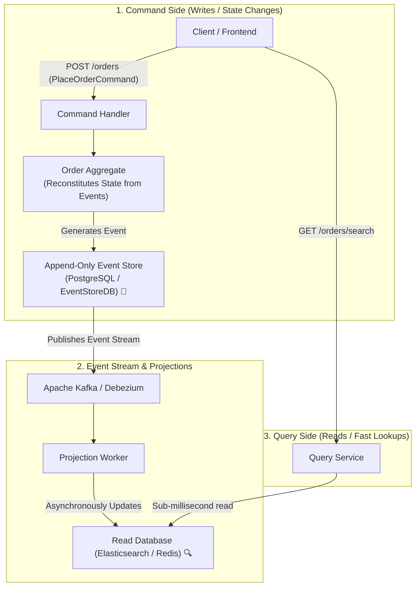

# Lesson 05: CQRS & Event Sourcing

Master Command Query Responsibility Segregation (CQRS), Event Sourcing, Append-Only Event Stores, Aggregate Snapshots, and asynchronous Read Model Projections.

---

## 1. What Is It?
- **CQRS (Command Query Responsibility Segregation)**: An architectural pattern that separates read models (Queries) from write models (Commands) into distinct data structures or databases.
- **Event Sourcing**: A persistence paradigm where state is not stored as mutable rows (e.g. `UPDATE accounts SET balance = 500`), but as an **append-only log of immutable business domain events** (`AccountOpenedEvent`, `MoneyDepositedEvent`, `MoneyWithdrawnEvent`).

---

## 2. Why Does It Exist?
Relational databases forced to handle complex analytical queries alongside high-frequency write operations suffer from table lock contention, unoptimized indexes, and schema conflicts. CQRS lets you optimize the write database for fast transactional inserts, and the read database (e.g. Elasticsearch/Read-Replica) for millisecond queries.

---

## 3. Mental Model: CQRS & Event Sourcing Architecture



---

## 4. How Does It Work: State Mutation vs Event Sourcing

| Feature | Traditional CRUD Persistence | Event Sourcing |
|---|---|---|
| **Storage Mechanism** | Overwrites row in place (`UPDATE`) | **Appends immutable event (`INSERT`)** |
| **Audit Trail** | Lost unless separate audit tables created | **$100\%$ Perfect Built-in Audit History** |
| **Time Travel Debugging**| Impossible | Replay events to any point in historical time |
| **Write Performance** | Random I/O updates | **Pure Sequential Append ($O(1)$ I/O)** |
| **Read Complexity** | Direct `SELECT` on current row | Requires projection or event fold |

---

## 5. Internal Working: Aggregate Snapshots for Performance

If an account has 100,000 historical transaction events, replaying all 100,000 events to compute the current balance on every request would take $> 500\text{ms}$.

**The Snapshot Solution**:
Every 100 events, write an **Aggregate Snapshot** containing the current accumulated balance. To reconstitute state, load the latest snapshot and replay only the events that occurred after the snapshot.

---

## 6. Example & Production Java 21 Code

Event Sourced Bank Account Aggregate in Java 21:

```java
package com.backend.microservices.cqrs;

import java.math.BigDecimal;
import java.time.Instant;
import java.util.ArrayList;
import java.util.List;
import java.util.UUID;

public class BankAccountAggregate {

    // Domain Events (Sealed interface in Java 21)
    public sealed interface AccountEvent permits AccountCreatedEvent, MoneyDepositedEvent, MoneyWithdrawnEvent {
        String accountId();
        Instant timestamp();
    }

    public record AccountCreatedEvent(String accountId, String owner, Instant timestamp) implements AccountEvent {}
    public record MoneyDepositedEvent(String accountId, BigDecimal amount, Instant timestamp) implements AccountEvent {}
    public record MoneyWithdrawnEvent(String accountId, BigDecimal amount, Instant timestamp) implements AccountEvent {}

    private String accountId;
    private BigDecimal balance = BigDecimal.ZERO;
    private final List<AccountEvent> uncommittedEvents = new ArrayList<>();

    public BankAccountAggregate() {}

    // Factory method for creating new account
    public static BankAccountAggregate create(String owner) {
        BankAccountAggregate account = new BankAccountAggregate();
        account.applyNewEvent(new AccountCreatedEvent(UUID.randomUUID().toString(), owner, Instant.now()));
        return account;
    }

    public void deposit(BigDecimal amount) {
        if (amount.compareTo(BigDecimal.ZERO) <= 0) {
            throw new IllegalArgumentException("Deposit amount must be positive");
        }
        applyNewEvent(new MoneyDepositedEvent(this.accountId, amount, Instant.now()));
    }

    public void withdraw(BigDecimal amount) {
        if (amount.compareTo(BigDecimal.ZERO) <= 0) {
            throw new IllegalArgumentException("Withdrawal amount must be positive");
        }
        if (this.balance.compareTo(amount) < 0) {
            throw new IllegalStateException("Insufficient funds! Balance: " + this.balance);
        }
        applyNewEvent(new MoneyWithdrawnEvent(this.accountId, amount, Instant.now()));
    }

    // Mutates internal state by pattern matching over domain events
    private void mutateState(AccountEvent event) {
        switch (event) {
            case AccountCreatedEvent e -> this.accountId = e.accountId();
            case MoneyDepositedEvent e -> this.balance = this.balance.add(e.amount());
            case MoneyWithdrawnEvent e -> this.balance = this.balance.subtract(e.amount());
        }
    }

    private void applyNewEvent(AccountEvent event) {
        mutateState(event);
        uncommittedEvents.add(event);
    }

    // Reconstitute aggregate from historical events
    public static BankAccountAggregate reconstitute(List<AccountEvent> history) {
        BankAccountAggregate aggregate = new BankAccountAggregate();
        for (AccountEvent event : history) {
            aggregate.mutateState(event);
        }
        return aggregate;
    }

    public List<AccountEvent> getUncommittedEvents() { return uncommittedEvents; }
    public BigDecimal getBalance() { return balance; }
    public String getAccountId() { return accountId; }
}
```

---

## 7. Performance Characteristics
- Append-only event writes achieve $> 25,000\text{ writes/sec}$ on PostgreSQL due to sequential disk writes avoiding B-Tree index reorganizations.

---

## 8. Failure Scenarios & Edge Cases
- **Event Schema Evolution (Breaking Changes)**: Renaming a field in a domain event breaks event replay for older historical events stored 2 years ago!
  - **Mitigation**: Treat events as immutable contracts. Never remove or rename existing fields; use **Upcasters** to transform old event JSON payloads to the latest schema version during load.

---

## 9. Observability (Logs, Metrics, Traces)
```text
# Event Sourcing Metrics
event_store_appends_total{aggregate="BankAccount"} 98000
event_projections_lag_seconds{projection="elasticsearch_orders"} 0.04
```

---

## 10. Debugging & Troubleshooting
1. **Replay Events to Reconstruct Bug State**:
   ```sql
   SELECT event_type, payload, created_at
   FROM event_store
   WHERE aggregate_id = 'acc-123'
   ORDER BY sequence_number ASC;
   ```

---

## 11. Scaling Considerations
- Partition the read projections by tenant or customer ID to scale query throughput linearly across Elasticsearch or Redis clusters.

---

## 12. Architectural Trade-offs
| Architecture | Auditability | Eventual Consistency Delay | Operational Overhead |
|---|---|---|---|
| **Standard CRUD DB** | Poor | **Zero (Immediate)** | **Lowest** |
| **CQRS + Event Sourcing**| **$100\%$ Perfect** | Small ($\sim 20\text{ms}$) | High |

---

## 13. When to Use
- Use **Event Sourcing** for financial systems, ledger balances, logistics tracking, and legal compliance audits.

---

## 14. When NOT to Use
- Do not use Event Sourcing for simple CRUD backends with basic data access patterns.

---

## 15. SDE2 / Senior Interview Questions & Answers
### Q1: What is the primary difference between CQRS and Event Sourcing, and can you use one without the other?
<details>
<summary>Reveal Answer</summary>

**Answer**:
- **CQRS**: Separates the **data models for reading and writing**. You can write to a normalized PostgreSQL table and update a denormalized Elasticsearch index for search.
- **Event Sourcing**: Changes **how state is persisted** by storing an immutable sequence of business events rather than updating mutable rows.
- **Can they be used independently?**:
  - **Yes**: You can use CQRS without Event Sourcing (e.g., standard SQL writes replicating to an Elasticsearch read store).
  - You can technically use Event Sourcing without CQRS, but querying complex aggregations across raw event streams is extremely inefficient, which is why Event Sourcing almost always uses CQRS projections for read models.
</details>

---

## 16. Practical Exercise
1. Write a projection consumer that listens to `MoneyDepositedEvent` and updates a cached customer balance in Redis.

---

## 17. Quick Revision Summary
- **CQRS** decouples high-throughput writes from low-latency reads.
- **Event Sourcing** persists state as an append-only event log.
- Use **Snapshots** and **Upcasters** to maintain high performance and schema evolution.
