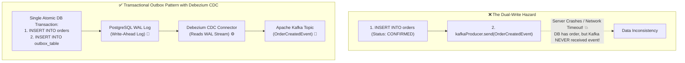

# Lesson 06: Event-Driven Architecture & Transactional Outbox

Master asynchronous event-driven microservices, the Dual-Write Hazard, the Transactional Outbox Pattern, Change Data Capture (CDC) with Debezium, and At-Least-Once delivery guarantees.

---

## 1. What Is It?
- **Dual-Write Hazard**: A critical distributed systems bug where a service updates a local database and attempts to publish a message to Kafka in the same request. If either one fails or the application crashes in between, the database and message broker permanently diverge.
- **Transactional Outbox Pattern**: A pattern where outgoing events are written to an `outbox` table in the **same local ACID database transaction** as business data, guaranteeing atomic persistence. An asynchronous CDC process (Debezium) reliably streams outbox records into Kafka.

---

## 2. Why Does It Exist?
Network calls to Kafka cannot participate in local database transactions. If your application saves an order to PostgreSQL and crashes before `kafkaProducer.send()` completes, downstream services never know the order exists, creating silent data loss.

---

## 3. Mental Model: The Dual-Write Hazard vs Transactional Outbox



---

## 4. How Does It Work: Comparing Outbox Publishing Strategies

| Strategy | Mechanism | DB Overhead | Latency | Reliability |
|---|---|---|---|---|
| **Polling Publisher** | `@Scheduled` task executes `SELECT ... FOR UPDATE` every 1s | High (constant table polling) | Moderate ($\sim 1\text{s}$) | Good |
| **Change Data Capture (CDC)** | Debezium tails PostgreSQL Write-Ahead Log (WAL) | **Zero (No DB query overhead)** | **Near Real-time ($< 50\text{ms}$)** | **Industry Gold Standard** |

---

## 5. Internal Working: Debezium PostgreSQL WAL Logical Replication

1. PostgreSQL writes every `INSERT INTO outbox` into its internal binary **Write-Ahead Log (WAL)** on disk.
2. The Debezium connector connects as a PostgreSQL replication slot.
3. Debezium decodes the WAL entries directly from disk without querying SQL tables.
4. Events are published to Kafka with partition keys ensuring in-order delivery per entity ID.

---

## 6. Example & Production Java 21 Code

Atomic Order Service with Transactional Outbox:

```java
package com.backend.microservices.outbox;

import com.fasterxml.jackson.databind.ObjectMapper;
import org.springframework.stereotype.Service;
import org.springframework.transaction.annotation.Transactional;

import java.time.Instant;
import java.util.UUID;

@Service
public class OrderService {

    private final OrderRepository orderRepository;
    private final OutboxRepository outboxRepository;
    private final ObjectMapper objectMapper;

    public record OutboxRecord(
        String id,
        String aggregateType,
        String aggregateId,
        String eventType,
        String payload,
        Instant createdAt
    ) {}

    public OrderService(OrderRepository orderRepository, OutboxRepository outboxRepository, ObjectMapper objectMapper) {
        this.orderRepository = orderRepository;
        this.outboxRepository = outboxRepository;
        this.objectMapper = objectMapper;
    }

    @Transactional // Guarantees both DB write and Outbox event are 100% atomic!
    public void createOrder(String customerId, String productId, double amount) {
        String orderId = UUID.randomUUID().toString();

        // 1. Write Business Domain Data
        OrderEntity order = new OrderEntity(orderId, customerId, productId, amount, "CONFIRMED");
        orderRepository.save(order);

        // 2. Write Outbox Event to Same DB Transaction
        try {
            OrderCreatedEvent event = new OrderCreatedEvent(orderId, customerId, amount, Instant.now());
            String jsonPayload = objectMapper.writeValueAsString(event);

            OutboxRecord outbox = new OutboxRecord(
                UUID.randomUUID().toString(),
                "Order",
                orderId,
                "OrderCreated",
                jsonPayload,
                Instant.now()
            );

            outboxRepository.save(outbox); // Committed atomically with OrderEntity!
        } catch (Exception e) {
            throw new RuntimeException("Failed to serialize outbox event", e);
        }
    }
}
```

---

## 7. Performance Characteristics
- Transactional Outbox adds $< 0.8\text{ms}$ to the local database transaction (a simple single-row SQL insert into the outbox table).

---

## 8. Failure Scenarios & Edge Cases
- **Outbox Table Bloat**: If using a Polling Publisher without CDC, the `outbox` table grows to millions of rows, slowing down queries.
  - **Mitigation**: Truncate or archive processed outbox rows, or use Debezium CDC with PostgreSQL `pg_drop_replication_slot`.

---

## 9. Observability (Logs, Metrics, Traces)
```text
# Outbox & CDC Metrics
outbox_events_created_total 125000
debezium_cdc_streaming_lag_ms 14
debezium_cdc_records_published_total 125000
```

---

## 10. Debugging & Troubleshooting
1. **Inspect PostgreSQL Replication Slot Lag**:
   ```sql
   SELECT slot_name, active, pg_wal_lsn_diff(pg_current_wal_lsn(), restart_lsn) AS lag_bytes
   FROM pg_replication_slots;
   ```

---

## 11. Scaling Considerations
- Set the Kafka partition key in Debezium to the `aggregate_id` (e.g. `order_id`) to ensure strict per-entity event ordering in Kafka partitions.

---

## 12. Architectural Trade-offs
| Pattern | Atomicity | Latency | Infrastructure Overhead |
|---|---|---|---|
| **Direct Kafka Send** | Broken (Dual-Write Hazard) | Low | Low |
| **Transactional Outbox + Polling**| **Atomic** | Moderate ($\sim 1\text{s}$) | Low |
| **Transactional Outbox + Debezium CDC**| **Atomic** | **Ultra-Low ($< 30\text{ms}$)**| Moderate (Kafka Connect / Debezium) |

---

## 13. When to Use
- Mandate the **Transactional Outbox Pattern** for all microservices publishing events to Kafka or RabbitMQ after database mutations.

---

## 14. When NOT to Use
- Do not use for non-critical telemetry logs or clickstream analytics where occasional data loss is acceptable.

---

## 15. SDE2 / Senior Interview Questions & Answers
### Q1: What is the Dual-Write Problem in distributed systems, and why is the Transactional Outbox Pattern considered the definitive solution?
<details>
<summary>Reveal Answer</summary>

**Answer**:
- **The Dual-Write Problem**: Occurs whenever an application must update two independent systems (e.g., writing to PostgreSQL and publishing to Kafka).
  - If you write to DB first and Kafka publish fails, your database has updated but other services never receive the event.
  - If you publish to Kafka first and DB write fails, downstream services process an event for data that never existed.
  - Because 2-Phase Commit (2PC) between databases and Kafka is impractical, achieving atomic synchronization directly is impossible.
- **The Transactional Outbox Solution**:
  1. The application writes both the business entity and an event record into an `outbox` table within the **exact same local ACID transaction**.
  2. Because it's a single database, the write is $100\%$ atomic: either both succeed, or both roll back.
  3. A Change Data Capture (CDC) tool like **Debezium** reads the database Write-Ahead Log (WAL) and reliably streams the outbox events to Kafka with guaranteed At-Least-Once delivery.
</details>

---

## 16. Practical Exercise
1. Create an `outbox` table in PostgreSQL and write a Spring Boot test verifying atomic rollback of both order and outbox records on error.

---

## 17. Quick Revision Summary
- Never publish directly to Kafka within a database transaction (Dual-Write Hazard).
- Use the **Transactional Outbox Pattern** to store events atomically in SQL.
- Stream events to Kafka in real-time using **Debezium CDC via PostgreSQL WAL**.
