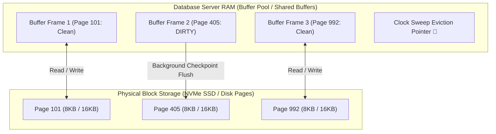
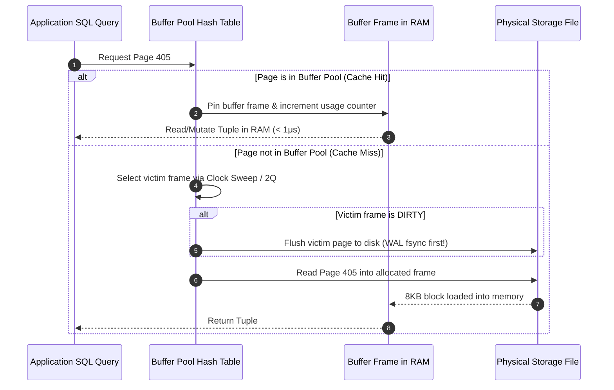

# Storage Engines, Slotted Disk Pages, and Buffer Pool Management

---

## 1. What Is It?
A database **Storage Engine** (such as PostgreSQL's Heap/Storage Manager or MySQL's InnoDB) is the foundational component responsible for organizing, reading, updating, and persisting relational tuples on physical block storage. Data is stored on disk in fixed-size blocks called **Disk Pages** (typically $8\text{KB}$ in PostgreSQL and $16\text{KB}$ in MySQL InnoDB). 

The **Buffer Pool** (or Shared Buffers) is a dedicated in-memory cache inside the database server process that holds cached disk pages in RAM to eliminate physical disk I/O for read and write operations.

---

## 2. Why Does It Exist?
Hardware storage access exhibits extreme latency disparities:
- **L1/L2/L3 CPU Cache**: $1 - 20\text{ns}$
- **System RAM**: $50 - 100\text{ns}$
- **NVMe SSD Storage**: $10 - 50\mu\text{s}$ ($500\times$ slower than RAM)
- **Traditional Spinning Disk (HDD)**: $5 - 10\text{ms}$ ($100,000\times$ slower than RAM)

If every SQL query required reading or writing directly from disk, database throughput would collapse to a few hundred IOPS. The storage engine uses fixed-size disk pages with a Slotted Page layout to avoid memory fragmentation, and leverages the Buffer Pool to execute in-memory reads and writes with microsecond latencies.

---

## 3. Mental Model



---

## 4. How Does It Work?

### Slotted Page Architecture (Inside an 8KB / 16KB Page)
Disk pages cannot simply append variable-length strings end-to-end without massive fragmentation when rows are updated or deleted. Relational engines utilize the **Slotted Page** format:

```text
+-----------------------------------------------------------------------+
| PAGE HEADER                                                           |
| (Page LSN, Free Space Pointers, Checksum, Flags)                      |
+-----------------------------------------------------------------------+
| LINE POINTER ARRAY (Grows Downward ⬇)                                |
| [Item 1 Offset: 8120] [Item 2 Offset: 8040] [Item 3 Offset: 7900]    |
+-----------------------------------------------------------------------+
|                         FREE SPACE                                    |
+-----------------------------------------------------------------------+
| TUPLE DATA STORAGE (Grows Upward ⬆)                                  |
| [Tuple 3 Payload: 140 bytes]                                          |
| [Tuple 2 Payload: 80 bytes]                                           |
| [Tuple 1 Payload: 72 bytes]                                           |
+-----------------------------------------------------------------------+
```

- **Line Pointer Array**: Fixed-size index pointers located at the top of the page, growing downward.
- **Tuple Storage**: Variable-length data rows located at the bottom of the page, growing upward.
- **Tuple Identifier (`TID` / `ctid`)**: Composed of `(PageNumber, LinePointerIndex)`. For example, `(42, 3)` points to Page 42, Line Pointer 3. This allows the physical row inside the page to be moved or defragmented without invalidating external B+Tree index pointers!

---

## 5. Internal Working

### Buffer Pool Management & The Clock Sweep Algorithm
The Buffer Pool divides allocated memory into fixed-size **Buffer Frames**, indexed by a hash table mapping `(TableID, PageNumber) -> BufferFrameNumber`.



### The Clock-Sweep Eviction Algorithm
1. Each buffer frame has a `usage_count` (0 to 5) and a `pin_count` (number of active queries currently accessing the page).
2. A rotating circular pointer (**Clock Hand**) scans candidate frames:
   - If `pin_count > 0`: Page is in use; skip frame.
   - If `pin_count == 0` and `usage_count > 0`: Decrement `usage_count` by 1 and advance hand.
   - If `pin_count == 0` and `usage_count == 0`: **Victim Chosen**.
3. If the victim page is clean, it is overwritten immediately. If it is **dirty** (modified in memory), it is flushed to disk before reuse.

---

## 6. Example

### Checking PostgreSQL Buffer Cache Hit Ratio
```sql
SELECT 
    sum(heap_blks_read) as disk_reads,
    sum(heap_blks_hit)  as buffer_cache_hits,
    round(sum(heap_blks_hit)::numeric / (sum(heap_blks_hit) + sum(heap_blks_read)) * 100, 2) as cache_hit_ratio_pct
FROM pg_statio_user_tables;
```
- **Target Production SLA**: `cache_hit_ratio_pct` should be $> 99\%$. A ratio $< 95\%$ indicates memory starvation and severe disk I/O thrashing.

---

## 7. Implementation

### Inspecting Raw Page Slotted Structure with `pageinspect` (PostgreSQL)
```sql
-- Enable PostgreSQL internal page diagnostics extension
CREATE EXTENSION IF NOT EXISTS pageinspect;

-- Inspect page header of the orders table (Page 0)
SELECT * FROM page_header(get_raw_page('orders', 0));

-- Inspect individual line pointers and tuple offsets
SELECT lp, lp_off, lp_flags, lp_len, t_xmin, t_xmax, t_ctid 
FROM heap_page_items(get_raw_page('orders', 0))
LIMIT 5;
```

---

## 8. Performance

| Storage Tier | Access Latency | Throughput (Bandwidth) | Cost per GB |
|---|---|---|---|
| Buffer Pool RAM | $\approx 80\text{ns}$ | $> 50\text{GB/s}$ | $\$3.00$ |
| NVMe SSD (Random 8KB Read) | $\approx 25\mu\text{s}$ | $\approx 3.5\text{GB/s}$ ($500\text{k IOPS}$) | $\$0.10$ |
| Magnetic HDD (Random Read) | $\approx 8\text{ms}$ | $\approx 150\text{MB/s}$ ($150\text{ IOPS}$) | $\$0.02$ |

---

## 9. Failure Scenarios

1. **Buffer Pool Thrashing via Sequential Scans**:
   - *Failure*: An unindexed analytical query performs a full table scan on a $500\text{GB}$ historical audit table. The sequential read floods the Buffer Pool, evicting all hot OLTP B+Tree index pages and customer profile pages into disk. Subsequent OLTP API latency spikes from $2\text{ms}$ to $500\text{ms}$.
   - *Engine Defense (PostgreSQL Ring Buffer)*: For large sequential scans ($> 256\text{KB}$), PostgreSQL bypasses the main buffer pool and allocates a small private circular ring buffer ($16\text{MB}$) to prevent polluting shared cache.

2. **Dirty Page Checkpoint Spikes**:
   - *Failure*: High write volume produces thousands of dirty pages per second. When a scheduled checkpoint occurs, the database attempts to flush all dirty pages to disk at once, saturating disk write IOPS and freezing incoming read/write queries.
   - *Mitigation*: Enable spread checkpoints via `checkpoint_completion_target = 0.9` in PostgreSQL to smooth disk I/O over time.

---

## 10. Observability

### Inspecting Top Tables Consuming Buffer Pool Memory
```sql
CREATE EXTENSION IF NOT EXISTS pg_buffercache;

SELECT 
    c.relname,
    pg_size_pretty(count(*) * 8192) as buffered_size,
    round(100.0 * count(*) / (SELECT setting FROM pg_settings WHERE name='shared_buffers')::integer, 1) AS buffer_pool_pct
FROM pg_buffercache b
JOIN pg_class c ON b.relfilenode = pg_relation_filenode(c.oid)
JOIN pg_database d ON (b.reldatabase = d.oid AND d.datname = current_database())
GROUP BY c.relname
ORDER BY count(*) DESC
LIMIT 10;
```

---

## 11. Debugging

### Triage: Low Cache Hit Ratio & I/O Spikes
1. Check OS disk I/O utilization: `iostat -xz 1` (look for `%util` reaching $100\%$).
2. Check PostgreSQL buffer eviction rates:
   ```sql
   SELECT checkpoints_timed, checkpoints_req, checkpoint_write_time, checkpoint_sync_time, buffers_checkpoint, buffers_clean, buffers_backend
   FROM pg_stat_bgwriter;
   ```
   - If `buffers_backend` is high, normal backend worker processes are forced to synchronously write dirty pages to disk during queries instead of the background writer (`bgwriter`), creating severe latency spikes.

---

## 12. Scaling

### Buffer Pool Sizing Rules of Thumb
- **PostgreSQL (`shared_buffers`)**:
  - Dedicated DB Server: Set to **$25\% \text{ of Total System RAM}$** (e.g., $16\text{GB}$ on a $64\text{GB}$ instance). 
  - PostgreSQL relies heavily on the **OS Kernel Page Cache** for the remaining memory to buffer filesystem reads.
- **MySQL InnoDB (`innodb_buffer_pool_size`)**:
  - Dedicated DB Server: Set to **$70\% - 80\% \text{ of Total System RAM}$** because InnoDB uses direct I/O (`O_DIRECT`), bypassing the OS page cache entirely.

---

## 13. Trade-offs

| Engine Memory Strategy | Mechanism | Advantage | Drawback |
|---|---|---|---|
| **Dual Caching (PostgreSQL)** | `shared_buffers` + OS Page Cache | Double protection against cold evictions; kernel handles readahead | Risk of duplicate cached pages in both RAM buffers |
| **Direct I/O (MySQL InnoDB)** | `innodb_buffer_pool_size` ($80\%$ RAM) | Zero page copying between kernel and DB; precise memory control | Misconfigured buffer pool directly leads to severe I/O stalls |

---

## 14. When to Use
- Understanding storage engines is critical when tuning database instance memory sizes, diagnosing I/O latency spikes, and sizing buffer pools.
- Mandatory for performance engineers configuring production PostgreSQL and MySQL database parameters.

---

## 15. When NOT to Use
- Managed cloud serverless databases (e.g. AWS Aurora Serverless v2, DynamoDB) where storage engine memory allocation and buffer pool sizing are dynamically automated by the hypervisor.

---

## 16. Interview Questions

### Q1: Why does PostgreSQL recommend setting `shared_buffers` to only 25% of RAM, while MySQL InnoDB recommends 70-80% of RAM?
<details>
<summary>Reveal Answer</summary>

**Answer**:
The difference stems from how each database interacts with the **Operating System Kernel Page Cache**:
1. **PostgreSQL** uses standard POSIX I/O calls (`read()`, `write()`). When PostgreSQL reads a block from disk, the Linux kernel automatically caches that block in the **OS Page Cache**. Setting `shared_buffers` to 25% allows PostgreSQL to cache hot structured pages in its own address space while allowing the remaining ~70% of RAM to be used by the Linux kernel page cache for compressed file system buffers and asynchronous writeback. Setting it higher often results in double buffering and inefficient OS cache coordination.
2. **MySQL InnoDB** by default opens data files with the `O_DIRECT` flag, which instructs the Linux kernel to **completely bypass the OS page cache**. Because the OS is not caching database files, InnoDB must manage its own global cache inside user-space RAM, requiring 70-80% of total system RAM to be assigned directly to `innodb_buffer_pool_size`.
</details>

### Q2: What is a Slotted Page and why don't relational databases store tuples sequentially like an array?
<details>
<summary>Reveal Answer</summary>

**Answer**:
In relational databases, rows contain variable-length attributes (`VARCHAR`, `TEXT`, `JSONB`) and can be updated or deleted at any time.
If rows were stored in a simple contiguous array:
1. Updating a `VARCHAR` to a longer string would require shifting all subsequent rows in the $8\text{KB}$ page, changing their physical memory addresses.
2. Any change to a row's address would invalidate all B+Tree secondary indexes that point to that row's physical offset.
A **Slotted Page** decouples the physical row offset from its external identifier:
- External indexes point to a fixed **Line Pointer** at the beginning of the page: `(PageId, SlotNumber)`.
- The Line Pointer stores the variable byte offset of the actual tuple stored at the bottom of the page.
- When a row is modified or the page is defragmented, only the internal Line Pointer offset is updated. The tuple's external `(PageId, SlotNumber)` remains completely unchanged, requiring **zero updates** to external indexes.
</details>

---

## 17. Practical Exercise
1. Run a local PostgreSQL instance and create a table with 500,000 rows.
2. Query `pg_statio_user_tables` to measure cold disk reads (`heap_blks_read`).
3. Re-run the same query immediately and observe the shift to 100% buffer cache hits (`heap_blks_hit`).
4. Use the `pageinspect` extension to inspect the physical `ctid`, `xmin`, `xmax`, and line pointer byte offsets inside Page 0.

---

## 18. Quick Revision
- **Disk Pages**: Fixed-size physical storage blocks ($8\text{KB}$ in Postgres, $16\text{KB}$ in InnoDB).
- **Slotted Page**: Top array of line pointers points to bottom variable-length row data, enabling internal defragmentation without breaking external index pointers.
- **Buffer Pool**: In-memory cache of disk pages managed via Clock-Sweep / LRU eviction algorithms.
- **Dirty Page**: A page modified in RAM that has not yet been flushed to disk storage.
- **`shared_buffers`**: Recommended at $25\%$ of RAM in PostgreSQL (leveraging OS page cache); `innodb_buffer_pool_size` at $75\%$ in MySQL (using `O_DIRECT`).
