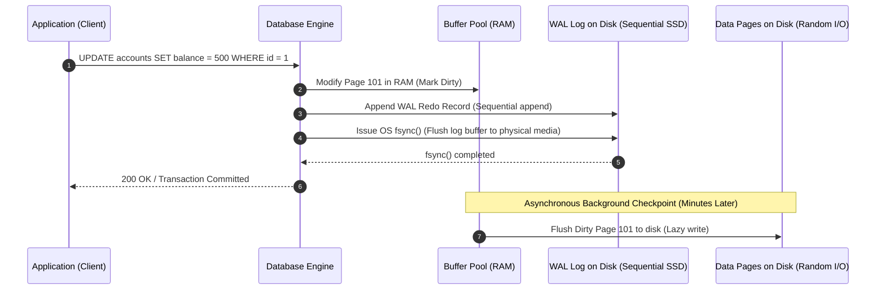
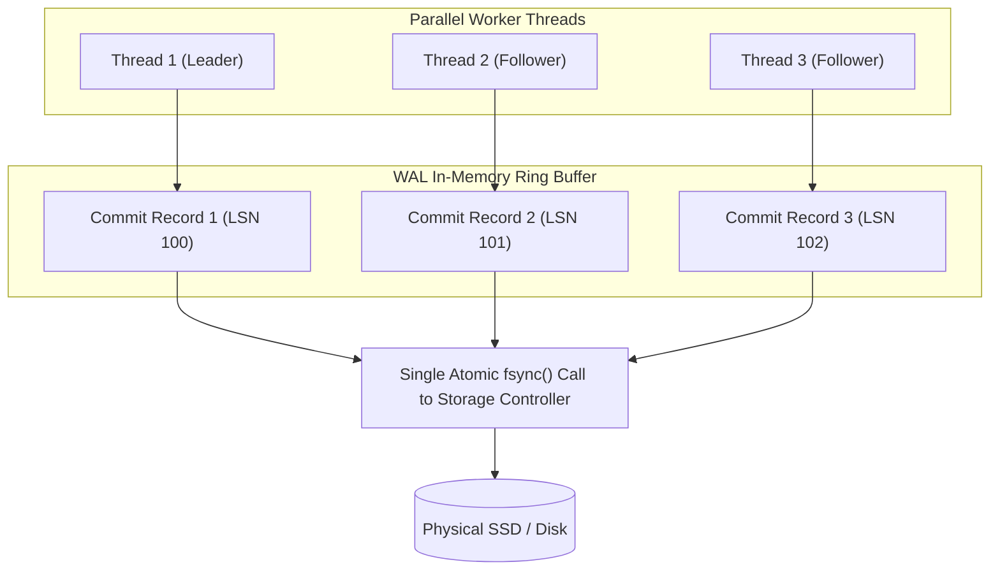

# Write-Ahead Logging (WAL), Group Commit, and Crash Recovery (ARIES)

---

## 1. What Is It?
The **Write-Ahead Log (WAL)** (known as the **Redo Log** in MySQL InnoDB) is an append-only, sequential disk log that records every data mutation *before* the changes are written to table data pages on disk. It is the core architectural mechanism that guarantees the **Durability (D)** and **Atomicity (A)** of ACID transactions while enabling ultra-high-throughput in-memory database operations.

---

## 2. Why Does It Exist?
Modifying table data directly on disk for every transaction would require expensive **random disk I/O** across thousands of scattered $8\text{KB}$ data pages. If the server loses power midway through updating a page, the page becomes physically torn and corrupted, causing irrecoverable data loss.

WAL solves both problems:
1. **Performance**: All transaction mutations are appended sequentially to the WAL file via fast **sequential I/O**. Data pages in the Buffer Pool are modified only in RAM (marked as **dirty pages**) and flushed to disk asynchronously in the background.
2. **Durability & Crash Recovery**: If the database crashes or loses power, the database replays the sequential WAL records during boot to reconstruct the exact state of all unwritten dirty pages (**Crash Recovery**).

---

## 3. Mental Model



---

## 4. How Does It Work?

### The Core WAL Invariant
$$\textbf{WAL Rule: } \text{A dirty page CANNOT be flushed to disk until the WAL record describing the mutation is flushed to disk!}$$

Every WAL record and every database disk page is tagged with a monotonically increasing 64-bit integer called the **Log Sequence Number (LSN)**:
- `Page_LSN`: The LSN of the latest WAL record that updated this specific disk page.
- When the buffer pool background writer attempts to write Page $X$ to disk, it verifies that:
  $$\text{Flushed\_WAL\_LSN} \ge \text{Page\_LSN}$$
If not, it forces a synchronous flush of the WAL buffer before writing the data page.

---

## 5. Internal Working

### Group Commit Mechanics
Executing an OS `fsync()` system call for every individual client transaction limits database throughput to the physical IOPS capacity of the disk ($1,000\text{ fsyncs/sec} \approx 1,000\text{ TPS}$).

Relational engines implement **Group Commit**:
1. When Thread 1 reaches commit, it acquires the WAL flush lock and becomes the **Leader**.
2. While Thread 1 prepares the `fsync()`, Threads 2, 3, and 4 append their commit records to the WAL in-memory buffer.
3. Thread 1 executes a single `fsync()` system call that physically flushes the combined log records of **all 4 transactions simultaneously**.
4. Thread 1 releases the lock and wakes up Threads 2, 3, and 4. All 4 transactions commit in parallel with a single disk sync!



---

## 6. Crash Recovery: The ARIES Algorithm
When a crashed database server restarts, it executes the standard **ARIES (Algorithms for Recovery and Isolation Exploiting Semantics)** recovery process in 3 distinct phases:


1. **Analysis Phase**:
   - Scans the WAL forward from the latest **Checkpoint**.
   - Identifies all **Dirty Pages** that were in memory at the time of crash.
   - Identifies all **Active Transactions** that were uncommitted (in-flight) when the crash occurred.
2. **Redo Phase ("Repeating History")**:
   - Scans WAL forward from the oldest dirty page's LSN.
   - Re-applies all changes (committed or uncommitted) to bring the database data pages to the exact physical state at the millisecond of crash.
3. **Undo Phase**:
   - Scans WAL backward and generates compensation log records to **roll back all active transactions** that never issued a commit before the crash.

---

## 7. Implementation

### Tuning WAL Durability in PostgreSQL (`synchronous_commit`)
```sql
-- 1. Strict ACID (Default): Synchronous fsync on every commit
SET synchronous_commit = 'on';

-- 2. Asynchronous Commit: Commits instantly in RAM; flushes to disk within wal_writer_delay (200ms)
-- (Provides 5x-10x throughput boost; risk losing up to 200ms of data on sudden power loss, ZERO corruption)
SET synchronous_commit = 'off';

-- 3. Distributed Standby Sync: Waits for physical standby replica to receive WAL
SET synchronous_commit = 'remote_write';
```

---

## 8. Performance

| `synchronous_commit` Level | Disk I/O Operations | Commit Latency | Throughput (TPS) | Crash Safety Guarantee |
|---|---|---|---|---|
| `on` (Default) | Synchronous `fsync()` per group commit | $1.5 - 5.0\text{ms}$ | $\approx 3,000\text{ TPS}$ | Zero committed data lost |
| `off` (Async Commit) | Asynchronous background flush ($200\text{ms}$) | $< 0.1\text{ms}$ | $\mathbf{> 45,000\text{ TPS}}$ | Up to 200ms lost on power cut (No corruption) |
| `remote_write` (Replica) | Flushes to standby RAM | $2.0 - 8.0\text{ms}$ | $\approx 2,500\text{ TPS}$ | Resilient to primary node crash |

---

## 9. Failure Scenarios

1. **WAL Disk Space Exhaustion (Disk Full Outage)**:
   - *Failure*: An unconsumed replication slot or stuck backup prevents PostgreSQL from archiving or recycling old WAL segments (stored in `pg_wal`). The disk fills to $100\%$, and PostgreSQL immediately panics and shuts down to prevent database corruption.
   - *Mitigation*: Set `max_slot_wal_keep_size` to cap replication slot WAL retention and configure disk space alerts at $80\%$ threshold.

2. **Checkpoint Spikes (Write Stall)**:
   - *Failure*: If `max_wal_size` is too small, checkpoints trigger too frequently. Flushing dirty pages consumes all disk I/O bandwidth, causing sudden 5-second latency spikes in API transactions.
   - *Mitigation*: Increase `max_wal_size = 16GB` and set `checkpoint_completion_target = 0.9` to spread checkpoint writes evenly across the checkpoint interval.

---

## 10. Observability

### Monitoring WAL Generation Rate & Checkpoint Metrics
```sql
-- Check checkpoint frequency and buffer write distribution
SELECT 
    checkpoints_timed,
    checkpoints_req,
    checkpoint_write_time,
    checkpoint_sync_time,
    buffers_checkpoint,
    buffers_backend
FROM pg_stat_bgwriter;

-- Monitor current WAL write location LSN
SELECT pg_current_wal_lsn(), pg_wal_lsn_diff(pg_current_wal_lsn(), '0/0') AS total_wal_bytes_generated;
```

---

## 11. Debugging

### Inspecting Raw WAL Records with `pg_waldump`
```bash
# Dump and inspect WAL records for transaction commits and heap mutations
pg_waldump -p /var/lib/postgresql/data/pg_wal -s 0/16B3000 -e 0/16B8000
```
- Output reveals exact record types: `Heap/INSERT`, `Transaction/COMMIT`, `Btree/INSERT_LEAF` with exact timestamp, LSN, and transaction ID (`xid`).

---

## 12. Scaling

1. **WAL Archiving & Point-In-Time Recovery (PITR)**:
   - Continuous WAL archiving (`archive_command = 'aws s3 cp %p s3://db-backups/wal/%f'`) ships sealed $16\text{MB}$ WAL segment files to durable S3 storage.
   - Allows restoring the database to any exact second in time (e.g., restore to $14:32:05\text{ UTC}$ right before an accidental `DROP TABLE` migration).
2. **Physical Streaming Replication**:
   - Primary database streams live WAL byte streams over TCP directly to standby read replicas via the `walsender` process.

---

## 13. Trade-offs

| WAL Configuration | Durability Guarantee | Write Latency | Ideal Use Case |
|---|---|---|---|
| `synchronous_commit = on` | $100\%$ Durable on local disk | Moderate ($1-5\text{ms}$) | Financial ledgers, checkout, user credentials |
| `synchronous_commit = off` | May lose last 200ms on sudden power crash | Ultra-fast ($< 0.1\text{ms}$) | High-volume IoT telemetry, gaming leaderboards, analytics logs |
| `wal_level = minimal` | Cannot use replication or PITR | Lowest WAL disk volume | Bulk data warehouse initial ETL loads |
| `wal_level = replica` | Full streaming replication & PITR support | Standard WAL generation | Standard production OLTP databases |

---

## 14. When to Use
- Fundamental to understanding database crash safety, durability guarantees, replication mechanics, and read replica lag.
- Use asynchronous commit (`synchronous_commit = off`) for non-critical high-throughput write workloads where losing a fraction of a second of data on server crash is an acceptable trade-off for $10\times$ higher throughput.

---

## 15. When NOT to Use
- Do not disable `synchronous_commit` on financial, payment, or medical auditing systems where zero data loss is legally mandated.

---

## 16. Interview Questions

### Q1: What is the purpose of the Log Sequence Number (LSN) and how does the storage engine ensure WAL records are written before dirty pages?
<details>
<summary>Reveal Answer</summary>

**Answer**:
The **Log Sequence Number (LSN)** is a monotonically increasing 64-bit integer representing the byte offset in the Write-Ahead Log.
Every mutation generates a WAL record with a unique LSN. When the mutation modifies a data page in the RAM Buffer Pool, the page's header is updated with `Page_LSN = Mutation_LSN`.
To enforce the **Write-Ahead Logging protocol**:
Before the background writer or checkpoint process writes any dirty page from RAM to the physical table file, it checks whether:
$$\text{Flushed\_WAL\_LSN} \ge \text{Page\_LSN}$$
If the WAL on disk has not yet reached `Page_LSN`, the database **stalls the data page write** and synchronously flushes the WAL buffer to disk first. This ensures that on-disk data pages never contain mutations that cannot be recovered or undone from the WAL.
</details>

### Q2: What is Group Commit and how does it prevent disk I/O bottlenecks during concurrent transactions?
<details>
<summary>Reveal Answer</summary>

**Answer**:
Without group commit, if 1,000 concurrent threads commit transactions simultaneously, each thread would issue a blocking `fsync()` system call to flush its individual commit record to disk. Because SSDs/HDDs can only process a finite number of physical sync operations per second, this creates severe disk queue bottlenecking.
**Group Commit** solves this by coalescing multiple concurrent transactions into a single physical disk I/O operation:
1. The first thread to initiate commit becomes the **Group Leader** and prepares to flush the log buffer.
2. Concurrent threads attempting to commit in the same microsecond window register as **Followers** and append their records to the shared in-memory WAL buffer.
3. The Leader executes a **single atomic `fsync()`** that flushes the combined log records of the entire group to physical storage.
4. The Leader notifies all Followers, allowing dozens of transactions to commit concurrently with the cost of a single disk sync.
</details>

---

## 17. Practical Exercise
1. Run a benchmark inserting 50,000 rows into a PostgreSQL database with `synchronous_commit = on` and measure total execution time.
2. Re-run the benchmark with `synchronous_commit = off` and observe the throughput increase.
3. Simulate an abrupt server crash (`kill -9 $(pgrep postgres)`) during active writes and inspect the PostgreSQL server logs on boot to observe the ARIES Redo and Undo recovery phases.

---

## 18. Quick Revision
- **WAL Invariant**: Redo log records must be flushed to disk *before* the corresponding dirty data pages are flushed.
- **LSN**: 64-bit monotonically increasing log sequence pointer linking data pages to WAL records.
- **Group Commit**: Coalesces concurrent transaction commits into a single `fsync()` system call.
- **ARIES Recovery**: Analysis $\longrightarrow$ Redo (reconstruct memory state) $\longrightarrow$ Undo (rollback active transactions).
- **`synchronous_commit = off`**: Provides massive throughput gains at the cost of losing up to 200ms of committed data during a hard power failure (never causes physical page corruption).
