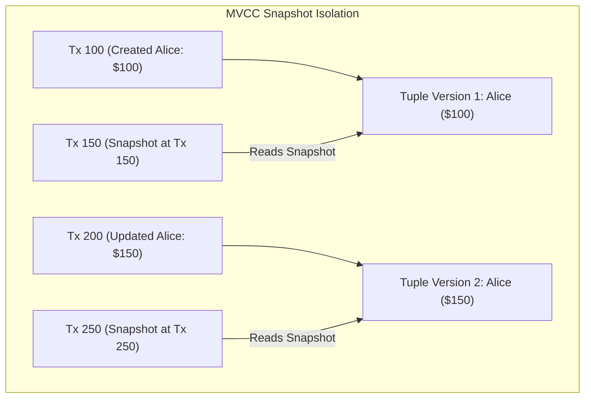
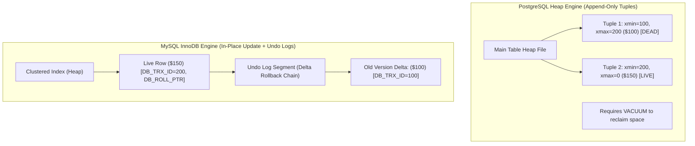

# Multi-Version Concurrency Control (MVCC), Vacuum, and Undo Logs

---

## 1. What Is It?
**Multi-Version Concurrency Control (MVCC)** is the foundational concurrency control paradigm used by modern relational database engines (PostgreSQL, MySQL InnoDB, Oracle) to provide ACID transaction isolation. 

MVCC guarantees that **readers never block writers, and writers never block readers**. Instead of acquiring locking barriers on rows during `SELECT` queries, the database maintains multiple historical versions of each modified row simultaneously, presenting each transaction with a consistent point-in-time snapshot.

---

## 2. Why Does It Exist?
In primitive 2-Phase Locking (2PL) database architectures, reading a row required acquiring a Shared (`S`) Lock, which completely blocked all concurrent Exclusive (`X`) write locks on that row. In high-volume systems:
- Long-running read queries or analytical reports would freeze all concurrent write transactions across the entire table.
- Concurrent writes would completely stall read throughput, causing massive lock convoying and deadlocks.

MVCC solves this by making updates **non-destructive**: updating a row creates a new version of the tuple without overwriting or locking the older version, allowing concurrent read queries to continue reading the older committed version unimpeded.

---

## 3. Mental Model



---

## 4. PostgreSQL vs MySQL InnoDB: Two Radically Different MVCC Implementations

Relational engines implement MVCC through two opposing storage architectures:



### 1. PostgreSQL MVCC (Heap-Based Multi-Version)
- When a row is updated, PostgreSQL **inserts a brand-new physical tuple** into the heap table file and marks the old tuple with an expiration ID (`xmax`).
- **Advantage**: Fast rollback (aborting a transaction simply marks its transaction ID as aborted in `pg_xact`; zero physical data cleanup required at rollback).
- **Disadvantage**: Accumulates "dead tuples" in table heap pages and indexes, requiring continuous **VACUUM** maintenance to prevent table bloat.

### 2. MySQL InnoDB MVCC (Rollback Segment / Undo Log)
- When a row is updated, InnoDB **overwrites the row in-place** inside the clustered index page and writes the previous column diffs to an **Undo Log** segment in the rollback log.
- **Advantage**: Zero table heap bloat on updates; table files stay compact.
- **Disadvantage**: Rolling back a long transaction requires physically applying undo log deltas. Old readers must traverse long undo log pointer chains to reconstruct historical snapshots.

---

## 5. Internal Working

### PostgreSQL Tuple Header Anatomy
Every physical tuple in a PostgreSQL page contains a 23-byte header containing MVCC visibility metadata:

| Header Field | Size | Description |
|---|---|---|
| `t_xmin` | 4 bytes (32-bit XID) | The Transaction ID that **inserted / created** this tuple version. |
| `t_xmax` | 4 bytes (32-bit XID) | The Transaction ID that **deleted or updated** this tuple version ($0$ if still live). |
| `t_ctid` | 6 bytes `(Page, Slot)` | Tuple ID pointing to itself, or to the newer tuple version if updated. |
| `t_infomask` | 2 bytes | Bit flags caching transaction commit/abort status (`XMIN_COMMITTED`, `XMAX_COMMITTED`). |

### PostgreSQL Visibility Snapshot Rules
When Transaction $T_{curr}$ with snapshot $[X_{min}, X_{max}, \text{active\_xids}]$ reads a tuple:
1. Is `t_xmin` uncommitted or aborted? $\longrightarrow$ **Invisible**.
2. Is `t_xmin` in `active_xids` (in-flight when snapshot was taken)? $\longrightarrow$ **Invisible**.
3. Was `t_xmin` committed before snapshot? $\longrightarrow$ **Check `t_xmax`**:
   - If `t_xmax == 0` (never deleted/updated) $\longrightarrow$ **VISIBLE**.
   - If `t_xmax` was deleted by an in-flight transaction or committed *after* snapshot $\longrightarrow$ **VISIBLE**.
   - If `t_xmax` was committed *before* snapshot $\longrightarrow$ **INVISIBLE (Dead to this reader)**.

---

## 6. Table Bloat, VACUUM, and Autovacuum (PostgreSQL)

When a row in PostgreSQL is updated 1,000 times, 1,000 physical tuple versions are created on disk. Once all transactions that could see the older versions finish, those 999 versions become **Dead Tuples**.

```mermaid
sequenceDiagram
    autonumber
    participant App as Application Writes
    participant Heap as PostgreSQL Table Heap
    participant AutoVac as Background Autovacuum Daemon

    App->>Heap: 10,000 UPDATE operations
    Heap->>Heap: Creates 10,000 dead tuple versions (Table size grows from 10MB to 50MB)
    AutoVac->>Heap: Scans pages with high dead tuple ratio (> 20%)
    AutoVac->>Heap: Marks dead line pointers as UNUSED; defragments page space
    Note over AutoVac,Heap: Free space is now available for future INSERTs (Zero file shrink)
```

### The 3 Types of Vacuuming
1. **Standard `VACUUM` (Concurrent)**:
   - Scans dead tuples and frees space *inside existing disk pages* so new `INSERT`s can reuse it.
   - **Does NOT shrink the physical file size on the OS disk** (does not return disk space to OS).
   - Runs online concurrently without blocking read/write queries.
2. **`VACUUM FULL`**:
   - Rewrites the entire table into a brand-new physical file on disk, removing all dead space and returning unused bytes to the OS.
   - **ACQUIRES EXCLUSIVE ACCESS LOCK (`ACCESS EXCLUSIVE`)**: Completely blocks all reads and writes on the table for the entire duration.
3. **Heap-Only Tuples (HOT) Optimization**:
   - If an update does not modify indexed columns and free space exists inside the *same page*, PostgreSQL updates the row without creating new index entries, eliminating index bloat entirely.

---

## 7. The 32-bit Transaction ID (XID) Wraparound Catastrophe

PostgreSQL uses 32-bit integers for Transaction IDs, providing $2^{32} \approx 4.29\text{ billion}$ unique transaction IDs.
Because transaction IDs are compared modulo $2^{31}$ (half in the past, half in the future):
- If the database processes $> 2.14\text{ billion}$ transactions without maintenance, old historical transaction IDs wrap around into the "future".
- **Result**: The storage engine suddenly perceives all historical data in the database as having been created in the future, rendering millions of committed rows **completely invisible (catastrophic silent data loss)**.

### The Defense: Autovacuum Freeze
PostgreSQL background workers proactively execute **Freeze Operations**:
- Replaces old `xmin` values with a special frozen transaction ID (`FrozenXID = 2`).
- A frozen tuple is mathematically treated as permanently committed and older than all future transactions for eternity.
- If freeze autovacuum fails to keep up and the wraparound safety limit is reached ($200\text{ million}$ transactions remaining), PostgreSQL **forces read-only emergency mode and refuses all write connections** until a manual vacuum freeze completes.

---

## 8. Performance

| Characteristic | PostgreSQL MVCC (Heap) | MySQL InnoDB MVCC (Undo Log) |
|---|---|---|
| **Write Latency (INSERT/UPDATE)** | Fast (Appends new tuple to heap) | Moderate (Writes row + writes Undo Log) |
| **Rollback Cost (`ABORT`)** | Instant ($O(1)$ mark in `pg_xact`) | Slower ($O(N)$ must replay undo logs) |
| **Long-Running Read Impact** | Prevents Vacuum from cleaning dead tuples | Prevents Purge threads from trimming Undo logs (History list length explodes) |
| **Table Bloat Vulnerability** | High (Requires tuned Autovacuum) | Low (In-place updates) |

---

## 9. Failure Scenarios

1. **Autovacuum Lagging Behind Heavy Updates (Table Bloat)**:
   - *Failure*: A high-throughput table receives $50,000\text{ updates/sec}$. Default autovacuum worker settings are too conservative (`autovacuum_vacuum_cost_limit = 200`). Dead tuples accumulate, causing a $2\text{GB}$ table to swell to $80\text{GB}$, blowing out the buffer pool and destroying query performance.
   - *Mitigation*: Tune table-level autovacuum scale factors:
     ```sql
     ALTER TABLE orders SET (
         autovacuum_vacuum_scale_factor = 0.05,
         autovacuum_vacuum_cost_limit = 2000
     );
     ```

2. **Long-Running Transactions Holding Back the Vacuum Horizon**:
   - *Failure*: An engineer opens a manual `psql` transaction (`BEGIN; SELECT * FROM users;`) and leaves the laptop open over the weekend. Because that transaction snapshot is still active, **no dead tuples created after that timestamp can be cleaned by Autovacuum anywhere in the database**.
   - *Mitigation*: Configure `idle_in_transaction_session_timeout = '60000'` (60 seconds) to terminate abandoned transactions automatically.

---

## 10. Observability

### Monitoring Dead Tuples and Table Bloat (PostgreSQL)
```sql
SELECT 
    schemaname,
    relname,
    n_live_tup AS live_rows,
    n_dead_tup AS dead_rows,
    round(100.0 * n_dead_tup / nullif(n_live_tup + n_dead_tup, 0), 2) AS dead_tuple_pct,
    last_vacuum,
    last_autovacuum
FROM pg_stat_user_tables
WHERE n_dead_tup > 10000
ORDER BY n_dead_tup DESC;
```

### Monitoring MySQL InnoDB Undo Log History Length
```sql
SHOW ENGINE INNODB STATUS;
-- Look for:
-- "History list length 154200" (If > 100,000, purge threads are stalled by a long-running reader)
```

---

## 11. Debugging

### Triage: Diagnosing Transaction ID Wraparound Danger
```sql
SELECT 
    datname,
    age(datfrozenxid) AS xid_age,
    2147483648 - age(datfrozenxid) AS transactions_until_wraparound_shutdown
FROM pg_database
ORDER BY xid_age DESC;
```
- If `xid_age > 1,500,000,000`, the database is approaching the emergency threshold. Immediately schedule an aggressive `VACUUM FREEZE ANALYZE;` across all tables.

---

## 12. Scaling

1. **Horizontal Scaling of Autovacuum Workers**:
   - In modern multi-core servers, increase concurrent vacuum capacity:
     ```ini
     autovacuum_max_workers = 6
     autovacuum_vacuum_cost_limit = 2000
     autovacuum_vacuum_cost_delay = 2ms
     ```
2. **Partitioning to Eliminate Vacuum Overhead**:
   - Partitioning high-volume time-series tables by day/month allows old data to be purged instantly via `DROP TABLE partition_2025_01` (zero dead tuples created, zero vacuum required).

---

## 13. Trade-offs

| Mechanism | Strength | Operational Risk |
|---|---|---|
| **PostgreSQL Heap MVCC** | Extremely high write velocity, fast aborts | Prone to dead tuple bloat and XID wraparound |
| **MySQL InnoDB Undo MVCC** | Stable table footprint, zero heap bloat | Large transactions inflate undo log size; rollback is expensive |
| **Aggressive Autovacuum** | Keeps tables compact and avoids bloat | Consumes disk I/O bandwidth during peak traffic |

---

## 14. When to Use
- Understanding MVCC is essential for diagnosing unexpected table size growth, buffer cache degradation, unexplainable transaction serialization failures, and tuning autovacuum parameters.

---

## 15. When NOT to Use
- Non-relational append-only event stores (Kafka, Cassandra) where mutations are immutable logs that do not require multi-version row visibility resolution.

---

## 16. Interview Questions

### Q1: Why does an uncommitted long-running `SELECT` transaction prevent Autovacuum from cleaning dead tuples across completely unrelated tables?
<details>
<summary>Reveal Answer</summary>

**Answer**:
In PostgreSQL, when a transaction starts, it acquires a snapshot containing the lowest active Transaction ID in the entire database (**`xmin horizon`**).
Because this long-running transaction might potentially query any table in the database and must see the data as it existed when its snapshot was created, PostgreSQL's Autovacuum daemon **cannot clean any dead tuple** whose `xmax` is greater than or equal to the lowest global `xmin horizon`.
Even if the long-running transaction is only querying a small lookup table, its open snapshot blocks Autovacuum from cleaning dead tuples across all other heavily updated tables in the database, leading to systemic table bloat.
</details>

### Q2: What is a HOT (Heap-Only Tuple) update in PostgreSQL and how does it prevent index bloat?
<details>
<summary>Reveal Answer</summary>

**Answer**:
Under standard MVCC updates in PostgreSQL, creating a new tuple version in the heap requires updating every single secondary B+Tree index on the table to point to the new tuple's physical page location (`ctid`), causing massive index bloat and random I/O.
**Heap-Only Tuple (HOT)** optimization eliminates this under two conditions:
1. The update does **not modify any indexed columns**.
2. Sufficient free space exists inside the **exact same 8KB disk page** to store the new tuple version.
When HOT applies, the old tuple's line pointer is updated to point directly to the new tuple within the same page (creating an intra-page pointer chain). Secondary B+Tree indexes continue to point to the original line pointer and require **zero updates**, completely preventing index bloat.
</details>

---

## 17. Practical Exercise
1. Create a PostgreSQL table and insert 10,000 rows.
2. Execute 50,000 `UPDATE` operations on those rows.
3. Query `pg_stat_user_tables` to inspect the `n_dead_tup` count.
4. Run `VACUUM` and observe `n_dead_tup` return to 0 while verifying that table physical disk size on the filesystem does not shrink.
5. Run `VACUUM FULL` and verify the reduction in physical disk file size.

---

## 18. Quick Revision
- **MVCC Core Rule**: Readers never block writers; writers never block readers.
- **Postgres MVCC**: Append-only tuples in heap tagged with `xmin` / `xmax`; requires `VACUUM` to clean dead tuples.
- **MySQL InnoDB MVCC**: In-place heap updates with delta rollback pointers stored in Undo Logs.
- **XID Wraparound**: 32-bit transaction IDs wrap around after 2.14 billion transactions; prevented by proactive `VACUUM FREEZE`.
- **HOT Updates**: Updates modifying non-indexed columns within the same disk page avoid secondary index writes.
