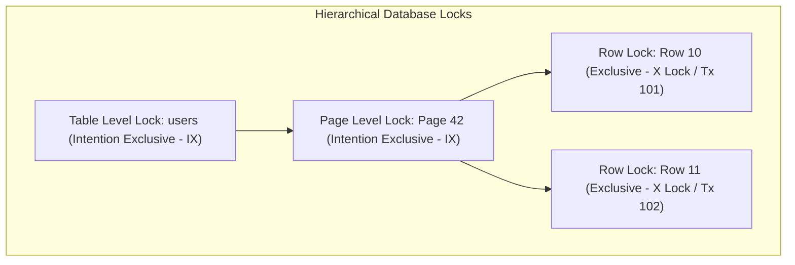
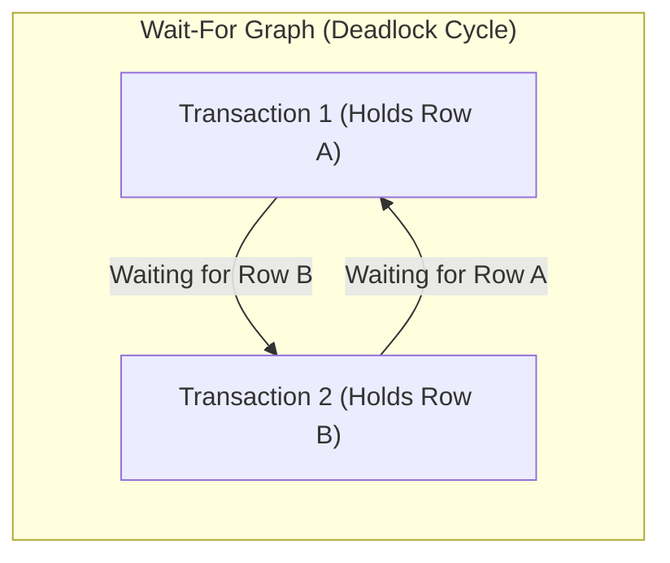

# Lock Manager, Lock Hierarchies, and Deadlock Detection Internals

---

## 1. What Is It?
The **Lock Manager** is an in-memory concurrency control subsystem inside the relational database engine that coordinates concurrent access to database objects (tables, pages, individual rows, transaction IDs). It enforces serializability and mutual exclusion where MVCC snapshot isolation alone cannot prevent conflicting data mutations.

---

## 2. Why Does It Exist?
While MVCC allows non-blocking reads, two concurrent write transactions attempting to modify the exact same row (e.g. subtracting balance from the same bank account) must execute sequentially to prevent the **Lost Update Anomaly**. 

The Lock Manager manages granular locks, enforces lock compatibility rules, prevents conflicting operations, and actively monitors for circular blocking dependencies (**Deadlocks**).

---

## 3. Mental Model



---

## 4. How Does It Work?

### The Granular Lock Hierarchy & Intention Locks
To modify a single row, a transaction must acquire locks from the top of the hierarchy downward:
1. **Intention Shared (`IS`)**: Declares intent to read rows at lower levels.
2. **Intention Exclusive (`IX`)**: Declares intent to modify rows at lower levels.
3. **Shared (`S`)**: Read lock. Multiple transactions can hold `S` locks concurrently on the same object.
4. **Exclusive (`X`)**: Write lock. Only one transaction can hold an `X` lock; all other requests are blocked.

### Lock Compatibility Matrix
| Requested \ Held | Shared (`S`) | Exclusive (`X`) | Intention Shared (`IS`) | Intention Exclusive (`IX`) |
|---|:---:|:---:|:---:|:---:|
| **Shared (`S`)** | ✅ **Compatible** | ❌ Conflict | ✅ **Compatible** | ❌ Conflict |
| **Exclusive (`X`)** | ❌ Conflict | ❌ Conflict | ❌ Conflict | ❌ Conflict |
| **Intention Shared (`IS`)** | ✅ **Compatible** | ❌ Conflict | ✅ **Compatible** | ✅ **Compatible** |
| **Intention Exclusive (`IX`)**| ❌ Conflict | ❌ Conflict | ✅ **Compatible** | ✅ **Compatible** |

---

## 5. Internal Working

### Lock Manager Hash Table Architecture
The Lock Manager maintains two global in-memory hash tables in shared memory:
1. **Lock Hash Table**: Maps `ObjectIdentifier` (e.g. `TableOID:PageNumber:TupleOffset`) $\longrightarrow$ `LockHead`.
   - `LockHead` contains:
     - `Granted List`: Linked list of transactions currently holding locks on this object.
     - `Wait Queue`: FIFO queue of blocked transactions waiting for the lock.
2. **Wait-For Graph (Deadlock Cycle Detector)**:
   - Directed graph where vertices represent active transactions ($T_1, T_2$) and directed edges ($T_1 \longrightarrow T_2$) represent "$T_1$ is blocked waiting for a lock held by $T_2$".



### Deadlock Detection: The Wait-For Graph Algorithm
1. When a transaction is blocked on a lock request, the database puts its worker thread to sleep and starts a `deadlock_timeout` timer (default: $1,000\text{ms}$ in PostgreSQL).
2. When the timer expires, the background lock monitor runs **Cycle Detection** (Depth-First Search / Tarjan's Strongly Connected Components algorithm) on the Wait-For Graph.
3. If a directed cycle ($T_1 \to T_2 \to T_1$) is detected:
   - The engine selects the **Victim Transaction** (the transaction that has performed the least amount of work / fewest WAL writes).
   - It aborts the victim transaction with `ERROR: deadlock detected (40P01)` and releases its locks, allowing the other transaction to proceed.

---

## 6. Example

### 1. Classic Deadlock Scenario in SQL
```sql
-- Transaction 1 (User A)
BEGIN;
UPDATE accounts SET balance = balance - 100 WHERE id = 1; -- Acquires X lock on Row 1
-- (Time delay)
UPDATE accounts SET balance = balance + 100 WHERE id = 2; -- Blocks waiting for Row 2!

-- Transaction 2 (User B - Concurrent)
BEGIN;
UPDATE accounts SET balance = balance - 50 WHERE id = 2;  -- Acquires X lock on Row 2
-- (Time delay)
UPDATE accounts SET balance = balance + 50 WHERE id = 1;  -- Blocks waiting for Row 1 -> DEADLOCK!
```

---

## 7. Implementation

### Java 21 Deadlock-Free Batch Updates via Consistent Key Sorting
```java
package com.backend.engineering.databases.service;

import org.springframework.jdbc.core.JdbcTemplate;
import org.springframework.stereotype.Service;
import org.springframework.transaction.annotation.Transactional;

import java.util.Collections;
import java.util.List;

@Service
public class TransferService {

    private final JdbcTemplate jdbcTemplate;

    public TransferService(JdbcTemplate jdbcTemplate) {
        this.jdbcTemplate = jdbcTemplate;
    }

    @Transactional
    public void executeTransfer(Long fromAccountId, Long toAccountId, long amountCents) {
        // DEADLOCK PREVENTION RULE: Always acquire row locks in deterministic ascending ID order!
        Long firstId = Math.min(fromAccountId, toAccountId);
        Long secondId = Math.max(fromAccountId, toAccountId);

        // 1. Explicitly lock rows in strict ascending order
        String lockSql = "SELECT id, balance_cents FROM accounts WHERE id IN (?, ?) ORDER BY id FOR UPDATE";
        jdbcTemplate.queryForList(lockSql, firstId, secondId);

        // 2. Perform balance mutations safely with zero risk of circular deadlocks
        jdbcTemplate.update("UPDATE accounts SET balance_cents = balance_cents - ? WHERE id = ?", amountCents, fromAccountId);
        jdbcTemplate.update("UPDATE accounts SET balance_cents = balance_cents + ? WHERE id = ?", amountCents, toAccountId);
    }
}
```

---

## 8. Performance

| Lock Operation | Memory Cost | Acquisition Latency | Deadlock Risk |
|---|---|---|---|
| In-Memory Row Lock (`SELECT FOR UPDATE`) | 128 bytes in Lock Hash Table | $< 2\mu\text{s}$ (Uncontended) | Moderate (Prevent via key sorting) |
| Table-Level Lock (`ALTER TABLE`) | $< 1\text{KB}$ in Lock Hash Table | Blocks all concurrent queries | High |
| Optimistic Locking (`@Version` column) | Zero DB lock manager memory | Zero lock wait time | Zero deadlocks (fails on conflict) |

---

## 9. Failure Scenarios

1. **Deadlock Bursts under Spike Traffic**:
   - *Failure*: 50 concurrent worker threads updating shopping cart inventories in random product ID order. Circular locks cascade, causing 40 transactions to abort with 500 errors.
   - *Mitigation*: **Always sort resource IDs in ascending order** (`Collections.sort(productIds)`) before acquiring row locks.

2. **Lock Starvation via DDL Statements (`ALTER TABLE`)**:
   - *Failure*: A migration script executes `ALTER TABLE users ADD COLUMN age INT;`. This requires an `ACCESS EXCLUSIVE` table lock. If a long-running read query is active, the `ALTER TABLE` queues behind it. All subsequent `SELECT` queries queue *behind* the `ALTER TABLE`, halting all application traffic.
   - *Mitigation*: Set `lock_timeout = '2000'` (2 seconds) on all migration scripts to fail fast rather than blocking production traffic.

---

## 10. Observability

### Real-Time Blocked Queries & Lock Inspection (PostgreSQL)
```sql
SELECT 
    blocked_locks.pid     AS blocked_pid,
    blocked_activity.usename  AS blocked_user,
    blocking_locks.pid    AS blocking_pid,
    blocking_activity.usename AS blocking_user,
    blocked_activity.query    AS blocked_statement,
    blocking_activity.query   AS blocking_statement,
    now() - blocked_activity.query_start AS blocked_duration
FROM pg_catalog.pg_locks blocked_locks
JOIN pg_catalog.pg_stat_activity blocked_activity ON blocked_activity.pid = blocked_locks.pid
JOIN pg_catalog.pg_locks blocking_locks 
    ON blocking_locks.locktype = blocked_locks.locktype
    AND blocking_locks.database IS NOT DISTINCT FROM blocked_locks.database
    AND blocking_locks.relation IS NOT DISTINCT FROM blocked_locks.relation
    AND blocking_locks.page IS NOT DISTINCT FROM blocked_locks.page
    AND blocking_locks.tuple IS NOT DISTINCT FROM blocked_locks.tuple
    AND blocking_locks.virtualxid IS NOT DISTINCT FROM blocked_locks.virtualxid
    AND blocking_locks.transactionid IS NOT DISTINCT FROM blocked_locks.transactionid
    AND blocking_locks.classid IS NOT DISTINCT FROM blocked_locks.classid
    AND blocking_locks.objid IS NOT DISTINCT FROM blocked_locks.objid
    AND blocking_locks.objsubid IS NOT DISTINCT FROM blocked_locks.objsubid
    AND blocking_locks.pid != blocked_locks.pid
JOIN pg_catalog.pg_stat_activity blocking_activity ON blocking_activity.pid = blocking_locks.pid
WHERE NOT blocked_locks.granted;
```

---

## 11. Debugging

### Interpreting PostgreSQL Deadlock Log
```text
ERROR: deadlock detected
DETAIL: Process 14201 waits for ShareLock on transaction 891203; blocked by process 14202.
Process 14202 waits for ExclusiveLock on tuple (42, 12) of relation "accounts"; blocked by process 14201.
HINT: See server log for query details.
CONTEXT: while updating tuple (42, 12) in relation "accounts"
```
- **Triage Action**: Identify the two competing queries, extract the resource IDs being updated, and enforce deterministic sorting before update execution.

---

## 12. Scaling

1. **Optimistic Locking over Pessimistic Locking**:
   - For high-read, low-contention workloads, replace physical row locks (`SELECT FOR UPDATE`) with **Optimistic Locking** using a `@Version` integer column:
     ```sql
     UPDATE accounts SET balance = 400, version = version + 1 
     WHERE id = 1 AND version = 5;
     ```
   - If 0 rows are updated, the application catches `OptimisticLockingFailureException` and retries with exponential backoff.
2. **Short Transaction Lifecycles**:
   - Minimize lock hold times: keep the number of statements inside a single transaction as small as possible.

---

## 13. Trade-offs

| Concurrency Approach | Lock Overhead | Throughput Under High Contention | Complexity |
|---|---|---|---|
| **Pessimistic Locking (`FOR UPDATE`)** | High (Holds DB lock manager memory) | Queues transactions; predictable serialization | Simple |
| **Optimistic Locking (`@Version`)** | Zero DB lock manager overhead | High abort/retry rate under heavy conflict | Requires retry loop logic in app |
| **Atomic Field Increments** | Minimal (Single statement lock) | Maximum throughput (`UPDATE ... SET val = val + 1`) | Limited to simple mathematical deltas |

---

## 14. When to Use
- High-contention financial transfers, inventory reservation checkouts, and seat booking systems requiring strict atomic mutex guarantees.
- Synchronizing multi-step mutations where intermediate inconsistent states cannot be tolerated.

---

## 15. When NOT to Use
- Read-only queries (rely on MVCC snapshot isolation instead of acquiring `S` locks).
- Long-running batch workflows holding locks for minutes (split into small transactional chunks).

---

## 16. Interview Questions

### Q1: What are Intention Locks (IS, IX) and why are they necessary in relational databases?
<details>
<summary>Reveal Answer</summary>

**Answer**:
**Intention Locks** are table-level locks that indicate a transaction is currently holding (or intends to acquire) row-level locks on rows within that table.
Without intention locks:
If Transaction $T_1$ modifies a single row in a 10,000,000-row table (acquiring an Exclusive `X` row lock), and Transaction $T_2$ attempts to execute `ALTER TABLE` or `DROP TABLE` (which requires an Exclusive `X` Table lock), $T_2$ would have to **scan all 10,000,000 rows in the table** to check if any individual row has an active lock!
With intention locks:
$T_1$ automatically acquires an **Intention Exclusive (`IX`) lock on the table** before locking the row. When $T_2$ attempts to acquire the table-level `X` lock, it immediately checks the table lock header, sees the `IX` lock, and blocks in $O(1)$ constant time without inspecting any rows.
</details>

### Q2: What is the single most effective engineering practice for preventing database deadlocks in application code?
<details>
<summary>Reveal Answer</summary>

**Answer**:
**Deterministic Global Lock Acquisition Ordering**.
Deadlocks are mathematically impossible without a circular wait condition in the Wait-For Graph ($A \to B \to A$).
If all application transactions sort their target entity IDs in a **strictly consistent global order** (e.g. ascending numerical primary key order) before acquiring row-level locks, no circular dependency can ever form. Transaction 1 locking Row 1 will always lock Row 1 before attempting to lock Row 2, and Transaction 2 will also attempt to lock Row 1 before Row 2, converting potential deadlocks into harmless serial queueing.
</details>

---

## 17. Practical Exercise
1. Open two concurrent `psql` sessions against a local database.
2. Execute opposing `UPDATE accounts WHERE id = 1` and `UPDATE accounts WHERE id = 2` statements to deliberately trigger a deadlock.
3. Inspect `pg_stat_activity` and `pg_locks` to observe the deadlock cycle before the engine aborts the victim transaction.
4. Rewrite the operations in Java to sort account IDs before updating and verify complete elimination of deadlocks.

---

## 18. Quick Revision
- **Lock Hierarchy**: Intention Locks (`IS`, `IX`) at table level allow $O(1)$ conflict detection against table-level locks.
- **Lock Compatibility**: Shared (`S`) locks are compatible with other `S` locks; Exclusive (`X`) locks conflict with everything.
- **Deadlocks**: Caused by circular wait conditions in the Wait-For Graph; resolved by the engine aborting the lowest-cost victim transaction.
- **Deadlock Prevention**: Always acquire locks in deterministic ascending primary key order.
- **Lock Timeout**: Always set `lock_timeout` on DDL migrations to prevent catastrophic production queueing.
