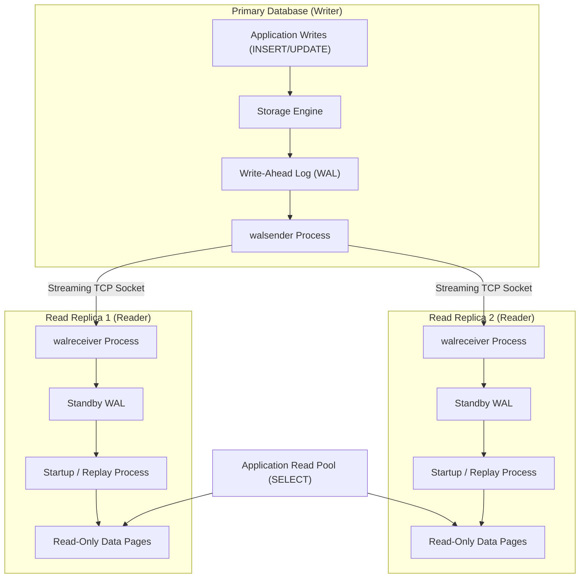
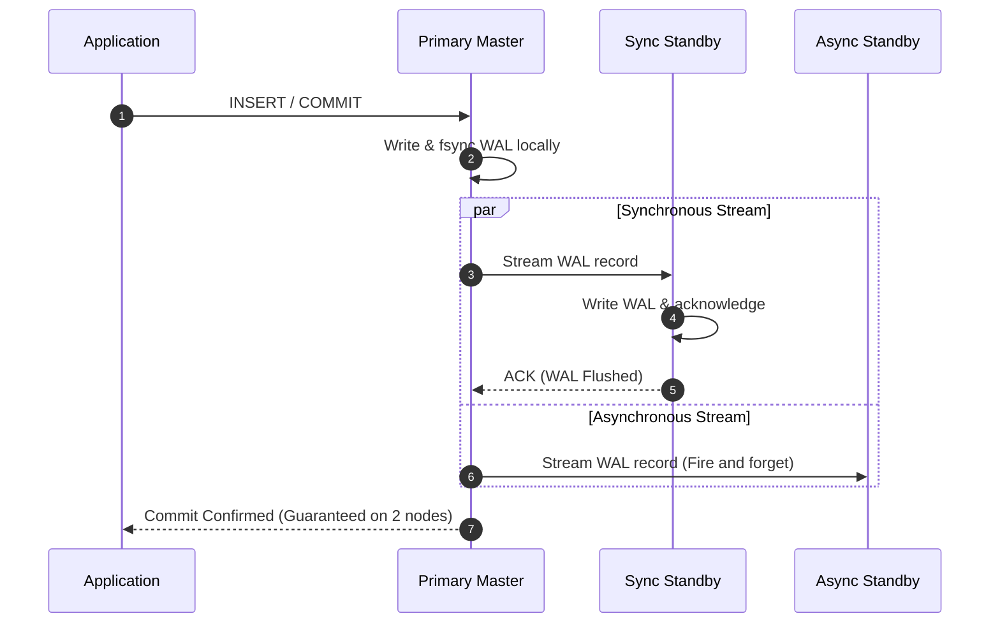
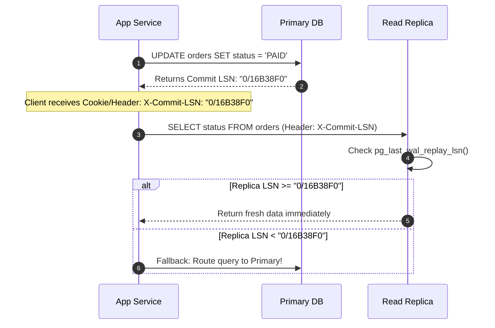

# Database Replication, WAL Streaming, and Read Replica Consistency

---

## 1. What Is It?
**Database Replication** is the continuous, real-time synchronization of data from a primary (leader/writer) database instance to one or more standby (follower/reader) instances. 

**Physical Streaming Replication** streams raw binary Write-Ahead Log (WAL) byte records directly across a persistent TCP connection to mirror the exact byte-for-byte physical disk page state of the primary. **Read Replicas** offload read-only query traffic from the primary writer node to horizontally scale read throughput.

---

## 2. Why Does It Exist?
A single relational database server has hard physical limits on CPU cores, RAM, and network bandwidth. If a platform experiences a $100:1$ read-to-write ratio ($100,000\text{ reads/sec}$ vs $1,000\text{ writes/sec}$), handling all traffic on the single primary master causes CPU exhaustion.

Replication solves two critical architectural requirements:
1. **High Availability & Failover**: If the primary hardware dies, a replica is promoted to primary with minimal downtime (MTTR) and minimal data loss (RPO).
2. **Horizontal Read Scalability**: Application routing directs all `SELECT` queries across a pool of read replicas, preserving the primary's resources exclusively for ACID write transactions.

---

## 3. Mental Model



---

## 4. How Does It Work?

### Physical vs Logical Replication

| Feature | Physical Streaming Replication | Logical Replication |
|---|---|---|
| **Mechanism** | Streams raw binary WAL bytes (Page-level diffs) | Streams decoded logical SQL row changes (`INSERT`, `UPDATE`, `DELETE`) via `pgoutput` |
| **Schema Flexibility** | Standby must be an exact byte-for-byte clone; same major version | Replicas can have different indexes, schemas, or major PG versions |
| **Write Capability on Replica** | Standby is strictly Read-Only | Replica can accept local writes to other tables |
| **Primary Use Case** | High Availability, Disaster Recovery, Read Replicas | Change Data Capture (CDC to Kafka), Cross-version upgrades |

---

## 5. Synchronous vs Asynchronous Replication



- **Asynchronous Replication (Default)**: Primary commits immediately on local disk and streams WAL asynchronously.
  - *Advantage*: Minimum write latency ($< 2\text{ms}$).
  - *Risk*: If primary dies abruptly, unstreamed WAL records are lost (**Replication Lag / RPO $> 0$**).
- **Synchronous Replication (`synchronous_standby_names`)**: Primary blocks the committing transaction until at least one configured standby acknowledges receiving and writing the WAL record.
  - *Advantage*: Zero data loss ($\text{RPO} = 0$).
  - *Cost*: Write latency inflates by the network roundtrip time ($+10-50\text{ms}$). If all standbys die, primary writes freeze.

---

## 6. The Stale Read Problem & Read-After-Write Solutions

### The Problem
```mermaid
sequenceDiagram
    autonumber
    actor User
    participant App as Application Server
    participant Primary as Primary DB (Writer)
    participant Replica as Read Replica (Lag: 500ms)

    User->>App: 1. Update Profile ("Alice Smith")
    App->>Primary: 2. UPDATE users SET name = 'Alice Smith' (Committed)
    Primary-->>App: 3. Success
    App-->>User: 4. Profile Saved!

    User->>App: 5. Refresh Profile Page
    App->>Replica: 6. SELECT name FROM users WHERE id = 1
    Note over Replica: Replica is 500ms behind; still has "Alice Jones"!
    Replica-->>App: 7. Returns "Alice Jones" (STALE READ!)
    App-->>User: 8. Displays "Alice Jones" (User thinks update failed!)
```

---

### Solution 1: Sticky Primary Routing (Session Pinning)
After a user performs any write mutation, the application flags their HTTP session/cookie. All subsequent read queries for that user are routed **directly to the Primary** for a cooldown window (e.g. $5\text{ seconds}$), after which reads revert to replicas.

---

### Solution 2: LSN Token-Based Read-Your-Writes Consistency


---

## 7. Implementation

### Spring Dynamic Routing DataSource (Master / Replica Routing)
```java
package com.backend.engineering.databases.routing;

import org.springframework.jdbc.datasource.lookup.AbstractRoutingDataSource;
import org.springframework.transaction.support.TransactionSynchronizationManager;

public class MasterReplicaRoutingDataSource extends AbstractRoutingDataSource {

    public enum DataSourceType {
        MASTER, REPLICA
    }

    @Override
    protected Object determineCurrentLookupKey() {
        // If current thread is in a read-only transaction, route to REPLICA
        boolean isReadOnly = TransactionSynchronizationManager.isCurrentTransactionReadOnly();
        return isReadOnly ? DataSourceType.REPLICA : DataSourceType.MASTER;
    }
}
```

---

## 8. Performance

| Architecture | Read Capacity | Write Latency | Failover Time (RTO) | Data Loss Risk (RPO) |
|---|---|---|---|---|
| Single Primary Node | $1\times$ (Bounded by single server) | Fast ($1-3\text{ms}$) | Minutes / Hours (Manual) | Risk of disk loss |
| 1 Primary + 3 Async Replicas | $\mathbf{4\times - 10\times}$ | Fast ($1-3\text{ms}$) | $< 30\text{s}$ (Automated Patroni/RDS) | Up to a few ms of WAL |
| 1 Primary + 1 Sync Replica | $2\times$ | Slower ($5-20\text{ms}$) | Instant ($< 10\text{s}$) | **Zero Data Loss ($\text{RPO}=0$)** |

---

## 9. Failure Scenarios

1. **Replication Lag Avalanche (Single-Threaded Replay Bottleneck)**:
   - *Failure*: While the primary processes transactions across 64 parallel CPU threads, the standby database replays WAL records sequentially using a **single startup replay thread**. A large bulk update on the primary creates thousands of WAL changes per second. Replay lag on replicas explodes from $5\text{ms}$ to $30\text{ minutes}$, serving severely stale data to users.
   - *Mitigation*: Avoid large monolithic bulk updates; chunk batch updates into small batches ($500\text{ rows}$) with pauses.

2. **Replication Slot Disk Exhaustion**:
   - *Failure*: If a read replica crashes or disconnects, the primary's configured replication slot keeps holding WAL files on disk indefinitely, waiting for the dead replica to reconnect. The primary's disk reaches $100\%$ full, causing an emergency shutdown.
   - *Mitigation*: Set `max_slot_wal_keep_size = 32GB` on the primary to automatically drop or invalidate lagging replication slots before disk exhaustion occurs.

---

## 10. Observability

### Measuring Replication Lag in PostgreSQL
```sql
-- Execute on PRIMARY: Monitor lag in bytes and time for all connected standbys
SELECT 
    client_addr AS replica_ip,
    state,
    sync_state,
    pg_wal_lsn_diff(pg_current_wal_lsn(), write_lsn) AS write_lag_bytes,
    pg_wal_lsn_diff(pg_current_wal_lsn(), flush_lsn) AS flush_lag_bytes,
    pg_wal_lsn_diff(pg_current_wal_lsn(), replay_lsn) AS replay_lag_bytes,
    write_lag,
    flush_lag,
    replay_lag
FROM pg_stat_replication;

-- Execute on STANDBY: Check replay timestamp lag
SELECT 
    now() - pg_last_xact_replay_timestamp() AS replication_time_lag,
    pg_last_wal_receive_lsn(),
    pg_last_wal_replay_lsn();
```

---

## 11. Debugging

### Triage: Diagnosing Read Replica Lag Spike
1. Check network saturation between Primary and Replica: `iperf3 -c replica_ip`.
2. Inspect Primary WAL generation rate: `pg_wal_lsn_diff(pg_current_wal_lsn(), '0/0')`.
3. Check Replica CPU utilization: If replica single-core CPU is pegged at $100\%$, the replay thread is CPU-bound.
4. Check for exclusive lock conflicts on the replica (long-running `SELECT` queries on the replica can block WAL replay of table DDL drops).

---

## 12. Scaling

1. **Cascading Replication**:
   - Instead of connecting 20 read replicas directly to the primary (saturating the primary's network egress), connect 2 intermediate standbys to the primary, and connect 9 replicas to each intermediate standby.
2. **Geographical Read Replicas**:
   - Deploy cross-region read replicas (e.g. AWS Aurora Global Database) in `us-east`, `eu-west`, and `ap-southeast` to serve local read requests with $< 20\text{ms}$ latency.

---

## 13. Trade-offs

| Replication Model | Throughput | Consistency Guarantee | Disaster Resilience |
|---|---|---|---|
| **Asynchronous Streaming** | Maximum throughput, lowest latency | Eventual consistency; subject to stale reads | Minimal data loss if lag is monitored |
| **Synchronous Replication** | Reduced write throughput, higher latency | Strong consistency on standby | Zero data loss on primary failure |
| **Logical Replication** | Selective table sync; cross-version | Slower replication throughput than physical | Ideal for zero-downtime DB migrations |

---

## 14. When to Use
- High read-to-write ratios ($> 10:1$) where horizontal read scaling is needed.
- Mission-critical systems requiring automatic high-availability failover (AWS RDS Multi-AZ, Patroni PostgreSQL clusters).
- Offloading analytical reports, business intelligence queries, and backups from the primary database.

---

## 15. When NOT to Use
- Pure write-heavy workloads (where $> 80\%$ of traffic is `INSERT`/`UPDATE`/`DELETE`); read replicas do not scale write throughput.
- Applications requiring strict real-time serializable read consistency across all queries without implementing LSN token checking or primary routing.

---

## 16. Interview Questions

### Q1: What is the "Stale Read" (or Read-Your-Own-Writes) problem in database read-replica architectures, and how do you solve it in production?
<details>
<summary>Reveal Answer</summary>

**Answer**:
The **Stale Read** problem occurs when an application writes data to the Primary database (e.g. creating an order or updating a profile) and immediately attempts to read that data from an asynchronous Read Replica. Because physical or logical replication has non-zero network and replay lag ($10-500\text{ms}$), the replica has not yet applied the WAL changes, returning stale data to the user.
**Production Solutions**:
1. **Sticky Primary Routing**: Temporarily route all read queries from a mutating user/session to the Primary database for a 5-10 second window following any write.
2. **LSN / Replication Token Tracking**: The write operation returns the exact Write-Ahead Log sequence number (`Commit-LSN`). The subsequent read query includes this token; if the replica's `pg_last_wal_replay_lsn()` is strictly less than the token, the application either waits briefly or redirects the read to the Primary.
3. **Explicit `@Transactional(readOnly = false)`**: Annotate critical user workflows to read directly from the Primary datasource.
</details>

### Q2: Why does a long-running read query on a PostgreSQL physical standby replica sometimes cancel with "ERROR: canceling statement due to conflict with recovery"?
<details>
<summary>Reveal Answer</summary>

**Answer**:
Physical streaming replication replays exact page-level byte operations from the primary.
If the Primary executes a `VACUUM` that cleans dead tuples on Page $P$, or an `ALTER TABLE` that drops a column, that change is logged to the WAL and streamed to the replica.
If a user on the standby replica is currently running a long-running `SELECT` query that is holding a read lock or reading tuples on Page $P$:
1. The standby's WAL replay process cannot apply the WAL clean/drop operation without conflicting with the running query.
2. The standby pauses WAL replay and starts a timer governed by `max_standby_streaming_delay` (default: 30s).
3. If the long read query does not finish before the timer expires, the standby **abruptly aborts the query** (`canceling statement due to conflict with recovery`) to allow WAL replay to continue and prevent infinite replication lag.
</details>

---

## 17. Practical Exercise
1. Set up a PostgreSQL primary and streaming read replica using Docker Compose.
2. Monitor replication lag metrics using `pg_stat_replication` while performing continuous bulk inserts.
3. Write a Spring Boot routing DataSource that automatically routes `@Transactional(readOnly = true)` to the replica and `@Transactional` to the primary.
4. Demonstrate a race condition where an immediate read after write returns stale data on the replica, and implement sticky session routing to fix it.

---

## 18. Quick Revision
- **Streaming Replication**: Streams raw binary WAL records from Primary `walsender` to Standby `walreceiver`.
- **Async vs Sync**: Async provides low write latency but risks replication lag; Sync guarantees $\text{RPO} = 0$ at the cost of higher commit latency.
- **Read-After-Write Consistency**: Solved via Sticky Primary routing, LSN token checking, or selective primary reads.
- **Replication Slots**: Guarantee the primary retains WAL for standbys, but must be bounded with `max_slot_wal_keep_size` to prevent disk full crashes.
