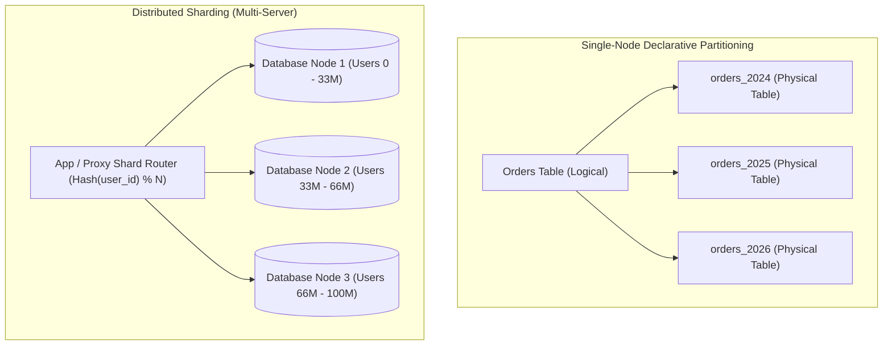
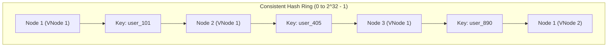

# Database Partitioning, Sharding Architecture, and Consistent Hashing

---

## 1. What Is It?
**Database Partitioning** is the division of a single logical database table into smaller, distinct physical storage subsets (**partitions**) managed on a single database server. 

**Database Sharding** is the horizontal distribution of data rows across multiple **independent database instances / physical servers** (shards), where each shard operates as an autonomous database containing a fraction of the total dataset.

---

## 2. Why Does It Exist?
As data scales past hundreds of millions of rows ($> 1\text{TB}$):
1. **B+Tree Index Degradation**: B+Trees grow to 4 or 5 levels deep. The entire working set of indexes no longer fits in the RAM Buffer Pool, causing frequent random disk I/O.
2. **Vacuum & Maintenance Bottlenecks**: Deleting 50,000,000 expired rows via `DELETE FROM logs WHERE created_at < NOW() - INTERVAL '90 days'` generates massive WAL traffic, dead tuple bloat, and table lock contention.
3. **Single-Node Write Limits**: A single server eventually hits physical limits on CPU cores, RAM, and IOPS.

Partitioning allows dropping entire physical partitions instantly via $O(1)$ `DROP TABLE partition_name` without generating dead tuples. Sharding breaks the single-node compute and storage barrier by distributing writes across $N$ servers.

---

## 3. Mental Model



---

## 4. How Does It Work?

### 1. Declarative Table Partitioning Strategies
- **Range Partitioning**: Divides data by contiguous numerical or date ranges (`created_at BETWEEN '2025-01-01' AND '2025-02-01'`). Ideal for time-series logs and audit events.
- **List Partitioning**: Divides data by explicit discrete values (`region IN ('US', 'EU', 'APAC')`). Ideal for geographical multi-tenant routing.
- **Hash Partitioning**: Distributes rows evenly using a hash modulus of the partition key (`HASH(user_id) MOD 8`). Ideal for eliminating hot spots.

### Partition Pruning by the Query Planner
When a query executes with a filter on the partition key:
```sql
SELECT * FROM orders WHERE created_at >= '2026-03-01' AND created_at < '2026-04-01';
```
The Query Planner performs **Static / Dynamic Partition Pruning**: it inspects partition metadata and **completely skips scanning all partitions outside the target range**, reading only the specific physical table for March 2026.

---

## 5. Distributed Sharding & Consistent Hashing

### The Resharding Problem with Simple Modulo
Using naive modulo hashing ($\text{Shard} = \text{Hash}(K) \pmod N$):
- If you have 4 shards ($N=4$) and add a 5th shard ($N=5$), **$\approx 80\%$ of all keys map to completely different shards**, requiring a catastrophic global data migration of the entire database.

### Consistent Hashing with Virtual Nodes (VNodes)
Consistent Hashing arranges shards on a circular $2^{32}$ hash ring:
- When a new shard is added, **only $\frac{K}{N}$ keys are moved** from its adjacent neighbors.
- **Virtual Nodes (VNodes)**: Each physical database server is mapped to 100-256 virtual points on the ring. This guarantees perfectly uniform data distribution and eliminates hot spots when servers have unequal hardware capacities.



---

## 6. Example

### 1. PostgreSQL Declarative Range Partitioning with Sub-Partitions
```sql
-- Create Parent Partitioned Table
CREATE TABLE customer_events (
    id BIGINT GENERATED ALWAYS AS IDENTITY,
    user_id BIGINT NOT NULL,
    event_type VARCHAR(64) NOT NULL,
    payload JSONB,
    created_at TIMESTAMP WITH TIME ZONE NOT NULL,
    PRIMARY KEY (id, created_at) -- Primary key MUST include the partition key!
) PARTITION BY RANGE (created_at);

-- Create Monthly Partitions
CREATE TABLE customer_events_2026_01 PARTITION OF customer_events
    FOR VALUES FROM ('2026-01-01 00:00:00+00') TO ('2026-02-01 00:00:00+00');

CREATE TABLE customer_events_2026_02 PARTITION OF customer_events
    FOR VALUES FROM ('2026-02-01 00:00:00+00') TO ('2026-03-01 00:00:00+00');

CREATE TABLE customer_events_2026_03 PARTITION OF customer_events
    FOR VALUES FROM ('2026-03-01 00:00:00+00') TO ('2026-04-01 00:00:00+00');
```

---

## 7. Implementation

### Java 21 Consistent Hash Ring Implementation with Virtual Nodes
```java
package com.backend.engineering.databases.sharding;

import java.nio.charset.StandardCharsets;
import java.security.MessageDigest;
import java.security.NoSuchAlgorithmException;
import java.util.*;

public class ConsistentHashRouter<T> {

    private final int numberOfReplicas; // Virtual nodes per physical server
    private final SortedMap<Long, T> ring = new TreeMap<>();

    public ConsistentHashRouter(int numberOfReplicas, Collection<T> nodes) {
        this.numberOfReplicas = numberOfReplicas;
        for (T node : nodes) {
            addNode(node);
        }
    }

    public synchronized void addNode(T node) {
        for (int i = 0; i < numberOfReplicas; i++) {
            long hash = hash(node.toString() + "-VNODE-" + i);
            ring.put(hash, node);
        }
    }

    public synchronized void removeNode(T node) {
        for (int i = 0; i < numberOfReplicas; i++) {
            long hash = hash(node.toString() + "-VNODE-" + i);
            ring.remove(hash);
        }
    }

    public T route(String key) {
        if (ring.isEmpty()) {
            throw new IllegalStateException("Consistent hash ring is empty");
        }
        long hash = hash(key);
        // Find the first virtual node equal to or greater than the key hash
        SortedMap<Long, T> tailMap = ring.tailMap(hash);
        long targetHash = tailMap.isEmpty() ? ring.firstKey() : tailMap.firstKey();
        return ring.get(targetHash);
    }

    // 64-bit Murmur3 / MD5 hashing
    private long hash(String key) {
        try {
            MessageDigest md = MessageDigest.getInstance("MD5");
            byte[] digest = md.digest(key.getBytes(StandardCharsets.UTF_8));
            return ((long) (digest[3] & 0xFF) << 24)
                    | ((long) (digest[2] & 0xFF) << 16)
                    | ((long) (digest[1] & 0xFF) << 8)
                    | ((long) (digest[0] & 0xFF));
        } catch (NoSuchAlgorithmException e) {
            throw new RuntimeException(e);
        }
    }
}
```

---

## 8. Performance

| Strategy | Storage / Scalability | Maintenance Cost | Query Optimization |
|---|---|---|---|
| Single Massive Table ($500\text{M rows}$) | Max $1\text{ Node}$ | Slow `VACUUM`, dead tuple bloat, slow deletes | Large B+Tree requires constant disk reads |
| Partitioned Table ($12\times 40\text{M}$) | Max $1\text{ Node}$ | **Instant partition drop ($< 1\text{ms}$)** | Partition pruning skips $92\%$ of table pages |
| Distributed Sharding ($10\text{ Nodes}$) | **Infinite Horizontal Scale** | Complex cross-shard backups & migrations | Single-shard point lookup: $< 2\text{ms}$ |

---

## 9. The 4 Major Engineering Challenges of Sharding

1. **Scatter-Gather Queries (Cross-Shard Queries)**:
   - If a query filters by a non-sharded key (`WHERE email = 'alice@example.com'` on a database sharded by `user_id`), the application/proxy must send parallel queries to **all 50 shards**, collect 50 result sets over the network, merge/sort them in memory, and return the result. Latency degrades to the slowest shard ($p99$ tail latency).
2. **Cross-Shard Distributed Transactions (2-Phase Commit Overhead)**:
   - Transferring funds between two users residing on different physical shards requires a distributed transaction protocol (2PC / XA). 2PC introduces blocking network rounds and locks across multiple coordinators, reducing throughput by $90\%$.
3. **Resharding / Rebalancing Data Migrations**:
   - Adding new physical servers requires migrating gigabytes of data between active nodes with zero downtime.
4. **Referential Integrity Loss**:
   - Relational Foreign Key constraints **cannot cross physical network database boundaries**. Foreign key validation must be enforced in application code.

---

## 10. Observability

### Verifying Partition Pruning in Query Plans
```sql
EXPLAIN (ANALYZE, COSTS)
SELECT * FROM customer_events
WHERE created_at >= '2026-02-15' AND created_at < '2026-02-20';
```
- **Expected Plan**:
  - `Append  (cost=0.00..25.40 rows=150)`
  - `  ->  Seq Scan on customer_events_2026_02`
  - *(Notice `customer_events_2026_01` and `customer_events_2026_03` are completely absent from the plan, confirming static partition pruning).*

---

## 11. Debugging

### Triage: Identifying Accidental Scatter-Gather Queries
- Monitor cross-shard proxy metrics (e.g. Citus / Vitess `queries_routed_to_all_shards_total`).
- Look for SQL queries missing the shard key (`user_id`) in their `WHERE` clause.

---

## 12. Scaling

### Global Secondary Indexes (GSI)
To avoid scatter-gather queries when searching by secondary attributes (e.g. `phone_number` or `email` when sharded by `user_id`):
1. **Lookup Table / Reverse Index (Redis or Metadata DB)**:
   - Stores `email -> user_id` mapping in a high-speed cache.
   - App does an initial $O(1)$ lookup to find `user_id`, then routes the primary query directly to the target shard.
2. **Asynchronous Secondary Indexing via CDC**:
   - Stream shard WAL events into Kafka and build a dedicated Elasticsearch / DynamoDB secondary index cluster.

---

## 13. Trade-offs

| Scaling Technique | Strengths | Severe Trade-offs |
|---|---|---|
| **Partitioning (Single Node)** | Native SQL support, instant table drops, zero application changes | Limited to compute/storage of one physical server |
| **App-Level Sharding** | Unlimited write scaling; no expensive proprietary DB software | No cross-shard FKs, complex 2PC transactions, scatter-gather queries |
| **Distributed SQL (CockroachDB / Yugabyte)** | Native distributed transactions, automatic rebalancing | Higher latency per write ($10-30\text{ms}$) due to Raft consensus |

---

## 14. When to Use
- **Partitioning**: Large time-series tables, audit logs, or multi-tenant tables requiring periodic historical data purges.
- **Sharding**: When total dataset size exceeds multi-terabyte disk limits or write IOPS exceed the physical capacity of the largest available cloud database instance (e.g. AWS `r6i.32xlarge`).

---

## 15. When NOT to Use
- Premature optimization on databases with $< 100\text{ million}$ rows and manageable write throughput.
- Applications with complex relational reporting, frequent ad-hoc joins across arbitrary columns, and heavy analytical queries.

---

## 16. Interview Questions

### Q1: What is the difference between Partitioning and Sharding?
<details>
<summary>Reveal Answer</summary>

**Answer**:
- **Partitioning** divides a table into smaller physical chunks **within a single database instance**. The database engine automatically manages partition pruning, foreign keys, and indexes locally. It solves local B+Tree index bloat and maintenance issues (e.g. dropping old data via `DROP PARTITION`), but remains bounded by the physical CPU, RAM, and disk limits of that single server.
- **Sharding** distributes data across **multiple independent physical database instances/servers**. Each shard has its own independent CPU, RAM, buffer pool, and disk. Sharding solves single-node hardware write and compute limits, but introduces significant distributed systems complexity (cross-shard joins, distributed 2-Phase Commit transactions, scatter-gather queries, and data rebalancing).
</details>

### Q2: Why is the Primary Key in a partitioned table required to include the partition key column in PostgreSQL and MySQL?
<details>
<summary>Reveal Answer</summary>

**Answer**:
Relational databases enforce **Primary Key Uniqueness** via local B+Tree indexes created on each physical partition.
If a table is partitioned by `created_at`, each partition only contains the B+Tree index for its specific date range.
If a row with `id = 101` is inserted into the February 2026 partition, the engine can only check whether `id = 101` exists within February 2026. Without scanning all other partitions (which would turn every single insert into an expensive cross-partition scan), the engine cannot guarantee global uniqueness of `id` across January, March, or April partitions unless the partition key (`created_at`) is part of the primary key composite constraint `(id, created_at)`.
</details>

---

## 17. Practical Exercise
1. Create a PostgreSQL table partitioned by range on `created_at` with 12 monthly partitions.
2. Insert 1,000,000 simulated log events across 12 months.
3. Run `EXPLAIN ANALYZE` on a query filtering for a specific 5-day window and verify that partition pruning skips 11 of the 12 partitions.
4. Execute `DROP TABLE log_events_2025_01` and measure the execution time ($< 2\text{ms}$) compared to running `DELETE FROM log_events WHERE created_at < '2025-02-01'`.

---

## 18. Quick Revision
- **Partitioning**: Single-node division of tables into smaller physical tables; enables fast partition pruning and instant partition drops.
- **Partition Pruning**: Query planner evaluates `WHERE` clauses and skips reading irrelevant partitions.
- **Consistent Hashing**: Minimizes data migration to $\frac{K}{N}$ during node additions on a distributed hash ring.
- **Virtual Nodes (VNodes)**: Eliminate hot spots and ensure uniform hash distribution across heterogeneous nodes.
- **Scatter-Gather**: Querying sharded databases without the shard key forces queries to all shards, resulting in tail latency degradation.
