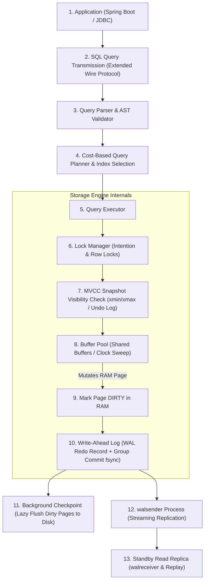

# Module 08: Database Internals & Storage Engines

Deconstruct the low-level physical internals of modern relational storage engines: slotted page architectures, buffer pool memory management, Write-Ahead Logging (WAL), Multi-Version Concurrency Control (MVCC), deadlock graph cycle detection, physical streaming replication, and distributed sharding.

---

## 🗺️ Master End-to-End Query & Mutation Lifecycle

---

## 📚 Curriculum Lessons

| # | Lesson | Core Focus & Mechanics |
|:---:|---|---|
| **01** | [`01-storage-engines-pages-and-buffer-pool.md`](./01-storage-engines-pages-and-buffer-pool.md) | 8KB/16KB slotted page anatomy, line pointer arrays, buffer pool frames, and the Clock-Sweep eviction algorithm. |
| **02** | [`02-write-ahead-log-and-crash-recovery.md`](./02-write-ahead-log-and-crash-recovery.md) | The core WAL invariant, Log Sequence Numbers (LSN), Group Commit `fsync`, and ARIES 3-phase crash recovery (Analysis, Redo, Undo). |
| **03** | [`03-mvcc-multi-version-concurrency-control.md`](./03-mvcc-multi-version-concurrency-control.md) | PostgreSQL heap multi-version (`xmin`/`xmax`/`infomask`) vs MySQL InnoDB Undo Logs, table bloat, Autovacuum, and XID wraparound disaster prevention. |
| **04** | [`04-lock-manager-and-deadlock-detection.md`](./04-lock-manager-and-deadlock-detection.md) | Lock modes (`S`, `X`, `IS`, `IX`), Lock Manager hash tables, Wait-For Graph cycle detection, and deterministic key sorting for deadlock prevention. |
| **05** | [`05-replication-wal-streaming-and-read-replicas.md`](./05-replication-wal-streaming-and-read-replicas.md) | Physical streaming replication (`walsender`/`walreceiver`), synchronous vs asynchronous durability, and solving stale reads via Sticky Primary and LSN token routing. |
| **06** | [`06-partitioning-and-sharding-mechanics.md`](./06-partitioning-and-sharding-mechanics.md) | Declarative table partitioning, partition pruning, distributed consistent hashing with virtual nodes, and scatter-gather query triage. |

---

## ⚡ Key Engineering Invariants

1. **The WAL Invariant**: Never write a dirty data page to physical disk until the WAL record describing that mutation is flushed to disk.
2. **PostgreSQL vs MySQL MVCC**: PostgreSQL appends new tuple versions in heap (requiring vacuuming); MySQL updates in-place and builds an Undo Log chain.
3. **Deadlock Prevention Rule**: Always sort resource identifiers in strict ascending numerical order before acquiring row-level locks.
4. **Partition Pruning Rule**: The primary key on a partitioned table must include the partition key to preserve $O(1)$ local unique constraint validation.
5. **Read Replica Stale Read Mitigation**: Use session pinning or LSN token validation to guarantee Read-Your-Own-Writes consistency across asynchronous replicas.
