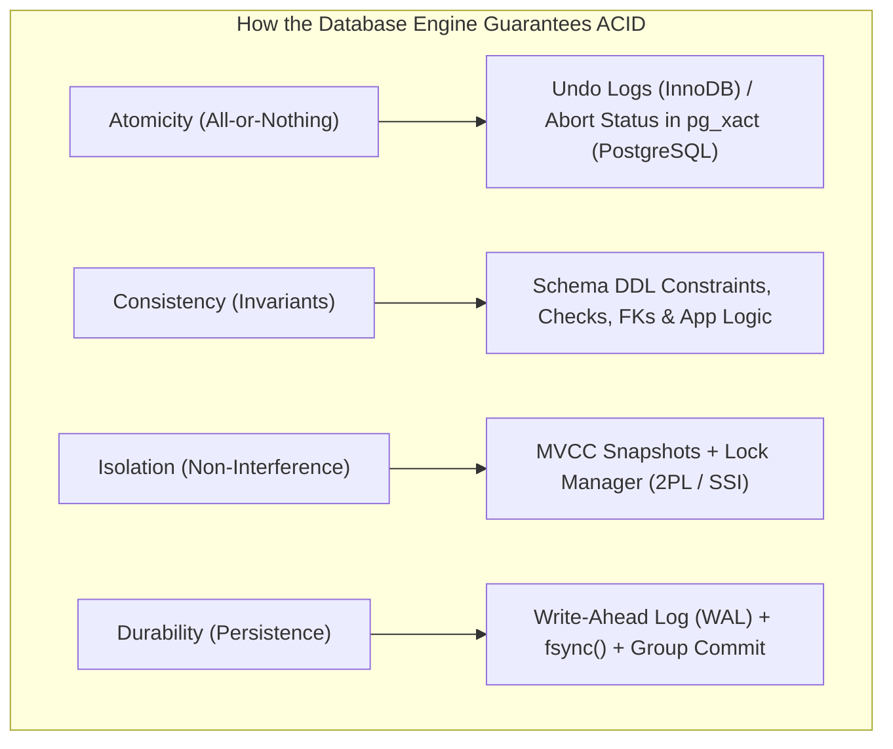
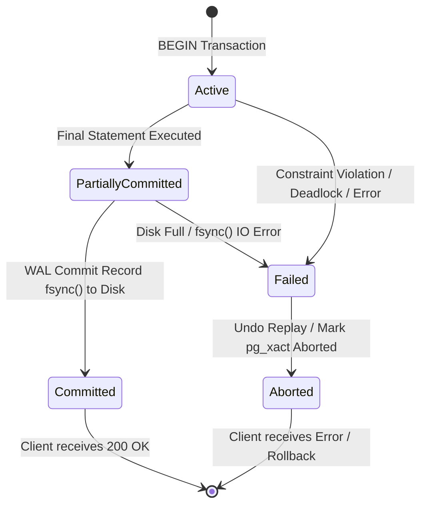

# ACID Properties, Mathematical Invariants, and Engine Guarantees

---

## 1. What Is It?
An **ACID Transaction** is an atomic, logical unit of database work that transitions a database from one consistent state to another. **ACID** is the formal contract guaranteeing:
- **A — Atomicity**: "All-or-Nothing". Either every mutation in the transaction succeeds, or the entire transaction is rolled back with zero partial side effects.
- **C — Consistency**: Preserves application and relational domain invariants (Foreign Keys, Unique, Check, Not Null, balance $\ge 0$).
- **I — Isolation**: The execution of concurrent transactions produces the same state as if they were executed sequentially without interference.
- **D — Durability**: Once committed, transaction mutations survive any subsequent server crash, power outage, or OS panic.

---

## 2. Why Does It Exist?
In high-concurrency distributed systems, hardware and network failures are continuous realities:
- A power cut occurs while transferring $\$500$ between two bank accounts (after debiting Account A, but before crediting Account B).
- A concurrent worker thread reads uncommitted account state and acts on phantom funds.
- An OS kernel panics while dirty pages are still sitting in volatile RAM.

Without strict ACID guarantees, databases suffer from catastrophic silent data corruption, lost funds, and irrecoverable system states.

---

## 3. Mental Model



---

## 4. How Does It Work?

### How the Storage Engine Enforces Each Property

1. **Atomicity Enforcement**:
   - **PostgreSQL**: When a transaction starts, it receives a 32-bit `xid`. All inserted/updated tuples are tagged with this `xid`. If the transaction aborts (`ROLLBACK` or crash), PostgreSQL writes an `ABORT` record to the Commit Log (`pg_xact`). The storage engine immediately treats all tuples tagged with that `xid` as mathematically invisible.
   - **MySQL InnoDB**: Records row diffs in **Undo Log segments**. If the transaction aborts, the engine iterates backwards through the undo log, physically reversing every modified column back to its original state.

2. **Consistency Enforcement**:
   - **Physical Level**: Page checksums detect torn pages; B+Tree structure invariants prevent graph cycles.
   - **Logical / Schema Level**: Evaluates `CHECK (balance >= 0)`, `FOREIGN KEY ... REFERENCES`, and `UNIQUE` indexes before transaction commit.
   - **Application Level**: Enforces complex business logic spanning multiple domain entities.

3. **Isolation Enforcement**:
   - Implemented via **Multi-Version Concurrency Control (MVCC)** for reads and **Two-Phase Locking (2PL)** or **Serializable Snapshot Isolation (SSI)** for concurrent writes.

4. **Durability Enforcement**:
   - Implemented via **Write-Ahead Logging (WAL)**. A transaction is not confirmed to the client until its commit record has been physically flushed to persistent non-volatile storage via the `fsync()` system call.

---

## 5. Internal Working

### The Dual-State Life of an ACID Transaction


---

## 6. Example

### Bank Balance Transfer Invariant in SQL
```sql
BEGIN;

-- 1. Deduct $100 from Account A
UPDATE accounts 
SET balance_cents = balance_cents - 10000 
WHERE id = 1 AND balance_cents >= 10000;

-- Verify 1 row was updated (App level invariant check)
-- If 0 rows updated (insufficient balance), immediately ROLLBACK!

-- 2. Add $100 to Account B
UPDATE accounts 
SET balance_cents = balance_cents + 10000 
WHERE id = 2;

-- 3. Log Immutable Audit Ledger Entry
INSERT INTO transfer_audit_logs (from_account_id, to_account_id, amount_cents, created_at)
VALUES (1, 2, 10000, CURRENT_TIMESTAMP);

COMMIT; -- Atomically flushes WAL; mutations become globally durable and visible
```

---

## 7. Implementation

### Production Java 21 Banking Transfer Service with Invariant Checks
```java
package com.backend.engineering.transactions.service;

import org.springframework.jdbc.core.JdbcTemplate;
import org.springframework.stereotype.Service;
import org.springframework.transaction.annotation.Isolation;
import org.springframework.transaction.annotation.Propagation;
import org.springframework.transaction.annotation.Transactional;

@Service
public class AccountTransferService {

    private final JdbcTemplate jdbcTemplate;

    public AccountTransferService(JdbcTemplate jdbcTemplate) {
        this.jdbcTemplate = jdbcTemplate;
    }

    @Transactional(
        propagation = Propagation.REQUIRED,
        isolation = Isolation.READ_COMMITTED,
        timeout = 5,
        rollbackFor = Exception.class
    )
    public void transferFunds(Long fromId, Long toId, long amountCents) {
        if (amountCents <= 0) {
            throw new IllegalArgumentException("Transfer amount must be positive");
        }

        // Deadlock prevention: Order lock acquisitions
        Long firstId = Math.min(fromId, toId);
        Long secondId = Math.max(fromId, toId);

        // Lock accounts deterministically
        jdbcTemplate.queryForList("SELECT id FROM accounts WHERE id IN (?, ?) ORDER BY id FOR UPDATE", firstId, secondId);

        // 1. Deduct from sender with atomic invariant check
        int updated = jdbcTemplate.update(
            "UPDATE accounts SET balance_cents = balance_cents - ? WHERE id = ? AND balance_cents >= ?",
            amountCents, fromId, amountCents
        );

        if (updated == 0) {
            // Triggers automatic transaction ROLLBACK
            throw new IllegalStateException("Insufficient funds in account: " + fromId);
        }

        // 2. Credit receiver
        jdbcTemplate.update(
            "UPDATE accounts SET balance_cents = balance_cents + ? WHERE id = ?",
            amountCents, toId
        );

        // 3. Write audit log
        jdbcTemplate.update(
            "INSERT INTO transfer_logs (from_id, to_id, amount_cents) VALUES (?, ?, ?)",
            fromId, toId, amountCents
        );
    }
}
```

---

## 8. Performance

| ACID Component | Primary Bottleneck | Optimization Mechanism |
|---|---|---|
| **Atomicity** | Undo log write / rollback replay cost | In-memory append-only tuple marking (`pg_xact`) |
| **Consistency** | Foreign key / Unique index lookups | Composite B+Tree indexing on foreign key constraints |
| **Isolation** | Lock contention & serialization conflicts | MVCC non-blocking snapshot reads |
| **Durability** | Disk `fsync()` physical IOPS limit | **Group Commit** coalescing concurrent transactions |

---

## 9. Failure Scenarios

1. **Partial State Leak via Unhandled Runtime Exceptions**:
   - *Failure*: A method updates the database, catches an exception internally without rethrowing it or setting `TransactionAspectSupport.currentTransactionStatus().setRollbackOnly()`. Spring's AOP interceptor assumes the method succeeded and **commits the partial, corrupted state**.
   - *Mitigation*: Never catch and swallow exceptions inside `@Transactional` methods without explicitly triggering a rollback.

2. **Storage Full Panic During Commit**:
   - *Failure*: The application executes all SQL queries successfully. During the `COMMIT` phase, the database attempts to write the commit record to the WAL, but the physical disk runs out of space. The `fsync()` fails.
   - *Mitigation*: The engine treats the transaction as `FAILED`, initiates an immediate abort, and rolls back all in-memory changes.

---

## 10. Observability

### Monitoring Transaction Commit vs Rollback Ratios
```sql
SELECT 
    datname,
    xact_commit AS total_commits,
    xact_rollback AS total_rollbacks,
    round(100.0 * xact_rollback / nullif(xact_commit + xact_rollback, 0), 2) AS rollback_rate_pct
FROM pg_stat_database
WHERE datname = current_database();
```
- A sudden spike in `rollback_rate_pct` ($> 5\%$) indicates serialization failures, deadlock bursts, or application invariant violations.

---

## 11. Debugging

### Triage: Identifying Aborting Transactions via Postgres Logs
- Configure PostgreSQL logging:
  ```ini
  log_min_error_statement = 'error'
  log_line_prefix = '%m [%p] tx=%x '
  ```
- Look for error codes:
  - `23505`: `unique_violation` (Duplicate key insertion).
  - `23503`: `foreign_key_violation` (Referential integrity failure).
  - `40P01`: `deadlock_detected` (Lock cycle aborted).
  - `40001`: `serialization_failure` (Serializable isolation conflict).

---

## 12. Scaling

### ACID vs BASE in Distributed Systems
When scaling horizontally across multiple database nodes, the CAP theorem forces a trade-off:
- **ACID (Pessimistic / Strong Consistency)**: Single-node relational databases or synchronous distributed SQL (CockroachDB, Google Spanner via Paxos/TrueTime).
- **BASE (Basically Available, Soft-state, Eventual Consistency)**: High-scale distributed databases (DynamoDB, Cassandra) trading immediate consistency for global availability and partition tolerance.

---

## 13. Trade-offs

| Consistency Paradigm | Strength | Severe Cost | Best Use Case |
|---|---|---|---|
| **Full ACID (Strict Serializability)** | Mathematically impossible to produce inconsistent states | Higher write latency, lower concurrency under contention | Financial ledgers, payment processing, inventory |
| **BASE (Eventual Consistency)** | Infinite horizontal scale, $< 5\text{ms}$ global writes | Application must handle conflict resolution (CRDTs, LWW) | Social feeds, messaging, telemetry, shopping carts |

---

## 14. When to Use
- Mandatory for core financial, payment, billing, order placement, and authentication workflows.
- Any business process where partial failure creates unrecoverable financial or legal liabilities.

---

## 15. When NOT to Use
- High-frequency IoT sensor telemetry ingestion (use append-only time-series databases with relaxed durability).
- Real-time video game telemetry and live user presence tracking.

---

## 16. Interview Questions

### Q1: What is the exact difference between Consistency in ACID vs Consistency in the CAP Theorem?
<details>
<summary>Reveal Answer</summary>

**Answer**:
This is one of the most common interview traps:
1. **Consistency in ACID (C)**: Refers to **Application and Domain Invariants**. The transaction must transition the database from one valid schema/domain state to another, preserving constraints (Foreign Keys, Unique constraints, Check conditions, and business rules like non-negative balance).
2. **Consistency in CAP (C)**: Refers to **Linearizability (Single-Copy Consistency)** in distributed systems. It guarantees that **every read returns the most recent write or an error**, ensuring that all distributed nodes in a cluster appear to clients as a single unified instantaneous clock and state machine.
</details>

### Q2: How does a database guarantee Atomicity if the operating system crashes while executing a multi-statement transaction?
<details>
<summary>Reveal Answer</summary>

**Answer**:
Through the combination of **Write-Ahead Logging (WAL)** and the **ARIES recovery protocol**:
1. Before any data page is modified in RAM, the database logs all mutations to the WAL.
2. If the OS crashes midway through a transaction, the transaction never writes a `COMMIT` record to the WAL.
3. Upon restarting, the database enters the **Crash Recovery** phase:
   - **Analysis Phase**: Identifies that the transaction was active/uncommitted at the time of crash.
   - **Redo Phase**: Replays the WAL to reconstruct memory state at the point of crash.
   - **Undo Phase**: Scans the WAL backwards and actively reverses all uncommitted mutations (or in PostgreSQL, marks the `xid` as `ABORTED` in `pg_xact`), ensuring that none of the partial changes are ever visible to subsequent transactions.
</details>

---

## 17. Practical Exercise
1. Write a Spring Boot test that executes a multi-step financial transfer.
2. Throw an unchecked `RuntimeException` after the debit operation.
3. Verify via database assertion that the debit was completely rolled back and both accounts retain their original balance.
4. Catch the exception inside the service method *without rethrowing* and observe the catastrophic failure where partial state is committed, demonstrating the swallowed exception anti-pattern.

---

## 18. Quick Revision
- **Atomicity**: All-or-nothing; guaranteed by Undo Logs (MySQL) or `pg_xact` abort flags (Postgres).
- **Consistency**: Preserves schema and business invariants.
- **Isolation**: Concurrent transactions do not interfere; guaranteed by MVCC and Lock Managers.
- **Durability**: Committed state survives crashes; guaranteed by WAL `fsync()` and Group Commit.
- **ACID (C) vs CAP (C)**: ACID Consistency = Schema Invariants; CAP Consistency = Linearizability / Single-Copy view.
