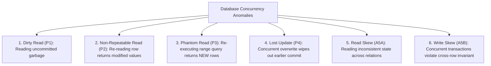
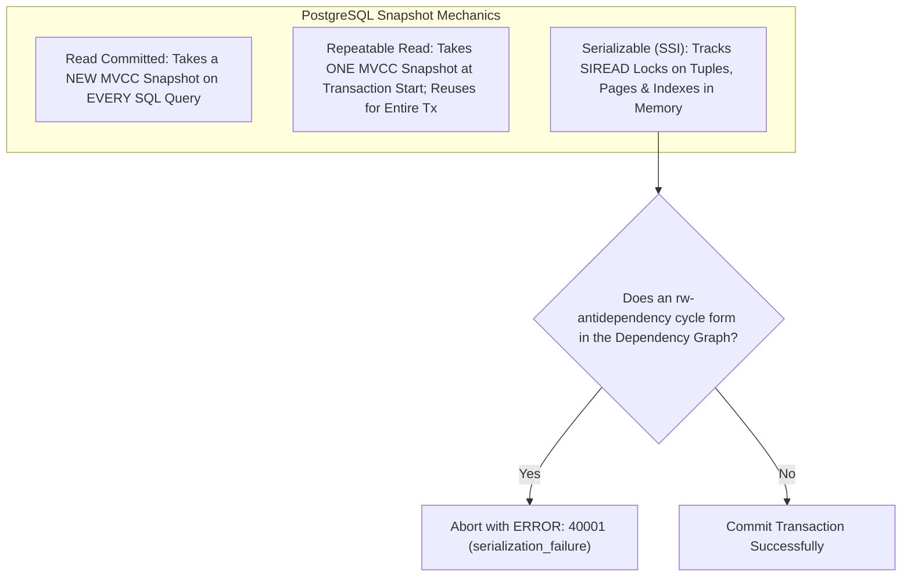

# Transaction Isolation Levels, Concurrency Anomalies, and SSI Internals

---

## 1. What Is It?
**Transaction Isolation Levels** define the degree to which the modifications made by one transaction are visible to other concurrent transactions. The ANSI/ISO SQL standard defines 4 classical isolation levels:
1. **Read Uncommitted**
2. **Read Committed** (Default in PostgreSQL, Oracle, SQL Server)
3. **Repeatable Read** (Default in MySQL InnoDB)
4. **Serializable** (Strict Serializability / SSI)

---

## 2. Why Does It Exist?
Executing all transactions with strict **Serializability** (one after another) eliminates all concurrency bugs, but severely limits database throughput. Lower isolation levels trade consistency guarantees for higher concurrent transaction throughput by permitting specific, well-defined **Concurrency Anomalies**.

---

## 3. The 6 Concurrency Anomalies



---

## 4. Anomaly Breakdown & Deep Mechanics

### 1. Dirty Read ($P_1$)
- **Scenario**: Transaction 1 modifies a row. Transaction 2 reads that uncommitted modified row. Transaction 1 then **aborts and rolls back**. Transaction 2 acted on data that *never mathematically existed*.
- **Prevented By**: Read Committed, Repeatable Read, Serializable.

---

### 2. Non-Repeatable / Fuzzy Read ($P_2$)
- **Scenario**: Transaction 1 reads Row A ($balance = \$100$). Transaction 2 updates Row A ($balance = \$200$) and commits. Transaction 1 reads Row A again within the same transaction and sees $\$200$.
- **Prevented By**: Repeatable Read, Serializable.

---

### 3. Phantom Read ($P_3$)
- **Scenario**: Transaction 1 reads a range of rows (`SELECT COUNT(*) WHERE status = 'PENDING' -> 5`). Transaction 2 inserts a *brand-new row* with `status = 'PENDING'` and commits. Transaction 1 repeats the query and receives `6`.
- **Prevented By**: Repeatable Read (in Postgres/InnoDB), Serializable.

---

### 4. Lost Update ($P_4$)
- **Scenario**: Transactions 1 and 2 read Account A ($balance = \$100$) concurrently. Both calculate a $\$20$ deduction in memory. Transaction 1 writes $\$80$ and commits. Transaction 2 writes $\$80$ and commits.
- **Result**: $\$40$ was withdrawn, but balance only decreased by $\$20$.
- **Prevented By**: Atomic SQL updates (`SET balance = balance - 20`), Optimistic Locking (`@Version`), `SELECT FOR UPDATE`, or Repeatable Read in PostgreSQL.

---

### 5. Write Skew ($A5B$) — The Classic "Doctors on Call" Anomaly
- **The Invariant**: A hospital requires **at least 1 doctor on call at all times**.
- **Current State**: Dr. Alice and Dr. Bob are both on call ($total = 2$).
- **The Race Condition**:
  - Alice initiates Transaction 1: Checks `COUNT(*) WHERE on_call = true` $\longrightarrow 2$. Safe to go off call. Updates Alice `on_call = false`.
  - Bob initiates Transaction 2 concurrently: Checks `COUNT(*) WHERE on_call = true` $\longrightarrow 2$. Safe to go off call. Updates Bob `on_call = false`.
  - Both transactions commit under **Repeatable Read / Snapshot Isolation**.
- **Result**: $0$ doctors are on call! The invariant is violated because each transaction modified *different* rows based on a premise made invalid by the other transaction.
- **Prevented By**: **Strict Serializable Isolation** or explicit table-level / row-level mutex locks.

---

## 5. ANSI SQL Isolation Levels vs Anomalies Matrix

| Isolation Level | Dirty Read ($P_1$) | Non-Repeatable Read ($P_2$) | Phantom Read ($P_3$) | Lost Update ($P_4$) | Write Skew ($A5B$) |
|---|:---:|:---:|:---:|:---:|:---:|
| **Read Uncommitted** | ❌ Allowed | ❌ Allowed | ❌ Allowed | ❌ Allowed | ❌ Allowed |
| **Read Committed** | ✅ **Prevented** | ❌ Allowed | ❌ Allowed | ❌ Allowed | ❌ Allowed |
| **Repeatable Read** | ✅ **Prevented** | ✅ **Prevented** | ✅ **Prevented\*** | ✅ **Prevented\*** | ❌ Allowed |
| **Serializable** | ✅ **Prevented** | ✅ **Prevented** | ✅ **Prevented** | ✅ **Prevented** | ✅ **Prevented** |

*\*Note: In PostgreSQL and MySQL InnoDB, Repeatable Read prevents Phantom Reads via MVCC snapshots (Postgres) and Next-Key Gap Locks (InnoDB).*

---

## 6. Internal Working

### How PostgreSQL Implements Repeatable Read & Serializable (SSI)



### 1. Read Committed (Postgres)
Takes a **brand-new MVCC snapshot at the start of every single SQL query**. If Transaction 2 commits between Query 1 and Query 2, Query 2 sees the new data.

### 2. Repeatable Read (Postgres)
Takes **one single MVCC snapshot at the first query of the transaction** and freezes it for the entire duration of the transaction.
- If Transaction 1 attempts to update a row that was updated and committed by Transaction 2 after Transaction 1's snapshot began:
  - PostgreSQL immediately aborts with: `ERROR: could not serialize access due to concurrent update (40001)`.

### 3. Serializable Snapshot Isolation (SSI)
PostgreSQL implements state-of-the-art **Serializable Snapshot Isolation (SSI)**:
- Non-blocking (never acquires blocking read locks).
- Places lightweight in-memory **`SIREAD` flags** on tuples, pages, and B+Tree index ranges.
- Constructs a directed graph of read-write conflicts (**rw-antidependencies**).
- If a dangerous cycle ($T_1 \xrightarrow{rw} T_2 \xrightarrow{rw} T_1$) is detected, the engine aborts one transaction with `40001: serialization_failure`.

---

## 7. Implementation

### Java 21 Spring Boot Serializable Transaction with Retry Loop
```java
package com.backend.engineering.transactions.service;

import org.springframework.dao.ConcurrencyFailureException;
import org.springframework.jdbc.core.JdbcTemplate;
import org.springframework.stereotype.Service;
import org.springframework.transaction.PlatformTransactionManager;
import org.springframework.transaction.TransactionDefinition;
import org.springframework.transaction.support.TransactionTemplate;

import java.util.concurrent.ThreadLocalRandom;

@Service
public class DoctorOnCallService {

    private final TransactionTemplate serializableTxTemplate;
    private final JdbcTemplate jdbcTemplate;

    public DoctorOnCallService(PlatformTransactionManager txManager, JdbcTemplate jdbcTemplate) {
        this.jdbcTemplate = jdbcTemplate;
        this.serializableTxTemplate = new TransactionTemplate(txManager);
        // STRICT SERIALIZABLE ISOLATION
        this.serializableTxTemplate.setIsolationLevel(TransactionDefinition.ISOLATION_SERIALIZABLE);
        this.serializableTxTemplate.setTimeout(5);
    }

    public void takeDoctorOffCallWithRetry(Long doctorId) {
        int maxRetries = 3;
        int attempt = 0;

        while (true) {
            try {
                attempt++;
                serializableTxTemplate.executeWithoutResult(status -> {
                    // 1. Invariant check: Count active doctors on call
                    Integer activeCount = jdbcTemplate.queryForObject(
                        "SELECT COUNT(*) FROM doctors WHERE on_call = true", Integer.class
                    );

                    if (activeCount == null || activeCount <= 1) {
                        throw new IllegalStateException("Cannot take doctor off call: Minimum 1 doctor required!");
                    }

                    // 2. Update specific doctor
                    jdbcTemplate.update("UPDATE doctors SET on_call = false WHERE id = ?", doctorId);
                });
                return; // Succeeded!
            } catch (ConcurrencyFailureException ex) {
                // Catches PostgreSQL 40001 serialization_failure / SSI conflict
                if (attempt >= maxRetries) {
                    throw new IllegalStateException("Failed to take doctor off call after retries due to concurrency", ex);
                }
                // Exponential backoff with full jitter
                try {
                    long backoffMs = (1L << attempt) * 20 + ThreadLocalRandom.current().nextInt(15);
                    Thread.sleep(backoffMs);
                } catch (InterruptedException ie) {
                    Thread.currentThread().interrupt();
                    throw new RuntimeException(ie);
                }
            }
        }
    }
}
```

---

## 8. Performance

| Isolation Level | Read Latency | Write Latency | Conflict Abort Rate | Safe Against Write Skew? |
|---|---|---|---|:---:|
| **Read Committed** | $< 0.1\text{ms}$ | Fast | $0\%$ | ❌ No |
| **Repeatable Read** | $< 0.1\text{ms}$ | Fast | Low ($< 1\%$) | ❌ No |
| **Serializable (Postgres SSI)** | $< 0.1\text{ms}$ | Slightly higher (Graph checks) | Higher under contention ($5-15\%$) | ✅ **Yes** |

---

## 9. Failure Scenarios

1. **Serialization Failure Cascades (`40001`)**:
   - *Failure*: Running all API endpoints under `ISOLATION_SERIALIZABLE` without client-side retry logic. Under peak write traffic, $20\%$ of user requests fail with raw 500 exceptions because the application does not catch and retry `serialization_failure` errors.
   - *Mitigation*: **Any application using `ISOLATION_SERIALIZABLE` MUST implement automated retry loops with exponential backoff and jitter.**

2. **Accidental Lost Updates under Read Committed**:
   - *Failure*: An application reads an entity, modifies it in Java memory, and calls `repository.save()`. Under `Read Committed`, two concurrent requests will overwrite each other's changes silently.
   - *Mitigation*: Add `@Version` column (Optimistic Locking) to detect concurrent modifications.

---

## 10. Observability

- **Metrics**:
  - `postgresql_stat_database_xact_rollback`: Monitor for rollback spikes caused by SSI conflicts.
- **Postgres SSI Lock Memory Monitoring**:
  ```sql
  SELECT count(*) AS total_siread_locks FROM pg_locks WHERE mode = 'SIReadLock';
  ```

---

## 11. Debugging

### Triage: Identifying SSI Serialization Conflicts in Logs
```text
ERROR: could not serialize access due to read/write dependencies among transactions
DETAIL: Reason code: Canceled on identification as a pivot, during commit attempt.
HINT: The transaction might succeed if retried.
```
- **Root Cause**: Confirms a Write Skew cycle was detected by PostgreSQL's SSI graph engine. Verify that the application's retry handler intercepted and re-executed the transaction.

---

## 12. Scaling

1. **Selective Isolation Level Application**:
   - Do not set global `SERIALIZABLE` across the entire database.
   - Run $95\%$ of standard OLTP operations on `READ_COMMITTED`.
   - Apply `SERIALIZABLE` or `SELECT FOR UPDATE` strictly on the critical $5\%$ of endpoints that enforce complex multi-row invariants (e.g. doctor on-call, auction bids, seat bookings).

---

## 13. Trade-offs

| Isolation Level | Throughput | Consistency Guarantee | Application Responsibility |
|---|---|---|---|
| **Read Committed** | Maximum | Baseline (Subject to Lost Updates & Skew) | Must use `@Version` or atomic updates |
| **Repeatable Read** | High | Prevents non-repeatable & phantom reads | Must handle occasional `40001` update conflicts |
| **Serializable** | Moderate | Complete mathematical correctness | Must implement retry loops for `40001` aborts |

---

## 14. When to Use
- **Read Committed**: Standard CRUD operations, user profile updates, social feeds.
- **Repeatable Read**: Financial reporting, balance generation across multiple tables within a single transaction.
- **Serializable**: Complex cross-row invariants where `SELECT FOR UPDATE` cannot be applied (e.g. range predicate constraints).

---

## 15. When NOT to Use
- Do not use `SERIALIZABLE` on high-throughput batch ingestion pipelines or distributed analytics where serialization abort storms will destroy throughput.

---

## 16. Interview Questions

### Q1: What is Write Skew, and why does Repeatable Read (Snapshot Isolation) fail to prevent it?
<details>
<summary>Reveal Answer</summary>

**Answer**:
**Write Skew** is a concurrency anomaly where two concurrent transactions read overlapping datasets, evaluate a cross-row business invariant, and subsequently modify **disjoint (different) sets of rows**.
Under **Repeatable Read (Snapshot Isolation)**:
- Transaction 1 reads the snapshot, validates that the condition holds, and modifies Row A.
- Transaction 2 reads the identical snapshot, validates that the condition holds, and modifies Row B.
Because neither transaction modifies the *same* row, there is no row-level write-write conflict. Both transactions commit successfully under Snapshot Isolation, but the combined result violates the global multi-row invariant.
Write Skew can only be prevented by **Strict Serializability (SSI)**, table locks, or using `SELECT ... FOR UPDATE` on all rows involved in the invariant check.
</details>

### Q2: What is the fundamental difference between Read Committed and Repeatable Read in PostgreSQL?
<details>
<summary>Reveal Answer</summary>

**Answer**:
The difference lies entirely in **Snapshot Lifetime**:
- Under **Read Committed**, the storage engine acquires a **fresh MVCC visibility snapshot at the start of every individual SQL statement** inside the transaction. If another transaction commits changes between Statement 1 and Statement 2, Statement 2 immediately sees those newly committed modifications (leading to Non-Repeatable Reads).
- Under **Repeatable Read**, the storage engine acquires a **single MVCC visibility snapshot at the start of the first query in the transaction** and reuses that exact same snapshot for all subsequent queries. Any concurrent transactions that commit during the lifetime of the transaction remain completely invisible, guaranteeing that re-reading any row or range returns identical results.
</details>

---

## 17. Practical Exercise
1. Set isolation level to `SERIALIZABLE` in two concurrent `psql` sessions.
2. Replicate the Doctor-on-Call Write Skew scenario.
3. Observe PostgreSQL detecting the `rw-antidependency` and throwing `ERROR: could not serialize access due to read/write dependencies among transactions (40001)` on the second commit.
4. Implement a Spring Boot retry loop to successfully catch and recover from the serialization failure.

---

## 18. Quick Revision
- **Read Committed**: New snapshot per query; default in PostgreSQL.
- **Repeatable Read**: One snapshot for entire transaction; prevents dirty, non-repeatable, and phantom reads.
- **Write Skew**: Occurs when concurrent transactions modify *different* rows based on a common read condition; only prevented by Serializable.
- **Postgres SSI**: Uses `SIREAD` flags in memory to detect conflict cycles without acquiring blocking read locks.
- **Retry Rule**: Any service invoking `SERIALIZABLE` transactions **must** implement exponential backoff retry logic to handle `40001` aborts.
