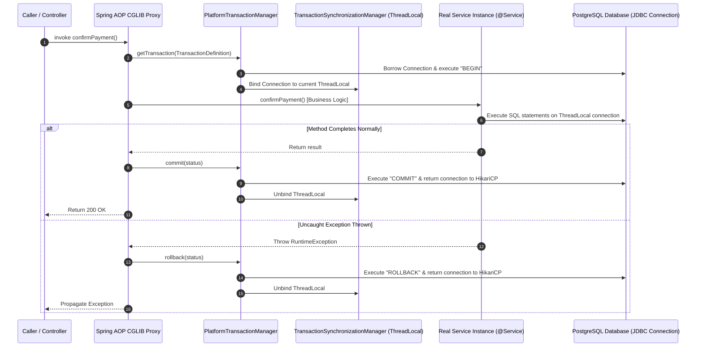
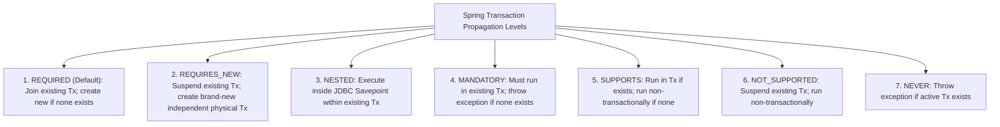

# Spring Transaction Boundaries, Propagation Levels, and Proxy Pitfalls

---

## 1. What Is It?
In Spring Boot and Java backend engineering, declarative transaction management is powered by the **`@Transactional`** annotation. It intercepts method invocations using Spring AOP dynamic proxies, coordinates physical JDBC database connections via `PlatformTransactionManager`, binds transactions to the active execution thread using `TransactionSynchronizationManager` (`ThreadLocal`), and enforces configured **Transaction Propagation Levels** and **Rollback Rules**.

---

## 2. Why Does It Exist?
Managing transactions manually with raw JDBC (`conn.setAutoCommit(false)`, `conn.commit()`, `conn.rollback()`) requires immense boilerplate and makes nested service orchestration error-prone. 

Declarative transactions allow developers to define clear **atomic business boundaries**. However, misunderstanding proxy mechanics, propagation boundaries, and rollback defaults leads to severe production issues:
- Uncommitted writes due to swallowed exceptions.
- Broken transaction boundaries caused by **Spring AOP Self-Invocation**.
- Database connection pool exhaustion caused by holding transactions open during slow external API calls.

---

## 3. Mental Model



---

## 4. The 7 Spring Transaction Propagation Levels



### Deep Dive: `REQUIRED` vs `REQUIRES_NEW` vs `NESTED`

| Propagation | Behavior with Existing Transaction | Behavior if Inner Fails | Physical DB Connections Used |
|---|---|---|:---:|
| **`REQUIRED`** (Default) | Joins existing transaction | Marks entire parent transaction as **Rollback-Only**; parent *cannot* commit | $1$ |
| **`REQUIRES_NEW`** | **Suspends** outer transaction and starts a completely separate physical transaction | Outer transaction can catch inner exception and still commit | $\mathbf{2}$ (Risks pool deadlocks!) |
| **`NESTED`** | Sets a **JDBC Savepoint** within the existing transaction | Can roll back inner changes to savepoint without failing outer transaction | $1$ |

---

## 5. Rollback Rules: Checked vs Unchecked Exceptions

By default in Spring:
- **Unchecked Exceptions** (`RuntimeException`, `Error`): **Automatic ROLLBACK**.
- **Checked Exceptions** (`Exception`, `IOException`, `SQLException`): **COMMITS THE TRANSACTION!**

```java
// CRITICAL BUG: Transaction will COMMIT despite throwing IOException!
@Transactional
public void processOrder() throws IOException {
    orderRepository.save(order);
    throw new IOException("Disk error"); // SPRING COMMITS THE ORDER!
}

// PRODUCTION FIX: Explicitly declare rollbackFor
@Transactional(rollbackFor = Exception.class)
public void processOrderFixed() throws Exception {
    orderRepository.save(order);
    throw new IOException("Disk error"); // ROLLED BACK SAFELY!
}
```

---

## 6. The 3 Most Dangerous `@Transactional` Production Pitfalls

### Pitfall 1: Spring AOP Self-Invocation (Bypassing Proxies)
```java
@Service
public class OrderService {

    public void createOrder() {
        // CALLING INTERNAL METHOD DIRECTLY VIA 'this'
        // Bypasses the Spring CGLIB proxy! executePayment() runs with NO TRANSACTION!
        executePayment(); 
    }

    @Transactional(propagation = Propagation.REQUIRES_NEW)
    public void executePayment() {
        // Database modifications here will NOT be isolated or managed!
    }
}
```

**Production Solutions**:
1. Move `executePayment()` to a separate dedicated `@Service` bean (Recommended).
2. Self-inject the bean (`@Autowired private OrderService self;` and call `self.executePayment()`).

---

### Pitfall 2: Connection Pool Exhaustion via `REQUIRES_NEW`
When Thread 1 in an outer `@Transactional` calls a method annotated with `@Transactional(propagation = Propagation.REQUIRES_NEW)`:
1. Thread 1 **holds Connection 1** (borrowed for the outer transaction).
2. To execute the inner method, Thread 1 **borrows Connection 2** from HikariCP.
3. If HikariCP `maximumPoolSize = 10`, and 10 concurrent requests execute simultaneously:
   - All 10 threads borrow Connection 1.
   - All 10 threads attempt to borrow Connection 2.
   - **HikariCP has 0 available connections**.
   - All 10 threads block waiting on each other, causing a **total application connection pool deadlock**.

---

### Pitfall 3: Holding Transactions Across Remote HTTP Calls
```java
// DISASTROUS ANTI-PATTERN: Holds DB Connection for 30 seconds!
@Transactional
public void checkoutOrder(Long orderId) {
    Order order = orderRepository.findById(orderId).get();
    
    // Remote HTTP call to Stripe / PayPal (Network latency: 200ms - 30,000ms!)
    PaymentResponse resp = paymentClient.chargeCreditCard(order.getAmount()); 
    
    order.setStatus(OrderStatus.PAID);
}
```

---

## 7. Implementation

### Clean Orchestrator Pattern (Separating I/O from DB Transactions)
```java
package com.backend.engineering.transactions.service;

import org.springframework.stereotype.Service;
import org.springframework.transaction.annotation.Transactional;

@Service
public class OrderCheckoutOrchestrator {

    private final OrderPersistenceService persistenceService;
    private final ExternalPaymentGatewayClient paymentClient;

    public OrderCheckoutOrchestrator(
            OrderPersistenceService persistenceService, 
            ExternalPaymentGatewayClient paymentClient) {
        this.persistenceService = persistenceService;
        this.paymentClient = paymentClient;
    }

    // NON-TRANSACTIONAL ORCHESTRATOR: Holds ZERO database connections during HTTP call!
    public void executeCheckout(Long orderId) {
        // 1. Short DB Transaction: Fetch order and validate
        OrderDto order = persistenceService.prepareOrderForCheckout(orderId);

        // 2. Remote HTTP Call: Zero database locks or connections held!
        PaymentResult result = paymentClient.processPayment(order.userId(), order.amountCents());

        // 3. Short DB Transaction: Update status
        if (result.isSuccess()) {
            persistenceService.markOrderAsPaid(orderId, result.transactionReference());
        } else {
            persistenceService.markOrderAsFailed(orderId, result.errorMessage());
        }
    }
}
```

---

## 8. Performance

| Transaction Strategy | Connection Hold Time | DB Pool Throughput | Deadlock Risk |
|---|---|---|---|
| Monolithic `@Transactional` (with HTTP calls) | $2,000 - 15,000\text{ms}$ | $< 10\text{ req/sec}$ (Starves pool) | Severe |
| Orchestrator Pattern (Short discrete transactions) | $1 - 4\text{ms}$ | $\mathbf{> 5,000\text{ req/sec}}$ | Zero |
| `REQUIRED` Propagation | Shared 1 connection | Fast | Minimal |
| `REQUIRES_NEW` in tight loops | Doubles connection usage | Halves pool capacity | High under load |

---

## 9. Failure Scenarios

1. **`UnexpectedRollbackException` via Caught Exceptions in `REQUIRED`**:
   - *Failure*: An outer method calls an inner method (both `REQUIRED`). The inner method throws an exception, marking the shared transaction `setRollbackOnly()`. The outer method catches the exception in a `try-catch` block and attempts to complete normally. Spring throws `UnexpectedRollbackException: Transaction silently rolled back because it has been marked as rollback-only`.
   - *Mitigation*: If the inner method failure should be recoverable, use `Propagation.REQUIRES_NEW` (with separate bean) or `Propagation.NESTED`.

2. **Non-Public Method Ignored**:
   - *Failure*: Annotating a `private` or `protected` method with `@Transactional`. CGLIB proxies **silently ignore** annotations on non-public methods; no transaction is started.
   - *Mitigation*: Ensure `@Transactional` is applied only to `public` methods.

---

## 10. Observability

### Logging Transaction Lifecycle Events in Development
```yaml
logging:
  level:
    org.springframework.transaction.interceptor: TRACE
    org.springframework.orm.jpa.JpaTransactionManager: DEBUG
```
- Logs exact messages: `Getting transaction for [com.service.method]`, `Suspending current transaction`, `Initiating transaction commit`.

---

## 11. Debugging

### Triage: Verifying Active Transaction Status at Runtime
```java
import org.springframework.transaction.support.TransactionSynchronizationManager;

public void debugTransactionState() {
    boolean isTxActive = TransactionSynchronizationManager.isActualTransactionActive();
    String currentTxName = TransactionSynchronizationManager.getCurrentTransactionName();
    boolean isReadOnly = TransactionSynchronizationManager.isCurrentTransactionReadOnly();
    
    log.info("Tx Active: {}, Name: {}, ReadOnly: {}", isTxActive, currentTxName, isReadOnly);
}
```

---

## 12. Scaling

### Read-Only Transactions on Read-Replicas
- Annotate query services with `@Transactional(readOnly = true)`.
- Combines with `AbstractRoutingDataSource` to route traffic away from the primary writer node to read replicas.

---

## 13. Trade-offs

| Propagation Level | Strength | Operational Risk |
|---|---|---|
| `REQUIRED` | Reuses existing connection; minimal overhead | Inner failure forces entire outer transaction rollback |
| `REQUIRES_NEW` | True isolation; inner rollback does not fail outer | Consumes 2 database connections simultaneously per thread |
| `NESTED` | Fine-grained rollback via JDBC savepoints | Not supported by all database drivers (e.g. Hibernate JPA standard limitations) |

---

## 14. When to Use
- Standard database write operations requiring atomicity.
- Isolating independent audit logs with `REQUIRES_NEW` (so audit logs persist even if the main business transaction fails).

---

## 15. When NOT to Use
- Around blocking network I/O, external REST API calls, or email sending.
- In pure read-only caching methods (e.g. checking Redis).

---

## 16. Interview Questions

### Q1: Why does calling a `@Transactional` method from another method within the same Java class fail to start a database transaction?
<details>
<summary>Reveal Answer</summary>

**Answer**:
Spring's declarative transaction management relies on **Spring AOP Dynamic Proxies (CGLIB / JDK Dynamic Proxies)**.
When an external caller (like a REST Controller) invokes a `@Transactional` service, it actually invokes the **Proxy Wrapper** object. The proxy intercepts the call, opens the transaction via `PlatformTransactionManager`, and delegates to the target service instance.
When `methodA()` calls `methodB()` **within the same class**, the invocation is executed via the standard Java `this` reference (`this.methodB()`). The call occurs internally within the target object in JVM memory, **completely bypassing the Spring AOP proxy wrapper**. Because the proxy is never invoked, the `@Transactional` interceptor never runs, and `methodB()` executes with zero transaction management.
</details>

### Q2: What is the default rollback behavior of Spring `@Transactional`, and why is `rollbackFor = Exception.class` recommended in production?
<details>
<summary>Reveal Answer</summary>

**Answer**:
By default, Spring's transaction interceptor follows the EJB transaction specification standard:
- It automatically triggers a rollback **only for Unchecked Exceptions** (subclasses of `RuntimeException` and `Error`).
- It **does NOT roll back for Checked Exceptions** (subclasses of `Exception` such as `IOException`, `SQLException`, or custom checked business exceptions). If a checked exception is thrown, Spring **commits the transaction**.
In production, unexpected checked exceptions (such as network socket timeouts or file system errors) should almost always abort the database state transition. Specifying `@Transactional(rollbackFor = Exception.class)` ensures that **all exceptions** trigger an atomic rollback.
</details>

---

## 17. Practical Exercise
1. Write a Spring service with an internal method call demonstrating the self-invocation proxy bypass.
2. Refactor the code by moving the transactional method into a separate `@Service` component and verify that transactions commit properly.
3. Write a test case demonstrating how `Propagation.REQUIRES_NEW` can exhaust a small HikariCP connection pool (`maximumPoolSize = 2`) under concurrent execution.

---

## 18. Quick Revision
- **Spring AOP Proxy**: Intercepts `@Transactional` to manage transaction lifecycles.
- **Self-Invocation**: Calling `@Transactional` methods within the same class bypasses the proxy.
- **`REQUIRED`**: Joins existing transaction (1 connection).
- **`REQUIRES_NEW`**: Suspends outer and opens a brand-new transaction (2 connections simultaneously).
- **Rollback Rule**: Checked exceptions commit by default; always configure `rollbackFor = Exception.class`.
- **Golden Rule**: **Keep database transactions strictly scoped to database operations; never include external HTTP calls inside `@Transactional`.**
