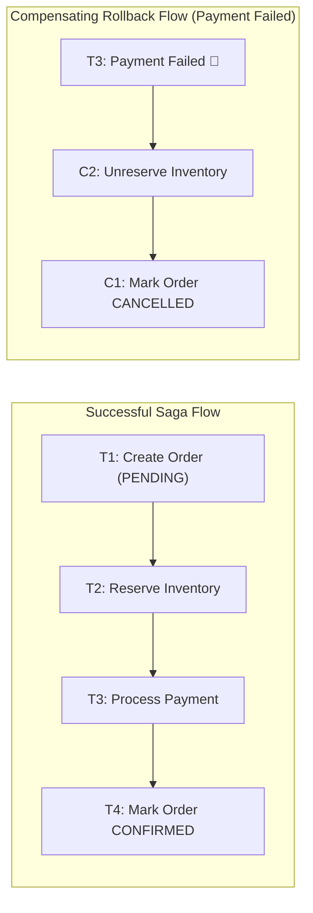
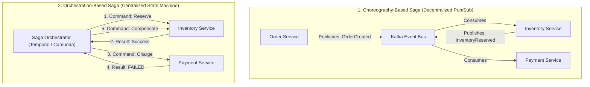

# Distributed Transactions: Two-Phase Commit (2PC) vs The Saga Pattern

---

## 1. What Is It?
A **Distributed Transaction** is a transaction that updates data across two or more independent, network-separated physical databases, microservices, or message brokers. 

Because traditional single-database ACID guarantees cannot scale across independent microservices without severe latency penalties, backend engineers choose between:
1. **Two-Phase Commit (2PC / XA Protocol)**: Synchronous, strictly consistent distributed transaction protocol.
2. **The Saga Pattern**: Asynchronous, eventually consistent sequence of local transactions coordinated via domain events or a workflow orchestrator, using **Compensating Transactions** to handle failures.

---

## 2. Why Does It Exist?
In a microservices architecture, each service owns its own private database (Database-per-Service pattern). A business workflow like **E-Commerce Checkout** spans:
- `Order Service` (PostgreSQL)
- `Payment Service` (Stripe API / MySQL)
- `Inventory Service` (PostgreSQL)
- `Notification Service` (Kafka / SQS)

If the Payment Service fails after the Inventory Service has already deducted stock, the system enters an inconsistent state unless a distributed transaction mechanism coordinates the rollback.

---

## 3. Two-Phase Commit (2PC / XA) Protocol

```mermaid
sequenceDiagram
    autonumber
    participant Coord as Transaction Coordinator (XA)
    participant DB1 as Order DB (Resource Mgr 1)
    participant DB2 as Payment DB (Resource Mgr 2)

    Note over Coord,DB2: Phase 1: PREPARE (Voting Phase)
    Coord->>DB1: PREPARE (Acquires row locks; writes WAL; votes YES)
    Coord->>DB2: PREPARE (Acquires row locks; writes WAL; votes YES)
    DB1-->>Coord: VOTE_COMMIT
    DB2-->>Coord: VOTE_COMMIT

    Note over Coord,DB2: Phase 2: COMMIT (Execution Phase)
    Coord->>Coord: Write COMMIT to Coordinator WAL
    Coord->>DB1: GLOBAL_COMMIT
    Coord->>DB2: GLOBAL_COMMIT
    DB1-->>Coord: ACK (Locks Released)
    DB2-->>Coord: ACK (Locks Released)
```

### The Fatal Flaws of 2PC in Modern Microservices
1. **Blocking Coordinator Single Point of Failure (SPOF)**: If the Coordinator crashes *after* Phase 1 (Prepare) but *before* sending the `GLOBAL_COMMIT`, all participating database nodes are left holding exclusive row locks indefinitely (**Lock Convoy / Database Freeze**).
2. **Extreme Latency ($10\times - 50\times$)**: 2PC requires multiple synchronous network roundtrips and holds physical database locks across the network for the entire duration of all participants.

---

## 4. The Saga Pattern (Eventual Consistency)

A **Saga** breaks a distributed transaction into a series of **independent local ACID transactions** ($T_1, T_2, \dots, T_n$). Each local transaction updates its private database and publishes an event. If a step fails ($T_3$), the Saga executes a series of **Compensating Transactions** ($C_2, C_1$) in reverse order to semantically undo earlier changes.



---

## 5. Choreography vs Orchestration Sagas



### Comparison

| Feature | Choreography Saga | Orchestration Saga |
|---|---|---|
| **Coordination** | Decentralized via Kafka / Event Bus | Centralized via dedicated state machine / workflow engine |
| **Coupling** | Loosely coupled services | Services coupled to Orchestrator commands |
| **Visibility / Tracing** | Difficult to track global workflow state | **Crystal clear**: Single dashboard shows complete state |
| **Complexity** | Becomes cyclic/tangled past 4-5 services | Scales cleanly to dozens of complex multi-step workflows |

---

## 6. Anatomy of Saga Transactions

A production Saga classifies its operations into 3 categories:
1. **Compensable Transactions**: Steps that precede the point of no return; can be undone via a compensating transaction ($T_1: \text{Reserve Stock} \longrightarrow C_1: \text{Release Stock}$).
2. **Pivot Transaction**: The irreversible "point of no return" ($T_{pivot}: \text{Execute Credit Card Charge}$). Once the pivot succeeds, the Saga *must* complete.
3. **Retriable Transactions**: Steps that follow the pivot transaction; guaranteed to succeed eventually via idempotent retries ($T_{retriable}: \text{Send Receipt Email}$).

---

## 7. Implementation

### Orchestrated Saga State Machine in Java 21
```java
package com.backend.engineering.transactions.saga;

import java.util.UUID;

public class OrderCheckoutSagaCoordinator {

    public enum SagaState {
        STARTED, INVENTORY_RESERVED, PAYMENT_PROCESSED, COMPLETED,
        COMPENSATING_INVENTORY, FAILED
    }

    public record SagaContext(String sagaId, Long orderId, Long userId, int amountCents, SagaState state) {}

    private final InventoryServiceClient inventoryClient;
    private final PaymentServiceClient paymentClient;
    private final OrderServiceClient orderClient;

    public OrderCheckoutSagaCoordinator(
            InventoryServiceClient inventoryClient,
            PaymentServiceClient paymentClient,
            OrderServiceClient orderClient) {
        this.inventoryClient = inventoryClient;
        this.paymentClient = paymentClient;
        this.orderClient = orderClient;
    }

    public void executeCheckoutSaga(Long orderId, Long userId, int amountCents) {
        String sagaId = UUID.randomUUID().toString();
        SagaContext context = new SagaContext(sagaId, orderId, userId, amountCents, SagaState.STARTED);

        // Step 1: Compensable Transaction (Reserve Inventory)
        boolean inventoryReserved = inventoryClient.reserveStock(orderId);
        if (!inventoryReserved) {
            orderClient.markCancelled(orderId, "Inventory unavailable");
            return;
        }

        // Step 2: Pivot Transaction (Process Payment)
        boolean paymentSuccess = paymentClient.chargeUser(userId, amountCents);
        if (!paymentSuccess) {
            // Initiate Compensation Rollback
            compensate(orderId, "Payment authorization failed");
            return;
        }

        // Step 3: Retriable Transaction (Confirm Order)
        orderClient.markConfirmed(orderId);
    }

    private void compensate(Long orderId, String reason) {
        // Compensate Step 1: Release reserved inventory
        inventoryClient.releaseStock(orderId);
        // Compensate Step 0: Cancel order
        orderClient.markCancelled(orderId, reason);
    }
}
```

---

## 8. Handling Semantic Anomalies in Sagas

Because Sagas do not hold physical database locks across steps, other transactions can read intermediate states (**ACID Isolation is absent in Sagas!**).

### Countermeasures for Saga Anomalies
1. **Semantic Locking (Pending State)**:
   - Mark entities with intermediate states (`status = 'PENDING_APPROVAL'`) to prevent other transactions from modifying them.
2. **Commutative Updates**:
   - Structure operations so order of execution does not matter (e.g. balance increments/decrements).
3. **Pessimistic View**:
   - Re-order Saga steps so operations with the greatest financial exposure occur last.

---

## 9. Performance

| Transaction Model | Latency Profile | Scalability | Availability | Consistency |
|---|---|---|---|---|
| **Two-Phase Commit (2PC)** | High ($50 - 500\text{ms}$) | Poor ($< 5\text{ nodes}$) | Low (Blocks on coordinator failure) | **Strong Consistency** |
| **Choreographed Saga** | Ultra-Low ($< 5\text{ms}$ local) | High | High (Decentralized) | **Eventual Consistency** |
| **Orchestrated Saga** | Low ($10 - 25\text{ms}$) | Very High | High (Persistent workflow state) | **Eventual Consistency** |

---

## 10. Failure Scenarios

1. **Compensating Transaction Failure**:
   - *Failure*: An order payment fails. The Saga orchestrator sends a compensation command to `Inventory Service` to release reserved stock, but `Inventory Service` is currently unreachable (network timeout).
   - *Mitigation*: **Compensating transactions MUST be idempotent and retry infinitely with exponential backoff until they succeed**. If retries are exhausted, raise an alert for human operator manual intervention.

---

## 11. Observability

- **Distributed Tracing**:
  - Propagate `traceparent` and `X-Saga-Id` across all HTTP/gRPC headers and Kafka record headers.
- **Workflow State Dashboards**:
  - In workflow engines like Temporal / Cadence, visualize the exact step, input parameters, and retry counts of every in-flight Saga.

---

## 12. Scaling

### Workflow Orchestrators (Temporal / Cadence)
For enterprise microservices:
- Replace manual Java state machines with **Temporal.io**.
- Temporal persists workflow history in Cassandra/PostgreSQL, handles automatic retries, heartbeat timeouts, and compensation flows with zero custom boilerplate.

---

## 13. Trade-offs

| Distributed Pattern | Pros | Cons | Best Use Case |
|---|---|---|---|
| **2PC / XA** | Simple mental model; immediate consistency | Blocking locks; terrible latency; SPOF | Legacy relational migrations on single LAN |
| **Choreography Saga** | Zero centralized bottlenecks; fast | Complex state tracking; circular event dependencies | Simple 2-3 step asynchronous pipelines |
| **Orchestration Saga** | Centralized audit trail; clear failure recovery | Additional orchestrator infrastructure | Complex multi-service business workflows |

---

## 14. When to Use
- Any multi-service workflow spanning independent databases or third-party APIs (Stripe, Twilio, SendGrid).
- Microservice architectures adopting the Database-per-Service pattern.

---

## 15. When NOT to Use
- Single-database monolithic applications (always use standard local ACID transactions instead).

---

## 16. Interview Questions

### Q1: Why is Two-Phase Commit (2PC) rarely used in modern cloud-native microservice architectures?
<details>
<summary>Reveal Answer</summary>

**Answer**:
2PC is considered an anti-pattern in distributed microservices for 3 fundamental reasons:
1. **Blocking Nature & Lock Convoying**: During Phase 1 (Prepare), every participating database acquires exclusive row locks. These locks must be held across the network until Phase 2 (Commit) completes. A single slow participant or transient network hiccup holds locks across all services, causing widespread lock starvation and system-wide latency spikes.
2. **Coordinator Single Point of Failure (SPOF)**: If the coordinator crashes after nodes have prepared, the participants have no way of knowing whether to commit or abort; they remain frozen and holding locks until the coordinator restarts.
3. **Incompatibility with External APIs**: Modern workflows integrate with third-party SaaS APIs (Stripe, PayPal, Twilio) that do not expose XA/2PC `prepare` endpoints.
</details>

### Q2: What is the difference between a Pivot Transaction and a Compensating Transaction in the Saga Pattern?
<details>
<summary>Reveal Answer</summary>

**Answer**:
- A **Compensating Transaction** is an explicit undo operation that reverses the business impact of a previously committed local transaction (e.g. reversing a balance debit by issuing a refund credit).
- A **Pivot Transaction** is the decisive "point of no return" in a Saga. If the Pivot Transaction fails, all previous steps are undone via their compensating transactions. However, once the Pivot Transaction **succeeds**, the Saga is guaranteed to commit, and all subsequent steps are **Retriable Transactions** that cannot fail permanently (they retry until successful).
</details>

---

## 17. Practical Exercise
1. Model an e-commerce checkout saga involving `Order`, `Inventory`, and `Payment` services.
2. Simulate a payment failure and verify that the compensating transaction executes to release inventory.
3. Introduce an artificial network outage during the compensation step to verify that the retry loop is resilient and idempotent.

---

## 18. Quick Revision
- **2PC**: Synchronous and strongly consistent, but suffers from blocking locks and coordinator SPOF.
- **Saga Pattern**: Sequence of local ACID transactions coordinating via events or an orchestrator.
- **Compensating Transaction**: Semantic undo operation for previously committed steps.
- **Pivot Transaction**: The point of no return; once successful, the Saga must complete.
- **Orchestration**: Ideal for complex multi-step sagas; provides single-pane-of-glass visibility.
