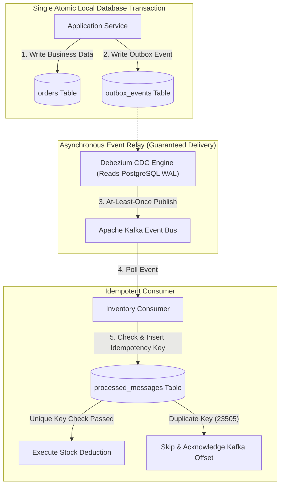

# The Transactional Outbox Pattern and Idempotent Processing

---

## 1. What Is It?
The **Transactional Outbox Pattern** is a distributed systems design pattern that solves the **Dual-Write Problem** by persisting domain state changes and outgoing message events within the **exact same local ACID database transaction**. 

An independent background process (**Polling Publisher** or **Change Data Capture / CDC engine like Debezium**) reliably extracts events from the Outbox table and publishes them to an event broker (Apache Kafka / AWS SQS). Combined with **Idempotent Consumers**, it guarantees **At-Least-Once delivery with Exactly-Once processing semantics**.

---

## 2. Why Does It Exist?
In microservice architectures, an application frequently needs to perform two actions:
1. Update its private database (`INSERT INTO orders ...`).
2. Publish an event to Kafka (`kafkaProducer.send("order-created", event)`).

### The Fatal Dual-Write Problem
```mermaid
sequenceDiagram
    autonumber
    actor User
    participant App as Application Service
    participant DB as PostgreSQL Database
    participant Kafka as Apache Kafka Broker

    User->>App: Place Order ($100)
    App->>DB: 1. BEGIN; INSERT INTO orders; COMMIT; (Success!)
    App->XKafka: 2. kafkaProducer.send() FAILS (Network Timeout / Broker Down!)
    
    Note over App,Kafka: Database updated, but Kafka message lost forever!<br/>Inventory is never deducted; Order hangs indefinitely!
```

If you reverse the order (publish to Kafka first, then update the DB), the database write can fail, leaving an orphaned event in Kafka that triggers false downstream billing.

---

## 3. Mental Model



---

## 4. How Does It Work?

### 1. The Outbox Table Schema
```sql
CREATE TABLE outbox_events (
    id UUID PRIMARY KEY,
    aggregate_type VARCHAR(64) NOT NULL,
    aggregate_id VARCHAR(64) NOT NULL,
    event_type VARCHAR(128) NOT NULL,
    payload JSONB NOT NULL,
    created_at TIMESTAMP WITH TIME ZONE DEFAULT CURRENT_TIMESTAMP NOT NULL,
    published BOOLEAN NOT NULL DEFAULT FALSE
);
CREATE INDEX idx_outbox_unprocessed ON outbox_events (created_at) WHERE published IS FALSE;
```

---

### 2. Publishing Mechanisms: Polling vs Change Data Capture (CDC)

| Characteristic | Polling Publisher (`SKIP LOCKED`) | Change Data Capture (Debezium CDC) |
|---|---|---|
| **Mechanism** | App scheduled thread queries Outbox table via `SELECT FOR UPDATE SKIP LOCKED` | Debezium connects as a replication client and tails PostgreSQL WAL bytes directly |
| **Database Load** | Regular polling queries create periodic DB CPU/read load | **Zero query overhead** on database engine (reads streaming WAL) |
| **Latency** | $500\text{ms} - 2,000\text{ms}$ (polling interval) | **$< 10\text{ms}$** (real-time streaming) |
| **Infrastructure** | Zero extra infrastructure (Runs in Spring Boot) | Requires Kafka Connect + Debezium cluster |

---

## 5. Implementation: Spring Boot Transactional Outbox

### Writing Domain Entity and Outbox Event in a Single Transaction
```java
package com.backend.engineering.transactions.outbox;

import com.fasterxml.jackson.databind.ObjectMapper;
import org.springframework.stereotype.Service;
import org.springframework.transaction.annotation.Transactional;

import java.time.Instant;
import java.util.UUID;

@Service
public class OrderCreationService {

    private final OrderRepository orderRepository;
    private final OutboxEventRepository outboxRepository;
    private final ObjectMapper objectMapper;

    public OrderCreationService(
            OrderRepository orderRepository,
            OutboxEventRepository outboxRepository,
            ObjectMapper objectMapper) {
        this.orderRepository = orderRepository;
        this.outboxRepository = outboxRepository;
        this.objectMapper = objectMapper;
    }

    @Transactional
    public Order createOrder(Long userId, int amountCents) {
        // 1. Mutate Domain Entity
        Order order = new Order(userId, amountCents);
        order = orderRepository.save(order);

        // 2. Create Outbox Event within the EXACT SAME local database transaction
        OrderCreatedEvent payload = new OrderCreatedEvent(
            order.getId(), userId, amountCents, Instant.now()
        );

        OutboxEvent outbox = new OutboxEvent(
            UUID.randomUUID(),
            "ORDER",
            order.getId().toString(),
            "OrderCreated",
            objectMapper.valueToTree(payload)
        );

        outboxRepository.save(outbox);

        // Commit flushes BOTH tables atomically to disk in a single WAL sync!
        return order;
    }
}
```

---

## 6. Implementation: Idempotent Consumer Pattern

Because networks can duplicate messages, consumers must guarantee **Idempotent Processing**:

$$\textbf{Formula: } \text{At-Least-Once Delivery} + \text{Idempotent Consumer} = \text{Exactly-Once Processing}$$

### Idempotent Consumer Implementation in Java 21
```java
package com.backend.engineering.transactions.outbox;

import org.slf4j.Logger;
import org.slf4j.LoggerFactory;
import org.springframework.dao.DuplicateKeyException;
import org.springframework.jdbc.core.JdbcTemplate;
import org.springframework.kafka.annotation.KafkaListener;
import org.springframework.stereotype.Service;
import org.springframework.transaction.annotation.Transactional;

@Service
public class IdempotentInventoryConsumer {

    private static final Logger log = LoggerFactory.getLogger(IdempotentInventoryConsumer.class);
    private final JdbcTemplate jdbcTemplate;
    private final InventoryService inventoryService;

    public IdempotentInventoryConsumer(JdbcTemplate jdbcTemplate, InventoryService inventoryService) {
        this.jdbcTemplate = jdbcTemplate;
        this.inventoryService = inventoryService;
    }

    @KafkaListener(topics = "order-events", groupId = "inventory-group")
    @Transactional
    public void consumeOrderEvent(String eventId, String payload) {
        try {
            // Atomic deduplication via unique primary key constraint in DB
            jdbcTemplate.update(
                "INSERT INTO processed_messages (message_id, processed_at) VALUES (?, CURRENT_TIMESTAMP)",
                eventId
            );
        } catch (DuplicateKeyException ex) {
            log.warn("Duplicate message received [ID: {}]. Skipping processing safely.", eventId);
            return; // Acknowledge and skip with zero side effects!
        }

        // Execute downstream business mutation safely
        inventoryService.deductStock(payload);
    }
}
```

---

## 7. Performance

| Architecture | Throughput | Delivery Latency | Duplicate Message Risk |
|---|---|---|---|
| Direct Kafka Publish (No Outbox) | Fast | $< 5\text{ms}$ | High risk of lost messages on crash |
| Polling Outbox (`SKIP LOCKED`) | Moderate ($5,000\text{ msg/s}$) | $500 - 1,000\text{ms}$ | Guaranteed delivery; occasional duplicates |
| Debezium CDC Outbox | Ultra-Fast ($> 50,000\text{ msg/s}$) | $< 20\text{ms}$ | Guaranteed delivery; minimal duplicates |

---

## 8. Failure Scenarios

1. **Outbox Table Bloat**:
   - *Failure*: In a polling publisher setup, published events remain in the `outbox_events` table forever. The table grows to 100,000,000 rows, slowing down poll queries and wasting disk space.
   - *Mitigation*: Delete rows immediately after publishing (`DELETE FROM outbox_events WHERE id = ?`), or use PostgreSQL table partitioning by day and drop old partitions.

2. **Poison Pill Event Blocking Poller**:
   - *Failure*: An outbox event contains malformed JSON that fails serialization when sending to Kafka. The poller throws an uncaught exception and halts, freezing all subsequent outbox event publishing.
   - *Mitigation*: Route unpublishable messages to a **Dead Letter Queue (DLQ)** table after 3 failed retries.

---

## 9. Observability

- **Metrics**:
  - `outbox_unprocessed_events_count`: Number of pending records in outbox table (Alert if $> 500$).
  - `debezium_streaming_lag_ms`: Milliseconds Debezium is lagging behind the PostgreSQL WAL.

---

## 10. Debugging

### Checking Unprocessed Outbox Events
```sql
SELECT count(*), min(created_at) AS oldest_pending_event
FROM outbox_events
WHERE published IS FALSE;
```
- If `oldest_pending_event` is older than 5 minutes, verify that the CDC engine or polling worker is active and not crashing.

---

## 11. Scaling

1. **Debezium Outbox Event Router SMT**:
   - Debezium includes a native **Single Message Transform (SMT)**: `io.debezium.transforms.outbox.EventRouter`.
   - Automatically routes rows from `outbox_events` to specific Kafka topics based on the `aggregate_type` column and assigns the `aggregate_id` as the Kafka partition key.

---

## 12. Trade-offs

| Implementation | Complexity | Operational Overhead | Latency |
|---|---|---|---|
| **Polling Publisher** | Minimal (Java `@Scheduled`) | Low | Higher ($500\text{ms}+$) |
| **Debezium CDC Engine** | Moderate | Requires Kafka Connect cluster | Near real-time ($< 20\text{ms}$) |

---

## 13. When to Use
- Any microservice that must update local relational state and reliably broadcast events to other services.
- Financial, order processing, and payment pipelines requiring zero lost events.

---

## 14. When NOT to Use
- High-volume telemetry / analytics where losing an occasional packet is harmless compared to the storage cost of an Outbox table.

---

## 15. Interview Questions

### Q1: What is the Dual-Write problem in distributed systems, and why does the Transactional Outbox pattern solve it?
<details>
<summary>Reveal Answer</summary>

**Answer**:
The **Dual-Write problem** occurs when an application must update two disparate distributed systems (such as a relational database and an Apache Kafka message broker) in response to a single request.
Because there is no native distributed transaction spanning both systems, one write can succeed while the other fails (e.g. database commit succeeds, but network partition causes Kafka publish to timeout). This leaves the distributed system in an irrecoverably inconsistent state.
The **Transactional Outbox pattern** solves this by converting the Kafka publish into a standard database `INSERT` into an **Outbox Table** within the *exact same local ACID database transaction*. Because both writes occur within a single database transaction, atomicity is guaranteed: either both are written to the database WAL, or neither is. An asynchronous worker or CDC engine (Debezium) then reliably tails the outbox table and streams events to Kafka with guaranteed At-Least-Once delivery.
</details>

### Q2: Why must consumers of an Outbox-Kafka pipeline always be designed as Idempotent Consumers?
<details>
<summary>Reveal Answer</summary>

**Answer**:
Because network communication is inherently unreliable, message brokers (Kafka, SQS, RabbitMQ) provide **At-Least-Once delivery guarantees**.
If a message is successfully delivered to a consumer, but the consumer's network ACK to Kafka is lost due to a transient timeout, Kafka will **re-deliver the exact same message**.
If the consumer is not idempotent, processing the duplicate message will result in duplicate business actions (e.g. charging a customer credit card twice or deducting stock twice). Implementing idempotent processing (via a deduplication database table, unique constraint, or Redis TTL key) ensures that processing duplicate messages produces zero additional side effects.
</details>

---

## 16. Practical Exercise
1. Model an `outbox_events` table in PostgreSQL.
2. Write a Spring Boot service that creates an `Order` and inserts an `OutboxEvent` within a single `@Transactional` method.
3. Build a polling publisher using `SELECT ... FOR UPDATE SKIP LOCKED` that publishes pending outbox events to a Kafka topic and deletes the processed rows.
4. Implement an idempotent Kafka listener that uses a `processed_messages` table to gracefully ignore duplicate messages.

---

## 17. Quick Revision
- **Dual-Write Problem**: Updating DB + publishing to Kafka cannot be atomic without an Outbox pattern.
- **Transactional Outbox**: Writes events into an outbox table inside the same local database transaction.
- **Relay Engines**: Polling Publisher (`SKIP LOCKED`) or Debezium CDC (PostgreSQL WAL tailing).
- **At-Least-Once + Idempotent Consumer = Exactly-Once Semantics**.
- **Deduplication**: Use unique database constraints on `message_id` to discard duplicate messages safely.
