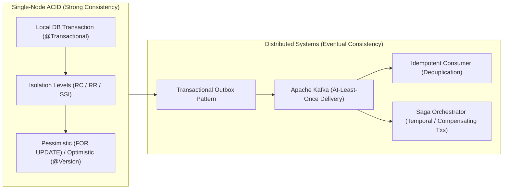

# Module 09: Transactions & Consistency

Master the mechanics of transaction management across local storage engines and distributed microservices: ACID properties, the 4 isolation levels, concurrency anomalies (Dirty Reads, Non-Repeatable Reads, Phantoms, Write Skew), Serializable Snapshot Isolation (SSI), Optimistic vs Pessimistic locking, Spring `@Transactional` propagation, Two-Phase Commit (2PC), Sagas, and the Transactional Outbox pattern.

---

## 🗺️ Module Architecture & Consistency Spectrum

---

## 📚 Curriculum Lessons

| # | Lesson | Core Focus & Mechanics |
|:---:|---|---|
| **01** | [`01-acid-properties-and-engine-guarantees.md`](./01-acid-properties-and-engine-guarantees.md) | Physical engine enforcement of Atomicity (Undo logs/`pg_xact`), Consistency (Schema invariants), Isolation (MVCC/2PL), and Durability (WAL `fsync`). |
| **02** | [`02-transaction-isolation-levels-and-anomalies.md`](./02-transaction-isolation-levels-and-anomalies.md) | The 6 concurrency anomalies (Dirty Read, Fuzzy Read, Phantom, Lost Update, Read Skew, Write Skew) and PostgreSQL SSI conflict graph detection (`40001`). |
| **03** | [`03-optimistic-vs-pessimistic-locking.md`](./03-optimistic-vs-pessimistic-locking.md) | `SELECT FOR UPDATE`, `NOWAIT`, `SKIP LOCKED` task queues vs JPA `@Version` optimistic locking retry loops. |
| **04** | [`04-transaction-boundaries-and-spring-propagation.md`](./04-transaction-boundaries-and-spring-propagation.md) | Spring AOP proxy interception, 7 propagation levels (`REQUIRED`, `REQUIRES_NEW`, `NESTED`), self-invocation traps, and `rollbackFor = Exception.class`. |
| **05** | [`05-distributed-transactions-2pc-and-sagas.md`](./05-distributed-transactions-2pc-and-sagas.md) | Why 2PC/XA fails in microservices; Choreography vs Orchestration Sagas, Compensating transactions, and Pivot transactions. |
| **06** | [`06-transactional-outbox-and-idempotency.md`](./06-transactional-outbox-and-idempotency.md) | Solving the Dual-Write problem with Outbox tables, Debezium CDC WAL streaming, and building idempotent Kafka consumers. |

---

## ⚡ Key Production Takeaways

1. **Write Skew Defense**: Write Skew cannot be prevented by Repeatable Read / Snapshot Isolation; use `SERIALIZABLE` or explicit `SELECT FOR UPDATE`.
2. **Handle Serialization Aborts**: Any application executing `SERIALIZABLE` transactions must implement retry loops with exponential backoff for `40001` exceptions.
3. **Queue Polling Standard**: Use `SELECT ... FOR UPDATE SKIP LOCKED` for building scalable, lock-contention-free database job queues.
4. **Proxy Self-Invocation**: Never call `@Transactional` methods internally from the same Java class; move them to a separate `@Service` bean.
5. **The Outbox Invariant**: Never execute independent database updates and Kafka message publishes without the Transactional Outbox pattern.
