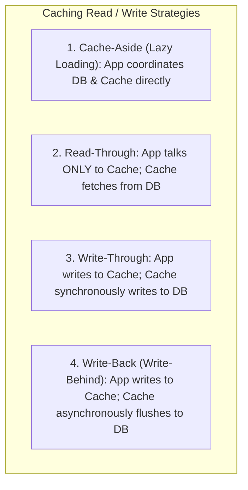

# Caching Design Patterns, Read/Write Strategies, and Multi-Tier Caching

---

## 1. What Is It?
**Caching** is the architectural technique of storing copies of transient, computationally expensive, or high-frequency data in ultra-fast, volatile storage layers (such as JVM heap memory or an in-memory distributed store like Redis) to serve subsequent read requests with sub-millisecond latencies ($< 1\text{ms}$) while drastically reducing load on primary relational databases.

---

## 2. Why Does It Exist?
Primary relational databases (PostgreSQL, MySQL) persist data to disk and execute complex query planning, index traversals, and ACID transaction checks.
- Typical PostgreSQL indexed point read latency: $1 - 5\text{ms}$.
- Typical Redis in-memory lookup latency: $0.1 - 0.5\text{ms}$ ($10\times - 50\times$ faster).
- In-memory JVM heap lookup (Caffeine cache): $< 50\text{ns}$ ($100,000\times$ faster).

Without caching, high-traffic read spikes (e.g. Black Friday product catalogs, viral social media posts) overwhelm database connection pools and saturate CPU cores, causing cascading backend service failures.

---

## 3. Mental Model

```mermaid
flowchart TD
    subgraph MultiTierCache["Multi-Tiered Caching Hierarchy (L1 / L2 / Storage)"]
        App["Application Thread"]
        L1["L1: Local In-Memory Cache (Caffeine in JVM Heap) ~50ns"]
        L2["L2: Distributed Cache (Redis Cluster over TCP) ~500μs"]
        DB[("L3: Persistent Storage (PostgreSQL DB) ~5ms")]
    end

    App -->|1. Check L1| L1
    L1 -- L1 Cache Miss -->|2. Check L2| L2
    L2 -- L2 Cache Miss -->|3. Fetch from DB| DB
    DB -->|4. Populate L2 & L1| L2
    L2 --> L1
```

---

## 4. The 4 Core Caching Strategies



### 1. Cache-Aside (Lazy Loading / Standard OLTP)
- **Read Path**:
  1. Application queries Cache for Key $K$.
  2. If found (**Cache Hit**), return data immediately.
  3. If not found (**Cache Miss**), application queries Database, stores result in Cache with a configured **Time-To-Live (TTL)**, and returns data to client.
- **Write Path**:
  1. Application updates Database.
  2. Application **invalidates / deletes** Key $K$ from Cache (`DEL key`).

---

### 2. Read-Through & Write-Through
- The Application treats the Cache as the single source of truth.
- **Read-Through**: On cache miss, the cache provider itself loads data from the database, caches it, and returns it.
- **Write-Through**: The application writes exclusively to the cache. The cache synchronously updates the database *before* confirming success to the application.
  - *Advantage*: Zero stale cache data on writes.
  - *Disadvantage*: Higher write latency (Cache write + Database write in series).

---

### 3. Write-Back (Write-Behind)
- The Application writes exclusively to the in-memory cache, which acknowledges success **immediately ($< 1\text{ms}$)**.
- An asynchronous background daemon batches dirty cache entries and writes them to the database in chunks.
  - *Advantage*: Massive write throughput ($100,000\text{ writes/sec}$); coalesces multiple updates to the same row.
  - *Disadvantage*: **Risk of data loss** if the cache server crashes before flushing dirty entries to the persistent database.

---

## 5. Internal Working: Cache Invalidation Strategies

$$\textbf{"There are only two hard things in Computer Science: cache invalidation and naming things." — Phil Karlton}$$

### The Dual-Write Race Condition: "Update Cache" vs "Delete Cache"

```mermaid
sequenceDiagram
    autonumber
    actor ClientA as Thread A (Writer)
    actor ClientB as Thread B (Writer)
    participant DB as PostgreSQL
    participant Cache as Redis Cache

    Note over ClientA,Cache: ANTI-PATTERN: Updating Cache Directly on Writes
    ClientA->>DB: 1. UPDATE products SET price = 100
    ClientB->>DB: 2. UPDATE products SET price = 120
    ClientB->>Cache: 3. SET product:1:price 120 (Thread B finishes first)
    ClientA->>Cache: 4. SET product:1:price 100 (Thread A delayed network packet arrives late!)
    
    Note over DB,Cache: FATAL INCONSISTENCY: Database has $120; Cache has $100 forever!
```

### The Production Standard: Update Database, Then Delete Cache
By deleting the cache entry (`DEL key`) rather than updating it:
1. Subsequent readers encounter a cache miss and fetch the latest committed value directly from the database.
2. Concurrent write races cannot leave permanently stale data in cache.

---

## 6. Implementation: Spring Boot Multi-Tiered Cache (Caffeine L1 + Redis L2)

```java
package com.backend.engineering.caching.service;

import com.github.benmanes.caffeine.cache.Cache;
import com.github.benmanes.caffeine.cache.Caffeine;
import org.slf4j.Logger;
import org.slf4j.LoggerFactory;
import org.springframework.data.redis.core.RedisTemplate;
import org.springframework.stereotype.Service;

import java.time.Duration;
import java.util.concurrent.TimeUnit;

@Service
public class MultiTierProductCacheService {

    private static final Logger log = LoggerFactory.getLogger(MultiTierProductCacheService.class);

    // L1: In-Memory JVM Heap Cache (Ultra-Fast ~50ns)
    private final Cache<Long, ProductDto> l1Cache = Caffeine.newBuilder()
            .maximumSize(10_000)
            .expireAfterWrite(2, TimeUnit.MINUTES)
            .recordStats()
            .build();

    // L2: Distributed Redis Cache (~500μs)
    private final RedisTemplate<String, ProductDto> redisTemplate;
    private final ProductDatabaseRepository dbRepository;

    public MultiTierProductCacheService(
            RedisTemplate<String, ProductDto> redisTemplate,
            ProductDatabaseRepository dbRepository) {
        this.redisTemplate = redisTemplate;
        this.dbRepository = dbRepository;
    }

    public ProductDto getProduct(Long productId) {
        // 1. Check L1 Cache
        ProductDto product = l1Cache.getIfPresent(productId);
        if (product != null) {
            return product; // L1 Hit!
        }

        // 2. Check L2 Redis Cache
        String redisKey = "product:" + productId;
        product = redisTemplate.opsForValue().get(redisKey);
        if (product != null) {
            l1Cache.put(productId, product); // Populate L1
            return product; // L2 Hit!
        }

        // 3. Fallback to Database (L3)
        product = dbRepository.findById(productId)
                .orElseThrow(() -> new IllegalArgumentException("Product not found: " + productId));

        // Populate L2 with 10-minute TTL
        redisTemplate.opsForValue().set(redisKey, product, Duration.ofMinutes(10));
        // Populate L1 with 2-minute TTL
        l1Cache.put(productId, product);

        return product;
    }

    public void updateProductPrice(Long productId, int newPriceCents) {
        // 1. Update Database First
        dbRepository.updatePrice(productId, newPriceCents);

        // 2. Evict L2 Distributed Cache
        String redisKey = "product:" + productId;
        redisTemplate.delete(redisKey);

        // 3. Evict L1 Local Cache
        l1Cache.invalidate(productId);
    }
}
```

---

## 7. Performance

| Caching Tier | Technology | Latency | Max Capacity | Network Bound |
|---|---|---|---|:---:|
| **L1 (Local Heap)** | Caffeine / Guava | $\mathbf{\approx 50\text{ns}}$ | Bounded by JVM Heap ($1-8\text{GB}$) | ❌ Zero Network |
| **L2 (Distributed)** | Redis Cluster | $\mathbf{\approx 500\mu\text{s}}$ | $100\text{GB} - 1\text{TB}+$ RAM | ✅ TCP Socket |
| **L3 (Database)** | PostgreSQL Indexed Read | $\approx 2 - 15\text{ms}$ | Multi-Terabyte SSD Storage | ✅ TCP Socket |

---

## 8. Failure Scenarios

1. **Stale Cache via Long Transactions**:
   - *Failure*: Thread 1 begins a database transaction, updates a product, and deletes the Redis cache. Before Thread 1 commits, Thread 2 receives a read request, encounters a cache miss, queries the database (which still sees the old uncommitted state under MVCC), and populates Redis with the stale old value. Thread 1 commits, leaving the stale data in Redis until TTL expiration.
   - *Mitigation*: Delete the cache **after the database transaction successfully commits** using Spring's `TransactionSynchronizationManager.registerSynchronization(afterCommit)`.

---

## 9. Observability

- **Metrics**:
  - `cache_gets_total{tier="l1", result="hit"}`: L1 Hit ratio ($> 85\%$).
  - `cache_gets_total{tier="l2", result="hit"}`: L2 Hit ratio ($> 95\%$).
  - `redis_connected_clients`: Active Redis connections.

---

## 10. Debugging

### Inspecting Redis Keys and TTL
```bash
# Connect to Redis CLI
redis-cli -h redis.internal -p 6379

# Check key existence and remaining TTL in seconds
TTL product:42

# Inspect object memory consumption
MEMORY USAGE product:42
```

---

## 11. Scaling

### Near-Cache Invalidation via Redis Pub/Sub
In a fleet of 50 application instances running L1 Caffeine caches:
- When Instance 1 updates an entity, it deletes Redis L2 and broadcasts an invalidation message over a **Redis Pub/Sub channel** (`cache:invalidate:product:42`).
- All other 49 instances listen to the channel and immediately evict key `42` from their local L1 Caffeine caches.

---

## 12. Trade-offs

| Strategy | Pros | Cons | Best Use Case |
|---|---|---|---|
| **Cache-Aside** | Resilient to cache failure; lazy population | Initial cache miss latency; cache drift risk | General-purpose web APIs |
| **Write-Through** | Cache is always consistent | Write latency penalty ($DB + Cache$) | Critical read-heavy reference data |
| **Write-Back** | Ultra-high write throughput; batching | Risk of data loss on power crash | Click analytics, gaming scores, IoT metrics |

---

## 13. When to Use
- Read-heavy workloads ($> 80\%$ reads).
- Static or slowly changing reference data (product catalogs, configuration settings, user permissions).
- High-cost computational aggregations.

---

## 14. When NOT to Use
- Highly dynamic, rapidly mutating data queried by arbitrary ad-hoc filters (e.g. real-time stock ticker order books).
- Small datasets that fit entirely in database buffer pool RAM with trivial query times.

---

## 15. Interview Questions

### Q1: Why is "Update DB then Delete Cache" preferred over "Update DB then Update Cache"?
<details>
<summary>Reveal Answer</summary>

**Answer**:
"Update DB then Update Cache" is vulnerable to **Concurrent Write Race Conditions**:
If Thread A updates the database to Value 100 and Thread B updates the database to Value 200:
Due to network jitter, Thread B might update Redis first (setting 200), followed by Thread A's delayed packet setting Redis to 100. The database holds 200 while Redis holds 100 indefinitely.
"Update DB then Delete Cache" eliminates this risk: both threads invalidate the key. The next incoming read query fetches the latest committed database value (200) and populates the cache cleanly.
</details>

### Q2: How do you prevent stale cache reads when deleting cache inside a `@Transactional` method?
<details>
<summary>Reveal Answer</summary>

**Answer**:
If you delete the cache *inside* the `@Transactional` method before `commit()` executes, a concurrent read request can hit a cache miss, query the database (which still returns the old snapshot because the write transaction has not committed yet), and repopulate the cache with the old stale data.
**Solution**:
Register an **After-Commit Transaction Hook** via Spring's `TransactionSynchronization`:
```java
TransactionSynchronizationManager.registerSynchronization(new TransactionSynchronization() {
    @Override
    public void afterCommit() {
        redisTemplate.delete(cacheKey); // Evicts cache ONLY after DB changes are permanently committed!
    }
});
```
</details>

---

## 16. Practical Exercise
1. Implement a two-tier cache in Spring Boot using Caffeine (L1) and Redis (L2).
2. Measure response latency on L1 hit ($< 1\text{ms}$), L2 hit ($< 2\text{ms}$), and full Database fallback ($15\text{ms}$).
3. Implement `afterCommit` cache eviction and verify that concurrent readers never repopulate the cache with uncommitted data.

---

## 17. Quick Revision
- **Cache-Aside**: App reads from cache; on miss loads from DB; on write updates DB and deletes cache.
- **Write-Through**: Writes to cache and DB in series.
- **Write-Back**: Writes to cache; flushes to DB asynchronously in batches (risks data loss on crash).
- **L1/L2 Hierarchy**: L1 (Caffeine in JVM heap) eliminates network roundtrips; L2 (Redis) provides shared state across instances.
- **After-Commit Eviction**: Always evict cache after the database transaction commits to prevent stale repopulation.
