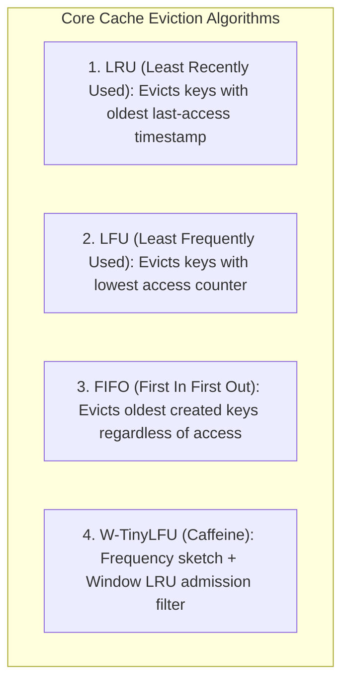
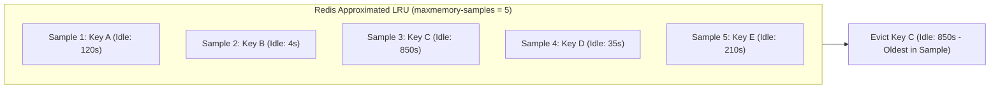

# Cache Eviction Algorithms, Redis maxmemory Policies, and Memory Fragmentation

---

## 1. What Is It?
When an in-memory cache reaches its physical memory boundary (**`maxmemory`**), it cannot accept new keys without freeing memory. **Cache Eviction Algorithms** are mathematical replacement policies (such as **LRU**, **LFU**, and **W-TinyLFU**) that determine which cached keys must be permanently removed to accommodate new data.

---

## 2. Why Does It Exist?
RAM is a finite, expensive physical hardware resource:
- If a cache runs out of memory without an eviction policy, incoming write operations fail with out-of-memory errors (`OOM command not allowed when used memory > 'maxmemory'`).
- If an improper eviction policy is selected (e.g. standard FIFO instead of LFU for skewed access distributions), the cache evicts hot, high-frequency keys, resulting in **Cache Hit Rate Collapse** and severe database overload.

---

## 3. Mental Model



---

## 4. How Does It Work?

### Redis `maxmemory` Eviction Policies (The 8 Policies)

| Policy Name | Target Keys | Eviction Criteria | Production Recommendation |
|---|---|---|---|
| **`noeviction`** | All keys | **Throws Error on write**; never evicts data | Default; ideal when Redis is used as persistent store / queue |
| **`allkeys-lru`** | All keys | Evicts least recently accessed keys | **Standard for general-purpose web caches** |
| **`volatile-lru`** | Keys with TTL | Evicts least recently accessed keys among expiring keys | Used when caching mixed persistent and transient data |
| **`allkeys-lfu`** | All keys | Evicts least frequently accessed keys | **Best for Zipfian / Power-Law skewed traffic** |
| **`volatile-lfu`** | Keys with TTL | Evicts least frequently accessed keys among expiring keys | Good for shared Redis clusters |
| **`allkeys-random`** | All keys | Evicts random keys | Testing / benchmarking |
| **`volatile-random`**| Keys with TTL | Evicts random keys with TTL | Rarely used |
| **`volatile-ttl`** | Keys with TTL | Evicts keys with the **shortest remaining TTL** | Evicts keys about to expire naturally |

---

## 5. Internal Working: Redis Approximated LRU/LFU

True LRU requires maintaining a globally synchronized doubly-linked list of all keys in memory, which consumes significant memory pointers (16-24 bytes per key) and causes lock contention under high concurrency.

### Redis Approximated LRU Mechanics
- Redis embeds a 24-bit timestamp (`lruclock`) inside every `redisObject` header.
- When memory exceeds `maxmemory`, Redis does **not** scan the entire keyspace.
- Instead, it selects $N$ random keys (configured via `maxmemory-samples`, default: 5).
- It evaluates the oldest key among the sample pool and evicts it.
- **Result**: At `maxmemory-samples = 10`, Redis Approximated LRU provides $99\%$ mathematical parity with True LRU at a fraction of the CPU and memory cost!



---

## 6. Memory Fragmentation and `activedefrag`

In Redis, memory is managed by the memory allocator (typically **Jemalloc**).

$$\textbf{Memory Fragmentation Ratio: } \text{Ratio} = \frac{\text{used\_memory\_rss (Total OS Memory Assigned)}}{\text{used\_memory (Actual Data Stored by Redis)}}$$

- **Healthy Ratio**: $1.0 - 1.5$.
- **Fragmented ($> 1.5$)**: Redis is occupying massive physical RAM from the OS, but most of it is empty, fragmented space caused by deleting and overwriting variable-length strings.
- **Swapping ($< 1.0$)**: The OS is swapping Redis memory to disk! **Disastrous latency spike from $100\mu\text{s}$ to $10\text{ms}$**.

### Activating Online Memory Defragmentation
```ini
# redis.conf
activedefrag yes
active-defrag-ignore-bytes 100mb
active-defrag-threshold-lower 10 # Start defrag if fragmentation > 10%
active-defrag-threshold-upper 30 # Maximum defrag CPU intensity at 30%
```

---

## 7. Implementation: Java LRU Cache using `LinkedHashMap`

```java
package com.backend.engineering.caching.eviction;

import java.util.LinkedHashMap;
import java.util.Map;

public class SimpleLruCache<K, V> extends LinkedHashMap<K, V> {

    private final int maxCapacity;

    public SimpleLruCache(int maxCapacity) {
        // initialCapacity, loadFactor, accessOrder = true (enables LRU access ordering!)
        super(maxCapacity, 0.75f, true);
        this.maxCapacity = maxCapacity;
    }

    @Override
    protected boolean removeEldestEntry(Map.Entry<K, V> eldest) {
        // Evicts the least recently accessed entry when size exceeds capacity
        return size() > maxCapacity;
    }

    // Synchronized wrapper for thread safety
    public synchronized V getSafely(K key) {
        return super.get(key);
    }

    public synchronized void putSafely(K key, V value) {
        super.put(key, value);
    }
}
```

---

## 8. Performance

| Eviction Algorithm | Hit Rate (Power-Law Workload) | CPU Overhead | Memory Overhead per Key |
|---|---|---|---|
| **FIFO** | Poor ($45 - 60\%$) | Lowest | Zero |
| **LRU** | High ($75 - 85\%$) | Low | 24-bit timestamp in header |
| **LFU** | **Very High ($85 - 92\%$)** | Low | 8-bit logarithmic counter |
| **W-TinyLFU (Caffeine)** | **Maximum ($90 - 96\%$)** | Low (Count-Min Sketch) | $\approx 8$ bytes per entry |

---

## 9. Failure Scenarios

1. **`OOM command not allowed` under `noeviction`**:
   - *Failure*: Redis `maxmemory` is reached with default `noeviction`. Every subsequent `SET` or `LPUSH` command throws a fatal error, breaking write traffic across all microservices.
   - *Mitigation*: For general cache instances, **always configure `maxmemory-policy allkeys-lru` or `allkeys-lfu`**.

2. **OS Swapping Latency Avalanche**:
   - *Failure*: Total system memory is exhausted; Linux kernel starts swapping Redis heap memory to swap disk partitions. Redis single-threaded event loop blocks on disk I/O, causing p99 latency to explode from $0.5\text{ms}$ to $500\text{ms}$.
   - *Mitigation*: Disable Linux swap entirely on Redis dedicated host machines (`sudo swapoff -a`).

---

## 10. Observability

### Inspecting Redis Memory and Eviction Metrics
```bash
redis-cli info memory
```
- Key output fields to monitor:
  - `used_memory_human`: Actual memory consumed by keys.
  - `used_memory_rss_human`: Total memory allocated by OS allocator.
  - `mem_fragmentation_ratio`: If $> 1.5$, trigger defragmentation.
  - `evicted_keys`: Total number of keys evicted due to `maxmemory`.

---

## 11. Debugging

### Triage: High Eviction Velocity & Cache Hit Collapse
```sql
-- Check Redis instantaneous operations and eviction rate
redis-cli info stats | grep -E "evicted_keys|keyspace_hits|keyspace_misses"
```
- If `evicted_keys` is incrementing by thousands per second, `maxmemory` is undersized for the active working set. Scale Redis memory vertically or increase cluster shard count.

---

## 12. Scaling

### Key TTL Jitter Sizing
When adding TTLs to cached entries, always introduce random jitter to prevent all keys from expiring at the same second:
$$\text{TTL} = \text{BaseTTL} + \text{Random}(0, \text{JitterSeconds})$$

---

## 13. Trade-offs

| Policy | Advantage | Downside |
|---|---|---|
| `allkeys-lru` | Optimal for time-decaying relevance (e.g. news articles) | Vulnerable to brief sequential scan pollution |
| `allkeys-lfu` | Protects perpetually hot keys against scan pollution | Takes longer to adapt when hot keys suddenly become cold |
| `volatile-ttl` | Reclaims memory by anticipating natural expirations | May evict hot keys if their remaining TTL is short |

---

## 14. When to Use
- **`allkeys-lru`**: Standard web application caches with shifting temporal popularity.
- **`allkeys-lfu`**: High-volume e-commerce catalogs with a steady power-law distribution of hot products.
- **`volatile-lru`**: Shared Redis instances holding both persistent background queue items and transient cached objects.

---

## 15. When NOT to Use
- Do not use `allkeys-lru` on Redis instances acting as **Message Brokers** (Redis Streams) or **Celery Task Queues**, as critical unconsumed tasks will be silently evicted. Use `noeviction` for message queues.

---

## 16. Interview Questions

### Q1: How does Redis LFU (Least Frequently Used) prevent historic "zombie keys" that were accessed millions of times in the past from staying in cache forever?
<details>
<summary>Reveal Answer</summary>

**Answer**:
In Redis LFU, the access counter is not a simple infinite integer. It is an **8-bit Logarithmic Aging Counter (Morris Counter)** that combines two mechanisms:
1. **Logarithmic Increment**: Counter increments probabilistically as access counts rise, allowing an 8-bit byte ($0-255$) to represent millions of accesses.
2. **Decay Time (Aging)**: Redis stores the last decay timestamp (`ldt`) inside the 24-bit object header. When a key is sampled, Redis calculates how many minutes have elapsed since the last decay (`lfu-decay-time`, default: 1 minute) and **decrements the counter proportionally to elapsed time**.
This ensures that historical hot keys that are no longer accessed decay rapidly over time and are evicted naturally.
</details>

### Q2: Why does `LinkedHashMap` with `accessOrder = true` implement True LRU, and what is its concurrency limitation?
<details>
<summary>Reveal Answer</summary>

**Answer**:
In Java, `LinkedHashMap(capacity, loadFactor, true)` sets `accessOrder = true`.
Whenever `get()` or `put()` is invoked on an entry, `LinkedHashMap` moves that entry to the **tail of its internal doubly-linked list**. When capacity is exceeded, `removeEldestEntry()` removes the node at the **head of the list** ($O(1)$ LRU eviction).
**Concurrency Limitation**:
Because every single read operation (`get()`) physically mutates the internal doubly-linked list pointers, the map **is not thread-safe**. All reads and writes must be wrapped in heavy synchronization locks, causing severe thread contention. Production high-concurrency caches (like **Caffeine**) replace this with lock-free ring buffers and striping algorithms (Window TinyLFU).
</details>

---

## 17. Practical Exercise
1. Configure a local Redis instance with `maxmemory 5mb` and `maxmemory-policy allkeys-lru`.
2. Insert 10,000 keys of 1KB each and verify that older keys are automatically evicted without throwing errors.
3. Switch policy to `noeviction` and verify that Redis throws `OOM command not allowed` once 5MB is reached.
4. Implement a custom Java `SimpleLruCache` using `LinkedHashMap` and test eviction behavior under unit tests.

---

## 18. Quick Revision
- **`maxmemory-policy`**: Dictates eviction behavior when RAM is exhausted (`allkeys-lru`, `allkeys-lfu`, `noeviction`).
- **Approximated LRU**: Redis samples $N$ random keys to find the oldest entry, avoiding the memory overhead of a global linked list.
- **Redis LFU**: Uses an 8-bit logarithmic counter with continuous time-decay aging.
- **Memory Fragmentation**: `used_memory_rss / used_memory`; resolved online via `activedefrag yes`.
- **Golden Rule**: Never use eviction policies on Redis instances storing task queues or distributed lock states.
