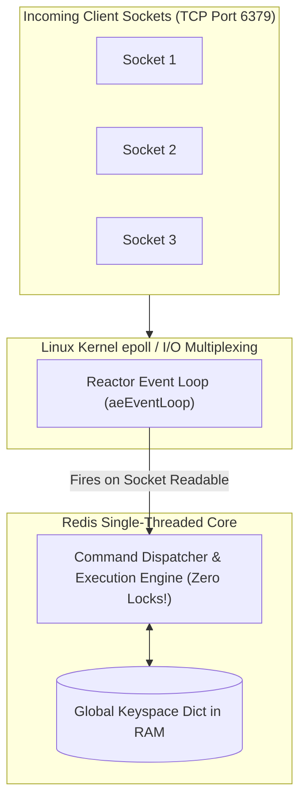
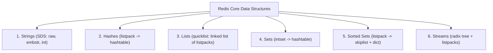
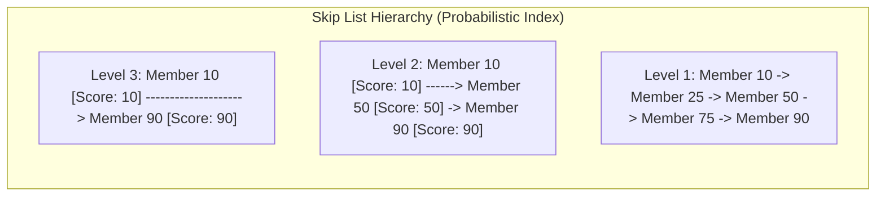

# Redis Architecture, Core Data Structures, and Memory Encodings

---

## 1. What Is It?
**Redis (Remote Dictionary Server)** is an open-source, in-memory, key-value data structure store used as a database, cache, message broker, and streaming engine. 

Redis owes its extreme performance ($> 100,000\text{ ops/sec}$ per core with sub-millisecond latencies) to an **asynchronous single-threaded event loop** paired with custom, cache-optimized internal C data structures (SDS, Skiplists, Listpacks, Intsets).

---

## 2. Why Does It Exist?
Traditional multi-threaded in-memory stores suffer from:
- **Lock Contention**: Threads spend CPU time acquiring mutexes, rw-locks, and synchronization barriers on shared hash tables.
- **Thread Context Switching**: Hundreds of competing worker threads cause CPU cache invalidation and kernel scheduling latency.

Redis eliminates all locking and context-switching overhead on command execution by processing all data mutations on a **single execution thread** using non-blocking **I/O Multiplexing** (`epoll` on Linux, `kqueue` on macOS).

---

## 3. Mental Model



---

## 4. How Does It Work?

### Redis 6+ Multi-Threaded I/O Architecture
While command execution is strictly single-threaded, **Redis 6+ introduces multi-threaded I/O**:
- **Socket Reading & Parsing**: Worker threads read raw network bytes from client sockets and parse Redis protocol commands (RESP).
- **Command Execution**: The **Single Main Thread** executes all parsed commands sequentially in memory (retaining 100% thread-safety and zero mutex locking).
- **Socket Serialization & Writing**: Worker threads serialize responses and flush socket buffers back over the network.

---

## 5. The 6 Core Data Structures & Internal Encodings



---

### 1. Strings: Simple Dynamic Strings (SDS)
Unlike standard null-terminated C strings (`char*`), Redis uses **Simple Dynamic Strings (SDS)**:
- **$O(1)$ Length Lookup**: Stores length explicitly in header (no `strlen()` scan).
- **Binary Safe**: Can store arbitrary binary data, raw bytes, Protobuf, or JPEG images (not terminated by `\0`).
- **Encodings**:
  - `int`: 64-bit signed integers (e.g. `INCR counter`).
  - `embstr`: Strings $\le 44\text{ bytes}$; allocated inside the *same memory chunk* as the `redisObject` header (1 memory allocation, maximum CPU cache locality).
  - `raw`: Strings $> 44\text{ bytes}$; requires 2 separate memory allocations.

---

### 2. Hashes (`HSET`, `HGET`)
- **`listpack` encoding**: For small hashes ($< 512\text{ entries}$ and $< 64\text{ bytes/field}$). Stores keys and values contiguously in a single flat byte array. **Ultra-low memory footprint**.
- **`hashtable` encoding**: Automatically upgraded to a full dictionary hash table when size or field length exceeds thresholds.

---

### 3. Lists (`LPUSH`, `RPOP`, `BLPOP`)
- Encoded as a **`quicklist`**: A doubly-linked list of compact `listpack` nodes. Combines the fast $O(1)$ head/tail insertions of a linked list with the contiguous memory density and CPU cache efficiency of an array.

---

### 4. Sets (`SADD`, `SMEMBERS`, `SINTER`)
- **`intset` encoding**: Used when all set elements are integers and total count $< 512$. Stored as a sorted flat array with binary search ($O(\log N)$).
- **`hashtable` encoding**: Used for string elements or large sets ($O(1)$ lookups).

---

### 5. Sorted Sets (`ZADD`, `ZRANGEBYSCORE`)
Combines two internal structures simultaneously:
1. **Hash Table (`dict`)**: Maps `Member -> Score` for $O(1)$ score lookups.
2. **Skip List (`skiplist`)**: Probabilistic multi-level linked list maintaining members sorted by score for $O(\log N)$ range queries and rank calculations (`ZRANK`).



---

### 6. Redis Streams (`XADD`, `XREADGROUP`)
- Encoded using a **Radix Tree (Rax)** holding compact **Listpacks**.
- Designed as an in-memory, append-only event stream supporting consumer groups, message acknowledgments (`XACK`), and pending entry lists (PEL).

---

## 6. Example: Practical Redis CLI Data Operations

```bash
# 1. String atomic counter
SET login:attempts:user_42 1 EX 60
INCR login:attempts:user_42

# 2. Hash object storage
HSET user:101 name "Alice" email "alice@example.com" role "ADMIN"
HGET user:101 email

# 3. Sorted Set real-time gaming leaderboard
ZADD leaderboard:weekly 1540 "player_alice"
ZADD leaderboard:weekly 2100 "player_bob"
ZADD leaderboard:weekly 1890 "player_charlie"

# Fetch top 3 players by score (Descending)
ZREVRANGE leaderboard:weekly 0 2 WITHSCORES
# Output:
# 1) "player_bob" - 2100
# 2) "player_charlie" - 1890
# 3) "player_alice" - 1540
```

---

## 7. Implementation: Java 21 Spring Data Redis Operations

```java
package com.backend.engineering.caching.redis;

import org.springframework.data.redis.core.RedisTemplate;
import org.springframework.data.redis.core.ZSetOperations;
import org.springframework.stereotype.Service;

import java.util.Set;

@Service
public class RedisLeaderboardService {

    private final RedisTemplate<String, String> redisTemplate;
    private static final String LEADERBOARD_KEY = "gaming:leaderboard:global";

    public RedisLeaderboardService(RedisTemplate<String, String> redisTemplate) {
        this.redisTemplate = redisTemplate;
    }

    public void recordScore(String playerId, double score) {
        // ZADD gaming:leaderboard:global <score> <playerId> (O(log N) in Skiplist)
        redisTemplate.opsForZSet().add(LEADERBOARD_KEY, playerId, score);
    }

    public Set<ZSetOperations.TypedTuple<String>> getTopPlayers(int topN) {
        // ZREVRANGE gaming:leaderboard:global 0 (topN - 1) WITHSCORES
        return redisTemplate.opsForZSet().reverseRangeWithScores(LEADERBOARD_KEY, 0, topN - 1);
    }

    public Long getPlayerRank(String playerId) {
        // ZREVRANK gaming:leaderboard:global <playerId> (0-indexed)
        Long rank = redisTemplate.opsForZSet().reverseRank(LEADERBOARD_KEY, playerId);
        return (rank != null) ? rank + 1 : null; // Convert to 1-indexed rank
    }
}
```

---

## 8. Performance & Big-O Complexity

| Data Structure | Typical Command | Internal Encoding | Time Complexity |
|---|---|---|---|
| **String** | `GET` / `SET` | SDS (`embstr` / `raw`) | $\mathbf{O(1)}$ |
| **String** | `INCR` / `DECR` | `int` | $\mathbf{O(1)}$ |
| **Hash** | `HGET` / `HSET` | `hashtable` / `listpack` | $\mathbf{O(1)}$ |
| **List** | `LPUSH` / `RPOP` | `quicklist` | $\mathbf{O(1)}$ |
| **Set** | `SADD` / `SISMEMBER`| `hashtable` / `intset` | $\mathbf{O(1)}$ |
| **Sorted Set** | `ZADD` / `ZREM` | `skiplist` + `dict` | $\mathbf{O(\log N)}$ |
| **Sorted Set** | `ZRANGE` ($M\text{ elements}$)| `skiplist` | $\mathbf{O(\log N + M)}$ |

---

## 9. Failure Scenarios

1. **The Dangerous `KEYS *` Production Freeze**:
   - *Failure*: An engineer runs `KEYS user:*` on a production Redis instance containing 10,000,000 keys. Because Redis is single-threaded, `KEYS *` performs an $O(N)$ full table scan, blocking the main execution thread for 15 seconds. All application health checks fail, causing Kubernetes to restart all pods.
   - *Mitigation*: **Disable `KEYS` command in `redis.conf` (`rename-command KEYS ""`)** and use non-blocking cursor-based **`SCAN`** instead.

2. **BigKey Latency Spikes**:
   - *Failure*: Storing a single Hash or Set with 1,000,000 elements under a single key (`HGETALL big_key` or `DEL big_key`). Deleting or querying a BigKey blocks the single main thread for hundreds of milliseconds.
   - *Mitigation*: Use `UNLINK big_key` (asynchronous non-blocking background deletion) instead of `DEL`, and keep collection sizes $< 5,000$ items per key.

---

## 10. Observability

### Inspecting Slow Commands and Key Encodings
```bash
# 1. Inspect low-level encoding of a specific key
OBJECT ENCODING user:101
# Output: "listpack" or "hashtable"

# 2. Inspect Redis Slowlog (Commands taking > 10,000μs)
SLOWLOG GET 10

# 3. Detect Top BigKeys across the entire database
redis-cli --bigkeys
```

---

## 11. Debugging

### Triage: Investigating High Latency Spikes
1. Check slow log: `SLOWLOG GET 25`.
2. Check single-thread CPU core utilization (if 1 core is pegged at $100\%$, check for $O(N)$ commands like `HGETALL`, `SMEMBERS`, `KEYS`).
3. Check network bandwidth saturation (BigKeys consuming full 1Gbps/10Gbps NIC capacity).

---

## 12. Scaling

### Redis Cluster & Hash Slot Sharding
- Redis Cluster partitions the keyspace into **16,384 Hash Slots**:
  $$\text{Slot} = \text{CRC16}(\text{Key}) \pmod{16384}$$
- Hash tags (`{user:101}:profile` and `{user:101}:orders`) ensure related keys map to the exact same hash slot and physical Redis shard for multi-key operations.

---

## 13. Trade-offs

| Data Structure | Best Suited For | Dangerous Anti-Pattern |
|---|---|---|
| **String** | Point cache, atomic counters, tokens | Serializing massive 5MB JSON blobs |
| **Hash** | Object representation (fields) | Running `HGETALL` on 100,000-field hashes |
| **Sorted Set** | Leaderboards, rate limiters, priority queues | High cardinality without range limits |
| **Streams** | In-memory message queues, audit logs | Unbounded growth without `MAXLEN` cap |

---

## 14. When to Use
- Real-time leaderboards, sliding window rate limiters, active session stores, distributed counters, and real-time caching.

---

## 15. When NOT to Use
- Relational data requiring complex multi-table joins and ACID transactions spanning multiple keys across different hash slots.
- Cold archival storage where data volume far exceeds affordable server RAM.

---

## 16. Interview Questions

### Q1: Why is Redis single-threaded, and how does it achieve over 100,000 operations per second on a single CPU core?
<details>
<summary>Reveal Answer</summary>

**Answer**:
Redis is single-threaded on command execution because its primary performance bottleneck is **memory bandwidth and network I/O, not CPU processing power**.
By running single-threaded:
1. **Zero Lock Overhead**: It completely avoids mutexes, read-write locks, semaphores, and synchronized blocks on internal data structures.
2. **Zero Context-Switching**: The CPU core never incurs kernel context-switch penalties, keeping hardware L1/L2 CPU caches hot.
3. **I/O Multiplexing (`epoll`)**: It uses the non-blocking Reactor pattern to monitor thousands of client TCP sockets simultaneously, dispatching ready read/write events to the execution engine in microsecond bursts.
4. **Custom Memory Encodings**: Data structures like SDS, Skiplists, and Listpacks are tailored for contiguous memory layout and minimal memory allocator fragmentation.
</details>

### Q2: What is the difference between `DEL` and `UNLINK` in Redis?
<details>
<summary>Reveal Answer</summary>

**Answer**:
- **`DEL`** is a **synchronous** blocking command. If you execute `DEL big_hash` on a hash containing 500,000 items, the single main execution thread must iterate through and reclaim all memory allocations immediately, **blocking all other client commands for tens or hundreds of milliseconds**.
- **`UNLINK`** is an **asynchronous non-blocking** command. It immediately unlinks the key from the keyspace dictionary in $O(1)$ time (making it instantly invisible to subsequent queries) and hands the memory deallocation task over to a **background worker thread (`bio.c`)** to reclaim memory asynchronously without blocking the main event loop.
</details>

---

## 17. Practical Exercise
1. Use `redis-cli` to create small Strings, Hashes, and Sets, and run `OBJECT ENCODING key` to observe `embstr`, `listpack`, and `intset`.
2. Add elements to exceed the threshold and observe the internal encoding transition to `raw` and `hashtable`.
3. Implement a sliding window rate limiter in Java using Redis Sorted Sets (`ZADD` with timestamps).
4. Run `SLOWLOG GET` after executing a simulated heavy operation.

---

## 18. Quick Revision
- **Single-Threaded Engine**: Command execution has zero locks; I/O is multiplexed via `epoll`.
- **SDS**: Binary-safe, $O(1)$ length string with `embstr` ($< 44\text{ bytes}$) cache-locality optimization.
- **Sorted Set**: Backed by **Skip List + Hash Table** for $O(\log N)$ range queries and $O(1)$ score lookups.
- **Never Run `KEYS *`**: Always use `SCAN` to prevent blocking the event loop.
- **Use `UNLINK`**: Free large keys asynchronously in background threads.
