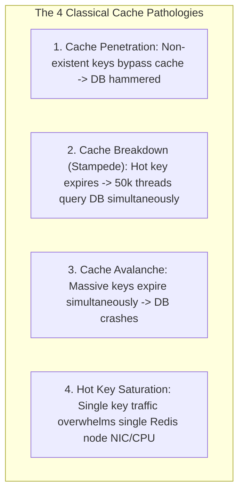
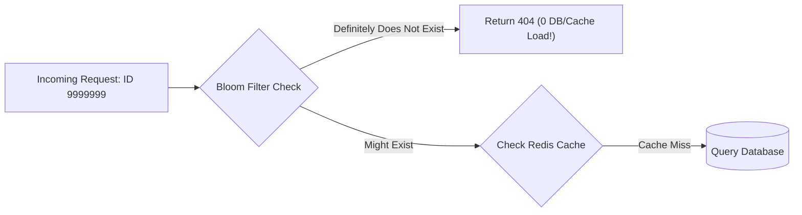

# Cache Pathologies: Penetration, Avalanche, Stampede, and Hot Key Defenses

---

## 1. What Is It?
**Cache Pathologies** are severe production failure modes that occur in caching architectures when traffic bypasses the caching layer, invalidates en masse, or concentrates on single keys, causing **Cascading Database Overload** and total backend service collapse.

The 4 classic pathologies are:
1. **Cache Penetration**
2. **Cache Breakdown (Hot Key Stampede)**
3. **Cache Avalanche**
4. **Hot Key Bottlenecking**

---

## 2. Why Does It Exist?
In high-throughput systems, primary databases are intentionally sized assuming a $> 95\%$ Cache Hit Rate. If a cache anomaly causes the hit rate to drop to $50\%$, the database receives **$10\times$ more direct query traffic than its maximum capacity**, instantly exhausting connection pools, spiking CPU to $100\%$, and taking down the entire platform.

---

## 3. Mental Model: The 4 Pathologies



---

## 4. Deep Mechanics & Production Defenses

### 1. Cache Penetration
- **The Problem**: Malicious attackers or buggy clients query non-existent IDs (`/users/999999999`). Because the ID does not exist in the database, the cache never stores it. Every incoming request penetrates directly through the cache to the database.
- **Defense 1: Null Object Caching**:
  - Store a null marker (`product:999999 = "NULL_MARKER"`) with a short TTL ($60\text{ seconds}$). Subsequent requests hit the cache and return 404 instantly.
- **Defense 2: Bloom Filter at Cache Gate**:
  - Place a space-efficient probabilistic **Bloom Filter** in front of the cache containing all valid database primary keys.
  - If Bloom Filter says "No" $\longrightarrow$ Item definitely does not exist; abort immediately with 404 without querying Redis or DB.



---

### 2. Cache Breakdown / Hot Key Stampede (Thundering Herd)
- **The Problem**: A single extremely hot key (e.g. Black Friday homepage banner) expires while handling $50,000\text{ req/sec}$. All 50,000 worker threads encounter a cache miss simultaneously and attempt to execute the heavy database query in parallel.
- **Defense 1: Distributed Mutex Lock (Singleflight / `SETNX`)**:
  - Only the first thread that acquires the mutex lock is allowed to query the database and repopulate the cache.
  - The other 49,999 threads sleep briefly ($50\text{ms}$) and re-read the newly populated cache.
- **Defense 2: Probabilistic Early Expiration (The XFetch Algorithm)**:
  - Background reader threads probabilistically compute whether to refresh the cache *before* it expires based on computation delta time ($\Delta$) and remaining TTL:
    $$\textbf{Compute Refresh if: } -\beta \times \Delta \times \ln(\text{rand}()) > \text{RemainingTTL}$$

---

### 3. Cache Avalanche
- **The Problem**: Millions of keys are bulk-inserted with the exact same TTL (e.g. `EXPIRE 3600`). At exactly $1\text{ hour}$ later, all millions of keys expire within the exact same second, dumping the entire platform's read load onto the database at once.
- **Defense: TTL Jitter / Randomization**:
  - Add a uniform random delta to every TTL:
    $$\text{TTL} = \text{BaseTTL} + \text{Random}(0, \text{JitterSeconds})$$
  - Example: For a 1-hour cache, set $\text{TTL} = 3600 + \text{Random}(0, 300)$ seconds. Expirations are smoothed evenly over a 5-minute window.

---

### 4. Hot Key Saturation
- **The Problem**: A viral celebrity post generates $300,000\text{ reads/sec}$ for key `post:viral_101`. In a Redis Cluster, that key resides on a **single physical shard**, saturating the single CPU core and 10Gbps network interface of that single node.
- **Defense 1: Local In-Memory L1 Cache (Caffeine)**:
  - Cache the hot key directly in application JVM heap memory for $30\text{ seconds}$.
- **Defense 2: Key Sharding / Suffix Replication**:
  - Replicate the hot key across $N$ shards with randomized suffix keys: `post:viral_101_shard_1`, `post:viral_101_shard_2`, `...`, `post:viral_101_shard_N`.
  - Clients randomly select a suffix: $\text{Key} = \text{viral\_101\_shard\_} + \text{Random}(1, N)$.

---

## 5. Implementation: Distributed Mutex & Null Caching in Java 21

```java
package com.backend.engineering.caching.pathologies;

import org.slf4j.Logger;
import org.slf4j.LoggerFactory;
import org.springframework.data.redis.core.RedisTemplate;
import org.springframework.stereotype.Service;

import java.time.Duration;
import java.util.concurrent.ThreadLocalRandom;

@Service
public class ResilientProductCatalogCache {

    private static final Logger log = LoggerFactory.getLogger(ResilientProductCatalogCache.class);
    private static final String NULL_MARKER = "@@NULL_ENTITY@@";

    private final RedisTemplate<String, String> redisTemplate;
    private final ProductDatabaseClient databaseClient;

    public ResilientProductCatalogCache(
            RedisTemplate<String, String> redisTemplate,
            ProductDatabaseClient databaseClient) {
        this.redisTemplate = redisTemplate;
        this.databaseClient = databaseClient;
    }

    public String getProductDetails(Long productId) {
        String cacheKey = "product:details:" + productId;

        // 1. Read from Redis Cache
        String cachedValue = redisTemplate.opsForValue().get(cacheKey);

        if (cachedValue != null) {
            // Check for Cache Penetration Null Marker
            if (NULL_MARKER.equals(cachedValue)) {
                return null; // Fast 404
            }
            return cachedValue; // Cache Hit!
        }

        // 2. Cache Miss: Defend against Cache Breakdown / Stampede via Mutex Lock
        String lockKey = "lock:rebuild:product:" + productId;
        Boolean acquired = redisTemplate.opsForValue().setIfAbsent(lockKey, "1", Duration.ofSeconds(3));

        if (Boolean.TRUE.equals(acquired)) {
            try {
                // Double-check cache inside lock
                cachedValue = redisTemplate.opsForValue().get(cacheKey);
                if (cachedValue != null) {
                    return NULL_MARKER.equals(cachedValue) ? null : cachedValue;
                }

                // 3. Fetch from Database (Single Thread Execution!)
                String dbData = databaseClient.fetchProductJson(productId);

                if (dbData == null) {
                    // DEFENSE: Cache Penetration -> Cache Null Marker with short 60s TTL
                    redisTemplate.opsForValue().set(cacheKey, NULL_MARKER, Duration.ofSeconds(60));
                    return null;
                }

                // DEFENSE: Cache Avalanche -> Apply TTL Jitter (60m + 0-5m random)
                long jitterSeconds = ThreadLocalRandom.current().nextLong(300);
                Duration ttlWithJitter = Duration.ofMinutes(60).plusSeconds(jitterSeconds);

                redisTemplate.opsForValue().set(cacheKey, dbData, ttlWithJitter);
                return dbData;

            } finally {
                redisTemplate.delete(lockKey); // Release Mutex Lock
            }
        } else {
            // 4. Failed to acquire lock: Another thread is rebuilding cache! Sleep and retry
            try {
                Thread.sleep(50);
                return getProductDetails(productId); // Retry read from cache
            } catch (InterruptedException e) {
                Thread.currentThread().interrupt();
                throw new RuntimeException(e);
            }
        }
    }
}
```

---

## 6. Performance

| Pathology Defended | Peak Read Concurrency | Database CPU Load | Latency Profile |
|---|---|---|---|
| No Defense (Stampede Failure) | $50,000\text{ req/sec}$ | $100\%$ (Crashed) | Timeouts ($> 30\text{s}$) |
| **With Mutex Lock (`SETNX`)** | $50,000\text{ req/sec}$ | $\mathbf{< 2\%}$ (1 single DB query) | $\mathbf{< 5\text{ms}}$ |
| **With Null Object Caching** | $100,000\text{ invalid req/s}$ | $\mathbf{0\%}$ DB load | $\mathbf{< 0.5\text{ms}}$ |
| **With TTL Jitter** | Expiration of $10\text{M keys}$ | Flat, stable line | Constant $< 1\text{ms}$ |

---

## 7. Failure Scenarios

1. **Deadlock in Stampede Mutex Lock**:
   - *Failure*: A thread acquires the `SETNX` lock to query the database, but the database connection hangs or the application crashes before releasing the lock. All other threads waiting for the lock block indefinitely.
   - *Mitigation*: **Always set a short, strict TTL on the mutex lock (`Duration.ofSeconds(3)`)** so the lock auto-expires if the holder crashes.

---

## 8. Observability

- **Metrics**:
  - `cache_miss_lock_acquire_failures_total`: Tracks how many threads waited on mutex locks during rebuilds.
  - `database_queries_for_null_entities_total`: Indicates potential cache penetration attacks.

---

## 9. Debugging

### Triage: Identifying Cache Breakdown / Stampede Spike
- Look for sudden Grafana spikes where **Cache Miss Rate** and **Database CPU** surge simultaneously on a specific SQL query signature while overall platform traffic is constant.

---

## 10. Scaling

### Google Guava / Caffeine Singleflight (`LoadingCache`)
For local JVM caching, use `LoadingCache.get(key, callable)`:
- Guava/Caffeine implements **atomic Singleflight**: If 1,000 local threads request the same missing key simultaneously, the cache library executes the `callable` loader on exactly **1 thread** and shares the resulting `Future` across all 999 other waiting threads.

---

## 11. Trade-offs

| Defense Pattern | Strength | Operational Cost |
|---|---|---|
| **Null Object Caching** | Simple to implement | Wastes memory storing non-existent keys (keep TTL short) |
| **Bloom Filters** | Ultra-compact memory (bits per key); zero DB load on misses | Cannot remove deleted keys easily (requires Counting Bloom Filter); false positives ($1\%$) |
| **Mutex Lock (`SETNX`)** | 100% prevents duplicate DB queries | Adds 50ms wait latency for competitor threads during rebuild |

---

## 12. When to Use
- **Null Caching / Bloom Filters**: Public search endpoints, user lookup APIs vulnerable to enumeration attacks.
- **Mutex Lock / XFetch**: High-traffic homepages, product catalogs, flash sale inventories.
- **TTL Jitter**: Mandatory standard on all production cache writes.

---

## 13. When NOT to Use
- Low-traffic internal admin services where cache stampede risk is mathematically zero.

---

## 14. Interview Questions

### Q1: What is the difference between Cache Penetration, Cache Breakdown, and Cache Avalanche?
<details>
<summary>Reveal Answer</summary>

**Answer**:
1. **Cache Penetration**: Queries for data that **does not exist in either the cache or the database** (e.g. random malicious IDs). Requests constantly bypass the cache and hit the database directly. *Defenses*: Null Object Caching, Bloom Filters.
2. **Cache Breakdown (Hot Key Stampede)**: A **single extremely popular hot key** expires or is deleted. A massive concurrent wave of requests hits a cache miss simultaneously, overloading the database with duplicate queries for the same key. *Defenses*: Distributed Mutex (`SETNX`), Singleflight, XFetch early refresh.
3. **Cache Avalanche**: A **large volume of different cached keys** expire at the **exact same moment** (due to identical TTLs) or the entire cache cluster crashes. *Defenses*: TTL Jitter (randomization), Redis High Availability multi-AZ clusters.
</details>

### Q2: How does a Bloom Filter work, and why does it have false positives but never false negatives?
<details>
<summary>Reveal Answer</summary>

**Answer**:
A **Bloom Filter** is a space-efficient probabilistic data structure based on a bit array of size $M$ and $K$ independent cryptographic hash functions.
- **Insertion**: When Key $A$ is added, it is hashed by all $K$ hash functions, and the corresponding bits at those $K$ array positions are set to `1`.
- **Query**: To check if Key $B$ exists, Key $B$ is hashed by the $K$ functions:
  - If **any of the $K$ bit positions is `0`**, Key $B$ **definitely does not exist** (Zero False Negatives).
  - If **all $K$ bit positions are `1`**, Key $B$ **probably exists** (False Positive possibility because previous distinct keys might have set those exact bits).
Because it never produces false negatives, any key that returns "No" can be rejected immediately with a 404 before touching the database.
</details>

---

## 17. Practical Exercise
1. Implement a Spring Boot cache service with deliberate 0-jitter TTLs and observe a simulated Cache Avalanche under `wrk` load testing.
2. Add TTL Jitter ($Base \pm 10\%$) and observe the smoothing of database query rates.
3. Simulate a cache stampede on an expensive 2-second database query with 500 concurrent threads and measure database queries executed with and without `SETNX` mutex locking.

---

## 18. Quick Revision
- **Penetration**: Non-existent keys hit DB; solve via **Null Caching** and **Bloom Filters**.
- **Breakdown / Stampede**: Single hot key expires under load; solve via **Distributed Mutex (`SETNX`)** and **Singleflight**.
- **Avalanche**: Mass TTL synchronized expiration; solve via **TTL Jitter / Randomization**.
- **Hot Key Sharding**: Suffix replication (`key_shard_N`) and local L1 JVM caching.
- **Lock TTL**: Always place strict timeouts on mutex locks to prevent deadlocks on crash.
