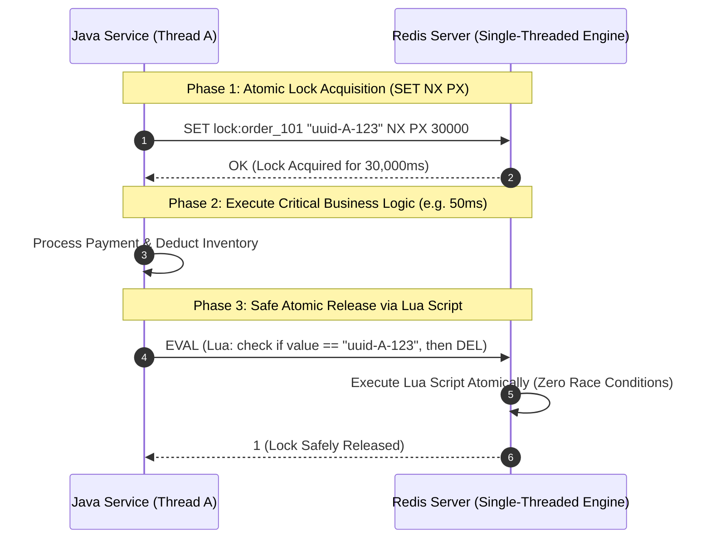

# Redis Lua Scripting, Distributed Locks, and Redisson Watchdog Internals

---

## 1. What Is It?
**Redis Lua Scripting** allows developers to write transactional logic in Lua that executes **atomically** inside the Redis engine without intermediate network roundtrips. 

A **Redis Distributed Lock** is a synchronization mechanism that guarantees mutual exclusion across distributed application instances running on different physical servers or Kubernetes pods, ensuring only one worker thread can access a shared resource at any given time.

---

## 2. Why Does It Exist?
Standard multi-step operations over Redis network connections are vulnerable to **Time-Of-Check to Time-Of-Use (TOCTOU)** race conditions:
```text
Step 1: GET lock:resource (Returns null -> lock free)
[Context switch / Network delay: Another thread acquires lock!]
Step 2: SET lock:resource uuid (Overwrites other thread's lock!)
```
Similarly, unlocking a distributed lock cannot be a simple `DEL lock:resource` because if Thread A takes longer than the lock TTL to finish, Thread B acquires the lock; Thread A then inadvertently deletes **Thread B's active lock**!

Lua scripting executes atomically inside the single-threaded Redis core: **no other command can run while the script is executing**.

---

## 3. Mental Model



---

## 4. How Does It Work?

### 1. Atomic Lock Acquisition
$$\text{Command: } \texttt{SET resource\_key client\_uuid NX PX 30000}$$
- `NX`: Set if Not eXists (Guarantees mutual exclusion; fails if already locked).
- `PX 30000`: Set expire time of $30,000\text{ms}$ (Guarantees automatic lock release if the client crashes or loses power, preventing permanent deadlocks).
- `client_uuid`: Unique identifier (e.g. UUID + ThreadID) preventing accidental release by other clients.

---

### 2. Safe Atomic Release via Lua Script
```lua
-- Keys: [KEYS[1] = lock_key], Args: [ARGV[1] = client_uuid]
if redis.call("get", KEYS[1]) == ARGV[1] then
    return redis.call("del", KEYS[1])
else
    return 0
end
```
If the lock expired and was acquired by another client, `get` returns a different UUID, the script returns `0`, and **the competitor's lock is left untouched**.

---

## 5. The Lock Expiration Hazard & Redisson Watchdog Daemon

What happens if the critical business logic takes $35\text{ seconds}$ to execute, but the lock TTL was configured as $30\text{ seconds}$?
1. At $T = 30\text{s}$, Redis automatically expires the lock.
2. Client B acquires the lock and enters the critical section simultaneously with Client A (**Loss of Mutual Exclusion!**).

```mermaid
flowchart TD
    subgraph RedissonLockArchitecture["Redisson Lock Watchdog Mechanism"]
        App["App Thread (Acquires Lock)"] --> Lock["Acquires Redis Hash Lock (TTL: 30s)"]
        Lock --> Watchdog["Background Watchdog Daemon (Netty HashedWheelTimer)"]
        
        Watchdog -->|Every 10s: Checks if App Thread is still alive| Renew["Lua Script: HEXPIRE lock 30s"]
        Renew --> Lock
        
        App -->|Business Logic Completes -> lock.unlock()| Cancel["Cancel Watchdog & DEL Lock"]
    end
```

### The Watchdog Solution
- **Redisson** starts a background **Watchdog Daemon** upon acquiring a lock without an explicit lease time.
- Every `lockWatchdogTimeout / 3` (default: every $10\text{ seconds}$ for a $30\text{s}$ lock), the Watchdog runs a Lua script that extends the lock TTL back to $30\text{ seconds}$.
- If the application crashes, the Watchdog dies, and the lock naturally expires after $30\text{s}$ without deadlocking.

---

## 6. Implementation: Redisson Distributed Lock in Java 21

```java
package com.backend.engineering.caching.locks;

import org.redisson.api.RLock;
import org.redisson.api.RedissonClient;
import org.slf4j.Logger;
import org.slf4j.LoggerFactory;
import org.springframework.stereotype.Service;

import java.util.concurrent.TimeUnit;

@Service
public class DistributedPaymentLockService {

    private static final Logger log = LoggerFactory.getLogger(DistributedPaymentLockService.class);
    private final RedissonClient redissonClient;

    public DistributedPaymentLockService(RedissonClient redissonClient) {
        this.redissonClient = redissonClient;
    }

    public void processPaymentWithLock(Long orderId, Runnable paymentTask) {
        String lockKey = "lock:payment:order:" + orderId;
        RLock lock = redissonClient.getLock(lockKey);

        try {
            // tryLock(waitTime, leaseTime, timeUnit)
            // waitTime: 5s (time to wait in queue to acquire lock)
            // leaseTime: -1 (enables automatic Watchdog lock renewal!)
            boolean isAcquired = lock.tryLock(5, -1, TimeUnit.SECONDS);

            if (!isAcquired) {
                throw new IllegalStateException("Could not acquire lock for order: " + orderId + " - Concurrent operation in progress");
            }

            log.info("Distributed lock acquired for order: {}", orderId);
            // Execute critical section
            paymentTask.run();

        } catch (InterruptedException e) {
            Thread.currentThread().interrupt();
            throw new RuntimeException("Lock acquisition interrupted", e);
        } finally {
            // Safe unlock: Only unlocks if current thread is the actual lock holder
            if (lock.isHeldByCurrentThread()) {
                lock.unlock();
                log.info("Distributed lock released for order: {}", orderId);
            }
        }
    }
}
```

---

## 7. The Redlock Algorithm across $N$ Independent Masters

In standard master-replica Redis setups, replication is **asynchronous**. If Client A acquires a lock on the Master, and the Master crashes *before* streaming the key to the Replica, the Replica is promoted to Master with **no knowledge of the lock**. Client B then acquires the exact same lock (**Dual Lock Bug**).

### The Redlock Algorithm (Martin Kleppmann vs Salvatore Sanfilippo)
To achieve fault-tolerant distributed locking:
1. Deploy $N$ ($5$) **completely independent Redis Master nodes** (zero replication between them).
2. The client attempts to acquire the lock sequentially across all $5$ nodes with a short timeout ($5-50\text{ms}$).
3. The client considers the lock acquired **only if it acquires a majority ($\ge 3$ nodes)** within the validity window.
4. If acquisition fails on a majority, the client unlocks all nodes immediately.

---

## 8. Performance

| Lock Type | Acquisition Latency | Contention Throughput | Fault Tolerance |
|---|---|---|---|
| Single Redis Instance (`SET NX PX`) | $< 0.5\text{ms}$ | $> 50,000\text{ locks/s}$ | Vulnerable to master failover loss |
| Redisson Lock + Watchdog | $< 0.8\text{ms}$ | $> 35,000\text{ locks/s}$ | Highly resilient; prevents early expiry |
| Multi-Master Redlock ($N=5$) | $5 - 20\text{ms}$ | $\approx 2,000\text{ locks/s}$ | Resilient to 2 node crashes |
| Database Pessimistic Lock (`FOR UPDATE`) | $2 - 10\text{ms}$ | Limited by DB connection pool | Full ACID durability |

---

## 9. Failure Scenarios

1. **GC Pause / Thread Stall violating Lock Validity**:
   - *Failure*: Client A acquires a distributed lock for 30s. Client A experiences a 35-second Stop-The-World (STW) JVM Garbage Collection pause. The lock expires in Redis. Client B acquires the lock. Client A wakes up from the GC pause and assumes it still owns the lock, writing corrupted data concurrently with Client B.
   - *Defense: Fencing Tokens*: Redis/DB assigns a monotonically increasing **Fencing Token** ($1, 2, 3$) on every lock acquisition. Storage rejects writes with older token numbers.

---

## 10. Observability

- **Metrics**:
  - `redisson_lock_acquire_time_seconds`: Latency to acquire distributed locks.
  - `redisson_lock_held_duration_seconds`: Total duration critical sections hold locks.

---

## 11. Debugging

### Inspecting Redisson Distributed Locks in Redis CLI
```bash
# Redisson locks are stored as Redis Hashes to support Reentrancy!
HGETALL lock:payment:order:101
# Output:
# 1) "b4c81f72-91ad-4a11-a832-12048f017402:1" -> (UUID:ThreadId)
# 2) "1"                                        -> (Reentrancy Counter)

# Check remaining TTL
PTTL lock:payment:order:101
```

---

## 12. Scaling

### Striped / Segmented Distributed Locks
Instead of locking an entire user table or inventory catalog under a single lock key:
- Lock only the specific entity ID: `lock:inventory:sku:SKU-9901`.
- For multi-item purchases, sort lock keys in ascending order before acquiring to prevent distributed deadlocks.

---

## 13. Trade-offs

| Tool | Pros | Cons | Best Use Case |
|---|---|---|---|
| **Raw Redis `SETNX`** | Simple; zero external dependencies | No auto-renewal; complex manual release logic | Simple rate limiting, single-run crons |
| **Redisson** | Full Java `java.util.concurrent.locks.Lock` API; Watchdog auto-renewal | Extra client library complexity | Enterprise Java distributed microservices |
| **Zookeeper / etcd** | Strong CP consensus; immune to async replication loss | Higher latency ($5-20\text{ms}$); heavier infrastructure | Long-lived leader election, cluster state |

---

## 14. When to Use
- Coordinating execution of scheduled cron jobs across multiple Kubernetes pod replicas.
- Preventing duplicate concurrent payment submissions and wallet balance double-spends.
- Coordinating access to non-transactional external APIs.

---

## 15. When NOT to Use
- When simple database row-level locking (`SELECT ... FOR UPDATE`) is already sufficient within a single database transaction.
- When optimistic locking (`@Version`) with retry loops can solve the concurrency without distributed locks.

---

## 16. Interview Questions

### Q1: Why must the release of a Redis distributed lock be executed via a Lua script instead of a simple `DEL` command?
<details>
<summary>Reveal Answer</summary>

**Answer**:
A simple `DEL lock_key` is vulnerable to **Accidental Lock Deletion across Clients**:
1. Client A acquires the lock with a 10-second TTL.
2. Client A's business logic encounters a slow network call taking 15 seconds.
3. At $T = 10\text{s}$, Redis expires Client A's lock.
4. Client B acquires the lock (`lock_key`).
5. At $T = 15\text{s}$, Client A finishes and executes `DEL lock_key`.
6. **Client A inadvertently deletes Client B's active lock!** Client C now acquires the lock, resulting in two concurrent threads in the critical section.
The Lua script prevents this by atomically verifying that the value stored in `lock_key` matches Client A's unique client UUID before calling `DEL`.
</details>

### Q2: What is the purpose of Redisson's Watchdog mechanism?
<details>
<summary>Reveal Answer</summary>

**Answer**:
In distributed locking, setting a fixed lock TTL creates a dilemma: setting it too long delays recovery if a client crashes; setting it too short risks the lock expiring before legitimate long-running tasks complete.
Redisson's **Watchdog** solves this by establishing a background heartbeat daemon:
- When a lock is acquired without an explicit lease time, Redisson sets the initial lock TTL to 30 seconds.
- Every 10 seconds, the Watchdog checks if the acquiring Java thread is still active. If it is, it issues an atomic Lua script extending the lock TTL back to 30 seconds.
- When the thread finishes and calls `lock.unlock()`, the Watchdog is canceled.
- If the application JVM crashes abruptly, the Watchdog terminates immediately, allowing the lock to expire cleanly in Redis after 30 seconds.
</details>

---

## 17. Practical Exercise
1. Implement a distributed lock using `SET resource_key uuid NX PX 5000`.
2. Simulate a client that takes 8 seconds to process and verify that a raw `DEL` command mistakenly deletes a second client's lock.
3. Replace the release logic with the atomic Lua script and verify that the second client's lock is preserved.
4. Implement Redisson `tryLock()` in Spring Boot and observe the Watchdog extending the TTL in `redis-cli PTTL`.

---

## 18. Quick Revision
- **Atomic Acquisition**: `SET key uuid NX PX <ms>`.
- **Atomic Release**: Lua script comparing UUID before calling `DEL`.
- **Redisson Watchdog**: Automatically extends lock TTL every 10s while the thread is alive.
- **Redlock**: Multi-master quorum algorithm for strict fault tolerance.
- **Fencing Tokens**: Monotonically increasing numbers used to reject stale writes after GC pauses.
