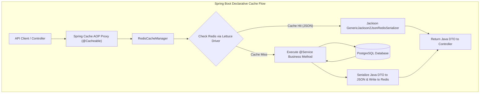
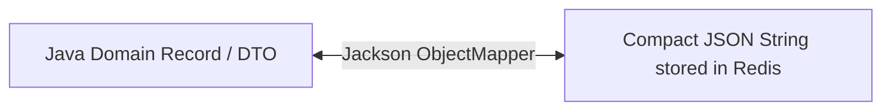
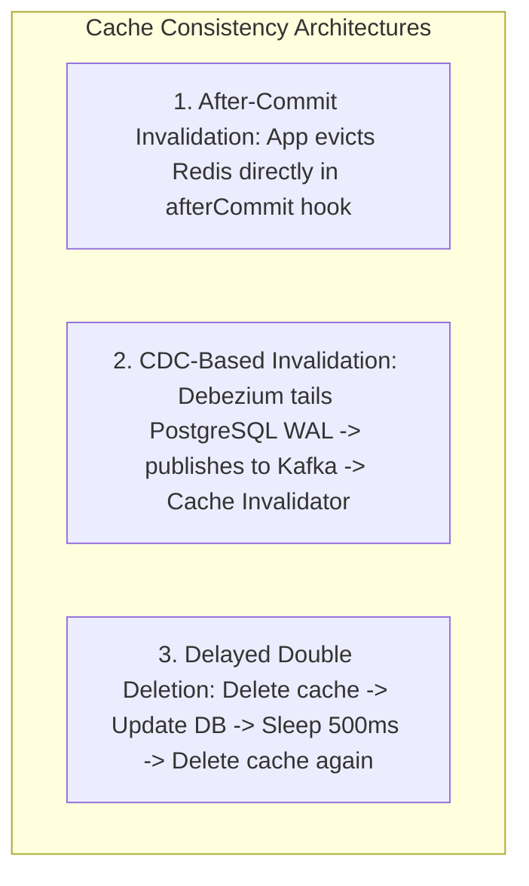

# Spring Boot Redis Integration, Serialization, and Cache Consistency

---

## 1. What Is It?
The **Spring Cache Abstraction** (`org.springframework.cache`) provides declarative, annotation-driven caching (`@Cacheable`, `@CachePut`, `@CacheEvict`) that decouples application business logic from underlying cache storage engines (Redis, Caffeine, Ehcache). 

**Cache Consistency** is the operational guarantee that data retrieved from the distributed cache layer reflects the authoritative state stored in the persistent relational database.

---

## 2. Why Does It Exist?
Integrating caching into enterprise Java applications without a unified abstraction produces thousands of lines of repetitive boilerplate:
```java
// BOILERPLATE ANTI-PATTERN: Manual cache lookup across every service
Product p = redisTemplate.opsForValue().get("product:" + id);
if (p == null) {
    p = db.findById(id);
    redisTemplate.opsForValue().set("product:" + id, p);
}
return p;
```
Spring Cache reduces this to a single declarative `@Cacheable("products")` annotation. 

However, improper Spring Cache configurations introduce critical production bugs:
- **JDK Default Serialization Bloat & Security CVEs** (using Java native `Serializable` instead of JSON).
- **Cache Desynchronization** (evicting cache before database transactions commit).
- **Polymorphic Deserialization Vulnerabilities** in Jackson.

---

## 3. Mental Model



---

## 4. How Does It Work?

### The Core Spring Cache Annotations

| Annotation | Execution Behavior | Typical Use Case |
|---|---|---|
| **`@Cacheable`** | Checks cache first; if hit, skips method execution. If miss, executes method and caches return value. | Read APIs (`findById()`, `getUserProfile()`) |
| **`@CachePut`** | **Always executes** the method and updates the cache with the returned result. | Update APIs where updated object is returned |
| **`@CacheEvict`** | Removes one or more entries from the cache upon method completion. | Delete APIs, status changes, order mutations |
| **`@Caching`** | Groups multiple caching operations together on a single method. | Complex updates requiring multi-key invalidations |

---

## 5. Production Serialization Architecture

By default, Spring Data Redis uses `JdkSerializationRedisSerializer`, which:
1. Generates huge binary payloads ($5\times$ larger than JSON).
2. Is strictly unreadable in `redis-cli` (`\xac\xed\x00\x05sr\x00...`).
3. Breaks when class versions change (`InvalidClassException: serialVersionUID`).
4. Is vulnerable to Remote Code Execution (RCE) Java deserialization exploits.

### Production Solution: Fast, Safe JSON Serialization via Jackson
Configure `GenericJackson2JsonRedisSerializer` with typed polymorphic type validators.



---

## 6. Implementation: Production Spring Boot Redis Configuration

```java
package com.backend.engineering.caching.config;

import com.fasterxml.jackson.annotation.JsonTypeInfo;
import com.fasterxml.jackson.databind.ObjectMapper;
import com.fasterxml.jackson.databind.jsontype.impl.LaissezFaireSubTypeValidator;
import org.springframework.cache.annotation.EnableCaching;
import org.springframework.context.annotation.Bean;
import org.springframework.context.annotation.Configuration;
import org.springframework.data.redis.cache.RedisCacheConfiguration;
import org.springframework.data.redis.cache.RedisCacheManager;
import org.springframework.data.redis.connection.RedisConnectionFactory;
import org.springframework.data.redis.serializer.GenericJackson2JsonRedisSerializer;
import org.springframework.data.redis.serializer.RedisSerializationContext;
import org.springframework.data.redis.serializer.StringRedisSerializer;

import java.time.Duration;
import java.util.HashMap;
import java.util.Map;

@Configuration
@EnableCaching
public class RedisCacheConfig {

    @Bean
    public RedisCacheManager cacheManager(RedisConnectionFactory connectionFactory) {
        // Configure Jackson ObjectMapper for secure JSON serialization
        ObjectMapper mapper = new ObjectMapper();
        mapper.activateDefaultTyping(
            LaissezFaireSubTypeValidator.instance,
            ObjectMapper.DefaultTyping.NON_FINAL,
            JsonTypeInfo.As.PROPERTY
        );

        GenericJackson2JsonRedisSerializer serializer = new GenericJackson2JsonRedisSerializer(mapper);

        // Default Cache Configuration
        RedisCacheConfiguration defaultCacheConfig = RedisCacheConfiguration.defaultCacheConfig()
                .entryTtl(Duration.ofMinutes(30)) // Default 30 min TTL
                .disableCachingNullValues() // Prevents storing plain nulls
                .serializeKeysWith(RedisSerializationContext.SerializationPair.fromSerializer(new StringRedisSerializer()))
                .serializeValuesWith(RedisSerializationContext.SerializationPair.fromSerializer(serializer));

        // Custom TTL configurations per cache name
        Map<String, RedisCacheConfiguration> customConfigs = new HashMap<>();
        customConfigs.put("users", defaultCacheConfig.entryTtl(Duration.ofHours(1)));
        customConfigs.put("leaderboard", defaultCacheConfig.entryTtl(Duration.ofMinutes(5)));
        customConfigs.put("product_catalog", defaultCacheConfig.entryTtl(Duration.ofDays(1)));

        return RedisCacheManager.builder(connectionFactory)
                .cacheDefaults(defaultCacheConfig)
                .withInitialCacheConfigurations(customConfigs)
                .build();
    }
}
```

---

## 7. Implementation: Declarative Service with After-Commit Cache Eviction

```java
package com.backend.engineering.caching.service;

import org.slf4j.Logger;
import org.slf4j.LoggerFactory;
import org.springframework.cache.annotation.CacheEvict;
import org.springframework.cache.annotation.Cacheable;
import org.springframework.stereotype.Service;
import org.springframework.transaction.annotation.Transactional;
import org.springframework.transaction.support.TransactionSynchronization;
import org.springframework.transaction.support.TransactionSynchronizationManager;

@Service
public class ProductService {

    private static final Logger log = LoggerFactory.getLogger(ProductService.class);
    private final ProductRepository productRepository;
    private final CacheEvictionPublisher evictionPublisher;

    public ProductService(ProductRepository productRepository, CacheEvictionPublisher evictionPublisher) {
        this.productRepository = productRepository;
        this.evictionPublisher = evictionPublisher;
    }

    // 1. Declarative Cache Read
    @Cacheable(value = "product_catalog", key = "#productId", unless = "#result == null")
    public ProductDto getProductById(Long productId) {
        log.info("Cache miss for product: {}. Fetching from Database...", productId);
        return productRepository.findById(productId)
                .map(ProductDto::fromEntity)
                .orElse(null);
    }

    // 2. Transactional Write with Safe After-Commit Invalidation
    @Transactional
    public void updateProductPrice(Long productId, int newPriceCents) {
        // Update Persistent Database
        productRepository.updatePrice(productId, newPriceCents);

        // GUARANTEE CACHE CONSISTENCY: Evict cache ONLY after database transaction commits!
        if (TransactionSynchronizationManager.isSynchronizationActive()) {
            TransactionSynchronizationManager.registerSynchronization(new TransactionSynchronization() {
                @Override
                public void afterCommit() {
                    evictionPublisher.evictProductCache(productId);
                    log.info("Cache successfully evicted for product: {} after DB commit.", productId);
                }
            });
        }
    }
}
```

---

## 8. 3 Architectures for Global Cache Consistency



### 1. After-Commit Hook (Standard for 90% of Applications)
- Application updates database.
- Upon database transaction commit, Spring `afterCommit` hook executes `DEL cacheKey`.

---

### 2. CDC-Based Cache Invalidation via Debezium & Kafka (Zero Dual-Write Race)
- The application updates **only the database** (`UPDATE products ...`).
- **Debezium** captures the committed row mutation directly from the PostgreSQL Write-Ahead Log (WAL).
- Debezium publishes an invalidation event to a Kafka topic.
- A dedicated **Cache Invalidator Service** consumes the event and deletes the key from Redis.
- **Advantage**: 100% decoupled; impossible for application crashes to leave orphaned stale cache data.

---

### 3. Delayed Double Deletion (For Legacy Multi-Reader Systems)
1. `DEL key` (First deletion).
2. Update Database.
3. `Thread.sleep(500)` (Wait for concurrent read transactions to complete).
4. `DEL key` (Second deletion).

---

## 9. Performance

| Method | Read Latency (Cache Hit) | Invalidation Overhead | Consistency Guarantee |
|---|---|---|---|
| Standard `@Cacheable` (Redis) | $\mathbf{0.4 - 1.2\text{ms}}$ | Zero | High |
| After-Commit Invalidation | $\mathbf{0.4 - 1.2\text{ms}}$ | Negligible ($< 1\text{ms}$ in hook) | **Strong (Zero uncommitted read leaks)** |
| CDC Invalidation (Debezium) | $\mathbf{0.4 - 1.2\text{ms}}$ | Zero on app write path | **Eventual ($< 20\text{ms}$ lag)** |

---

## 10. Failure Scenarios

1. **ClassCastException on Spring Boot Hot Reloads / Deploys**:
   - *Failure*: Storing Java class metadata in JSON (`@class: com.dto.ProductDto`). When a new application version refactors the package or changes fields, reading existing Redis keys throws `ClassCastException` or `JsonMappingException`, crashing the endpoint.
   - *Mitigation*: Avoid storing explicit `@class` strings in JSON where possible; configure Jackson to ignore unknown properties (`DeserializationFeature.FAIL_ON_UNKNOWN_PROPERTIES = false`).

---

## 11. Observability

- **Metrics**:
  - `cache_gets_total{cache="product_catalog", result="hit"}`
  - `cache_gets_total{cache="product_catalog", result="miss"}`
  - `cache_evictions_total{cache="product_catalog"}`

---

## 12. Scaling

### Key Prefix Namespacing
Configure explicit cache prefixes (`usePrefix()`) in `RedisCacheConfiguration` to namespace keys cleanly in multi-tenant or multi-service clusters:
```text
product_catalog::101
users::42
```

---

## 13. Trade-offs

| Invalidation Approach | Strengths | Drawbacks |
|---|---|---|
| **Spring `@CacheEvict`** | Simple; zero external dependencies | If method fails after eviction, cache is invalidated unnecessarily |
| **After-Commit Hook** | Guarantees cache is evicted only on success | Requires explicit programmatic hook registration |
| **CDC (Debezium + Kafka)** | True single source of truth; zero dual-write bugs | Requires running Kafka Connect and Debezium infrastructure |

---

## 14. When to Use
- Standard Spring Boot microservices interacting with Redis clusters.
- High-throughput read APIs benefiting from declarative method-level caching.

---

## 15. When NOT to Use
- Complex caching logic requiring dynamic runtime key generation based on external header flags or geo-IP routing (use manual programmatic `RedisTemplate`).

---

## 16. Interview Questions

### Q1: Why does using default JDK serialization with Redis in Spring Boot represent both a performance issue and a security vulnerability?
<details>
<summary>Reveal Answer</summary>

**Answer**:
1. **Performance & Space**: Java's standard `Serializable` writes full Java class metadata, package hierarchies, and JVM bytecode signatures along with the data. A simple 20-byte string object balloon to $> 300\text{ bytes}$ of binary payload, causing massive memory bloat in Redis and inflating network serialization latency.
2. **Security Vulnerability (RCE Exploits)**: Standard Java deserialization (`ObjectInputStream.readObject()`) is inherently insecure. If an attacker can inject or manipulate bytes in Redis, they can execute **Gadget Chain Deserialization Attacks** (e.g. using Apache Commons Collections or Spring gadget chains) to achieve full **Remote Code Execution (RCE)** inside the application JVM.
Using compact, safe JSON serialization (Jackson) eliminates the security vulnerability and reduces memory consumption by $> 75\%$.
</details>

### Q2: What is the "Delayed Double Deletion" strategy in cache consistency, and what problem does it solve?
<details>
<summary>Reveal Answer</summary>

**Answer**:
**Delayed Double Deletion** solves a subtle race condition in Cache-Aside architectures with read replicas:
1. Thread A updates the primary database and deletes the cache.
2. Thread B reads, encounters a cache miss, and queries an asynchronous **Read Replica** that is currently lagging by $100\text{ms}$.
3. Thread B reads the **old stale data** from the replica and repopulates the Redis cache.
4. **Delayed Double Deletion** fixes this: Thread A sleeps for a short period ($500\text{ms}$ — enough time for replication lag to settle and concurrent reads to finish) and issues a **second `DEL cacheKey` command**, clearing any stale cache entries written by Thread B.
</details>

---

## 17. Practical Exercise
1. Configure a Spring Boot application with `GenericJackson2JsonRedisSerializer` and custom TTLs.
2. Annotate service methods with `@Cacheable` and verify via `redis-cli` that values are stored as clean JSON strings.
3. Test an `updateProduct` method with `afterCommit` cache eviction and verify that cache invalidation triggers only when the transaction succeeds.

---

## 18. Quick Revision
- **Spring Annotations**: `@Cacheable` (read), `@CachePut` (update), `@CacheEvict` (delete).
- **Serialization Standard**: Always use `GenericJackson2JsonRedisSerializer`; avoid default JDK serialization.
- **After-Commit Invalidation**: Evict cache in `afterCommit` hooks to prevent stale repopulation from uncommitted reads.
- **CDC Invalidation**: Debezium tails WAL to stream invalidations over Kafka with zero dual-write race bugs.
- **Null Caching**: Configure `.disableCachingNullValues()` to prevent storing empty records.
