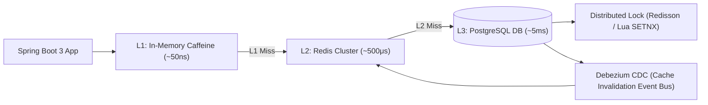

# Module 10: Caching & Redis Mechanics

Master high-performance caching architectures: cache-aside, write-through, multi-tier caching (L1 Caffeine + L2 Redis), Redis single-threaded internals, data structures (SDS, Skiplists, Listpacks), eviction algorithms (LRU, LFU, W-TinyLFU), cache pathologies (Penetration, Avalanche, Stampede), Lua scripting, Redlock distributed locking with Redisson, and Spring Boot cache consistency.

---

## 🗺️ Module Architecture & Data Flow

---

## 📚 Curriculum Lessons

| # | Lesson | Core Focus & Mechanics |
|:---:|---|---|
| **01** | [`01-caching-patterns-and-read-write-strategies.md`](./01-caching-patterns-and-read-write-strategies.md) | Cache-Aside, Read-Through, Write-Through, Write-Back, Multi-Tiered (L1 Caffeine + L2 Redis), and why "Update DB then Delete Cache" prevents stale write races. |
| **02** | [`02-cache-eviction-algorithms-lru-lfu-and-memory-limits.md`](./02-cache-eviction-algorithms-lru-lfu-and-memory-limits.md) | LRU, LFU, W-TinyLFU, Redis 8 `maxmemory-policy` settings, Approximated LRU sampling, and online memory defragmentation (`activedefrag`). |
| **03** | [`03-redis-data-structures-and-internal-encoding.md`](./03-redis-data-structures-and-internal-encoding.md) | Single-threaded event loop (`epoll`), I/O threads in Redis 6+, SDS (`embstr`/`raw`), Hashes (`listpack`/`hashtable`), and Sorted Sets (`skiplist` + `dict`). |
| **04** | [`04-cache-pathologies-penetration-avalanche-and-stampede.md`](./04-cache-pathologies-penetration-avalanche-and-stampede.md) | The 4 pathologies: Cache Penetration (Bloom Filters / Null Caching), Breakdown / Stampede (`SETNX` mutex / XFetch), Avalanche (TTL Jitter), and Hot Key Sharding. |
| **05** | [`05-redis-lua-scripting-and-distributed-locks.md`](./05-redis-lua-scripting-and-distributed-locks.md) | Atomic Lua execution (`EVAL`), `SET NX PX`, safe release scripts, multi-master Redlock, and Redisson Watchdog background lock renewal. |
| **06** | [`06-spring-boot-redis-caching-and-cache-consistency.md`](./06-spring-boot-redis-caching-and-cache-consistency.md) | Spring `@Cacheable`, `@CachePut`, `@CacheEvict`, Jackson JSON serialization, `afterCommit` invalidation hooks, and CDC-based cache invalidation. |

---

## ⚡ Key Production Takeaways

1. **Delete, Don't Update**: Always delete cache entries on database updates to prevent concurrent write races.
2. **After-Commit Invalidation**: Always evict cache in `afterCommit` hooks to prevent readers from caching uncommitted database states.
3. **Always Add TTL Jitter**: Apply randomized TTL jitter ($Base \pm 10\%$) to every write to prevent Cache Avalanches.
4. **Stampede Defense**: Use distributed mutexes (`SETNX`) or Singleflight loaders on hot keys to prevent hundreds of threads from hammering the database on cache miss.
5. **Watchdog Locking**: Use Redisson Watchdog for distributed locks to ensure locks never expire prematurely during long-running tasks.
