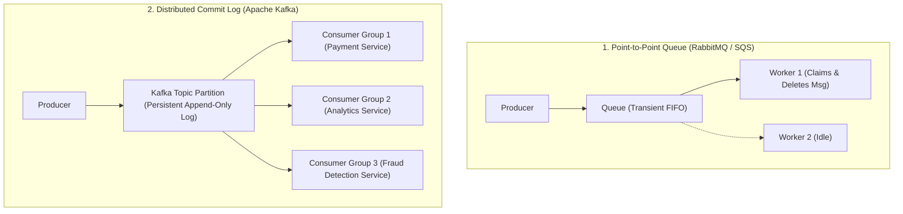
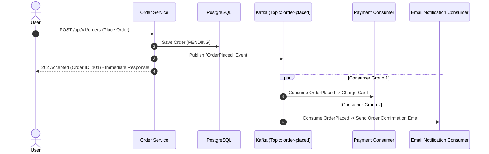

# Messaging Fundamentals: Point-to-Point Queues vs Distributed Pub/Sub

---

## 1. What Is It?
**Asynchronous Messaging** is an architectural paradigm where distributed services communicate by exchanging discrete message envelopes across an intermediary broker without requiring immediate synchronous response coordination. 

The two dominant messaging archetypes are:
1. **Message Queues (Point-to-Point)**: Messages are consumed and deleted by exactly **one** consumer (e.g. AWS SQS, RabbitMQ).
2. **Publish-Subscribe / Distributed Commit Logs (Pub/Sub)**: Messages are broadcast to a topic and can be read independently by **multiple distinct consumer groups** with persistent message retention (e.g. Apache Kafka, AWS SNS/Kinesis).

---

## 2. Why Does It Exist?
Synchronous HTTP/gRPC architectures introduce severe architectural vulnerabilities:
- **Temporal Coupling**: Service A cannot complete its request unless downstream Services B, C, and D are healthy, reachable, and responsive at that exact millisecond.
- **Cascading Latency**: Total request latency equals the sum of all downstream latencies ($L_{total} = L_A + L_B + L_C$).
- **Traffic Spike Disruption**: A sudden $10\times$ traffic surge propagates directly to all backend databases and downstream services simultaneously.

Asynchronous messaging decouples producers from consumers in **time, space, and scale**, providing built-in **buffer queues for traffic absorption (load leveling)**.

---

## 3. Mental Model



---

## 4. How Does It Work?

### Point-to-Point Queues vs Distributed Logs Comparison

| Architectural Dimension | Message Queues (RabbitMQ / AWS SQS) | Distributed Commit Log (Apache Kafka) |
|---|---|---|
| **Data Storage Model** | Transient: Messages are **deleted immediately** once acknowledged by a consumer | Persistent: Append-only disk log; messages retained for days/weeks regardless of consumption |
| **Consumer Scaling** | Competing consumers on a single queue | Partition-based consumer group parallelism |
| **Message Replay** | ❌ **Impossible** (Data is destroyed upon ACK) | ✅ **Trivial** (Consumers can reset offsets and replay historical events) |
| **Throughput Capacity** | Moderate ($10,000 - 50,000\text{ msg/sec}$) | Massive ($\mathbf{> 1,000,000\text{ msg/sec}}$ per cluster) |
| **Flow Model** | Broker pushes messages to consumers (Push) | Consumers poll messages from partitions (Pull) |

---

## 5. Push vs Pull Models & Backpressure

```mermaid
flowchart TD
    subgraph PushModel["Push Model (RabbitMQ / Webhooks)"]
        BrokerPush["Broker"] -->|Pushes messages aggressively| FastConsumer["Consumer"]
        Note over BrokerPush,FastConsumer: Vulnerable to Buffer Overrun / OOM if Consumer slows down!
    end

    subgraph PullModel["Pull Model (Apache Kafka / SQS)"]
        ConsumerPull["Consumer"] -->|Polls when ready (poll(Duration))| BrokerPull["Kafka Broker"]
        Note over ConsumerPull,BrokerPull: Built-in Backpressure! Consumer controls its own intake velocity.
    end
```

- **Push Model Hazards**: If a consumer experiences a slow database or GC pause, the broker continues pushing messages, overflowing socket buffers and exhausting application memory.
- **Pull Model Protection**: The consumer pulls only the exact number of records it has capacity to process (`max.poll.records = 500`), naturally throttling intake during downstream slowdowns (**Built-in Backpressure**).

---

## 6. Example: Async Checkout Pipeline



---

## 7. Implementation: Simple Queue vs Topic Publisher

```java
package com.backend.engineering.messaging.publisher;

import org.springframework.kafka.core.KafkaTemplate;
import org.springframework.stereotype.Service;

import java.time.Instant;
import java.util.UUID;

@Service
public class OrderEventPublisher {

    private final KafkaTemplate<String, OrderEvent> kafkaTemplate;
    private static final String ORDER_TOPIC = "orders.v1";

    public record OrderEvent(String eventId, Long orderId, Long userId, int amountCents, Instant timestamp) {}

    public OrderEventPublisher(KafkaTemplate<String, OrderEvent> kafkaTemplate) {
        this.kafkaTemplate = kafkaTemplate;
    }

    public void publishOrderPlaced(Long orderId, Long userId, int amountCents) {
        OrderEvent event = new OrderEvent(
            UUID.randomUUID().toString(), orderId, userId, amountCents, Instant.now()
        );

        // Partition Key: userId ensures all orders for a user route to the SAME partition!
        String partitionKey = userId.toString();

        kafkaTemplate.send(ORDER_TOPIC, partitionKey, event)
            .whenComplete((result, ex) -> {
                if (ex != null) {
                    // Log error and handle retry / fallback
                    System.err.println("Failed to publish order event: " + ex.getMessage());
                } else {
                    System.out.println("Published to partition: " + result.getRecordMetadata().partition()
                            + ", offset: " + result.getRecordMetadata().offset());
                }
            });
    }
}
```

---

## 8. Performance

| Communication Archetype | Direct Latency | Throughput Limit | Fault Isolation |
|---|---|---|---|
| **Synchronous REST / gRPC** | Instant ($2 - 10\text{ms}$) | Limited by slowest downstream service | Poor (Failures cascade) |
| **Point-to-Point Queue (SQS)** | Async ($10 - 50\text{ms}$) | Medium ($10\text{k - }50\text{k req/s}$) | High |
| **Distributed Commit Log (Kafka)** | Async ($< 5\text{ms}$ write) | **Ultra-High ($> 1\text{M msg/s}$)** | **Maximum** |

---

## 9. Failure Scenarios

1. **Slow Consumer Bottleneck in Push Queues**:
   - *Failure*: RabbitMQ pushes 50,000 messages to a worker instance that has a database lock contention. The worker runs out of heap memory and crashes with `java.lang.OutOfMemoryError`.
   - *Mitigation*: Configure `basic.qos(prefetchCount = 100)` to limit the unacknowledged message buffer on push queues.

2. **Consumer Group Rebalance Freezes**:
   - *Failure*: A consumer processing heavy batches takes longer than `max.poll.interval.ms` (default: 5 minutes) to complete its processing. Kafka coordinator assumes the consumer died and triggers a full group rebalance, halting message consumption across all partitions.
   - *Mitigation*: Lower `max.poll.records` or offload heavy processing to an asynchronous worker thread pool.

---

## 10. Observability

- **Metrics**:
  - `kafka_consumergroup_lag`: Total number of unconsumed messages waiting in the topic.
  - `sqs_approximate_number_of_messages_visible`: Queue depth in AWS SQS.

---

## 11. Debugging

### Inspecting Consumer Lag via CLI
```bash
# Check lag across all partitions for a specific consumer group
kafka-consumer-groups.sh --bootstrap-server localhost:9092 \
  --describe --group payment-service-group
```
- **Key Columns**:
  - `LOG-END-OFFSET`: Highest offset written by producers.
  - `CURRENT-OFFSET`: Latest offset processed by consumer.
  - `LAG`: Difference (`LOG-END-OFFSET - CURRENT-OFFSET`).

---

## 12. Scaling

1. **Horizontal Consumer Scaling via Partitions**:
   - In Kafka, the maximum number of active consumers in a single consumer group is **strictly bounded by the number of partitions** in the topic.
   - If a topic has 12 partitions, you can run up to 12 parallel consumer instances. Running a 13th instance results in an idle consumer.

---

## 13. Trade-offs

| Strategy | Advantages | Drawbacks |
|---|---|---|
| **Point-to-Point Queue** | Simple per-message acknowledgments; auto-deletion | Cannot broadcast to multiple services; no replay |
| **Kafka Commit Log** | Massive throughput; multi-consumer pub/sub; full replay | Complex rebalancing; requires partition key planning |

---

## 14. When to Use
- **Point-to-Point (SQS/RabbitMQ)**: Background job processing, email delivery, PDF invoice rendering, video transcoding tasks.
- **Distributed Log (Kafka)**: High-throughput event streaming, event-driven microservices, CDC data pipelines, clickstream tracking, audit ledgers.

---

## 15. When NOT to Use
- Interactive, synchronous client requests where the user is actively waiting on an immediate return value (e.g. validating a password or fetching a user's address during checkout).

---

## 16. Interview Questions

### Q1: What is the fundamental architectural difference between RabbitMQ and Apache Kafka?
<details>
<summary>Reveal Answer</summary>

**Answer**:
1. **Storage & Lifecycle**:
   - **RabbitMQ** is a traditional message broker. Messages are transient and held in memory/disk queues only until a consumer acknowledges them, after which they are **permanently deleted**.
   - **Kafka** is a **distributed immutable commit log**. Messages are written sequentially to append-only disk segments and **retained for configured time/size limits** (e.g. 7 days) regardless of whether they have been read.
2. **Consumption Paradigm**:
   - RabbitMQ **pushes** messages to consumers and tracks state per message.
   - Kafka uses a **pull-based** model where consumers maintain their own position (**Offset**) in the log, enabling independent consumption speeds, zero broker-side per-message state tracking, and arbitrary historical message replay.
</details>

### Q2: Why does Kafka's pull-based consumer model provide superior backpressure handling compared to push-based brokers?
<details>
<summary>Reveal Answer</summary>

**Answer**:
In a push-based model, the broker controls the transmission rate. If the consumer slows down due to database latency, GC pauses, or CPU spikes, the incoming message stream will overflow consumer buffers and cause `OutOfMemoryError` unless complex flow control protocols are negotiated.
In Kafka's pull-based model, **the consumer dictates the intake rate**. The consumer calls `poll(timeout)` only when its execution thread is completely ready to process the next batch (`max.poll.records`). If downstream processing slows down, the consumer naturally polls less frequently, automatically buffering the surge in Kafka's durable partition log without crashing application instances.
</details>

---

## 17. Practical Exercise
1. Run Apache Kafka locally using Docker Compose.
2. Create a topic with 3 partitions: `kafka-topics.sh --create --topic orders --partitions 3`.
3. Launch 2 consumers in the same consumer group and observe partition distribution.
4. Launch a 3rd and 4th consumer to observe partition rebalancing and verify that the 4th consumer remains idle.

---

## 18. Quick Revision
- **Message Queue**: Transient point-to-point delivery; messages deleted upon ACK (SQS/RabbitMQ).
- **Commit Log**: Persistent append-only topic log; multiple consumer groups with independent offsets (Kafka).
- **Pull Model**: Provides built-in backpressure by allowing consumers to control intake velocity.
- **Partition Bound**: A topic with $N$ partitions can support at most $N$ active consumers per consumer group.
- **Decoupling**: Messaging eliminates temporal coupling and absorbs traffic surges.
