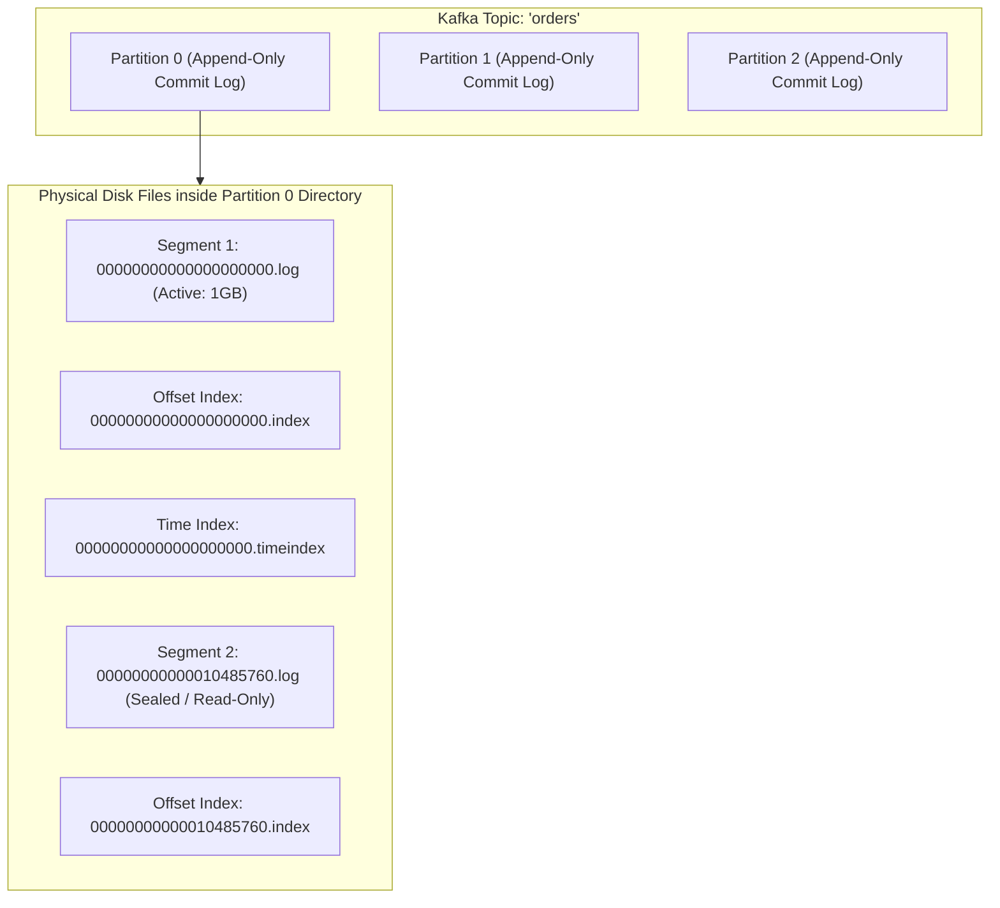
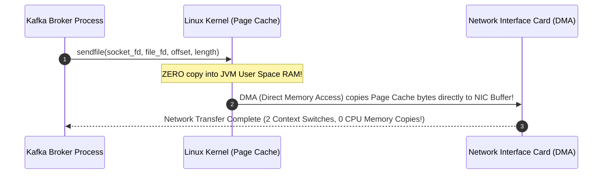

# Apache Kafka Storage Architecture, Zero-Copy Transfer, and KRaft Mode

---

## 1. What Is It?
**Apache Kafka** is a distributed event streaming platform built on a partitioned, replicated **distributed commit log**. 

Kafka achieves staggering throughput ($> 1,000,000\text{ messages/sec}$ per node) through three fundamental low-level architectural design choices:
1. **Sequential Disk I/O & OS Page Cache**
2. **Zero-Copy Network Data Transfer (`sendfile()`)**
3. **KRaft Consensus Mode** (Kafka Raft Metadata mode, eliminating Apache ZooKeeper).

---

## 2. Why Does It Exist?
Traditional message brokers store messages in complex tree structures (B-Trees / heaps) with individual message acknowledgment indexing. When message backlogs grow to millions of records, random disk I/O degrades throughput exponentially.

Kafka treats disk storage as an **immutable, append-only sequential log**. Because sequential disk access on modern NVMe and HDD storage rivals RAM speeds ($> 600\text{MB/sec}$ sequential throughput), Kafka's performance remains **strictly $O(1)$ constant time**, completely independent of whether the queue contains 100 messages or 100,000,000 messages.

---

## 3. Mental Model: Storage Hierarchy



---

## 4. How Does It Work?

### 1. Partition Segment & Sparse Index Architecture
Each partition is split into multiple on-disk **Segments** (default: $1\text{GB}$ per segment configured via `segment.bytes`):
- **`.log` File**: The raw binary serialized message records stored sequentially.
- **`.index` File (Sparse Offset Index)**: Maps logical message **Offsets** to physical byte positions within the `.log` file.
  - Unlike a dense index, Kafka's index is **Sparse**: it stores an index entry only every $4\text{KB}$ of log data (`index.interval.bytes`).
  - To locate Offset 10,500, Kafka binary-searches the small in-memory sparse index to find the nearest base offset (e.g. 10,400 at byte 81,920) and scans forward sequentially through the `.log` file for the remaining 100 messages.
- **`.timeindex` File**: Maps message timestamps to logical offsets for time-based lookups and retention cleanup.

---

### 2. Zero-Copy Network Transfer (`sendfile()` System Call)

In traditional web applications, reading a file from disk and sending it over a network socket requires **4 user-kernel context switches and 4 data copies**:

```text
Traditional File Transfer (4 Copies):
Disk -> OS Kernel Buffer -> JVM Heap Memory -> Socket Buffer -> NIC Buffer (Network)
```

Kafka uses the Linux **`sendfile()` system call** (**Zero-Copy**):



- Data is transferred directly from the **Linux OS Page Cache to the Network Interface Card (NIC)** via Direct Memory Access (DMA).
- **Result**: CPU utilization drops by $90\%$, eliminating JVM garbage collection overhead on message transfers.

---

## 5. KRaft Mode: Kafka Raft Metadata Consensus (KIP-500)

Historically, Kafka relied on an external **Apache ZooKeeper** cluster to store cluster metadata, partition state, topic definitions, and controller election state.

```mermaid
flowchart TD
    subgraph LegacyZooKeeper["Legacy ZooKeeper Architecture (Deprecated)"]
        ZK["ZooKeeper Quorum (External Cluster)"] <--> ControllerBroker["Controller Broker Node"]
        ControllerBroker --> B1["Broker 1"]
        ControllerBroker --> B2["Broker 2"]
        Note over ZK,ControllerBroker: Dual-system complexity; slow metadata updates on cluster restart
    end

    subgraph ModernKRaft["Modern KRaft Architecture (Native Kafka Raft)"]
        subgraph KRaftQuorum["KRaft Quorum Controllers (Built-in)"]
            C1["Controller Node 1 (Leader)"]
            C2["Controller Node 2 (Follower)"]
            C3["Controller Node 3 (Follower)"]
        end
        MetaTopic["@metadata Topic (Internal Replicated Log)"]
        KRaftQuorum <--> MetaTopic
        KRaftQuorum --> BK1["Broker Node 1"]
        KRaftQuorum --> BK2["Broker Node 2"]
    end
```

### Why KRaft Revolutionized Kafka
1. **Instantaneous Failover**: ZooKeeper metadata had to be loaded into the active controller on startup, taking minutes for clusters with 1,000,000 partitions. KRaft maintains an active in-memory replicated `@metadata` partition on all controller nodes, enabling **sub-second controller failover**.
2. **Simplified Operations**: Eliminates the operational nightmare of managing, sizing, securing, and monitoring two separate distributed systems (ZooKeeper + Kafka).
3. **Massive Partition Scalability**: Supports millions of partitions per cluster (ZooKeeper hit scaling limits around $200,000$ partitions).

---

## 6. Example: Kafka Cluster Configuration (KRaft Mode)

### `server.properties` (KRaft Combined Node)
```properties
# Node Roles: broker, controller, or both
process.roles=broker,controller
node.id=1
controller.quorum.voters=1@kafka1:9093,2@kafka2:9093,3@kafka3:9093

# Listeners
listeners=PLAINTEXT://kafka1:9092,CONTROLLER://kafka1:9093
inter.broker.listener.name=PLAINTEXT
controller.listener.names=CONTROLLER

# Storage directories
log.dirs=/var/lib/kafka/data

# Retention policies
log.retention.hours=168 # 7 days
log.segment.bytes=1073741824 # 1GB per segment
log.cleanup.policy=delete
```

---

## 7. Implementation: Inspecting On-Disk Log Segments with `DumpLogSegments`

```bash
# Dump the internal binary contents of a Kafka .log segment
kafka-run-class.sh kafka.tools.DumpLogSegments \
  --files /var/lib/kafka/data/orders-0/00000000000000000000.log \
  --print-data-log \
  --deep-iteration
```
- Outputs exact record batch headers, base offsets, payload sizes, sequence numbers, producer IDs (`producerId`), and CRC32 checksums.

---

## 8. Performance

| Feature | Performance Benefit | Architectural Rationale |
|---|---|---|
| **Sequential I/O** | $> 600\text{MB/sec}$ write throughput | Avoids random disk head movement or SSD block erase cycles |
| **OS Page Cache** | Sub-microsecond read lookups | Bypasses JVM Garbage Collection entirely |
| **Zero-Copy (`sendfile`)** | Reduces CPU overhead by $90\%$ | Direct kernel-to-NIC DMA memory transfers |
| **KRaft Metadata** | Sub-second cluster failover | Event-driven Raft consensus log replacing ZooKeeper |

---

## 9. Failure Scenarios

1. **Broker Memory Starvation via Oversized JVM Heap**:
   - *Failure*: An engineer allocates a $64\text{GB}$ JVM heap to a Kafka broker on a $128\text{GB}$ server. Large JVM garbage collection sweeps cause STW pauses, while starving the **Linux OS Page Cache** of RAM. Read throughput collapses because the kernel cannot cache disk pages.
   - *Mitigation*: **Set Kafka broker JVM heap to only $6 - 8\text{GB}$** (`-Xms6g -Xmx6g`). Allow the remaining $> 90\%$ of physical RAM to be used entirely by the Linux OS Page Cache for Zero-Copy buffers.

2. **Disk Full via Compaction Hang**:
   - *Failure*: In compacted topics (`cleanup.policy = compact`), if `min.cleanable.dirty.ratio` is misconfigured or segment size is too large, the cleaner thread cannot reclaim disk space, filling the broker partition disk to $100\%$.
   - *Mitigation*: Monitor `kafka.log:type=LogCleanerManager` and configure disk usage alerts at $80\%$ capacity.

---

## 10. Observability

- **Metrics**:
  - `kafka.server:type=BrokerTopicMetrics,name=BytesInPerSec`: Inbound network throughput.
  - `kafka.server:type=BrokerTopicMetrics,name=BytesOutPerSec`: Outbound consumer egress.
  - `kafka.network:type=RequestMetrics,name=TotalTimeMs,request=Produce`: Producer request latency.

---

## 11. Debugging

### Triage: Identifying Controller Failover and In-Sync Replica (ISR) Drops
```bash
# Inspect topic partitions and Under-Replicated Partitions (URP)
kafka-topics.sh --bootstrap-server localhost:9092 \
  --describe --under-replicated-partitions
```
- Any partition listed here indicates that a follower replica is falling behind the leader's High Watermark (due to network partition or slow disk).

---

## 12. Scaling

### Storage Tiering (Tiered Storage / KIP-405)
Modern Kafka clusters separate hot active storage from cold historical storage:
- **Local NVMe SSDs**: Retains recent partitions ($< 4\text{ hours}$) for fast consumer reads.
- **Remote Object Storage (AWS S3 / GCS)**: Automatically offloads sealed historical segments to cheap S3 storage, enabling infinite message retention without expensive broker SSD arrays.

---

## 13. Trade-offs

| Storage Option | Strengths | Drawbacks |
|---|---|---|
| **Local SSD Storage** | Ultra-fast access; sub-millisecond | Expensive to retain months of data |
| **Tiered Storage (S3)** | Low-cost infinite retention | Slightly higher latency on historical replay ($50-100\text{ms}$) |
| **KRaft Mode** | Native consensus; fast controller recovery | Newer operational paradigm compared to legacy ZK |

---

## 14. When to Use
- High-throughput distributed event streaming ($> 50,000\text{ events/sec}$).
- Building centralized company-wide event backbones and real-time CDC data pipelines.

---

## 15. When NOT to Use
- Small-scale synchronous RPC replacements.
- Simple, low-volume background task worker queues (prefer AWS SQS or Redis Streams).

---

## 16. Interview Questions

### Q1: How does Kafka achieve high write and read throughput using spinning disks (HDDs) or SSDs?
<details>
<summary>Reveal Answer</summary>

**Answer**:
Kafka achieves high throughput on disk via 3 fundamental architectural techniques:
1. **Sequential Append-Only Writes**: Disk storage engines are slow primarily during **random I/O** (disk head seeking and SSD block garbage collection). Sequential disk access on modern drives exceeds $600\text{MB/s}$. Kafka writes all partition data as sequential append-only records, achieving throughput close to physical hardware limits.
2. **OS Page Cache Utilization**: Rather than maintaining large in-memory caches inside the JVM heap (which triggers heavy Garbage Collector pauses and double-buffering), Kafka delegates all caching to the Linux Kernel **Page Cache**. All free RAM on the server acts as an automatic, lock-free memory cache.
3. **Zero-Copy Network Transfers**: Using the Linux `sendfile()` system call, Kafka transfers data directly from the OS Page Cache to the network socket buffer via DMA (Direct Memory Access), bypassing JVM user-space memory entirely and eliminating CPU memory-copy overhead.
</details>

### Q2: What was the main motivation behind removing ZooKeeper in favor of KRaft (KIP-500)?
<details>
<summary>Reveal Answer</summary>

**Answer**:
In ZooKeeper-based Kafka:
1. **Metadata Synchronization Bottleneck**: When the active Controller failed, the newly elected Controller had to synchronously load all partition and topic metadata from ZooKeeper into memory before taking over. For large clusters with hundreds of thousands of partitions, this caused multi-minute cluster freezes.
2. **Double Metadata Storage**: Metadata was stored in two separate state machines (ZooKeeper znodes and Controller RAM), leading to subtle desynchronization bugs.
3. **KRaft Mode** solves this by embedding an event-driven **Raft Quorum** directly inside Kafka:
   - Metadata is stored as a standard internal Kafka topic (`@metadata`).
   - Controller state is replicated in real-time across all controller nodes.
   - Failover to a new metadata leader takes **milliseconds** instead of minutes, allowing clusters to scale to millions of partitions.
</details>

---

## 17. Practical Exercise
1. Launch a 3-node Kafka cluster in KRaft mode using Docker Compose.
2. Publish 100,000 messages to a topic and locate the physical `.log`, `.index`, and `.timeindex` files on the host filesystem.
3. Run `DumpLogSegments` to inspect the binary headers and offset mappings.
4. Kill the active KRaft controller leader and observe the sub-second quorum leader election in the logs.

---

## 18. Quick Revision
- **Append-Only Log**: Guarantees $O(1)$ constant time write/read operations regardless of data size.
- **Sparse Index**: Maps logical offsets to physical byte offsets every 4KB.
- **Zero-Copy**: `sendfile()` moves bytes from OS Page Cache directly to NIC via DMA.
- **Small JVM Heap**: Set Kafka JVM heap to $6-8\text{GB}$; leave remaining RAM for OS Page Cache.
- **KRaft Mode**: Replaces ZooKeeper with native Raft consensus for sub-second controller failover.
