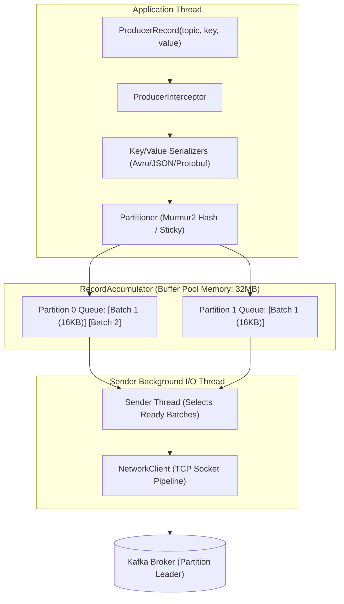
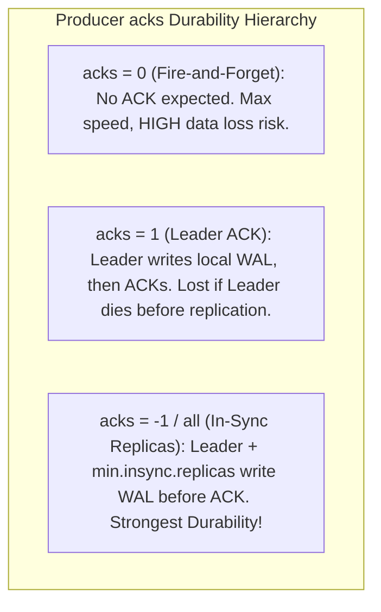
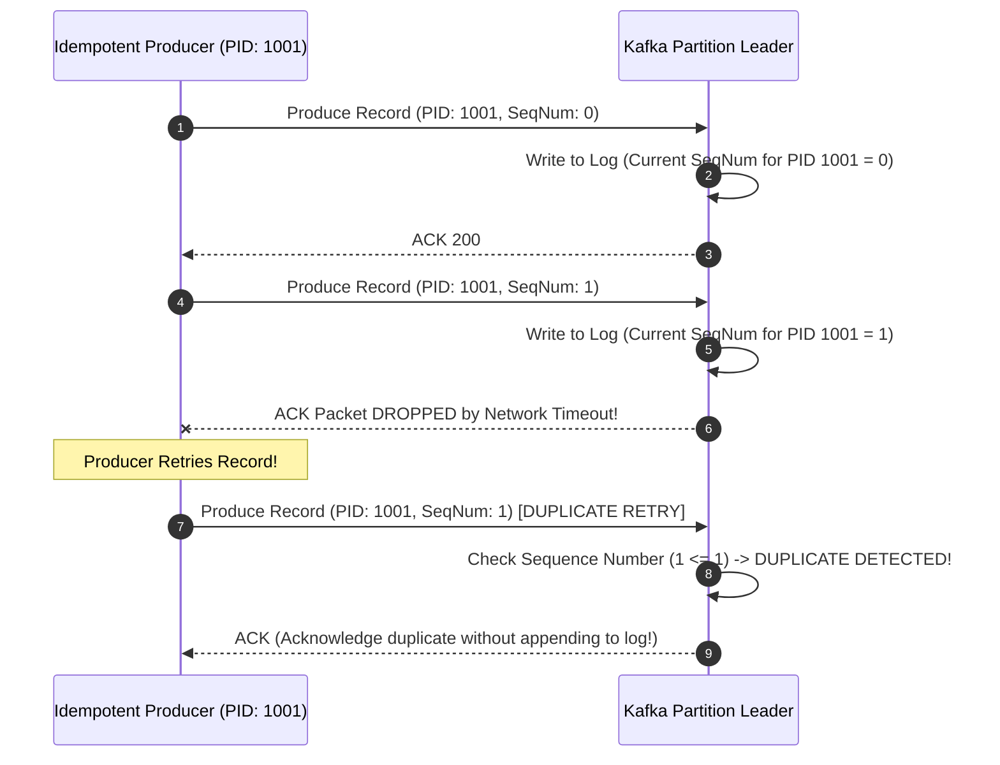

# Kafka Producers: Record Accumulator, Partitioning, and Delivery Semantics

---

## 1. What Is It?
The **Apache Kafka Producer** is the client library responsible for serializing, partitioning, compressing, batching, and transmitting records over TCP to Kafka partition leader brokers. 

It provides configurable **Delivery Semantics**:
- **At-Most-Once**: Messages may be lost, but are never duplicated (`acks=0`).
- **At-Least-Once**: Messages are never lost, but may be duplicated on network retries (`acks=all, enable.idempotence=false`).
- **Exactly-Once Semantics (EOS)**: Messages are written to partitions with zero loss and zero duplicates (`enable.idempotence=true` + Transactional Producer).

---

## 2. Why Does It Exist?
Transmitting individual records across network sockets for every `send()` call introduces massive TCP header overhead and network packet fragmentation.

The Kafka Producer buffers records in client memory inside a **`RecordAccumulator`**, coalescing thousands of messages into compressed batches per partition before sending them in single network roundtrips.

---

## 3. Mental Model: The Producer Internal Pipeline



---

## 4. How Does It Work?

### 1. Batching Mechanics: `batch.size` and `linger.ms`
The Producer buffers records in memory based on two competing parameters:
- **`batch.size`** (default: $16\text{KB}$): The maximum byte size allocated per partition batch. Once a batch fills to $16\text{KB}$, it is sent immediately.
- **`linger.ms`** (default: $0\text{ms}$ in legacy; recommended: $5 - 20\text{ms}$ in production): The maximum time the `Sender` thread waits for additional records to fill the batch before sending.
  - Setting `linger.ms = 20` introduces an artificial 20ms delay on low traffic, but **increases throughput by $500\%$** under load by allowing full 16KB batches to coalesce.

---

### 2. Partitioning Strategies
- **Keyed Records (`key != null`)**:
  $$\text{Partition} = \text{toPositive}(\text{Murmur2}(\text{Key})) \pmod{\text{NumPartitions}}$$
  - Guarantees that all events sharing the exact same key (e.g. `user_id = 101`) are routed to the **exact same partition in strict chronological order**.
- **Keyless Records (`key == null`)**:
  - Uses the **Uniform Sticky Partitioner** (Kafka 2.4+): Fills a single partition's batch completely before switching to the next partition, maximizing compression and batch density.

---

## 5. Producer Acknowledgment Modes (`acks`)



### The Production Invariant for Zero Data Loss
$$\textbf{Production Durability Invariant: } \texttt{acks = all} \quad \mathbf{\&} \quad \texttt{min.insync.replicas = 2} \quad \mathbf{\&} \quad \texttt{replication.factor} \ge 3$$

If `acks = all` and `min.insync.replicas = 2`:
- If 1 follower node drops out of the ISR (In-Sync Replicas), the leader and 1 remaining follower commit, and the producer succeeds.
- If 2 follower nodes drop out (only leader remains), the leader **rejects the producer write** with `NotEnoughReplicasException`, preventing data from being written to an un-replicated partition.

---

## 6. Idempotent Producer (`enable.idempotence = true`)

In standard networking, if a producer sends Batch 10, the broker writes it to disk, but the network ACK packet drops, the producer will **retry sending Batch 10**, resulting in duplicate records in the partition.



- When `enable.idempotence = true` (Default in Kafka 3.0+):
  - Broker assigns each producer a unique 64-bit **Producer ID (PID)**.
  - Each record batch contains a monotonically increasing **Sequence Number**.
  - Broker rejects duplicate sequence numbers, guaranteeing **zero duplicate writes on network retries**.

---

## 7. Implementation: Production-Grade Spring Boot Producer Configuration

```java
package com.backend.engineering.messaging.config;

import org.apache.kafka.clients.producer.ProducerConfig;
import org.apache.kafka.common.serialization.StringSerializer;
import org.springframework.context.annotation.Bean;
import org.springframework.context.annotation.Configuration;
import org.springframework.kafka.core.DefaultKafkaProducerFactory;
import org.springframework.kafka.core.KafkaTemplate;
import org.springframework.kafka.core.ProducerFactory;
import org.springframework.kafka.support.serializer.JsonSerializer;

import java.util.HashMap;
import java.util.Map;

@Configuration
public class KafkaProducerConfig {

    @Bean
    public ProducerFactory<String, Object> producerFactory() {
        Map<String, Object> config = new HashMap<>();
        
        // 1. Connection
        config.put(ProducerConfig.BOOTSTRAP_SERVERS_CONFIG, "localhost:9092");

        // 2. Serializers
        config.put(ProducerConfig.KEY_SERIALIZER_CLASS_CONFIG, StringSerializer.class);
        config.put(ProducerConfig.VALUE_SERIALIZER_CLASS_CONFIG, JsonSerializer.class);

        // 3. ZERO DATA LOSS DURABILITY
        config.put(ProducerConfig.ACKS_CONFIG, "all"); // acks = -1
        config.put(ProducerConfig.ENABLE_IDEMPOTENCE_CONFIG, true); // Guarantees exactly-once on retry
        config.put(ProducerConfig.RETRIES_CONFIG, Integer.MAX_VALUE); // Retry infinitely on transient errors
        config.put(ProducerConfig.MAX_IN_FLIGHT_REQUESTS_PER_CONNECTION, 5); // Safe pipelining with idempotence

        // 4. HIGH-THROUGHPUT BATCHING & COMPRESSION
        config.put(ProducerConfig.BATCH_SIZE_CONFIG, 32 * 1024); // 32KB batches
        config.put(ProducerConfig.LINGER_MS_CONFIG, 20); // 20ms linger window
        config.put(ProducerConfig.COMPRESSION_TYPE_CONFIG, "lz4"); // Fast, low CPU compression

        // 5. MEMORY BUFFER BOUNDS
        config.put(ProducerConfig.BUFFER_MEMORY_CONFIG, 64 * 1024 * 1024L); // 64MB buffer pool
        config.put(ProducerConfig.MAX_BLOCK_MS_CONFIG, 5000); // Fail fast if buffer is full

        return new DefaultKafkaProducerFactory<>(config);
    }

    @Bean
    public KafkaTemplate<String, Object> kafkaTemplate(ProducerFactory<String, Object> producerFactory) {
        return new KafkaTemplate<>(producerFactory);
    }
}
```

---

## 8. Performance

| Compression Algorithm | CPU Overhead | Compression Ratio | Producer Throughput |
|---|---|---|---|
| `none` | $0\%$ | $1.0\times$ | Network bandwidth limited |
| **`lz4` (Recommended)** | **Ultra-Low** | $\approx 2.1\times$ | **Maximum ($> 120\text{MB/sec}$)** |
| **`snappy`** | Low | $\approx 1.9\times$ | Very High |
| **`zstd`** | Moderate | $\mathbf{\approx 3.2\times}$ (Best Ratio) | High (Ideal for JSON/Text payloads) |
| `gzip` | High | $\approx 2.8\times$ | Moderate (CPU bottlenecked) |

---

## 9. Failure Scenarios

1. **`BufferExhaustedException` / Producer Thread Stalling**:
   - *Failure*: A network partition causes the `Sender` thread to block. The `RecordAccumulator` buffer memory fills to $64\text{MB}$. Incoming application worker threads calling `send()` block waiting for free buffer space up to `max.block.ms` ($60\text{s}$), freezing the entire web application.
   - *Mitigation*: Set `max.block.ms = 3000` (fail fast in 3 seconds) and reject incoming HTTP traffic with 503 instead of exhausting application worker threads.

---

## 10. Observability

- **Metrics**:
  - `kafka.producer:type=producer-metrics,name=record-queue-time-avg`: Time records sit waiting in accumulator.
  - `kafka.producer:type=producer-metrics,name=record-retry-rate`: Retries triggered by transient broker drops.
  - `kafka.producer:type=producer-metrics,name=bufferpool-wait-ratio`: Fraction of time producer threads are blocked waiting for memory.

---

## 11. Debugging

### Triage: Out-of-Order Message Investigation
- If messages for the same key arrive out of order:
  - Verify that `enable.idempotence = true` and `max.in.flight.requests.per.connection <= 5`.
  - Check if custom partitioner logic altered partition routing.

---

## 12. Scaling

### Custom Partitioner for VIP Tenant Isolation
```java
public class TenantAwarePartitioner implements Partitioner {
    @Override
    public int partition(String topic, Object key, byte[] keyBytes, Object value, byte[] valueBytes, Cluster cluster) {
        String tenantId = extractTenantId(key);
        if ("VIP_TENANT".equals(tenantId)) {
            return 0; // Dedicated high-capacity partition
        }
        // Hash all other tenants across remaining partitions (1 to N-1)
        int numPartitions = cluster.partitionsForTopic(topic).size();
        return 1 + (Math.abs(Utils.murmur2(keyBytes)) % (numPartitions - 1));
    }
}
```

---

## 13. Trade-offs

| Config | Value | Trade-off |
|---|---|---|
| `acks` | `0` vs `all` | Ultra-low latency vs Absolute durability |
| `linger.ms` | `0` vs `20ms` | Lowest point-latency vs $5\times$ higher throughput under load |
| `compression.type` | `none` vs `lz4` | Zero CPU cost vs $50\%$ network/disk reduction |

---

## 14. When to Use
- All enterprise Kafka event publishing requiring guaranteed message delivery, ordering by key, and high throughput.

---

## 15. When NOT to Use
- Do not use high `linger.ms` ($> 100\text{ms}$) on interactive real-time bidding or high-frequency gaming telemetry.

---

## 16. Interview Questions

### Q1: Why was `max.in.flight.requests.per.connection` historically required to be set to 1 to preserve ordering, and why does `enable.idempotence = true` allow setting it up to 5?
<details>
<summary>Reveal Answer</summary>

**Answer**:
Without idempotence:
If `max.in.flight.requests.per.connection = 5`, the producer pipelines 5 batches simultaneously over TCP. If Batch 1 encounters a transient network timeout while Batch 2 succeeds, the producer will retry Batch 1. Batch 1 will now be written to the log **after Batch 2**, causing **out-of-order message delivery**. Historically, setting `max.in.flight.requests.per.connection = 1` was the only way to prevent reordering on retry.
With `enable.idempotence = true`:
The broker tracks **Sequence Numbers** for each Producer ID. If the broker receives Batch 2 (SeqNum 2) before Batch 1 (SeqNum 1), the broker detects the out-of-order sequence gap and **buffers Batch 2 until Batch 1 arrives**. This allows up to 5 concurrent in-flight requests without risking out-of-order delivery!
</details>

### Q2: What happens if `acks = all` is configured but `min.insync.replicas = 1` on the broker?
<details>
<summary>Reveal Answer</summary>

**Answer**:
Configuring `acks = all` with `min.insync.replicas = 1` creates a **False Sense of Durability**:
If 2 of the 3 replicas crash or disconnect, the In-Sync Replica (ISR) pool shrinks to just the Leader node ($size = 1$).
Because `min.insync.replicas = 1`, the Leader satisfies the `acks = all` condition by writing only to its own local disk. If the Leader now crashes before the other replicas rejoin, **all recently acknowledged messages are permanently lost**.
To guarantee true multi-node durability, always set `min.insync.replicas = 2` whenever `replication.factor >= 3`.
</details>

---

## 17. Practical Exercise
1. Configure a Java Kafka Producer with `acks = all`, `enable.idempotence = true`, `linger.ms = 20`, and `compression.type = lz4`.
2. Benchmark publishing 500,000 records with and without batching (`linger.ms = 0` vs `linger.ms = 20`) and observe the throughput difference.
3. Simulate a broker crash during active produce and verify that the idempotent producer reconnects and retries with zero duplicate messages in the partition.

---

## 18. Quick Revision
- **`RecordAccumulator`**: Buffers messages in memory batches per partition.
- **Batching**: `linger.ms = 20` + `batch.size = 32KB` multiplies throughput under load.
- **Durability Trio**: `acks = all`, `min.insync.replicas = 2`, `replication.factor = 3`.
- **Idempotence**: `enable.idempotence = true` uses PIDs and Sequence Numbers to eliminate duplicates on retry.
- **Compression**: `lz4` provides the optimal balance of ultra-low CPU cost and $50\%$ bandwidth reduction.
