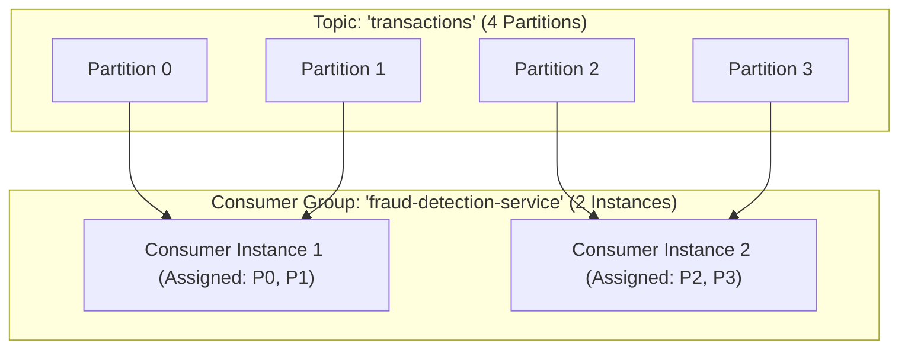
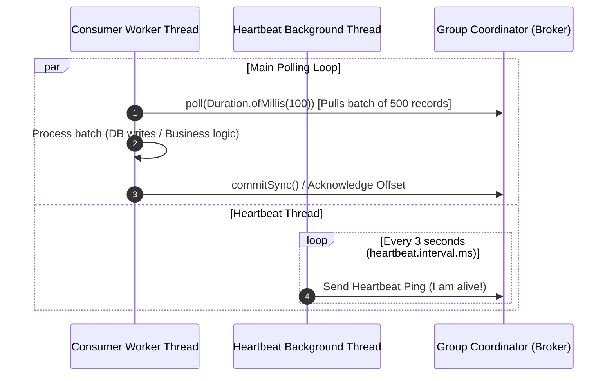

# Kafka Consumer Groups, Offset Management, and Cooperative Rebalancing

---

## 1. What Is It?
A **Kafka Consumer Group** is a cooperative pool of independent consumer instances sharing a common `group.id` that collectively divide and process all partitions of a topic in parallel.

**Offset Management** is the tracking of the consumer's current position within each partition, persisted durably in an internal compacted Kafka topic named **`__consumer_offsets`**.

---

## 2. Why Does It Exist?
If a single consumer thread had to process all 50 partitions of a high-volume topic ($500,000\text{ msg/sec}$), it would quickly fall behind, creating unbounded **Consumer Lag**.

Consumer Groups allow elastic horizontal scaling:
- Adding a new consumer instance dynamically redistributes partitions across the group.
- If a consumer crashes, remaining healthy consumers automatically claim ownership of the abandoned partitions (**Consumer Rebalance**).

---

## 3. Mental Model: Partition Distribution in Consumer Groups



---

## 4. How Does It Work?

### 1. Consumer Group Scaling Bounds
- **Partitions $\ge$ Consumers**: All consumers are actively assigned one or more partitions.
- **Partitions $<$ Consumers**: Extra consumer instances sit completely idle with **zero partition assignments**!

$$\textbf{Golden Rule: } \text{Maximum Active Consumers in a Group} = \text{Total Partitions in the Topic}$$

---

### 2. Offset Commit Modes: Auto vs Manual
- **Automatic Commit (`enable.auto.commit = true`)**:
  - Commits `CURRENT_OFFSET` automatically every $5\text{ seconds}$ (`auto.commit.interval.ms`).
  - **Fatal Flaw (Data Loss Risk)**: If the consumer polls 500 records, commits the offset at 5s, and crashes midway through processing Record 100, the remaining 400 records **will never be processed on restart!**
- **Manual Commit (`enable.auto.commit = false`)**:
  - Application explicitly commits the offset *after* the entire batch has been successfully processed and written to the database.

---

## 5. The Consumer Heartbeat & Polling Loop



### The 3 Critical Timeout Configurations
1. **`heartbeat.interval.ms`** (default: $3\text{s}$): Background thread pings Group Coordinator to prove JVM is alive.
2. **`session.timeout.ms`** (default: $45\text{s}$): Maximum time coordinator waits for heartbeats before declaring the consumer dead.
3. **`max.poll.interval.ms`** (default: $300,000\text{ms} = 5\text{ minutes}$): Maximum allowed time between successive calls to `poll()`.
   - If processing a batch takes $5\text{ minutes and } 1\text{ second}$, the coordinator assumes the main thread is hung/dead and **kicks the consumer out of the group**, triggering a rebalance!

---

## 6. Rebalancing Protocols: Eager vs Cooperative Sticky Assignor

```mermaid
flowchart TD
    subgraph EagerRebalance["1. Legacy Eager Rebalance (Stop-The-World Freeze)"]
        E1["New Consumer Joins Group"] --> E2["ALL Consumers Revoke ALL Partitions"]
        E2 --> E3["Total Consumption FREEZES across entire cluster (Stop-The-World)"]
        E3 --> E4["Partitions Reassigned from Scratch"]
    end

    subgraph CooperativeRebalance["2. Incremental Cooperative Rebalance (Kafka 2.4+)"]
        C1["New Consumer Joins Group"] --> C2["Consumers continue processing unaffected partitions!"]
        C2 --> C3["Only specific reassigned partitions are migrated smoothly"]
        C3 --> C4["ZERO Cluster-Wide Stop-The-World Pause!"]
    end
```



### The Production Standard: `CooperativeStickyAssignor`
In modern Kafka, always configure:
```properties
partition.assignment.strategy=org.apache.kafka.clients.consumer.CooperativeStickyAssignor
```
- **Zero Stop-The-World**: Unaffected partitions continue processing live records without interruption.
- **Sticky Assignment**: Preserves existing partition-to-consumer mappings where possible, avoiding unnecessary in-memory state flushes.

---

## 7. Implementation: Production Manual Commit Consumer in Java 21

```java
package com.backend.engineering.messaging.consumer;

import org.apache.kafka.clients.consumer.ConsumerConfig;
import org.apache.kafka.clients.consumer.ConsumerRecord;
import org.apache.kafka.clients.consumer.ConsumerRecords;
import org.apache.kafka.clients.consumer.KafkaConsumer;
import org.apache.kafka.clients.consumer.CooperativeStickyAssignor;
import org.apache.kafka.common.serialization.StringDeserializer;
import org.slf4j.Logger;
import org.slf4j.LoggerFactory;

import java.time.Duration;
import java.util.Collections;
import java.util.Properties;

public class ResilientManualOffsetConsumer implements Runnable {

    private static final Logger log = LoggerFactory.getLogger(ResilientManualOffsetConsumer.class);
    private volatile boolean running = true;

    @Override
    public void run() {
        Properties props = new Properties();
        props.put(ConsumerConfig.BOOTSTRAP_SERVERS_CONFIG, "localhost:9092");
        props.put(ConsumerConfig.GROUP_ID_CONFIG, "payment-processing-group");
        props.put(ConsumerConfig.KEY_DESERIALIZER_CLASS_CONFIG, StringDeserializer.class.getName());
        props.put(ConsumerConfig.VALUE_DESERIALIZER_CLASS_CONFIG, StringDeserializer.class.getName());

        // MANUAL COMMIT DISCIPLINE
        props.put(ConsumerConfig.ENABLE_AUTO_COMMIT_CONFIG, "false");
        props.put(ConsumerConfig.AUTO_OFFSET_RESET_CONFIG, "earliest");

        // COOPERATIVE STICKY REBALANCING
        props.put(ConsumerConfig.PARTITION_ASSIGNMENT_STRATEGY_CONFIG, CooperativeStickyAssignor.class.getName());

        // BATCH SIZING & TIMEOUT TUNING
        props.put(ConsumerConfig.MAX_POLL_RECORDS_CONFIG, 100); // 100 records per poll
        props.put(ConsumerConfig.MAX_POLL_INTERVAL_MS_CONFIG, 30000); // 30 seconds max processing budget
        props.put(ConsumerConfig.SESSION_TIMEOUT_MS_CONFIG, 10000); // 10s heartbeat timeout

        try (KafkaConsumer<String, String> consumer = new KafkaConsumer<>(props)) {
            consumer.subscribe(Collections.singletonList("orders.v1"));

            while (running) {
                ConsumerRecords<String, String> records = consumer.poll(Duration.ofMillis(500));

                if (records.isEmpty()) {
                    continue;
                }

                for (ConsumerRecord<String, String> record : records) {
                    processBusinessRecord(record);
                }

                // Synchronous manual commit after the entire batch succeeds!
                consumer.commitSync();
                log.info("Committed batch of {} records.", records.count());
            }
        } catch (Exception ex) {
            log.error("Fatal error in consumer polling loop: {}", ex.getMessage(), ex);
        }
    }

    private void processBusinessRecord(ConsumerRecord<String, String> record) {
        log.info("Processing order: Key={}, Offset={}, Partition={}", 
                 record.key(), record.offset(), record.partition());
    }

    public void shutdown() {
        this.running = false;
    }
}
```

---

## 8. Performance

| Rebalance Strategy | Rebalance Latency ($1,000\text{ Partitions}$) | Active Consumer Pauses | Production Recommendation |
|---|---|---|---|
| Eager Rebalance (`RangeAssignor`) | $15 - 45\text{ seconds}$ | **Total cluster-wide freeze** | Legacy (Deprecated) |
| **`CooperativeStickyAssignor`** | $\mathbf{< 1\text{ second}}$ | **Zero pause on unaffected partitions** | **Modern Production Standard** |

---

## 9. Failure Scenarios

1. **Rebalance Storms via `max.poll.interval.ms` Expiry**:
   - *Failure*: A downstream database experiences lock contention. Processing 500 polled records takes $6\text{ minutes}$. Because `max.poll.interval.ms = 300,000` (5 mins), the coordinator revokes the consumer's partitions and triggers a rebalance. Consumer 2 claims the partitions, hits the exact same slow DB, expires at 5 mins, and triggers *another* rebalance (**Infinite Rebalance Storm**).
   - *Mitigation*: Reduce `max.poll.records = 50` or increase `max.poll.interval.ms = 600000` (10 minutes).

2. **Poison Pill Infinite Retry Loop**:
   - *Failure*: A malformed message in partition 0 throws a `DeserializationException`. The consumer crashes before committing the offset. Upon restart, it polls the exact same poison pill message and crashes again in an infinite loop.
   - *Mitigation*: Use Spring Kafka `ErrorHandlingDeserializer` and route deserialization failures directly to a **Dead Letter Queue (DLQ)**.

---

## 10. Observability

- **Metrics**:
  - `kafka.consumer:type=consumer-fetch-manager-metrics,name=records-lag-max`: Maximum consumer lag across all assigned partitions.
  - `kafka.consumer:type=consumer-coordinator-metrics,name=rebalance-latency-avg`: Average rebalance duration.

---

## 11. Debugging

### Resetting Consumer Group Offsets to Recover from Failures
```bash
# Shift consumer offset backward by 100 records for partition 0
kafka-consumer-groups.sh --bootstrap-server localhost:9092 \
  --group payment-processing-group \
  --reset-offsets --to-offset 14520 \
  --topic orders.v1:0 --execute
```

---

## 12. Scaling

### Static Membership (KIP-345)
In containerized Kubernetes environments where pods are frequently rolled or restarted during deployments:
- Configure `group.instance.id = "payment-pod-1"`.
- When the pod restarts within `session.timeout.ms`, Kafka **completely skips rebalancing**, allowing the pod to resume consuming its exact same partitions instantly.

---

## 13. Trade-offs

| Config Choice | Pro | Con |
|---|---|---|
| `enable.auto.commit = true` | Zero code complexity | High risk of data loss on consumer crashes |
| `enable.auto.commit = false` | Guaranteed zero message loss | Must handle manual retry / idempotency |
| `commitSync()` | Absolute guarantee before moving to next batch | Adds 5-10ms blocking network latency per batch |

---

## 14. When to Use
- All multi-node microservice consumers processing Kafka topics in parallel.

---

## 15. When NOT to Use
- Ephemeral, single-instance scripts intended to tail raw logs from the beginning (use standalone consumer without `group.id`).

---

## 16. Interview Questions

### Q1: What is the difference between `session.timeout.ms` and `max.poll.interval.ms`?
<details>
<summary>Reveal Answer</summary>

**Answer**:
1. **`session.timeout.ms`** tracks **Heartbeat Liveness**:
   - Managed by a background heartbeat thread inside the consumer client.
   - If the Kafka broker does not receive a heartbeat ping within this window (e.g. 45s), it concludes the consumer process has crashed, lost network connectivity, or died, and triggers a rebalance.
2. **`max.poll.interval.ms`** tracks **Application Processing Health**:
   - Monitored by the main application execution thread calling `poll()`.
   - If the application thread takes longer than this interval (e.g. 5 minutes) to process a batch of records and invoke the next `poll()`, the coordinator concludes the consumer is stuck in an infinite loop or locked thread, and evicts it from the group.
</details>

### Q2: How does `CooperativeStickyAssignor` eliminate Stop-The-World pauses during consumer rebalances?
<details>
<summary>Reveal Answer</summary>

**Answer**:
Under legacy **Eager Rebalancing**, every member of the consumer group was required to revoke all assigned partitions simultaneously, halting all message processing cluster-wide until the coordinator recalculated assignments from scratch.
**`CooperativeStickyAssignor`** uses a two-phase protocol:
1. When a membership change occurs, consumers **continue processing their currently assigned partitions without stopping**.
2. The coordinator calculates which specific partitions need to move.
3. Only the specific consumers holding partitions that must be reassigned revoke those individual partitions in Phase 2.
All other consumers process records continuously with zero downtime.
</details>

---

## 17. Practical Exercise
1. Launch 3 consumers in the same group on a topic with 6 partitions.
2. Verify partition assignments using `kafka-consumer-groups.sh --describe`.
3. Kill 1 consumer and observe how `CooperativeStickyAssignor` migrates the 2 abandoned partitions to the surviving consumers without interrupting the unaffected 4 partitions.

---

## 18. Quick Revision
- **Consumer Group**: Divides partitions among group members; bounded by total partition count.
- **Manual Commit**: Always set `enable.auto.commit = false` in production to prevent data loss.
- **`max.poll.interval.ms`**: Processing budget for a batch; exceeding it causes rebalance storms.
- **`CooperativeStickyAssignor`**: Modern non-blocking rebalance protocol.
- **Static Membership**: `group.instance.id` prevents rebalances during Kubernetes rolling pod restarts.
