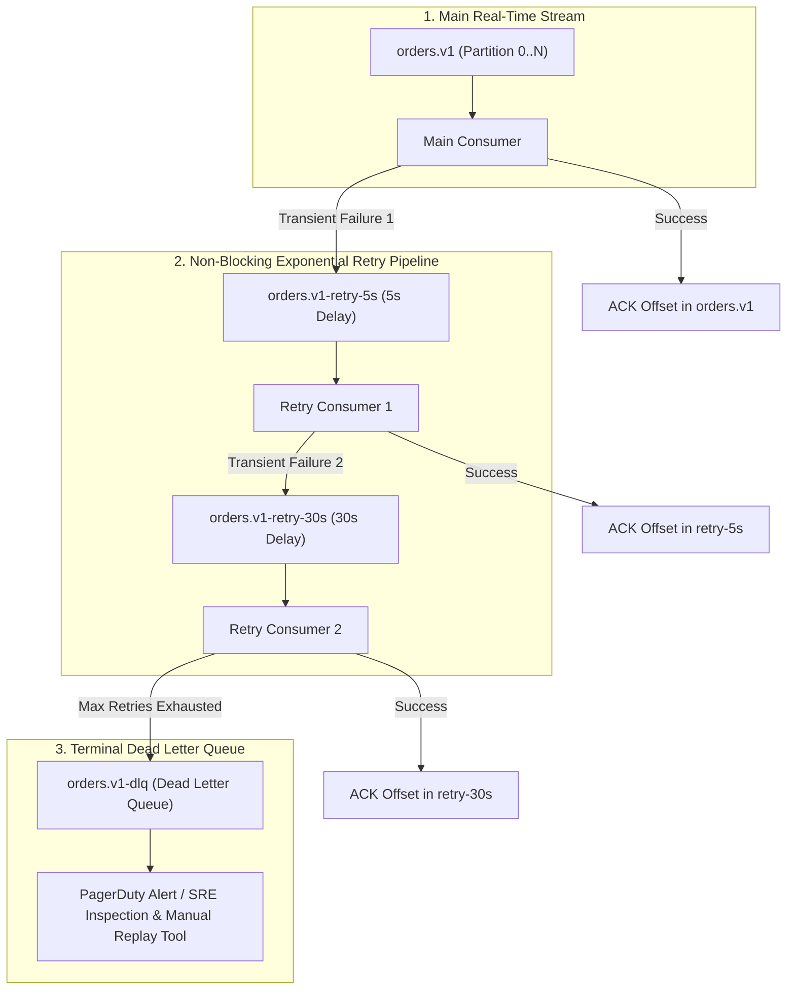

# Message Ordering, Non-Blocking Retries, and Dead Letter Queues (DLQ)

---

## 1. What Is It?
In distributed event-driven systems:
- **Message Ordering**: The guarantee that messages are processed in the exact sequence in which they were produced (guaranteed in Kafka **strictly within a single partition**).
- **Non-Blocking Retries**: An architectural pattern that shifts failed messages to secondary **Retry Topics** with configured exponential backoff delays, preventing a single failed message from blocking subsequent valid messages in the main partition (**Head-of-Line Blocking**).
- **Dead Letter Queue (DLQ)**: A dedicated terminal topic where permanently unprocessable or corrupted messages (**Poison Pills**) are routed after exhausting all configured retry attempts.

---

## 2. Why Does It Exist?
If a consumer encounters a transient error (e.g. downstream payment gateway timeout) while processing Message 42 in Partition 0:
- If the consumer halts and retries in place (`Thread.sleep(5000)`), all subsequent 10,000 valid messages in Partition 0 are **blocked and delayed** (**Head-of-Line Blocking**).
- If the consumer simply skips the error and advances the offset, **data is permanently lost**.
- If the error is a malformed poison pill (e.g. invalid JSON), retrying in-place causes an **infinite crash loop**.

Non-blocking retry topics and DLQs decouple transient retry delays and terminal error isolation from real-time partition streaming.

---

## 3. Mental Model: Non-Blocking Multi-Tiered Retry & DLQ Architecture



---

## 4. Message Ordering Guarantees & Trade-offs

### The Partition Ordering Law
$$\textbf{Kafka Ordering Law: } \text{Total Message Ordering is guaranteed ONLY within a Single Partition!}$$

- **Global Ordering Across All Partitions**: Mathematically impossible without reducing the topic to **1 single partition**, which caps maximum cluster write throughput to a single broker's disk capacity ($< 50\text{MB/sec}$).
- **Entity-Level Ordering (The Solution)**: Set the **Partition Key = `entity_id`** (e.g. `order_id` or `user_id`).
  - All state transitions for Order 101 (`Created` $\longrightarrow$ `Paid` $\longrightarrow$ `Shipped`) hash to the **exact same partition**, guaranteeing strict chronological execution for that specific order.

---

## 5. Non-Blocking Delay Implementation Mechanics

Kafka does not support native delayed message delivery (messages in a partition must be read sequentially).

### How Non-Blocking Delays are Engineered in Spring Kafka
1. When a message fails in `orders.v1`, the error handler catches the exception, attaches a failure count header (`X-Retry-Count: 1`), and publishes the record to `orders.v1-retry-5s`.
2. The main consumer immediately **commits the offset in `orders.v1`** and resumes processing the next message without delay.
3. The `Retry Consumer 1` polls `orders.v1-retry-5s`:
   - It inspects the record timestamp: if `Now() - RecordTimestamp < 5000ms`, it **pauses the partition consumption** (`consumer.pause()`) for the remaining delta time.
   - When the 5-second delay elapses, it resumes and re-attempts the database mutation.

---

## 6. Implementation: Spring Kafka `@RetryableTopic` and DLQ

```java
package com.backend.engineering.messaging.consumer;

import org.slf4j.Logger;
import org.slf4j.LoggerFactory;
import org.springframework.kafka.annotation.DltHandler;
import org.springframework.kafka.annotation.KafkaListener;
import org.springframework.kafka.annotation.RetryableTopic;
import org.springframework.kafka.retrytopic.DltStrategy;
import org.springframework.kafka.support.KafkaHeaders;
import org.springframework.messaging.handler.annotation.Header;
import org.springframework.retry.annotation.Backoff;
import org.springframework.stereotype.Service;

@Service
public class ResilientOrderEventConsumer {

    private static final Logger log = LoggerFactory.getLogger(ResilientOrderEventConsumer.class);
    private final OrderProcessorService processorService;

    public ResilientOrderEventConsumer(OrderProcessorService processorService) {
        this.processorService = processorService;
    }

    // Declarative Non-Blocking Retries: 3 attempts with exponential backoff
    @RetryableTopic(
        attempts = "4", // 1 Initial + 3 Retries
        backoff = @Backoff(delay = 1000, multiplier = 3.0, maxDelay = 10000), // 1s -> 3s -> 9s
        dltStrategy = DltStrategy.ALWAYS_RETRY_ON_ERROR,
        include = {TransientServiceException.class, NetworkTimeoutException.class},
        exclude = {MalformedPayloadException.class} // Poison pills bypass retries and route directly to DLT!
    )
    @KafkaListener(topics = "orders.v1", groupId = "order-fulfillment-group")
    public void consumeOrder(String payload, @Header(KafkaHeaders.RECEIVED_TOPIC) String topic) {
        log.info("Consuming order from topic [{}]: {}", topic, payload);
        processorService.processOrder(payload);
    }

    // Dead Letter Topic (DLT) Handler
    @DltHandler
    public void handleDeadLetterMessage(
            String payload,
            @Header(KafkaHeaders.ORIGINAL_TOPIC) String originalTopic,
            @Header(KafkaHeaders.ORIGINAL_OFFSET) long originalOffset,
            @Header(KafkaHeaders.EXCEPTION_MESSAGE) String errorMsg) {

        log.error("CRITICAL: Message routed to DLQ! Original Topic: {}, Offset: {}, Error: {}",
                originalTopic, originalOffset, errorMsg);

        // Store in Dead Letter Database Table for Admin Dashboard & SRE Alerting
        processorService.saveToDlqAuditStore(originalTopic, originalOffset, payload, errorMsg);
    }
}
```

---

## 7. Performance

| Retry Model | Main Stream Latency | Head-of-Line Blocking | DLQ Isolation |
|---|---|---|---|
| In-Place Blocking Retry (`Thread.sleep`) | **Severely Degraded (Stalls all messages)** | High (1 fail blocks 10,000 items) | None |
| **Non-Blocking Retry Topics (`@RetryableTopic`)** | **Ultra-Fast (Zero main stream delay)** | **Zero (Messages moved to retry topic)** | Full isolation |

---

## 8. Failure Scenarios

1. **Ordering Inversion via Retry Topics**:
   - *Failure*: Order 101 receives an `OrderUpdated` event that fails transiently and moves to `retry-5s`. $1\text{ second later}$, Order 101 receives an `OrderCancelled` event on the main topic and processes immediately. $5\text{ seconds later}$, the retry topic replays `OrderUpdated` and overwrites the cancellation!
   - *Mitigation*: Track entity state versioning (`version` timestamp) in the database to discard out-of-order stale updates.

---

## 9. Observability

- **Metrics**:
  - `kafka_retry_topic_messages_total`: Number of messages routed to retry topics.
  - `kafka_dlq_messages_total`: Counter tracking permanent poison pills (Trigger SEV-2 PagerDuty alert if $> 0$).

---

## 10. Debugging

### Inspecting Messages in the DLQ Topic
```bash
# Read raw dead letter queue records with exception headers
kafka-console-consumer.sh --bootstrap-server localhost:9092 \
  --topic orders.v1-dlt \
  --from-beginning \
  --property print.headers=true \
  --property print.key=true
```

---

## 11. Scaling

### DLQ Replay Tools
Build an administrative CLI or API to re-inject fixed DLQ records back into the main topic after resolving downstream bugs:
```bash
# Replay DLQ records back to main topic
kafka-mirror-maker.sh --consumer.config dlq-consumer.properties \
  --producer.config main-producer.properties \
  --whitelist "orders.v1-dlt"
```

---

## 12. Trade-offs

| Strategy | Advantages | Operational Costs |
|---|---|---|
| **In-Place Retry** | Preserves strict per-partition ordering | Destroys throughput; causes Head-of-Line blocking |
| **Non-Blocking Retry Topics** | Preserves high throughput on main topic | May cause out-of-order processing across retry tiers |

---

## 13. When to Use
- High-volume transaction processing where transient downstream network hiccups must not block independent customer orders.

---

## 14. When NOT to Use
- Workloads requiring strict absolute global sequencing where subsequent events are mathematically dependent on immediate prior event success.

---

## 15. Interview Questions

### Q1: What is Head-of-Line (HoL) Blocking in Kafka consumers, and how do Retry Topics resolve it?
<details>
<summary>Reveal Answer</summary>

**Answer**:
**Head-of-Line Blocking** occurs when a single consumer thread processing a partition encounters a failing message (e.g. downstream service down) and repeatedly blocks or sleeps in place. Because Kafka offsets are linear, the consumer cannot advance its offset without skipping the failed message; therefore, **all subsequent thousands of valid, independent messages queued behind it in that partition are blocked from processing**.
**Retry Topics** resolve this by publishing the failing record to a separate **Retry Topic** (`topic-retry-5s`) and immediately advancing the main partition offset. The main consumer continues streaming live traffic with zero latency degradation, while an independent retry consumer handles the failing message with the appropriate exponential backoff delay.
</details>

### Q2: Why is global ordering across an entire Kafka topic practically impossible at scale?
<details>
<summary>Reveal Answer</summary>

**Answer**:
Kafka achieves horizontal scale by partitioning topics across multiple independent broker servers.
To guarantee strict **Global Ordering**, all messages must be written to a **single physical partition** on a single broker node. This completely eliminates horizontal scaling:
1. Maximum write throughput is capped to the disk write bandwidth of that single node ($< 100\text{MB/s}$).
2. Consumer parallelism is capped to **exactly 1 active consumer instance** across the entire consumer group.
In distributed architectures, global ordering is replaced with **Entity-Level Partition Ordering**: messages are partitioned by an entity key (e.g. `user_id` or `account_id`), guaranteeing strict chronological ordering for each individual entity while scaling across hundreds of parallel partitions.
</details>

---

## 17. Practical Exercise
1. Configure a Spring Boot Kafka consumer with `@RetryableTopic` (3 retries with backoff: 1s, 2s, 4s).
2. Throw a simulated `TransientServiceException` and observe the message moving through the generated retry topics in `kafka-console-consumer`.
3. Throw a `MalformedPayloadException` and verify that it skips retry topics and routes immediately to the Dead Letter Topic (DLT).

---

## 18. Quick Revision
- **Partition Ordering**: Ordering is strictly per-partition, not global.
- **Head-of-Line Blocking**: In-place retries stall the entire partition.
- **Non-Blocking Retries**: Shift failed messages to delay topics (`topic-retry-5s`) to keep main stream fast.
- **DLQ**: Terminal topic for unrecoverable poison pills.
- **Entity Key Partitioning**: Use `user_id` or `order_id` as key to ensure all lifecycle events for an entity remain strictly ordered.
