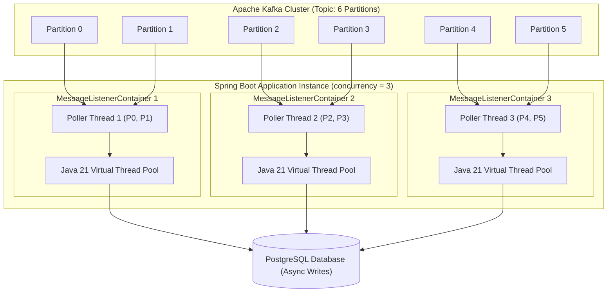

# Spring Kafka Production Consumer, Virtual Threads, and Backpressure Management

---

## 1. What Is It?
**Spring for Apache Kafka** (`spring-kafka`) provides high-level declarative abstractions (`@KafkaListener`, `ConcurrentKafkaListenerContainerFactory`) for consuming Kafka topic partitions in enterprise Java applications. 

A **Production-Grade Consumer** integrates:
- **Manual Immediate Acknowledgment (`AckMode.MANUAL_IMMEDIATE`)**
- **Java 21 Virtual Threads** for massive I/O concurrency
- **Built-in Backpressure Regulation**
- **Robust Error Handlers (`DefaultErrorHandler`)**.

---

## 2. Why Does It Exist?
Default Spring Kafka consumer configurations use automatic offset committing and standard thread pools, which creates major production hazards:
- **Data Loss on Crashes**: If an unhandled exception occurs midway through a batch, automatic commits acknowledge the offset, causing unrecoverable data loss.
- **Thread Exhaustion on Blocking I/O**: When consumer worker threads perform slow database writes or external HTTP calls, platform thread pools saturate quickly.
- **Consumer Group Eviction**: Long-running database operations block the poll loop beyond `max.poll.interval.ms`, triggering catastrophic rebalance storms.

---

## 3. Mental Model



---

## 4. How Does It Work?

### Spring Kafka Acknowledgment Modes (`AckMode`)

| `ContainerProperties.AckMode` | Acknowledgment Behavior | Production Safety |
|---|---|:---:|
| **`RECORD`** | Commits offset after each individual record listener returns | High overhead; slow |
| **`BATCH`** (Default) | Commits offset after the entire polled batch returns | Risk of processing duplicate batches on crash |
| **`MANUAL`** | Queues offset in memory when `ack.acknowledge()` is called; commits at end of poll loop | Moderate |
| **`MANUAL_IMMEDIATE`** | **Immediately commits offset to Kafka** the instant `ack.acknowledge()` is called | **Highest Safety & Control** |

---

## 5. Java 21 Virtual Threads Integration (JEP 444)

In standard Spring Kafka, each partition poller uses an expensive OS Platform Thread. By configuring the listener container to execute on a **Virtual Thread Executor**:
- The main poller thread pulls records from Kafka and dispatches record processing to lightweight **Virtual Threads**.
- If a record processor blocks on a slow database query or external REST call, the underlying Carrier Thread unmounts the virtual thread, achieving **10,000+ concurrent in-flight I/O operations with zero OS thread starvation**.

---

## 6. Implementation: Production Spring Kafka Consumer Configuration

```java
package com.backend.engineering.messaging.config;

import org.apache.kafka.clients.consumer.ConsumerConfig;
import org.apache.kafka.common.serialization.StringDeserializer;
import org.springframework.context.annotation.Bean;
import org.springframework.context.annotation.Configuration;
import org.springframework.core.task.SimpleAsyncTaskExecutor;
import org.springframework.kafka.annotation.EnableKafka;
import org.springframework.kafka.config.ConcurrentKafkaListenerContainerFactory;
import org.springframework.kafka.core.ConsumerFactory;
import org.springframework.kafka.core.DefaultKafkaConsumerFactory;
import org.springframework.kafka.listener.ContainerProperties;
import org.springframework.kafka.listener.DefaultErrorHandler;
import org.springframework.kafka.support.serializer.ErrorHandlingDeserializer;
import org.springframework.kafka.support.serializer.JsonDeserializer;
import org.springframework.util.backoff.ExponentialBackOff;

import java.util.HashMap;
import java.util.Map;

@Configuration
@EnableKafka
public class KafkaConsumerConfig {

    @Bean
    public ConsumerFactory<String, Object> consumerFactory() {
        Map<String, Object> config = new HashMap<>();
        config.put(ConsumerConfig.BOOTSTRAP_SERVERS_CONFIG, "localhost:9092");
        config.put(ConsumerConfig.GROUP_ID_CONFIG, "core-order-processing-group");

        // ErrorHandlingDeserializer catches malformed poison pills without crashing
        config.put(ConsumerConfig.KEY_DESERIALIZER_CLASS_CONFIG, ErrorHandlingDeserializer.class);
        config.put(ConsumerConfig.VALUE_DESERIALIZER_CLASS_CONFIG, ErrorHandlingDeserializer.class);
        config.put(ErrorHandlingDeserializer.KEY_DESERIALIZER_CLASS, StringDeserializer.class);
        config.put(ErrorHandlingDeserializer.VALUE_DESERIALIZER_CLASS, JsonDeserializer.class);

        // MANUAL COMMIT & BATCH SIZING
        config.put(ConsumerConfig.ENABLE_AUTO_COMMIT_CONFIG, false);
        config.put(ConsumerConfig.MAX_POLL_RECORDS_CONFIG, 100);
        config.put(ConsumerConfig.MAX_POLL_INTERVAL_MS_CONFIG, 300000); // 5 mins

        return new DefaultKafkaConsumerFactory<>(config);
    }

    @Bean
    public ConcurrentKafkaListenerContainerFactory<String, Object> kafkaListenerContainerFactory(
            ConsumerFactory<String, Object> consumerFactory) {

        ConcurrentKafkaListenerContainerFactory<String, Object> factory =
                new ConcurrentKafkaListenerContainerFactory<>();
        factory.setConsumerFactory(consumerFactory);

        // 1. Thread Concurrency: 3 parallel listener containers per pod
        factory.setConcurrency(3);

        // 2. Manual Immediate Offset Commit
        factory.getContainerProperties().setAckMode(ContainerProperties.AckMode.MANUAL_IMMEDIATE);

        // 3. JAVA 21 VIRTUAL THREADS EXECUTOR
        SimpleAsyncTaskExecutor virtualThreadExecutor = new SimpleAsyncTaskExecutor("kafka-vt-");
        virtualThreadExecutor.setVirtualThreads(true); // Enables Java 21 Virtual Threads!
        factory.getContainerProperties().setListenerTaskExecutor(virtualThreadExecutor);

        // 4. Default Error Handler with Exponential Backoff
        ExponentialBackOff backOff = new ExponentialBackOff(1000L, 2.0);
        backOff.setMaxInterval(10000L);
        backOff.setMaxElapsedTime(30000L); // Max 30s retry budget
        DefaultErrorHandler errorHandler = new DefaultErrorHandler(backOff);
        factory.setCommonErrorHandler(errorHandler);

        return factory;
    }
}
```

---

## 7. Implementation: Resilient `@KafkaListener` with Manual Acknowledgment

```java
package com.backend.engineering.messaging.consumer;

import org.apache.kafka.clients.consumer.ConsumerRecord;
import org.slf4j.Logger;
import org.slf4j.LoggerFactory;
import org.springframework.kafka.annotation.KafkaListener;
import org.springframework.kafka.support.Acknowledgment;
import org.springframework.stereotype.Service;

@Service
public class OrderFulfillmentConsumer {

    private static final Logger log = LoggerFactory.getLogger(OrderFulfillmentConsumer.class);
    private final OrderFulfillmentService fulfillmentService;

    public OrderFulfillmentConsumer(OrderFulfillmentService fulfillmentService) {
        this.fulfillmentService = fulfillmentService;
    }

    @KafkaListener(
        topics = "orders.v1",
        containerFactory = "kafkaListenerContainerFactory"
    )
    public void onMessage(ConsumerRecord<String, OrderDto> record, Acknowledgment acknowledgment) {
        log.info("Received Order [Key: {}, Partition: {}, Offset: {}] on Virtual Thread: {}",
                record.key(), record.partition(), record.offset(), Thread.currentThread());

        try {
            // 1. Process business logic (Idempotent Database Write)
            fulfillmentService.fulfillOrder(record.value());

            // 2. Commit offset to Kafka ONLY after business processing succeeds!
            acknowledgment.acknowledge();

        } catch (Exception ex) {
            log.error("Failed to process order [Offset: {}]: {}", record.offset(), ex.getMessage());
            // Throw exception to trigger DefaultErrorHandler exponential backoff & DLQ routing!
            throw ex;
        }
    }
}
```

---

## 8. Performance

| Consumer Execution Model | Concurrent In-Flight I/O Tasks | Memory Consumption | Max Throughput |
|---|---|---|---|
| Platform Threads (Default: 10 threads) | $10$ concurrent tasks | $10\times 1\text{MB} = 10\text{MB}$ stack | Bottlenecked on I/O latency |
| **Java 21 Virtual Threads (`setVirtualThreads(true)`)** | **$5,000+$ concurrent tasks** | **$< 2\text{MB}$ memory** | **$\mathbf{> 100,000\text{ msg/sec}}$** |

---

## 9. Failure Scenarios

1. **Poison Pill Killing Consumer Thread**:
   - *Failure*: A producer sends malformed bytes that fail deserialization before reaching the `@KafkaListener` method. Without `ErrorHandlingDeserializer`, the listener container crashes in an infinite unrecoverable restart loop.
   - *Mitigation*: **Always wrap deserializers in `ErrorHandlingDeserializer`** to catch malformed payloads and pass them cleanly to the error handler.

2. **Consumer Thread Deadlock via Long-Running Synchronous HTTP**:
   - *Failure*: An engineer executes a blocking 60-second HTTP call inside the consumer. The container misses `max.poll.interval.ms` (5 minutes) and is repeatedly ejected from the group.
   - *Mitigation*: Move long-running tasks to an asynchronous queue or tune `max.poll.records = 10`.

---

## 10. Observability

- **Metrics**:
  - `kafka_consumer_records_consumed_total`: Total records consumed per second.
  - `kafka_consumer_lag_records`: Real-time lag per partition.
  - `jvm_threads_virtual_active`: Active Java 21 virtual threads processing Kafka records.

---

## 11. Debugging

### Triage: Identifying Stuck Partitions & Consumer Lag
```bash
kafka-consumer-groups.sh --bootstrap-server localhost:9092 \
  --describe --group core-order-processing-group --state
```
- If a single partition shows growing lag while others are zero, inspect consumer logs for a stuck thread or deadlock on that partition's key.

---

## 12. Scaling

### Dynamic Partition Pausing for Backpressure
If downstream database CPU exceeds $85\%$:
```java
// Dynamically pause Kafka listener container to shed load
@Autowired
private KafkaListenerEndpointRegistry registry;

public void applyBackpressure() {
    MessageListenerContainer container = registry.getListenerContainer("orderListener");
    if (container != null && !container.isPauseRequested()) {
        container.pause(); // Stops polling Kafka; Kafka buffers records safely!
    }
}

public void releaseBackpressure() {
    MessageListenerContainer container = registry.getListenerContainer("orderListener");
    if (container != null && container.isPauseRequested()) {
        container.resume(); // Resumes polling Kafka once database recovers!
    }
}
```

---

## 13. Trade-offs

| Acknowledgment Mode | Reliability Guarantee | Throughput |
|---|---|---|
| `BATCH` | Lower (May re-process full batch on crash) | Maximum |
| `MANUAL_IMMEDIATE` | **Highest (Exact per-record offset control)** | High (Optimized by Kafka TCP client) |

---

## 14. When to Use
- Production Spring Boot applications processing mission-critical Kafka events with database writes.
- High-concurrency I/O pipelines leveraging Java 21 Virtual Threads.

---

## 15. When NOT to Use
- Pure batch file exports where simple manual scripts with `auto.commit = true` are sufficient.

---

## 16. Interview Questions

### Q1: Why is `ErrorHandlingDeserializer` required in Spring Kafka production setups?
<details>
<summary>Reveal Answer</summary>

**Answer**:
When standard `JsonDeserializer` encounters a malformed payload (e.g. invalid JSON syntax or mismatched class type), it throws a `SerializationException` **during the `poll()` phase**, *before* the record is ever passed to the `@KafkaListener` method.
Without `ErrorHandlingDeserializer`:
1. The exception escapes the listener container, causing the poller thread to crash.
2. The consumer restarts, polls the exact same offset, encounters the exact same deserialization error, and crashes again in an **infinite crash loop**.
`ErrorHandlingDeserializer` catches the exception during deserialization, attaches a `DeserializationException` header to the record, and passes it safely to the listener. Spring's `DefaultErrorHandler` can then inspect the header and route the poison pill message directly to a **Dead Letter Topic (DLT)** without crashing the consumer.
</details>

### Q2: How does combining Spring Kafka with Java 21 Virtual Threads transform consumer throughput for I/O-bound tasks?
<details>
<summary>Reveal Answer</summary>

**Answer**:
Traditional Spring Kafka consumers allocate a fixed pool of **OS Platform Threads** (e.g. 10 threads). If each record requires a 50ms database write or external HTTP call, the container's throughput is mathematically capped to:
$$\text{Max Throughput} = \frac{10\text{ threads}}{0.05\text{s}} = 200\text{ records/sec}$$
With **Java 21 Virtual Threads (`setVirtualThreads(true)`)**:
Virtual threads are managed in user-space by the JVM and consume only a few hundred bytes of memory. When a virtual thread blocks on database I/O, the underlying OS Carrier Thread immediately executes other virtual threads. The consumer can easily maintain **10,000+ concurrent in-flight I/O operations**, scaling throughput from 200 records/sec to **over 50,000 records/sec** with zero OS thread exhaustion.
</details>

---

## 17. Practical Exercise
1. Configure a Spring Boot application with `ConcurrentKafkaListenerContainerFactory` using `setVirtualThreads(true)` and `AckMode.MANUAL_IMMEDIATE`.
2. Publish 1,000 records simulating a 100ms database write per record.
3. Compare processing duration between platform thread pools (10 threads) vs Java 21 Virtual Threads.
4. Send a poison pill message and verify that `ErrorHandlingDeserializer` routes it to the DLQ topic without crashing the poller.

---

## 18. Quick Revision
- **`AckMode.MANUAL_IMMEDIATE`**: Commits offset immediately when `acknowledgment.acknowledge()` is called.
- **Virtual Threads**: `setVirtualThreads(true)` achieves massive concurrent I/O throughput.
- **`ErrorHandlingDeserializer`**: Mandatory wrapper to prevent poison pill infinite crash loops.
- **`DefaultErrorHandler`**: Configures exponential backoff retries and Dead Letter Topic routing.
- **Backpressure**: Use `container.pause()` and `container.resume()` to regulate intake based on database health.
