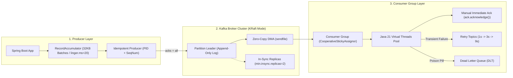

# Module 11: Messaging & Apache Kafka

Master distributed messaging architectures: Point-to-Point queues (SQS/RabbitMQ) vs Distributed Commit Logs (Apache Kafka), append-only segment storage, Zero-Copy data transfers (`sendfile()`), KRaft metadata consensus, Producer batching (`RecordAccumulator`, `linger.ms`), Idempotent Producer mechanics, Consumer Groups, Cooperative Sticky Rebalancing, Non-blocking retry topics with DLQs, and Spring Kafka with Java 21 Virtual Threads.

---

## 🗺️ Master Producer-to-Consumer Request Flow

---

## 📚 Curriculum Lessons

| # | Lesson | Core Focus & Mechanics |
|:---:|---|---|
| **01** | [`01-messaging-fundamentals-queues-vs-pubsub.md`](./01-messaging-fundamentals-queues-vs-pubsub.md) | Point-to-Point queues (SQS/RabbitMQ) vs Commit Logs (Kafka), Push vs Pull flow control, and temporal decoupling. |
| **02** | [`02-apache-kafka-architecture-and-kraft.md`](./02-apache-kafka-architecture-and-kraft.md) | Append-only segments (`.log`/`.index`), Zero-Copy (`sendfile`), OS Page Cache, and KRaft Raft consensus (KIP-500). |
| **03** | [`03-producers-partitioning-and-delivery-semantics.md`](./03-producers-partitioning-and-delivery-semantics.md) | `RecordAccumulator`, `batch.size`, `linger.ms`, `acks=all`, `min.insync.replicas=2`, and Idempotent Producer PIDs. |
| **04** | [`04-consumer-groups-offsets-and-rebalancing.md`](./04-consumer-groups-offsets-and-rebalancing.md) | Offset management (`__consumer_offsets`), `max.poll.interval.ms`, and `CooperativeStickyAssignor` non-blocking rebalances. |
| **05** | [`05-message-ordering-retries-and-dead-letter-queues.md`](./05-message-ordering-retries-and-dead-letter-queues.md) | Partition ordering vs global ordering, eliminating Head-of-Line blocking via `@RetryableTopic`, and DLQ poison pill triage. |
| **06** | [`06-spring-kafka-production-consumer-and-backpressure.md`](./06-spring-kafka-production-consumer-and-backpressure.md) | `ConcurrentKafkaListenerContainerFactory`, `AckMode.MANUAL_IMMEDIATE`, Java 21 Virtual Threads, `ErrorHandlingDeserializer`, and dynamic backpressure. |

---

## ⚡ Key Production Takeaways

1. **The Durability Invariant**: Always configure `acks = all`, `min.insync.replicas = 2`, and `replication.factor = 3` to prevent silent data loss.
2. **Idempotence Standard**: Always enable `enable.idempotence = true` on producers to eliminate network retry duplicate writes.
3. **Cooperative Rebalancing**: Always use `CooperativeStickyAssignor` to eliminate cluster-wide Stop-The-World rebalance pauses.
4. **Poison Pill Defense**: Always wrap deserializers in `ErrorHandlingDeserializer` to route bad payloads to DLQs without crashing poll loops.
5. **Virtual Threads for I/O**: Use Java 21 Virtual Threads in listener container factories to scale concurrent I/O throughput to over 50,000 msg/sec.
