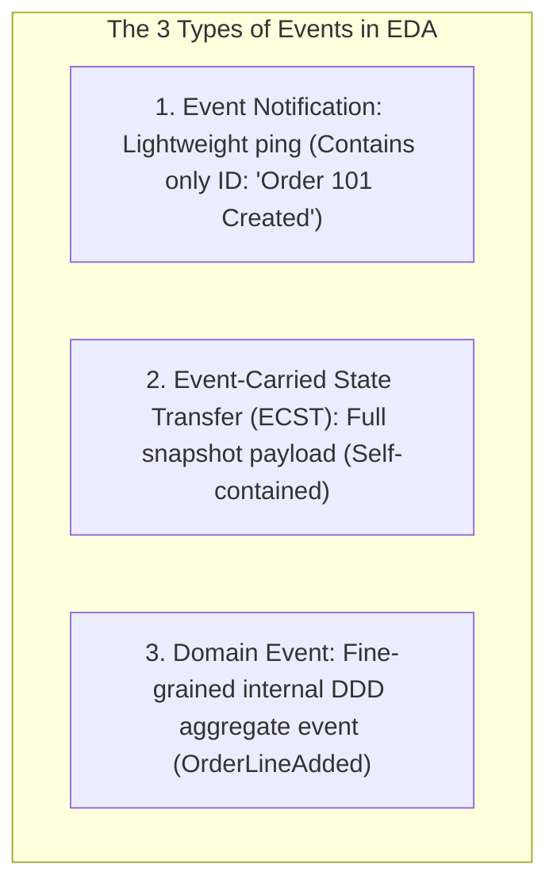

# Event-Driven Architecture: Events, Commands, and REST vs EDA

---

## 1. What Is It?
**Event-Driven Architecture (EDA)** is an asynchronous architectural style where decoupled software components communicate by producing, broadcasting, and reacting to significant state changes (**Events**) across an event broker, rather than invoking direct synchronous remote procedure calls.

---

## 2. Events vs Commands

```mermaid
flowchart LR
    subgraph CommandPattern["Command (Direct Intent / Directed Action)"]
        CmdSender["Order Service"] -->|Command: 'ChargeCreditCard'| CmdReceiver["Payment Service"]
        Note over CmdSender,CmdReceiver: 1:1 Coupling; Directed request; Expects immediate execution or rejection
    end

    subgraph EventPattern["Event (Immutable Fact / Broadcast)"]
        EvtPublisher["Order Service"] -->|Event: 'OrderPlaced' (Fact)| Broker["Event Bus / Kafka"]
        Broker --> Sub1["Payment Service"]
        Broker --> Sub2["Inventory Service"]
        Broker --> Sub3["Email Service"]
        Note over EvtPublisher,Sub3: 1:N Decoupled; Past tense immutable record; Publisher has zero knowledge of consumers
    end
```

### Core Differences

| Dimension | Command | Event |
|---|---|---|
| **Semantic Meaning** | An **Intent / Instruction** to perform an action in the future | An **Immutable Fact** that already happened in the past |
| **Naming Convention** | Imperative Verb: `ProcessPayment`, `CancelOrder` | Past-Tense Verb: `PaymentProcessed`, `OrderCancelled` |
| **Recipient** | Directed to a **single specific handler** ($1:1$) | Broadcast to **zero or more anonymous subscribers** ($1:N$) |
| **Coupling** | High (Sender expects specific outcome) | **Zero (Publisher does not know or care who listens)** |

---

## 3. The 3 Types of Events



1. **Event Notification (Lightweight)**:
   - Contains only entity identifier: `{"eventId": "...", "type": "OrderPlaced", "orderId": 101}`.
   - *Downside*: Consumers must make synchronous REST/gRPC callbacks back to Order Service to fetch details (**Reverse Query Stampede**).
2. **Event-Carried State Transfer (ECST - Self-Contained)**:
   - Contains the full entity snapshot: `{"orderId": 101, "userId": 42, "items": [...], "totalCents": 5000}`.
   - *Advantage*: Consumers process events completely autonomously without touching upstream services.

---

## 4. REST vs Event-Driven Systems Architectural Comparison

| Architectural Attribute | Synchronous REST / gRPC | Asynchronous Event-Driven (EDA) |
|---|---|---|
| **Communication Model** | Request / Response (Point-to-Point) | Publish / Subscribe (Event Stream) |
| **Temporal Coupling** | **Tight**: Both client and server must be online simultaneously | **Zero**: Producers and consumers run completely asynchronously |
| **Latency Characteristics** | Immediate client feedback ($< 50\text{ms}$) | Eventual consistency ($10\text{ms} - 2\text{s}$) |
| **Failure Blast Radius** | Downstream failure cascades upstream | Downstream failure buffered in event broker |
| **Adding New Consumers** | Requires modifying caller service code | **Zero caller modification** (New services just subscribe to topic) |

---

## 5. Implementation: Domain Event Model in Java 21

```java
package com.backend.engineering.eda.events;

import java.time.Instant;
import java.util.List;
import java.util.UUID;

// Immutable Java 21 Record representing an Event-Carried State Transfer Event
public record OrderPlacedEvent(
    UUID eventId,
    String eventType,
    Long orderId,
    Long userId,
    List<OrderItemDto> items,
    int totalAmountCents,
    Instant occurredAt
) {
    public record OrderItemDto(Long productId, int quantity, int unitPriceCents) {}

    public static OrderPlacedEvent of(Long orderId, Long userId, List<OrderItemDto> items, int totalAmountCents) {
        return new OrderPlacedEvent(
            UUID.randomUUID(),
            "ORDER_PLACED",
            orderId,
            userId,
            items,
            totalAmountCents,
            Instant.now()
        );
    }
}
```

---

## 6. Performance

| Architecture | Peak Write Throughput | Downstream Failure Resilience | System Extensibility |
|---|---|---|---|
| Synchronous REST Cascade | Moderate ($2,000\text{ req/s}$) | Low (Single downstream failure breaks request) | Complex (Requires code changes) |
| **Event-Driven (Kafka ECST)**| **Massive ($> 100,000\text{ events/s}$)** | **Maximum (Brokers buffer traffic safely)** | **Trivial (Plug-and-play consumers)** |

---

## 7. Failure Scenarios

1. **The Reverse Query Stampede (Lightweight Event Trap)**:
   - *Failure*: Order Service broadcasts lightweight Event Notifications (`{"orderId": 101}`). 10 independent downstream microservices consume the event simultaneously and fire 10 concurrent REST calls back to Order Service, crashing its database.
   - *Mitigation*: Use **Event-Carried State Transfer (ECST)** so events contain all required data payload fields.

---

## 8. Observability

- **OpenTelemetry Context Propagation**:
  - Inject W3C `traceparent` headers into Kafka message headers to trace distributed transactions from HTTP ingress through event brokers to downstream consumer databases.

---

## 9. Interview Questions

### Q1: What is the difference between Event Notification and Event-Carried State Transfer (ECST)?
<details>
<summary>Reveal Answer</summary>

**Answer**:
- **Event Notification** is a lightweight message containing minimal metadata (typically just the entity ID and event type, e.g. `{"orderId": 101, "status": "CONFIRMED"}`). It informs consumers that something happened, but forces every interested consumer to make a synchronous REST or gRPC call back to the source service to fetch full details. Under high traffic, this creates a **Reverse Query Stampede** on the source service.
- **Event-Carried State Transfer (ECST)** packages the full enriched entity snapshot directly inside the event payload (e.g. customer info, order line items, pricing, delivery address). Consumers can execute their business logic completely autonomously without ever making network callbacks to the source service, achieving true decoupled independence.
</details>

---

## 10. Quick Revision
- **Command**: Directed intent ($1:1$), imperative, high coupling.
- **Event**: Immutable fact ($1:N$), past-tense, zero publisher-consumer coupling.
- **ECST**: Self-contained event payload preventing reverse query stampedes.
- **EDA Benefits**: Temporal decoupling, traffic load-leveling, plug-and-play extensibility.
