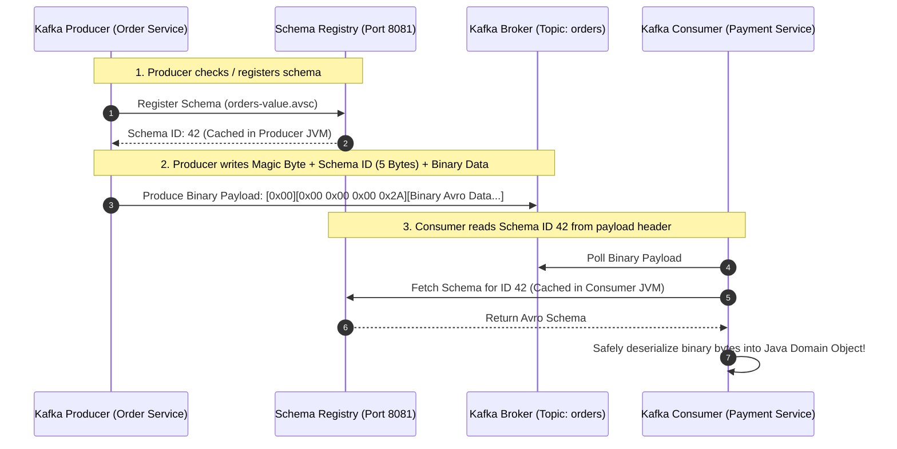
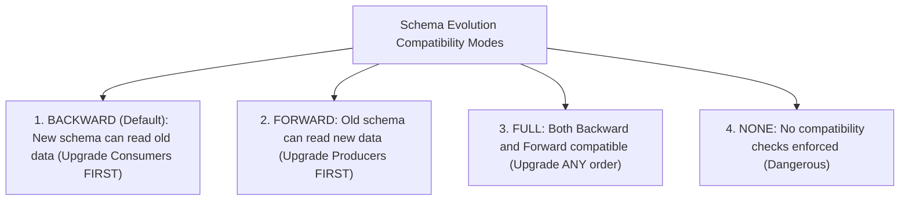

# Event Schemas, Schema Registry, and Avro/Protobuf Evolution

---

## 1. What Is It?
In Event-Driven Architectures, **Event Schemas** formally define the structural data contract (field names, types, optionality, default values) of messages transmitted across event topics. 

A **Schema Registry** (Confluent Schema Registry / Apicurio) is a centralized metadata service that stores, versions, and validates schemas, guaranteeing that message producers and consumers evolve independently without breaking deserialization compatibility.

---

## 2. Why Does It Exist?
Using untyped, schemaless JSON in high-scale microservices leads to catastrophic production failures:
- **Silent Payload Drift**: A producer renames `userId` to `customer_id`. Downstream consumer microservices silently deserialize `userId` as `null`, causing NullPointerExceptions and corrupted billing.
- **Payload Bloat**: JSON repeatedly sends full field string names on every single message over the network ($50-80\%$ bandwidth waste).

Binary serialization frameworks (**Apache Avro**, **Protocol Buffers**) eliminate field name redundancy by packing raw values into compact binary formats and validating changes against strict **Schema Evolution Compatibility Rules**.

---

## 3. Mental Model: Schema Registry Integration



---

## 4. How Does It Work?

### Schema Wire Protocol (The 5-Byte Header)
When serializing via Confluent Schema Registry:
- **Byte 0**: Magic Byte (`0x00`).
- **Bytes 1–4**: 32-bit Schema ID integer representing the exact schema version in the registry.
- **Bytes 5+**: Raw, compact binary Avro/Protobuf data (zero JSON field names!).

---

## 5. Schema Evolution Compatibility Modes



### Deep Dive: Compatibility Rules

| Compatibility Mode | Rule for Modifying Fields | Safe Deployment Order |
|---|---|---|
| **`BACKWARD`** (Default) | Can **add optional fields with defaults**; can **delete optional fields** | Upgrade **Consumers** first, then Producers |
| **`FORWARD`** | Can **add fields**; can **delete fields with defaults** | Upgrade **Producers** first, then Consumers |
| **`FULL`** | Can **only add or delete optional fields with defaults** | Upgrade in **any order** (Zero deployment coordination) |

---

## 6. Example: Apache Avro Schema Definition (`.avsc`)

```json
{
  "type": "record",
  "name": "OrderEvent",
  "namespace": "com.backend.engineering.schemas",
  "doc": "Production Order State Transition Event",
  "fields": [
    { "name": "orderId", "type": "long" },
    { "name": "userId", "type": "long" },
    { "name": "status", "type": { "type": "enum", "name": "OrderStatus", "symbols": ["PENDING", "CONFIRMED", "CANCELLED"] } },
    { "name": "totalAmountCents", "type": "int" },
    
    // SAFE BACKWARD-COMPATIBLE EVOLUTION: Added field MUST have a default value!
    { "name": "discountCode", "type": ["null", "string"], "default": null },
    
    { "name": "occurredAt", "type": "long", "logicalType": "timestamp-millis" }
  ]
}
```

---

## 7. Implementation: Spring Boot Kafka Producer with Avro Serializer

```java
package com.backend.engineering.eda.config;

import io.confluent.kafka.serializers.AbstractKafkaSchemaSerDeConfig;
import io.confluent.kafka.serializers.KafkaAvroSerializer;
import org.apache.kafka.clients.producer.ProducerConfig;
import org.apache.kafka.common.serialization.StringSerializer;
import org.springframework.context.annotation.Bean;
import org.springframework.context.annotation.Configuration;
import org.springframework.kafka.core.DefaultKafkaProducerFactory;
import org.springframework.kafka.core.KafkaTemplate;
import org.springframework.kafka.core.ProducerFactory;

import java.util.HashMap;
import java.util.Map;

@Configuration
public class AvroProducerConfig {

    @Bean
    public ProducerFactory<String, Object> avroProducerFactory() {
        Map<String, Object> props = new HashMap<>();
        props.put(ProducerConfig.BOOTSTRAP_SERVERS_CONFIG, "localhost:9092");
        props.put(ProducerConfig.KEY_SERIALIZER_CLASS_CONFIG, StringSerializer.class);
        
        // CONFLUENT AVRO SERIALIZER
        props.put(ProducerConfig.VALUE_SERIALIZER_CLASS_CONFIG, KafkaAvroSerializer.class);
        props.put(AbstractKafkaSchemaSerDeConfig.SCHEMA_REGISTRY_URL_CONFIG, "http://localhost:8081");
        props.put(AbstractKafkaSchemaSerDeConfig.AUTO_REGISTER_SCHEMAS, false); // False in production CI/CD!

        return new DefaultKafkaProducerFactory<>(props);
    }

    @Bean
    public KafkaTemplate<String, Object> avroKafkaTemplate(ProducerFactory<String, Object> factory) {
        return new KafkaTemplate<>(factory);
    }
}
```

---

## 8. Performance

| Serialization Format | Payload Size ($1\text{M Messages}$) | Serialization CPU Speed | Schema Enforcement |
|---|---|---|---|
| Plain Text JSON | $\approx 250\text{MB}$ | Moderate (High string parsing) | None (Runtime errors) |
| **Apache Avro** | $\mathbf{\approx 45\text{MB}}$ ($80\%$ smaller) | **Ultra-Fast (Direct binary bytes)** | **Strict Schema Registry** |
| **Protocol Buffers** | $\mathbf{\approx 40\text{MB}}$ ($84\%$ smaller) | **Ultra-Fast (Pre-compiled C/Java code)** | **Strict Schema Registry** |

---

## 9. Failure Scenarios

1. **Schema Incompatibility Deployment Block**:
   - *Failure*: A producer adds a mandatory field without a default value (`{"name": "taxId", "type": "string"}`). When attempting to publish to a `BACKWARD` compatible topic, the Schema Registry immediately rejects the schema with `422 Unprocessable Entity (Incompatible schema)`.
   - *Mitigation*: **CI/CD Schema Validation Gate**: Always run `mvn schema-registry:test-compatibility` in the pull request pipeline before merging.

---

## 10. Observability

- **Metrics**:
  - `schema_registry_requests_total`: Total schema lookup requests.
  - `schema_registry_cache_hits_total`: Schema cache hit ratio (should be $> 99.9\%$).

---

## 11. Interview Questions

### Q1: Why is Apache Avro / Protobuf with Schema Registry preferred over JSON in enterprise Kafka streaming architectures?
<details>
<summary>Reveal Answer</summary>

**Answer**:
1. **Bandwidth & Storage Optimization**: JSON serializes field names as plain text on every record (e.g. `"transactionTimestamp": 1725200000`). Avro and Protobuf use dense binary encodings, reducing payload sizes by $70-85\%$, saving gigabytes of network bandwidth and disk storage.
2. **Compile-Time & Wire-Time Contract Enforcement**: The Schema Registry acts as a centralized governance gate. Breaking schema modifications (such as deleting a required field or altering types) are rejected before messages can be published, eliminating downstream consumer deserialization crashes.
3. **Decoupled Deployment Evolution**: Allows producers and consumers to evolve their schemas independently through formal backward/forward compatibility rules.
</details>

---

## 12. Quick Revision
- **Schema Registry**: Centralized metadata service mapping 4-byte Schema IDs to Avro/Protobuf schemas.
- **Wire Format**: 5 bytes (1 magic byte + 4 schema ID bytes) followed by raw binary payload.
- **`BACKWARD`**: Upgrade consumers first; new fields must have default values.
- **`FULL` Compatibility**: Enables zero-coordination deployments in any order.
- **CI/CD Gate**: Enforce automated compatibility tests before deploying schema changes.
