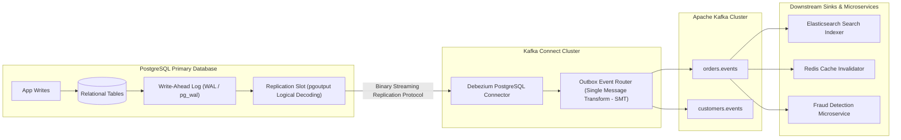

# Eventual Consistency, Change Data Capture (CDC), and Debezium Architecture

---

## 1. What Is It?
**Eventual Consistency** is a consistency model in distributed event-driven systems where, in the absence of new mutations, all replicas and downstream materialized data stores are guaranteed to eventually converge to identical states.

**Change Data Capture (CDC)** is an architectural pattern that observes, captures, and streams row-level database mutations (`INSERT`, `UPDATE`, `DELETE`) in real time by tailing the database's low-level transaction commit log (**PostgreSQL Write-Ahead Log (WAL)** or **MySQL Binary Log (Binlog)**) without impacting application write paths.

**Debezium** is the industry-standard open-source distributed platform for Change Data Capture built on top of Apache Kafka Connect.

---

## 2. Why Does It Exist?
In modern event-driven microservices, multiple systems must react to database state changes:
- Updating an Elasticsearch / OpenSearch cluster for full-text search.
- Invalidating Redis distributed caches.
- Streaming real-time analytics events to a Snowflake / BigQuery data warehouse.
- Publishing domain events to other autonomous microservices.

Traditional application-level dual-writes (`DB write + Kafka write`) suffer from the **Dual-Write Failure Anomaly**. CDC eliminates dual-writes by treating the relational database commit log as the single, immutable source of truth.

---

## 3. Mental Model: Debezium CDC Architecture



---

## 4. How Does It Work?

### PostgreSQL Logical Decoding (`pgoutput`)
1. In PostgreSQL, physical replication streams raw disk page binary diffs.
2. **Logical Decoding** (using the built-in `pgoutput` plugin) decodes the internal WAL byte stream into high-level, discrete logical tuples:
   - `INSERT: table=orders, id=101, user_id=42, total=5000`
   - `UPDATE: table=orders, id=101, old_status=PENDING, new_status=CONFIRMED`
   - `DELETE: table=orders, id=101`
3. Debezium connects as a standard PostgreSQL replication client, registers a **Replication Slot**, continuously consumes the decoded changes, and converts them into standardized JSON or Apache Avro envelopes.

---

## 5. Debezium Change Event Envelope Anatomy

A standard Debezium change event contains comprehensive audit metadata:
```json
{
  "before": {
    "id": 101,
    "status": "PENDING",
    "total_amount_cents": 5000
  },
  "after": {
    "id": 101,
    "status": "CONFIRMED",
    "total_amount_cents": 5000
  },
  "source": {
    "version": "2.6.0.Final",
    "connector": "postgresql",
    "db": "core_db",
    "schema": "public",
    "table": "orders",
    "txId": 982145,
    "lsn": 238491024,
    "ts_ms": 1725200000123
  },
  "op": "u", // 'c' = Create, 'u' = Update, 'd' = Delete, 'r' = Read (Snapshot)
  "ts_ms": 1725200000130
}
```

---

## 6. CDC Outbox Pattern vs Polling Outbox Pattern

```mermaid
flowchart TD
    subgraph PollingOutbox["1. Polling Outbox (App Thread Scheduler)"]
        AppP["App Instance"] -->|1. INSERT| DB_P[("outbox_events")]
        AppP -->|2. Polling: SELECT ... FOR UPDATE SKIP LOCKED| DB_P
        AppP -->|3. Publish| KafkaP["Kafka Broker"]
        Note over AppP,DB_P: Periodic query overhead; latency 500ms - 2s
    end

    subgraph CDCOutbox["2. Debezium CDC Outbox (Zero Query Overhead)"]
        AppC["App Instance"] -->|1. INSERT| DB_C[("outbox_events")]
        DB_C --> WAL_C["WAL Log (Disk)"]
        WAL_C -->|2. Real-Time Streaming| Deb["Debezium CDC"]
        Deb -->|3. Publish| KafkaC["Kafka Broker"]
        Note over DB_C,Deb: Zero DB query overhead; sub-20ms streaming latency!
    end
```

---

## 7. Implementation: Debezium PostgreSQL Connector Configuration

```json
{
  "name": "orders-cdc-connector",
  "config": {
    "connector.class": "io.debezium.connector.postgresql.PostgresConnector",
    "tasks.max": "1",
    "plugin.name": "pgoutput",
    "database.hostname": "postgres.internal",
    "database.port": "5432",
    "database.user": "debezium_user",
    "database.password": "secret",
    "database.dbname": "core_db",
    "database.server.name": "production_pg",
    "table.include.list": "public.outbox_events",
    
    // DEBEZIUM OUTBOX EVENT ROUTER TRANSFORMATION (SMT)
    "transforms": "outbox",
    "transforms.outbox.type": "io.debezium.transforms.outbox.EventRouter",
    "transforms.outbox.route.topic.replacement": "${routedByValue}",
    "transforms.outbox.table.fields.additional.placement": "event_type:header:eventType",
    
    // SNAPSHOT & REPLICATION CONFIG
    "slot.name": "debezium_orders_slot",
    "publication.name": "debezium_orders_pub",
    "tombstones.on.delete": "false"
  }
}
```

---

## 8. Performance

| Invalidation / Sync Approach | Database Read Load | Event Streaming Latency | End-to-End Throughput |
|---|---|---|---|
| Application Dual-Write | Low | $< 5\text{ms}$ | High (Vulnerable to lost data on crash) |
| Polling Outbox (`SKIP LOCKED`) | Moderate (Continuous SQL queries) | $500 - 2,000\text{ms}$ | $\approx 5,000\text{ events/s}$ |
| **Debezium WAL CDC** | **Zero SQL Query Overhead** | **$< 20\text{ms}$** | **$\mathbf{> 60,000\text{ events/s}}$** |

---

## 9. Failure Scenarios

1. **Replication Slot Disk Space Overflow**:
   - *Failure*: If the Debezium Kafka Connect cluster crashes, PostgreSQL holds all WAL segments on disk waiting for Debezium to catch up. If unmonitored, the database disk reaches $100\%$, triggering an emergency shutdown.
   - *Mitigation*: Configure `max_slot_wal_keep_size = 32GB` on PostgreSQL and alert when replication slot lag exceeds $5\text{GB}$.

2. **Schema Drift Breaking CDC**:
   - *Failure*: An engineer alters a database table column type (`INT` $\longrightarrow$ `VARCHAR`). If Debezium is publishing to an Apache Avro topic, the schema mismatch breaks Kafka Connect tasks.
   - *Mitigation*: Integrate Debezium with Confluent Schema Registry and configure `schema.compatibility = BACKWARD`.

---

## 10. Observability

- **Metrics**:
  - `debezium_metrics_MilliSecondsBehindSource`: Time difference between DB commit and Debezium capture.
  - `debezium_metrics_TotalNumberOfEventsSeen`: Total events processed.
  - `postgresql_replication_slot_wal_bytes_retained`: Disk space held by replication slots.

---

## 11. Interview Questions

### Q1: What is Change Data Capture (CDC) and why is it superior to dual-writing inside application services?
<details>
<summary>Reveal Answer</summary>

**Answer**:
**Change Data Capture (CDC)** extracts data mutations directly from the database's internal transaction log (PostgreSQL WAL or MySQL Binlog) in real time.
It is fundamentally superior to application dual-writes (`DB.save() + Kafka.send()`) for 3 reasons:
1. **Guaranteed Atomicity (Zero Dual-Write Race)**: In application code, if the database write succeeds but the Kafka publish fails (or the JVM crashes in between), the system enters an inconsistent state. CDC eliminates this because only mutations that successfully commit to the database WAL are ever published.
2. **Zero Performance Overhead on Application Threads**: Application threads execute standard database operations without blocking on message broker network I/O.
3. **Capture of All Changes**: Captures direct DBA hotfixes, background batch jobs, and third-party script mutations that bypass application microservices.
</details>

---

## 12. Quick Revision
- **Eventual Consistency**: State converges across distributed nodes over time.
- **CDC**: Tails transaction logs (WAL/Binlog) to stream real-time database changes.
- **Debezium**: Distributed CDC platform running inside Kafka Connect using `pgoutput`.
- **Zero Query Overhead**: CDC reads WAL bytes rather than executing SQL polling queries.
- **Replication Slot Safeguard**: Always set `max_slot_wal_keep_size` to prevent CDC disconnects from filling the database disk.
