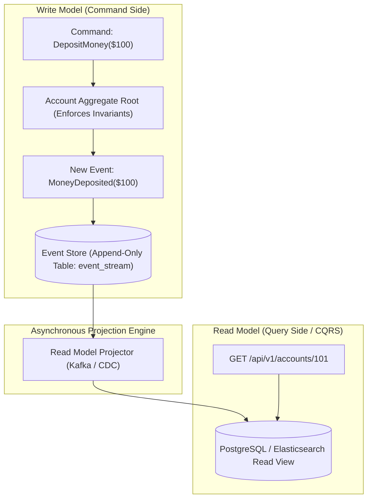
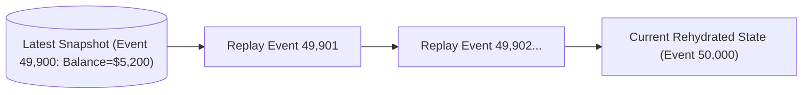

# Event Sourcing, Aggregate Rehydration, and CQRS Architecture

---

## 1. What Is It?
**Event Sourcing** is an architectural pattern where application state is persisted not by updating mutable database rows in place (e.g. `UPDATE accounts SET balance = 500`), but by appending an immutable sequence of **Domain Events** to an **Event Store** (e.g. `AccountOpened`, `MoneyDeposited`, `MoneyWithdrawn`). The current state of any entity is reconstructed by **replaying (rehydrating)** its event stream from beginning to end.

**Command Query Responsibility Segregation (CQRS)** separates the write model (**Commands** that mutate state) from the read model (**Queries** that fetch state), allowing each model to scale, optimize, and use different underlying database technologies independently.

---

## 2. Why Does It Exist?
Traditional CRUD architectures overwrite historical state destructively:
- When an order changes from `PENDING` to `CONFIRMED` to `SHIPPED`, previous state transitions and intermediate timestamps are permanently erased from the database.
- Building audit trails, legal compliance ledgers, financial balancing, and time-travel debugging requires complex secondary audit logging tables.

Event Sourcing provides a **$100\%$ complete, mathematically immutable audit trail** by default. Combined with CQRS, it allows creating arbitrary new read models and search projections retroactively by simply replaying past events.

---

## 3. Mental Model: Event Sourcing & CQRS Pipeline



---

## 4. How Does It Work?

### 1. State Rehydration (Loading an Aggregate)
To execute a command on an Aggregate (e.g. `WithdrawMoney`):
1. Load all historical events for Aggregate ID `101` from the Event Store in sequential order:
   - Event 1: `AccountCreated(id=101, initialBalance=0)` $\longrightarrow$ State: $balance = 0$
   - Event 2: `MoneyDeposited(amount=500)` $\longrightarrow$ State: $balance = 500$
   - Event 3: `MoneyWithdrawn(amount=200)` $\longrightarrow$ State: $balance = 300$
2. The aggregate is now fully **rehydrated** to its current state ($balance = 300$).
3. The aggregate evaluates the new business command (`Withdraw $400` $\longrightarrow$ Invariant check fails: $300 < 400$; command rejected!).

---

### 2. Snapshotting (Performance Optimization)
If an aggregate has 50,000 historical events, replaying 50,000 records from disk on every single command causes unacceptable latency.
- Every $N$ events (e.g. every 100 events), the system takes an in-memory **Snapshot** of the aggregate and saves it to a `snapshots` table.
- Rehydration loads the **latest Snapshot** ($Event\ 49,900$) and replays only the remaining $100$ events to reach the current state ($< 2\text{ms}$).



---

## 5. Implementation: Java 21 Event-Sourced Aggregate

```java
package com.backend.engineering.eda.eventsourcing;

import java.util.ArrayList;
import java.util.List;

public class BankAccountAggregate {

    private Long accountId;
    private int balanceCents;
    private boolean isClosed;
    private long version;

    // Uncommitted events generated during current command execution
    private final List<Object> uncommittedEvents = new ArrayList<>();

    public BankAccountAggregate() {}

    // 1. Command Handler: Enforces domain business invariants
    public void withdraw(int amountCents) {
        if (isClosed) {
            throw new IllegalStateException("Account is closed");
        }
        if (amountCents <= 0) {
            throw new IllegalArgumentException("Amount must be positive");
        }
        if (this.balanceCents < amountCents) {
            throw new IllegalStateException("Insufficient funds! Current balance: " + balanceCents);
        }

        // Apply domain event
        applyChange(new MoneyWithdrawnEvent(accountId, amountCents, System.currentTimeMillis()));
    }

    // 2. Event Applier: Mutates state in memory (Zero logic, strictly mutates fields)
    public void apply(Object event) {
        if (event instanceof AccountCreatedEvent e) {
            this.accountId = e.accountId();
            this.balanceCents = e.initialBalanceCents();
            this.isClosed = false;
        } else if (event instanceof MoneyDepositedEvent e) {
            this.balanceCents += e.amountCents();
        } else if (event instanceof MoneyWithdrawnEvent e) {
            this.balanceCents -= e.amountCents();
        }
        this.version++;
    }

    private void applyChange(Object event) {
        apply(event);
        uncommittedEvents.add(event);
    }

    // Rehydration method
    public static BankAccountAggregate rehydrate(List<Object> historicalEvents) {
        BankAccountAggregate aggregate = new BankAccountAggregate();
        for (Object event : historicalEvents) {
            aggregate.apply(event);
        }
        return aggregate;
    }

    public List<Object> getUncommittedEvents() { return uncommittedEvents; }
    public void markEventsCommitted() { uncommittedEvents.clear(); }
    public int getBalanceCents() { return balanceCents; }
}

// Domain Event Records
record AccountCreatedEvent(Long accountId, int initialBalanceCents, long timestamp) {}
record MoneyDepositedEvent(Long accountId, int amountCents, long timestamp) {}
record MoneyWithdrawnEvent(Long accountId, int amountCents, long timestamp) {}
```

---

## 6. Performance

| Storage Architecture | Write Latency | Rehydration Latency (with Snapshot) | Historical Audit Capability |
|---|---|---|---|
| Traditional CRUD | $\approx 2 - 5\text{ms}$ (Row lock update) | $0\text{ms}$ (Direct select) | Poor (Requires audit triggers) |
| **Event Sourcing + CQRS** | **$< 1\text{ms}$ (Append-only insert)** | **$< 2\text{ms}$ (Snapshot + delta)** | **$\mathbf{100\%}$ Perfect Mathematical History** |

---

## 7. Failure Scenarios

1. **Optimistic Concurrency Collision on Event Append**:
   - *Failure*: Two threads attempt to append an event to the same aggregate concurrently.
   - *Mitigation*: The Event Store enforces a unique constraint on `(aggregate_id, event_version)`. If Thread B's version matches Thread A's version, the DB rejects the write with a constraint violation; Thread B reloads the aggregate and retries.

---

## 8. Interview Questions

### Q1: What is the difference between Event Sourcing and standard Audit Logging?
<details>
<summary>Reveal Answer</summary>

**Answer**:
- In **Audit Logging**, the application updates the current state table as the authoritative source of truth (`UPDATE users SET email = 'new'`), and as a secondary side-effect writes a log line to an audit table. If the audit log fails or drifts, the application continues running unaffected.
- In **Event Sourcing**, the **events themselves ARE the single source of truth**. There is no "current state table" in the primary database. If an event is not written to the event store, the state transition mathematically never occurred. Current state is purely an ephemeral projection computed from the immutable event log.
</details>

---

## 9. Quick Revision
- **Event Sourcing**: System state is persisted as an immutable append-only event stream.
- **Rehydration**: Replaying historical events to rebuild aggregate state in memory.
- **Snapshots**: Periodic state caches that prevent replaying thousands of past events.
- **CQRS**: Separates append-only Command writes from read-optimized Query views.
- **Auditability**: Provides complete, irreversible, time-travel audit trails by design.
