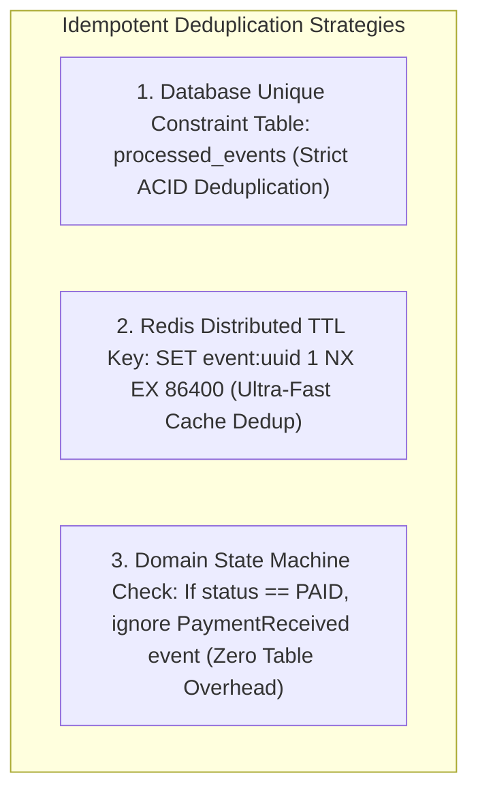

# Idempotent Event Processing, Deduplication Strategies, and Out-of-Order Handling

---

## 1. What Is It?
An **Idempotent Consumer** is a message consumer designed such that executing the same message multiple times produces the **exact same system state** as executing it once:

$$f(f(x)) = f(x)$$

Because all distributed event brokers (Apache Kafka, AWS SQS, RabbitMQ) provide **At-Least-Once Delivery**, duplicate messages caused by transient network timeouts, consumer retries, and rebalances are inevitable.

---

## 2. Why Does It Exist?
Without idempotent consumer processing:
- A network glitch during a Kafka offset commit causes a payment event to be delivered twice, charging a customer's credit card twice.
- A duplicate inventory deduction event subtracts stock below zero.
- An out-of-order `UserAddressUpdated` event overwrites a newer address with a stale historical address.

---

## 3. Mental Model: The 3 Production Deduplication Strategies



---

## 4. Deep Mechanics: The 3 Strategies

### 1. Database Unique Constraint Table (The Strongest Guarantee)
- Maintains a dedicated table:
  ```sql
  CREATE TABLE processed_events (
      event_id VARCHAR(64) PRIMARY KEY,
      consumer_group VARCHAR(64) NOT NULL,
      processed_at TIMESTAMP WITH TIME ZONE DEFAULT CURRENT_TIMESTAMP NOT NULL
  );
  ```
- The consumer attempts to insert the `event_id` and execute the business state mutation within the **exact same local ACID transaction**:
  - If the `INSERT` succeeds, the transaction commits.
  - If a duplicate message arrives, the `INSERT` throws a `UniqueViolationException` (`23505`), triggering a safe transaction rollback and acknowledging the Kafka offset without duplicate side effects.

---

### 2. Redis Distributed Deduplication (High-Throughput)
- For high-volume systems ($> 50,000\text{ msg/sec}$) where database unique index inserts create I/O bottlenecks:
  ```bash
  SET event:dedup:9a4b81c2 1 NX EX 86400
  ```
- If Redis returns `null` (key already exists), the consumer skips processing immediately ($< 0.5\text{ms}$).

---

### 3. Domain State Machine Idempotency (Natural Idempotency)
- Design domain state transitions to reject invalid historical inputs:
  ```mermaid
  stateDiagram-v2
      [*] --> PENDING
      PENDING --> PAID: PaymentSuccess Event (Valid)
      PAID --> PAID: Duplicate PaymentSuccess Event (No-op / Ignored!)
      PAID --> SHIPPED: OrderShipped Event (Valid)
  ```

---

## 5. Handling Out-of-Order Events

When messages arrive out of chronological sequence:
- Event 1 ($T = 10:00$): `EmailUpdated: "alice@new.com"`
- Event 2 ($T = 09:59$ - Delayed): `EmailUpdated: "alice@old.com"`

### Defense: Monotonic Version Tracking & Event Timestamps
Include an immutable `event_version` or `occurred_at` timestamp in the database row:
```sql
UPDATE users 
SET email = :newEmail, version = :eventVersion 
WHERE id = :userId AND version < :eventVersion;
```
If a delayed out-of-order event arrives with `version = 4` when the database is already at `version = 5`, the update affects **0 rows** and is safely discarded.

---

## 6. Implementation: Production Idempotent Consumer in Java 21

```java
package com.backend.engineering.eda.consumer;

import org.slf4j.Logger;
import org.slf4j.LoggerFactory;
import org.springframework.dao.DuplicateKeyException;
import org.springframework.jdbc.core.JdbcTemplate;
import org.springframework.kafka.annotation.KafkaListener;
import org.springframework.kafka.support.Acknowledgment;
import org.springframework.stereotype.Service;
import org.springframework.transaction.annotation.Transactional;

@Service
public class IdempotentPaymentConsumer {

    private static final Logger log = LoggerFactory.getLogger(IdempotentPaymentConsumer.class);
    private final JdbcTemplate jdbcTemplate;
    private final AccountBalanceService balanceService;

    public IdempotentPaymentConsumer(JdbcTemplate jdbcTemplate, AccountBalanceService balanceService) {
        this.jdbcTemplate = jdbcTemplate;
        this.balanceService = balanceService;
    }

    @KafkaListener(topics = "payments.v1", groupId = "payment-ledger-group")
    @Transactional
    public void processPaymentEvent(PaymentEvent event, Acknowledgment ack) {
        log.info("Received Payment Event: ID={}, OrderID={}, Amount={}", 
                 event.eventId(), event.orderId(), event.amountCents());

        try {
            // 1. Atomic Deduplication Insert
            jdbcTemplate.update(
                "INSERT INTO processed_events (event_id, consumer_group, processed_at) VALUES (?, 'payment-ledger', CURRENT_TIMESTAMP)",
                event.eventId()
            );

            // 2. Business Mutation (Within the exact same local ACID transaction)
            balanceService.creditAccount(event.userId(), event.amountCents());

            // 3. Acknowledge Kafka Offset
            ack.acknowledge();
            log.info("Payment event {} successfully processed.", event.eventId());

        } catch (DuplicateKeyException ex) {
            // DUPLICATE DETECTED: Acknowledge offset and exit cleanly!
            log.warn("Duplicate payment event detected [ID: {}]. Discarding safely without duplicate credit.", event.eventId());
            ack.acknowledge();
        }
    }
}

public record PaymentEvent(String eventId, Long orderId, Long userId, int amountCents) {}
```

---

## 7. Performance

| Deduplication Mechanism | Latency Overhead | Memory/Storage Cost | Consistency Guarantee |
|---|---|---|---|
| DB Deduplication Table | $\approx 1.5 - 3.0\text{ms}$ | 64 bytes per event (Clean via TTL partition) | **100% ACID Guaranteed** |
| Redis `SETNX` Deduplication | $\mathbf{< 0.5\text{ms}}$ | In-memory RAM ($24\text{h TTL}$) | High (Small risk if Redis crashes) |
| State Machine Invariant | $\mathbf{0\text{ms}}$ | **Zero extra tables** | **Maximum** |

---

## 8. Interview Questions

### Q1: Why is At-Least-Once Delivery combined with an Idempotent Consumer considered the industry standard for distributed messaging?
<details>
<summary>Reveal Answer</summary>

**Answer**:
In distributed systems, true end-to-end **Exactly-Once Delivery** across network boundaries is physically impossible without complex distributed transactions (2PC) that destroy performance and availability.
Instead, distributed systems combine two highly efficient patterns:
1. **At-Least-Once Delivery**: The broker and producer guarantee that messages are never lost, retrying across network partitions until an acknowledgment is received.
2. **Idempotent Consumer**: The consumer tracks message uniqueness (via database constraints or state machine checks) so that duplicate deliveries produce zero additional side-effects.
This achieves the mathematical equivalent of **Exactly-Once Processing Semantics** while maintaining ultra-high throughput and fault tolerance.
</details>

---

## 9. Quick Revision
- **At-Least-Once + Idempotent Consumer = Exactly-Once Semantics**.
- **DB Unique Table**: The gold standard for ACID transaction deduplication.
- **Redis `SETNX`**: High-throughput deduplication with 24-hour sliding TTL windows.
- **Out-of-Order Defense**: Monotonic version numbers (`version < eventVersion`) prevent stale state overwrites.
