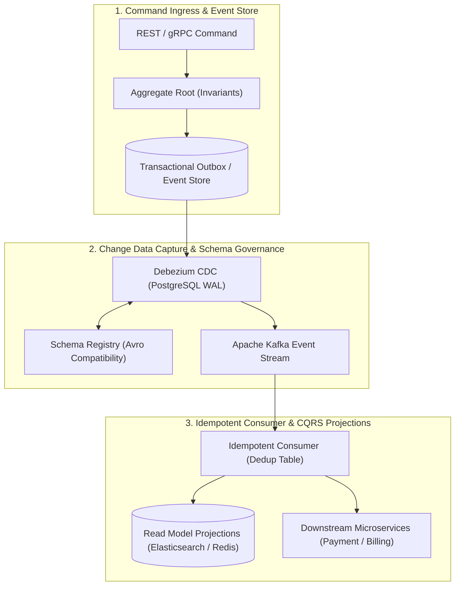

# Module 12: Event-Driven Architecture

Master modern enterprise event-driven architectures: Events vs Commands, Event-Carried State Transfer (ECST), Schema Registry evolution (Apache Avro / Protobuf), Eventual Consistency, Change Data Capture (CDC with Debezium), Event Sourcing, CQRS read projections, and Idempotent Consumers with out-of-order event reconciliation.

---

## 🗺️ Master Event-Driven Pipeline & CQRS Flow

---

## 📚 Curriculum Lessons

| # | Lesson | Core Focus & Mechanics |
|:---:|---|---|
| **01** | [`01-eda-core-concepts-events-vs-commands.md`](./01-eda-core-concepts-events-vs-commands.md) | Commands ($1:1$) vs Events ($1:N$), Event Notification vs Event-Carried State Transfer (ECST), and REST vs EDA architectural trade-offs. |
| **02** | [`02-event-schemas-and-evolution-avro-protobuf.md`](./02-event-schemas-and-evolution-avro-protobuf.md) | Apache Avro/Protobuf binary serialization, Confluent Schema Registry 5-byte wire protocol, and `BACKWARD`/`FULL` evolution compatibility rules. |
| **03** | [`03-eventual-consistency-and-cdc-debezium.md`](./03-eventual-consistency-and-cdc-debezium.md) | Eventual consistency convergence, Debezium CDC tailing PostgreSQL WAL (`pgoutput`), and CDC Outbox vs Polling Outbox comparison. |
| **04** | [`04-event-sourcing-and-cqrs-architecture.md`](./04-event-sourcing-and-cqrs-architecture.md) | Immutable event streams as system of record, aggregate rehydration, snapshot optimization, CQRS projections, and historical event replay. |
| **05** | [`05-idempotent-event-processing-and-deduplication.md`](./05-idempotent-event-processing-and-deduplication.md) | The 3 deduplication patterns (DB unique table, Redis `SETNX`, domain state machines), and handling out-of-order events via monotonic version numbers. |

---

## ⚡ Key Production Takeaways

1. **Use ECST to Prevent Stampedes**: Always use Event-Carried State Transfer so consumers do not flood upstream source services with reverse query REST calls.
2. **Schema Registry Governance**: Enforce binary schema validation (Avro/Protobuf) in CI/CD pipelines to prevent downstream deserialization crashes.
3. **CDC Eliminates Dual-Writes**: Use Debezium CDC to stream database mutations directly from the WAL with guaranteed zero lost events.
4. **Idempotence is Mandatory**: Always implement consumer deduplication tables to achieve exactly-once semantics over at-least-once message delivery.
5. **Monotonic Versioning**: Defend against out-of-order events by enforcing `WHERE version < :eventVersion` on database state updates.
