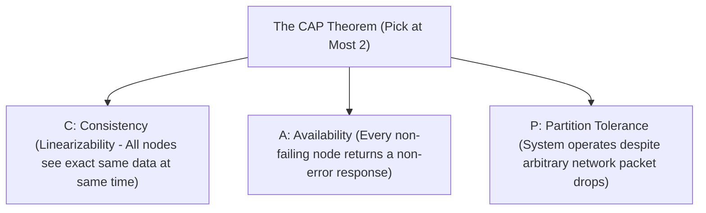
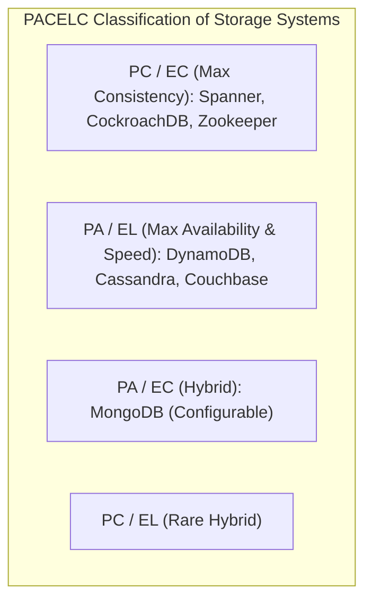

# The CAP Theorem, PACELC Model, and Service-Level Trade-offs

---

## 1. What Is It?
The **CAP Theorem** (Brewer's Theorem) and the **PACELC Model** are foundational distributed systems frameworks that define the mathematical trade-offs between **Consistency (Linearizability)**, **Availability**, and **Latency** in the presence and absence of **Network Partitions**.

---

## 2. The CAP Theorem



### The Real-World Rule: You Cannot "Choose" CA
$$\textbf{"In a distributed network, Network Partitions (P) are an inevitable physical reality. You MUST choose between CP and AP."}$$

1. **CP Systems (Consistency + Partition Tolerance)**:
   - When a network partition occurs, the system **rejects writes or returns errors** to prevent inconsistent split-brain states (e.g. Raft controllers, ZooKeeper, CockroachDB, PostgreSQL synchronous replicas).
2. **AP Systems (Availability + Partition Tolerance)**:
   - When a network partition occurs, both partitioned halves **accept writes independently**, guaranteeing availability at the cost of temporary data divergence (e.g. Apache Cassandra, AWS DynamoDB with eventual consistency).

---

## 3. The PACELC Model (The Complete Picture)

CAP only describes behavior *during a rare network partition*. **PACELC** models system trade-offs during normal $99.99\%$ steady-state operations as well:

$$\textbf{PACELC: } \text{If } \mathbf{P} \text{ (Partition) } \longrightarrow \text{Choose } \mathbf{A} \lor \mathbf{C}, \quad \mathbf{E} \text{lse (Normal State) } \longrightarrow \text{Choose } \mathbf{L} \text{ (Latency)} \lor \mathbf{C} \text{ (Consistency)}$$



---

## 4. Service-Level Implementation: Tunable Consistency (Quorum Calculus)

In distributed databases (Cassandra, DynamoDB), consistency is configurable per query using **Quorum Math**:
- $N$: Total Replication Factor (e.g. 3 copies of data).
- $W$: Number of replicas that must acknowledge a **Write**.
- $R$: Number of replicas that must respond to a **Read**.

$$\textbf{Strong Consistency (Linearizability) Invariant: } W + R > N$$

```mermaid
flowchart LR
    subgraph StrongQuorum["Strong Consistency Quorum (W + R > N: 2 + 2 > 3)"]
        W1["Write Replica 1 (Ack)"]
        W2["Write Replica 2 (Ack)"]
        W3["Write Replica 3 (Missed)"]
        
        R1["Read Replica 2 (Fresh)"]
        R2["Read Replica 3 (Stale)"]
    end
    Note over StrongQuorum: Overlapping intersection ensures Read ALWAYS includes at least one fresh replica!
```

---

## 5. Performance & Trade-offs

| System Configuration | Read Latency | Write Latency | Partition Behavior |
|---|---|---|---|
| **CP / Strong Quorum ($W=2, R=2, N=3$)** | $5 - 20\text{ms}$ (Waits for 2 nodes) | $5 - 20\text{ms}$ | Fails write if 2 nodes are down |
| **AP / Eventual ($W=1, R=1, N=3$)** | $\mathbf{< 1\text{ms}}$ (Fastest local replica) | $\mathbf{< 1\text{ms}}$ | **Always Available** |

---

## 6. Interview Questions

### Q1: Why is it technically incorrect to claim that a distributed system is "CA" (Consistent and Available)?
<details>
<summary>Reveal Answer</summary>

**Answer**:
A distributed system spans multiple physical servers communicating over network cables, switches, and routers.
Network partitions (packet loss, fiber cuts, switch reboots, GC pauses) are **inevitable physical realities** in distributed hardware. When a partition occurs, nodes on Side A cannot communicate with nodes on Side B.
If an application allows both sides to accept writes, the data diverges (**Loss of Consistency** $\longrightarrow$ AP). If the application rejects writes on one side to preserve consistency, it becomes unavailable (**Loss of Availability** $\longrightarrow$ CP).
Because Partition Tolerance ($P$) cannot be avoided, a system can only choose between **CP** and **AP**. A "CA" system can only exist if the network is mathematically 100% reliable and latency-free, which is physically impossible.
</details>

---

## 7. Quick Revision
- **CAP Theorem**: Under network partition, choose Consistency (CP) or Availability (AP).
- **PACELC**: Extends CAP to model Latency vs Consistency during normal non-partitioned operation.
- **Quorum Calculus**: $W + R > N$ guarantees strong consistency via overlapping replica sets.
- **CP Standard**: PostgreSQL Sync Replicas, CockroachDB, Raft controllers.
- **AP Standard**: Cassandra, DynamoDB eventual reads, DNS caching.
