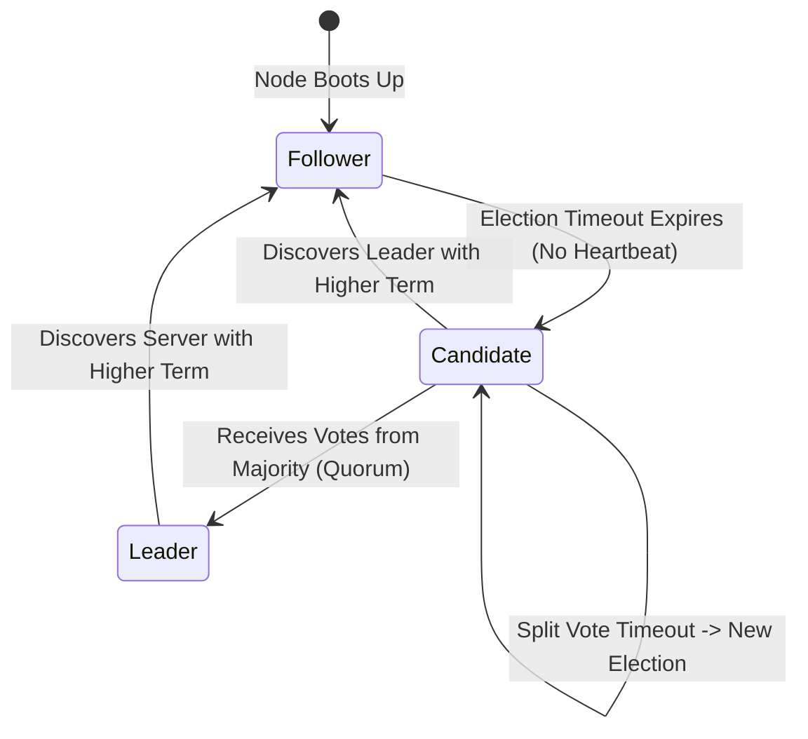

# Distributed Consensus, The Raft Protocol, and Leader Election

---

## 1. What Is It?
**Distributed Consensus** is the fundamental algorithmic process by which a cluster of independent, network-separated physical server nodes agree on a shared state, commit sequence, or leader identity, even in the presence of node crashes, message delays, and network partitions.

**Raft** is the dominant, understandable consensus protocol powering modern distributed backends (Apache Kafka KRaft, etcd/Kubernetes, CockroachDB, HashiCorp Consul).

---

## 2. Why Does It Exist?
In distributed systems:
- Nodes crash without warning.
- Network partitions split clusters in half.
- If two nodes both believe they are the active Leader (**Split-Brain Anomaly**), they accept conflicting writes, causing irrecoverable data corruption.

Consensus protocols guarantee that a cluster functions as a **single, unified, fault-tolerant state machine** with a mathematically proven majority quorum.

---

## 3. Mental Model: Raft Node State Transitions



---

## 4. How Does It Work?

### 1. The 3 Raft Sub-Problems
1. **Leader Election**: Selecting a single leader when the current leader fails.
2. **Log Replication**: Leader accepts client mutations, writes them to its log, and forces follower logs to match its own.
3. **Safety**: If any server commits a log entry, no other server can commit a different entry for that index.

---

### 2. Majority Quorum Math & Why Odd Node Counts (3, 5, 7)
A Raft cluster of size $N$ requires a **Strict Majority Quorum**:

$$Q = \left\lfloor \frac{N}{2} \right\rfloor + 1$$

- **3-Node Cluster**: $Q = 2$. Can tolerate **1 node failure**.
- **5-Node Cluster**: $Q = 3$. Can tolerate **2 node failures**.
- **4-Node Cluster**: $Q = 3$. Can tolerate only **1 node failure** (Adding a 4th node provides zero extra fault tolerance while increasing network coordination!).

$$\textbf{Split-Brain Prevention: } \text{Any two majorities in a cluster of size } N \text{ MUST overlap by at least one node!}$$

```mermaid
flowchart TD
    subgraph NetworkPartition["Network Partition (5-Node Cluster: 3 vs 2)"]
        subgraph MajoritySide["Majority Partition (3 Nodes) - HEALTHY"]
            N1["Node 1 (Leader)"]
            N2["Node 2 (Follower)"]
            N3["Node 3 (Follower)"]
            Note over MajoritySide: 3 >= 3 Quorum -> ACCEPTS WRITES!
        end

        subgraph MinoritySide["Minority Partition (2 Nodes) - FROZEN"]
            N4["Node 4 (Follower)"]
            N5["Node 5 (Follower)"]
            Note over MinoritySide: 2 < 3 Quorum -> REJECTS ALL WRITES!
        end
    end
```

---

## 5. Internal Working: Leader Election Step-by-Step

1. **Heartbeat Timeout**: Follower nodes expect regular heartbeats (`AppendEntries`) from the Leader every $50\text{ms}$.
2. **Randomized Election Timeouts ($150 - 300\text{ms}$)**:
   - If a follower hears no heartbeat, its randomized election timer expires.
   - It increments its **Term** number ($Term = 2$), transitions to **Candidate**, votes for itself, and broadcasts `RequestVote` RPCs to all peers.
3. **Vote Granting Rules**:
   - A node grants a vote only if:
     1. The candidate's Term is $\ge$ node's current Term.
     2. The node has not voted for another candidate in this Term.
     3. The candidate's log is **at least as up-to-date** as the node's log.
4. **Leader Established**: The candidate receives votes from a majority ($\ge 2$ out of 3) and begins broadcasting heartbeats immediately.

---

## 6. Implementation: Spring Cloud Leader Election with Kubernetes Leases

```java
package com.backend.engineering.distributed.leadership;

import org.slf4j.Logger;
import org.slf4j.LoggerFactory;
import org.springframework.context.event.EventListener;
import org.springframework.integration.leader.event.OnGrantedEvent;
import org.springframework.integration.leader.event.OnRevokedEvent;
import org.springframework.stereotype.Component;

@Component
public class DistributedCronSchedulerLeader {

    private static final Logger log = LoggerFactory.getLogger(DistributedCronSchedulerLeader.class);
    private volatile boolean isLeader = false;

    // Triggered when this pod wins the Kubernetes / etcd leader election lease
    @EventListener
    public void onLeadershipGranted(OnGrantedEvent event) {
        this.isLeader = true;
        log.info("LEADERSHIP GRANTED! This instance is now the primary leader for cron tasks: {}", event.getRole());
        startBackgroundJobCoordinator();
    }

    // Triggered when lease expires or pod is revoked
    @EventListener
    public void onLeadershipRevoked(OnRevokedEvent event) {
        this.isLeader = false;
        log.warn("LEADERSHIP REVOKED! Pausing all singleton background job executions: {}", event.getRole());
        stopBackgroundJobCoordinator();
    }

    public boolean isCurrentLeader() {
        return isLeader;
    }

    private void startBackgroundJobCoordinator() {
        // Run singleton batch cron workflows
    }

    private void stopBackgroundJobCoordinator() {
        // Cleanly pause in-flight singleton jobs
    }
}
```

---

## 7. Performance

| Consensus Operation | Protocol | Latency ($3\text{ Nodes, LAN}$) | Latency ($3\text{ Nodes, WAN}$) |
|---|---|---|---|
| Single Log Commit | Raft / Paxos | $1.5 - 4\text{ms}$ | $40 - 150\text{ms}$ (Network RTT bounded) |
| Leader Election Failover | Raft | $\mathbf{\approx 300 - 500\text{ms}}$ | $\approx 1 - 2\text{ seconds}$ |

---

## 8. Failure Scenarios

1. **Split-Vote Live Lock**:
   - *Failure*: If all nodes use identical election timeouts ($150\text{ms}$), 3 followers transition to Candidate at the exact same millisecond, splitting votes $1-1-1$. Nobody achieves quorum.
   - *Mitigation*: **Randomized Election Timeouts** ($150 - 300\text{ms}$) ensure one candidate's timer always fires first, winning majority votes cleanly.

---

## 9. Interview Questions

### Q1: Why does Raft use randomized election timeouts?
<details>
<summary>Reveal Answer</summary>

**Answer**:
If all nodes in a cluster had identical fixed election timeouts (e.g. 200ms), when the leader fails, all follower nodes would timeout at the exact same millisecond. Each node would vote for itself, split the votes evenly, and fail to obtain a majority quorum. They would then restart another election at the same time, leading to an **infinite split-vote livelock**.
Randomizing election timeouts across a range (e.g. $150\text{ms} - 300\text{ms}$) ensures that **one node's timer almost always expires before the others**. That node increments its term, requests votes, and secures a majority quorum before competitors wake up.
</details>

---

## 10. Quick Revision
- **Raft Roles**: Follower, Candidate, Leader.
- **Quorum Rule**: Majority $Q = \lfloor N/2 \rfloor + 1$ prevents split-brain.
- **Odd Nodes**: Always use 3, 5, or 7 nodes (even node counts add overhead without adding fault tolerance).
- **Raft Log Matching**: Leader's log is authoritative; follower logs are overwritten to match.
