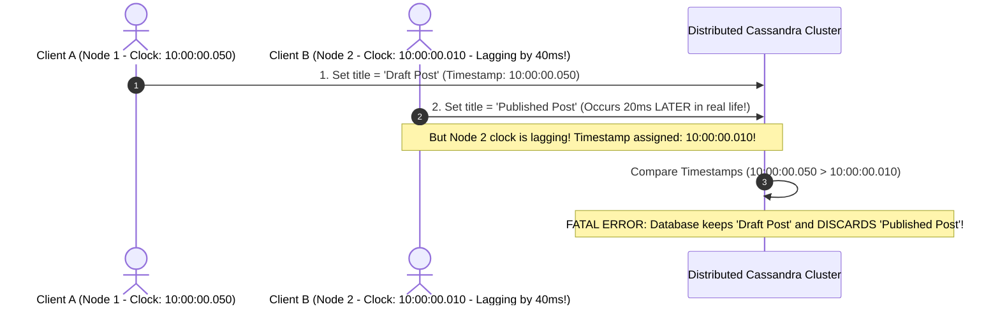
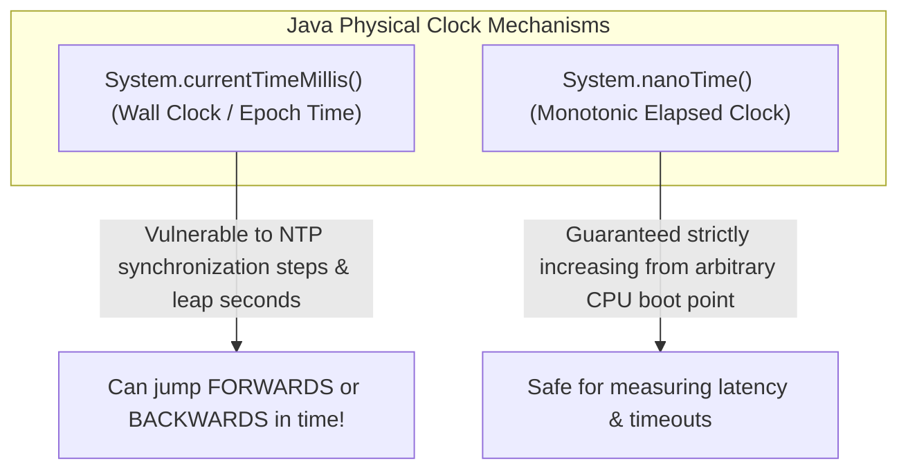
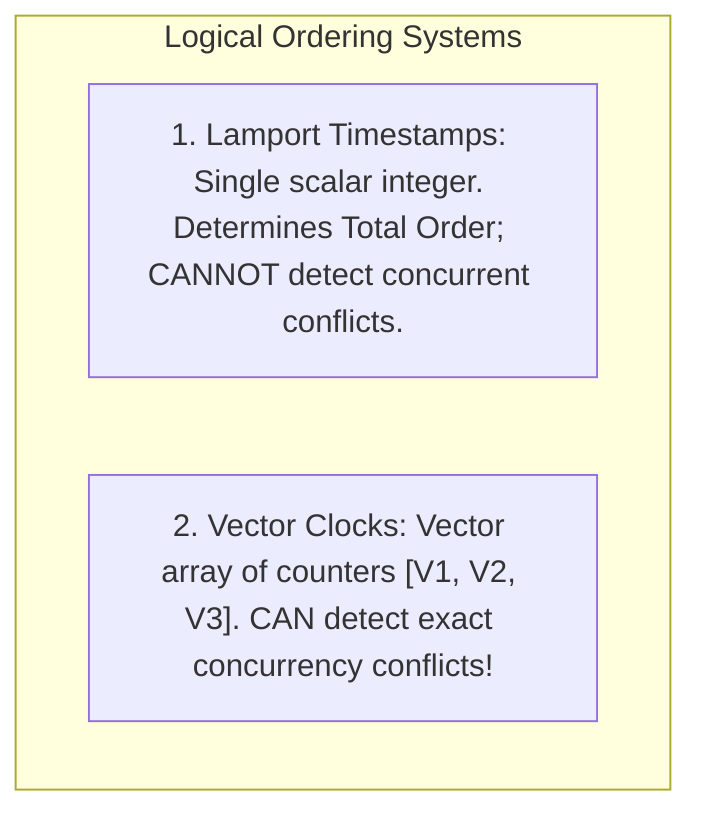

# Physical Clocks, Clock Skew, Vector Clocks, and TrueTime

---

## 1. What Is It?
In distributed systems, physical hardware quartz clocks on different servers drift constantly due to temperature, voltage, and hardware variations (**Clock Drift**). 

Because perfect physical clock synchronization is impossible across networks, distributed systems distinguish between:
1. **Physical Wall Clocks (Time-of-Day)**: Subject to **Clock Skew** and NTP jumps.
2. **Monotonic Clocks**: Measure elapsed duration on a single machine.
3. **Logical Clocks (Lamport Timestamps & Vector Clocks)**: Track causal ordering of events based on message exchange rather than physical time.
4. **Hybrid Logical Clocks (HLC) & TrueTime**: State-of-the-art clocks combining bounded physical timestamps with logical sequence counters.

---

## 2. Why Does It Exist?
If a distributed database relies on physical wall clock timestamps to order writes (**Last-Write-Wins / LWW**):



A lagging clock of just a few milliseconds can silently discard valid user updates!

---

## 3. Physical Clocks: Wall Clock vs Monotonic Clock



$$\textbf{Production Rule: } \text{Never use } \texttt{System.currentTimeMillis()} \text{ to measure elapsed duration! Use } \texttt{System.nanoTime()}.$$

---

## 4. Logical Clocks: Lamport Timestamps vs Vector Clocks



### Vector Clock Conflict Detection
Each node maintains a vector array $V[1..N]$:
- Before sending a message, Node $i$ increments $V[i] = V[i] + 1$.
- Upon receiving a vector $V_{msg}$, Node $i$ sets:
  $$V_{local}[k] = \max(V_{local}[k], V_{msg}[k]) \quad \forall k$$
- **Conflict Rule**: If $V_A$ is neither strictly greater than nor less than $V_B$, the two events occurred **concurrently**, alerting the application to reconcile state (e.g. Git merge conflict or shopping cart reconciliation).

---

## 5. Google TrueTime & Hybrid Logical Clocks (HLC)

### Google TrueTime (Google Spanner)
Google solved the physical clock problem by installing **GPS receivers and Atomic Rubidium Clocks** directly in every Google datacenter:
- The TrueTime API returns a time interval: $[t.earliest, t.latest]$ with a **bounded uncertainty $\epsilon \approx \pm 1\text{ms}$**.
- **Commit-Wait Rule**: Before committing a transaction, the server intentionally waits for $2\epsilon$ ($7\text{ms}$). This mathematically guarantees that no future transaction anywhere on Earth can ever be assigned an earlier timestamp, achieving **Strict Serializability globally**.

---

## 6. Implementation: Hybrid Logical Clock (HLC) in Java 21

```java
package com.backend.engineering.distributed.clocks;

public class HybridLogicalClock {

    private long physicalTime = 0;
    private int logicalCounter = 0;

    public record HlcTimestamp(long physicalTime, int logicalCounter) implements Comparable<HlcTimestamp> {
        @Override
        public int compareTo(HlcTimestamp o) {
            int cmp = Long.compare(this.physicalTime, o.physicalTime);
            return (cmp != 0) ? cmp : Integer.compare(this.logicalCounter, o.logicalCounter);
        }
    }

    // Generate new event timestamp locally
    public synchronized HlcTimestamp now() {
        long currentPhysical = System.currentTimeMillis();
        if (currentPhysical > this.physicalTime) {
            this.physicalTime = currentPhysical;
            this.logicalCounter = 0;
        } else {
            this.logicalCounter++;
        }
        return new HlcTimestamp(this.physicalTime, this.logicalCounter);
    }

    // Update clock upon receiving a remote message
    public synchronized HlcTimestamp updateOnReceive(HlcTimestamp remoteHlc) {
        long currentPhysical = System.currentTimeMillis();
        long maxPhysical = Math.max(Math.max(this.physicalTime, remoteHlc.physicalTime()), currentPhysical);

        if (maxPhysical == this.physicalTime && maxPhysical == remoteHlc.physicalTime()) {
            this.logicalCounter = Math.max(this.logicalCounter, remoteHlc.logicalCounter()) + 1;
        } else if (maxPhysical == this.physicalTime) {
            this.logicalCounter++;
        } else if (maxPhysical == remoteHlc.physicalTime()) {
            this.logicalCounter = remoteHlc.logicalCounter() + 1;
        } else {
            this.logicalCounter = 0;
        }

        this.physicalTime = maxPhysical;
        return new HlcTimestamp(this.physicalTime, this.logicalCounter);
    }
}
```

---

## 7. Performance & Trade-offs

| Clock Mechanism | Hardware Requirement | Clock Skew Vulnerability | Can Detect Concurrent Conflicts? |
|---|---|---|:---:|
| **Physical NTP Wall Clock** | Standard Server | High ($10 - 100\text{ms}$) | ❌ No (LWW data loss) |
| **Vector Clocks** | Standard Server | **Zero** | ✅ **Yes** |
| **Google TrueTime** | GPS + Atomic Clocks | Bounded ($\pm 1\text{ms}$) | ✅ **Yes (via Commit-Wait)** |
| **Hybrid Logical Clock (HLC)**| Standard Server | Bounded by max drift | ✅ **Yes** |

---

## 8. Interview Questions

### Q1: What is the difference between `System.currentTimeMillis()` and `System.nanoTime()` in Java?
<details>
<summary>Reveal Answer</summary>

**Answer**:
1. **`System.currentTimeMillis()`** returns the current **Wall Clock Time** (Unix Epoch time). It is synchronized with the operating system clock, which is continuously adjusted by the **Network Time Protocol (NTP)**. If NTP detects drift, the OS clock can step **backwards or forwards in time abruptly**. Using it to measure method latency can result in negative elapsed times.
2. **`System.nanoTime()`** reads from the CPU's **Monotonic Clock** (e.g. `RDTSC` cycle counter). It has zero relation to wall clock time and cannot tell the time of day, but is **mathematically guaranteed to move strictly forward at a constant rate**. It is the only safe API in Java for measuring elapsed duration, timeouts, and benchmarking latencies.
</details>

---

## 9. Quick Revision
- **Clock Drift**: Physical clocks drift continuously due to temperature and hardware limits.
- **LWW Hazard**: Last-Write-Wins using physical timestamps causes silent data loss on skewed clocks.
- **Monotonic Clocks**: `System.nanoTime()` is strictly monotonic; use for latency measurements.
- **Vector Clocks**: Vector of counters used to detect concurrent conflict branches.
- **TrueTime**: Combines GPS + Atomic clocks with commit-wait delays to achieve global serializability.
