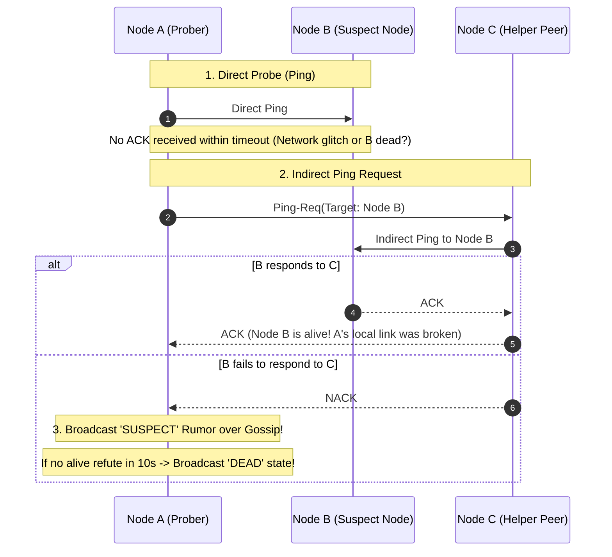

# Failure Detectors, Heartbeats, and The Gossip Protocol (SWIM)

---

## 1. What Is It?
In distributed systems, a **Failure Detector** is a localized algorithmic subsystem that monitors remote nodes across a network and accurately determines whether a node is **Alive**, **Suspicious**, or **Dead**.

The **Gossip Protocol (Epidemic Algorithm)** is a decentralized peer-to-peer protocol where nodes periodically exchange membership state and failure rumors with randomly selected peers, propagating global cluster state in $O(\log N)$ rounds without a centralized coordinator.

---

## 2. Why Does It Exist?
In real-world distributed networks:
- Nodes experience transient CPU spikes, Garbage Collection pauses, and network congestion.
- A fixed heartbeat timeout (e.g. "declare dead if no reply in 5 seconds") produces frequent **False Positives**: an overloaded node undergoing a 6-second GC pause is mistakenly marked dead, triggering unnecessary data rebalancing and cluster churn.
- Conversely, setting the timeout to 60 seconds delays failover, causing traffic outages.

---

## 3. Mental Model: Heartbeat vs Gossip Failure Detection

```mermaid
flowchart TD
    subgraph FixedHeartbeat["1. Fixed Heartbeat (Centralized Master / Point-to-Point)"]
        Master["Master Node"] -->|Ping / Timeout 5s| NodeA["Node A"]
        Master -->|Ping / Timeout 5s| NodeB["Node B"]
        Note over Master,NodeB: Master is a bottleneck (O(N) network load) and SPOF
    end

    subgraph GossipProtocol["2. Gossip / Epidemic Protocol (Decentralized Peer-to-Peer)"]
        G1["Node 1"] <-->|Random Gossip Exchange| G2["Node 2"]
        G2 <-->|Random Gossip Exchange| G3["Node 3"]
        G3 <-->|Random Gossip Exchange| G4["Node 4"]
        G4 <-->|Random Gossip Exchange| G1
        Note over G1,G4: O(1) load per node; global state converges in O(log N) rounds!
    end
```

---

## 4. How Does It Work?

### 1. The $\Phi$ (Phi) Accrual Failure Detector (Cassandra / Akka)
Instead of returning a binary `true/false` (Dead or Alive), the **$\Phi$ Accrual Failure Detector** returns a **continuous probability scale ($\Phi$)** representing the likelihood that a node has failed:

$$\Phi = -\log_{10}(P_{\text{later}}(t - t_{\text{last}}))$$

- The detector records a sliding window of historical heartbeat arrival times and fits a normal distribution.
- If $\Phi = 1$, there is a $10\%$ chance of false positive.
- If $\Phi = 8$, there is a $0.000001\%$ chance of false positive.
- **Advantage**: Automatically adapts to fluctuating network latency; tolerates expected jitter while detecting true hard crashes rapidly.

---

### 2. The SWIM Protocol (Structured Weak-Consistency Infection-Style Process Group)
SWIM is the industry-standard decentralized gossip protocol powering **HashiCorp Consul** and **Cassandra**:



---

## 5. Implementation: Gossip Membership Exchange in Java 21

```java
package com.backend.engineering.distributed.failure;

import java.util.*;
import java.util.concurrent.ConcurrentHashMap;
import java.util.concurrent.ThreadLocalRandom;

public class GossipNodeMember {

    private final String nodeId;
    private final Map<String, NodeState> membershipTable = new ConcurrentHashMap<>();

    public record NodeState(long heartbeatCounter, long localTimestamp, Status status) {}
    public enum Status { ALIVE, SUSPECT, DEAD }

    public GossipNodeMember(String nodeId, List<String> initialPeers) {
        this.nodeId = nodeId;
        this.membershipTable.put(nodeId, new NodeState(1, System.currentTimeMillis(), Status.ALIVE));
        for (String peer : initialPeers) {
            this.membershipTable.put(peer, new NodeState(0, System.currentTimeMillis(), Status.ALIVE));
        }
    }

    // Executed periodically (e.g. every 1 second)
    public void gossipPeriod() {
        // 1. Increment own heartbeat counter
        NodeState self = membershipTable.get(nodeId);
        membershipTable.put(nodeId, new NodeState(self.heartbeatCounter() + 1, System.currentTimeMillis(), Status.ALIVE));

        // 2. Select random peer
        List<String> peers = new ArrayList<>(membershipTable.keySet());
        peers.remove(nodeId);
        if (peers.isEmpty()) return;

        String randomPeer = peers.get(ThreadLocalRandom.current().nextInt(peers.size()));
        
        // 3. Send membership table digest over UDP to random peer
        sendGossipDigest(randomPeer, this.membershipTable);

        // 4. Check for node timeouts locally
        long now = System.currentTimeMillis();
        for (Map.Entry<String, NodeState> entry : membershipTable.entrySet()) {
            if (!entry.getKey().equals(nodeId) && entry.getValue().status() == Status.ALIVE) {
                if (now - entry.getValue().localTimestamp() > 10_000) { // 10s without heartbeat update
                    membershipTable.put(entry.getKey(), new NodeState(entry.getValue().heartbeatCounter(), now, Status.SUSPECT));
                }
            }
        }
    }

    // Merge incoming gossip table
    public synchronized void receiveGossipDigest(Map<String, NodeState> remoteTable) {
        long now = System.currentTimeMillis();
        for (Map.Entry<String, NodeState> remoteEntry : remoteTable.entrySet()) {
            String remoteNode = remoteEntry.getKey();
            NodeState remoteState = remoteEntry.getValue();
            NodeState localState = membershipTable.get(remoteNode);

            if (localState == null || remoteState.heartbeatCounter() > localState.heartbeatCounter()) {
                // Remote has fresher information!
                membershipTable.put(remoteNode, new NodeState(remoteState.heartbeatCounter(), now, Status.ALIVE));
            }
        }
    }

    private void sendGossipDigest(String peer, Map<String, NodeState> table) {
        // Network UDP dispatch
    }
}
```

---

## 6. Performance

| Failure Detection Protocol | Network Bandwidth per Node | Convergence Speed | Scalability Limits |
|---|---|---|---|
| Centralized Heartbeats | $O(N)$ on Master | Instant on Master | Bottlenecked at $\approx 1,000\text{ nodes}$ |
| **Gossip Protocol (SWIM)** | **$O(1)$ Constant (Fixed UDP rate)** | **$O(\log N)$ rounds** | **Proven on $100,000+\text{ nodes}$** |

---

## 7. Interview Questions

### Q1: Why does the SWIM protocol use Indirect Pings (Ping-Req) before declaring a node suspicious?
<details>
<summary>Reveal Answer</summary>

**Answer**:
In distributed networks, communication between Node A and Node B might fail due to a **localized network link failure, localized routing issue, or packet drop** specific to the link between A and B, while Node B is otherwise completely healthy and communicating normally with all other nodes.
If Node A declared Node B dead based solely on its direct failed ping:
1. It would trigger a false alarm and unnecessary cluster churn.
2. By issuing an **Indirect Ping Request (`Ping-Req`)** to $K$ random peer nodes (e.g. Node C and Node D):
   - If Node C or D successfully pings Node B and receives an ACK, it forwards the ACK back to Node A.
   - Node A learns that Node B is alive and that only its own direct network link is degraded, completely preventing false positive failure declarations.
</details>

---

## 8. Quick Revision
- **Failure Detection Dilemma**: Cannot distinguish between a dead node and a slow network with 100% certainty.
- **$\Phi$ Accrual Detector**: Uses historical heartbeat arrival distributions to return a continuous suspicion probability.
- **Gossip Protocol**: Decentralized membership protocol where nodes share state with random peers ($O(\log N)$ convergence).
- **SWIM Indirect Pings**: Uses peer proxies to prevent false alarms from localized single-link network drops.
