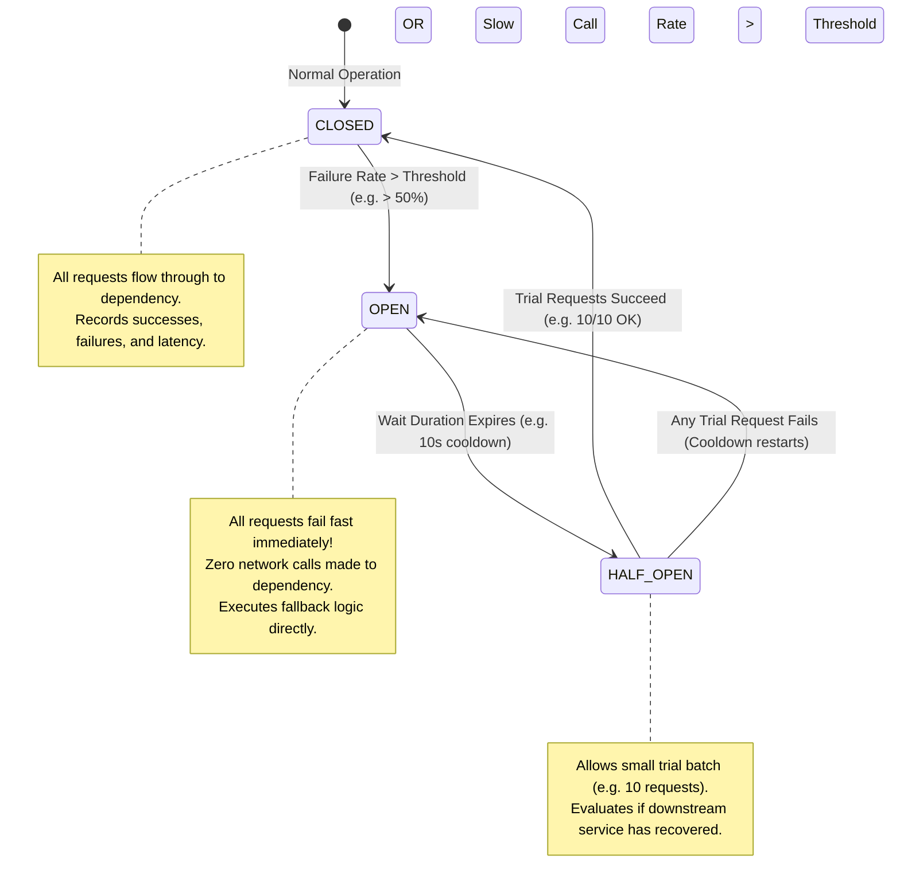

# Lesson 01: Circuit Breaker Pattern & State Transitions

Master the Circuit Breaker pattern, finite state transitions (Closed, Open, Half-Open), sliding window metrics (count-based vs time-based), and Resilience4j production configuration.

---

## 1. What Is It?
- **Circuit Breaker**: A stability pattern that wraps network calls to an external dependency. When the dependency begins failing or timing out at a rate exceeding a configured threshold, the breaker **trips OPEN**, immediately failing fast and returning fallback data without waiting for network timeouts.
- **Resilience4j**: The standard lightweight fault tolerance library for modern Java and Spring Boot.

---

## 2. Why Does It Exist?
When a third-party payment gateway or downstream database slows down from $50\text{ms}$ to $30\text{s}$, incoming client requests wait for 30 seconds. In a thread-per-request architecture (Tomcat), 200 concurrent requests consume all 200 server threads within seconds, causing a complete cascading crash of your entire backend.

---

## 3. Mental Model: Circuit Breaker State Machine



---

## 4. How Does It Work: Sliding Window Metrics

Resilience4j tracks metrics using circular ring buffers:

| Window Type | Mechanism | Memory Overhead | Best Use Case |
|---|---|---|---|
| **Count-Based** | Measures the last $N$ calls (e.g., last 100 requests) | $O(N)$ minimal ($< 1\text{KB}$) | High-throughput steady traffic |
| **Time-Based** | Measures all calls in the last $T$ seconds (e.g., last 60s) | Circular array of epoch buckets | Low-volume or bursty traffic |

---

## 5. Internal Working: Evaluation Invariants

A Circuit Breaker in `CLOSED` state transitions to `OPEN` if:
1. `minimumNumberOfCalls` is reached (prevents tripping on 1 single failed call on boot).
2. **Failure Rate**: $\frac{\text{Failed Calls}}{\text{Total Calls in Window}} \times 100 \ge \text{failureRateThreshold}$ (e.g. $\ge 50\%$).
3. **Slow Call Rate**: $\frac{\text{Calls with Latency} > \text{slowCallDurationThreshold}}{\text{Total Calls in Window}} \times 100 \ge \text{slowCallRateThreshold}$.

---

## 6. Example & Production Java 21 Code

Resilience4j Circuit Breaker with Custom Fallback in Java 21:

```java
package com.backend.resilience.circuitbreaker;

import io.github.resilience4j.circuitbreaker.CircuitBreaker;
import io.github.resilience4j.circuitbreaker.CircuitBreakerConfig;
import io.github.resilience4j.circuitbreaker.CircuitBreakerRegistry;
import org.slf4j.Logger;
import org.slf4j.LoggerFactory;

import java.time.Duration;
import java.util.function.Supplier;

public class PaymentGatewayClient {

    private static final Logger log = LoggerFactory.getLogger(PaymentGatewayClient.class);
    private final CircuitBreaker circuitBreaker;

    public PaymentGatewayClient() {
        CircuitBreakerConfig config = CircuitBreakerConfig.custom()
            .slidingWindowType(CircuitBreakerConfig.SlidingWindowType.COUNT_BASED)
            .slidingWindowSize(20)
            .minimumNumberOfCalls(10)
            .failureRateThreshold(50.0f) // Trip OPEN if 50% fail
            .slowCallDurationThreshold(Duration.ofMillis(1000)) // Calls > 1s are marked slow
            .slowCallRateThreshold(70.0f) // Trip OPEN if 70% are slow
            .waitDurationInOpenState(Duration.ofSeconds(10)) // Cooldown before HALF_OPEN
            .permittedNumberOfCallsInHalfOpenState(5) // Trial probe requests
            .automaticTransitionFromOpenToHalfOpenEnabled(true)
            .build();

        CircuitBreakerRegistry registry = CircuitBreakerRegistry.of(config);
        this.circuitBreaker = registry.circuitBreaker("paymentGateway");

        // Event Listeners for Observability
        circuitBreaker.getEventPublisher()
            .onStateTransition(event -> log.warn("Circuit Breaker Transition: {}", event.getStateTransition()));
    }

    public record PaymentResult(String transactionId, String status, boolean isFallback) {}

    public PaymentResult executePayment(String orderId, double amount) {
        Supplier<PaymentResult> decoratedSupplier = CircuitBreaker.decorateSupplier(
            circuitBreaker,
            () -> callThirdPartyGateway(orderId, amount)
        );

        try {
            return decoratedSupplier.get();
        } catch (Exception e) {
            log.error("Payment failed or breaker OPEN! Executing fallback. Reason: {}", e.getMessage());
            return fallbackPayment(orderId, amount, e);
        }
    }

    private PaymentResult callThirdPartyGateway(String orderId, double amount) {
        // Simulated network call
        return new PaymentResult("tx-999", "SUCCESS", false);
    }

    private PaymentResult fallbackPayment(String orderId, double amount, Throwable t) {
        // Fallback: Queue order for offline asynchronous batch settlement
        return new PaymentResult("pending-" + orderId, "QUEUED_OFFLINE", true);
    }
}
```

---

## 7. Performance Characteristics
- Evaluating the circular ring buffer in Resilience4j requires atomic bit-shifts taking $< 0.005\text{ms}$ CPU overhead per call.

---

## 8. Failure Scenarios & Edge Cases
- **Fallback Exception Bug**: If your fallback method itself throws an unhandled `NullPointerException`, the exception propagates upstream, completely neutralizing the benefits of the Circuit Breaker.
  - **Mitigation**: Ensure fallback methods are completely pure, fail-safe, and never throw checked or unchecked exceptions.

---

## 9. Observability (Logs, Metrics, Traces)
```text
# Resilience4j Micrometer Metrics
resilience4j_circuitbreaker_state{name="paymentGateway",state="closed"} 1
resilience4j_circuitbreaker_state{name="paymentGateway",state="open"} 0
resilience4j_circuitbreaker_failure_rate{name="paymentGateway"} 4.2
```

---

## 10. Debugging & Troubleshooting
1. **Force Circuit Breaker State Transition via Actuator**:
   ```bash
   curl -X POST http://localhost:8080/actuator/circuitbreakers/paymentGateway/transitionToOpenState
   ```

---

## 11. Scaling Considerations
- Keep circuit breaker state **local in-memory per pod**. Do not store circuit breaker state in Redis, as network latency to Redis would defeat the purpose of microsecond fail-fast protection.

---

## 12. Architectural Trade-offs
| Strategy | Protection Level | Fallback Availability | Memory Overhead |
|---|---|---|---|
| **Simple Timeout** | Minimal | None | **Zero** |
| **Resilience4j Circuit Breaker**| **Maximum (Self-Healing)** | **High** | **Minimal (KB per service)** |

---

## 13. When to Use
- Wrap **every external REST/gRPC network call** and third-party SaaS integration in a Circuit Breaker.

---

## 14. When NOT to Use
- Do not wrap local in-memory method calls or fast intra-process cache lookups.

---

## 15. SDE2 / Senior Interview Questions & Answers
### Q1: Explain the purpose of the Half-Open state in a Circuit Breaker, and what happens if trial requests fail?
<details>
<summary>Reveal Answer</summary>

**Answer**:
- **Purpose of Half-Open**:
  - When the breaker is in `OPEN` state, it completely blocks all traffic to protect the recovering downstream service from getting hammered.
  - After a configured cooldown duration (e.g., `waitDurationInOpenState = 10s`), the breaker transitions to `HALF_OPEN`.
  - In `HALF_OPEN`, it permits a small, controlled sample of trial requests (e.g., `permittedNumberOfCallsInHalfOpenState = 5`) to pass through.
- **Outcome Evaluation**:
  - **If all trial requests succeed**: The breaker concludes the downstream service has fully recovered and transitions back to `CLOSED`, restoring full normal traffic.
  - **If any trial request fails**: The breaker immediately trips back to `OPEN` for another full cooldown cycle, preventing a fragile recovering service from crashing again.
</details>

---

## 16. Practical Exercise
1. Configure Resilience4j to record `SocketTimeoutException` as failures, but ignore business validation exceptions (`InvalidCouponException`).

---

## 17. Quick Revision Summary
- Circuit Breakers prevent **cascading thread pool exhaustion**.
- The three states are **Closed (Normal), Open (Failing Fast), and Half-Open (Probing Recovery)**.
- Use **Count-Based sliding windows** for high-traffic microservices.
