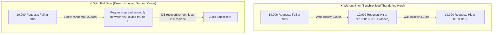

# Lesson 02: Retry, Exponential Backoff & Jitter

Master transient vs non-transient error classification, exponential backoff mathematical modeling, and Jitter algorithms (Full, Equal, Decorrelated) to prevent Thundering Herd catastrophes.

---

## 1. What Is It?
- **Retry Pattern**: Automatically re-executing a failed operation when the failure is believed to be transient.
- **Exponential Backoff**: Progressively doubling the wait time between retry attempts ($T = \text{base} \times 2^{\text{attempt}}$) to allow downstream services time to recover.
- **Jitter**: Injecting cryptographic or pseudo-random randomness into the backoff delay to desynchronize concurrent client retry waves.

---

## 2. Why Does It Exist?
If 10,000 mobile clients fail simultaneously due to a momentary 500ms database spike and all retry after exactly 2.0 seconds, they hit the recovering database with another 10,000 requests at the exact same millisecond. This is the **Thundering Herd Problem**, which permanently knocks the backend offline.

---

## 3. Mental Model: Backoff With vs Without Jitter



---

## 4. How Does It Work: Transient vs Non-Transient Classification

| Error Type | Status Codes / Exceptions | Should Retry? | Action |
|---|---|---|---|
| **Transient Error** | HTTP `503 Service Unavailable`, `504 Gateway Timeout`, `SocketTimeoutException` | **YES ✅** | Retry with Exponential Backoff + Jitter |
| **Non-Transient (Fatal)**| HTTP `400 Bad Request`, `401 Unauthorized`, `404 Not Found`, `422 Unprocessable` | **NO ❌** | Fail fast immediately to caller |
| **Rate Limited** | HTTP `429 Too Many Requests` | **Conditional** | Obey `Retry-After` HTTP header |

---

## 5. Internal Working: Jitter Mathematical Formulations (AWS Architecture)

Let $\text{base} = 100\text{ms}$, $\text{cap} = 10{,}000\text{ms}$, and $\text{temp} = \min(\text{cap}, \text{base} \times 2^{\text{attempt}})$.

1. **No Jitter**:
   $$\text{sleep} = \text{temp}$$
2. **Full Jitter** (Recommended by AWS Architecture):
   $$\text{sleep} = \text{random}(0, \text{temp})$$
3. **Equal Jitter**:
   $$\text{sleep} = \frac{\text{temp}}{2} + \text{random}\left(0, \frac{\text{temp}}{2}\right)$$
4. **Decorrelated Jitter**:
   $$\text{sleep} = \min(\text{cap}, \text{random}(\text{base}, \text{previous\_sleep} \times 3))$$

---

## 6. Example & Production Java 21 Code

Resilient Retry Executor with Full Jitter and Non-Transient Exception Filtering:

```java
package com.backend.resilience.retry;

import org.slf4j.Logger;
import org.slf4j.LoggerFactory;

import java.io.IOException;
import java.time.Duration;
import java.util.concurrent.ThreadLocalRandom;
import java.util.concurrent.Callable;

public class ResilientRetryExecutor {

    private static final Logger log = LoggerFactory.getLogger(ResilientRetryExecutor.class);

    private final int maxAttempts;
    private final Duration baseDelay;
    private final Duration maxDelay;

    public ResilientRetryExecutor(int maxAttempts, Duration baseDelay, Duration maxDelay) {
        this.maxAttempts = maxAttempts;
        this.baseDelay = baseDelay;
        this.maxDelay = maxDelay;
    }

    public <T> T executeWithRetry(Callable<T> operation) throws Exception {
        int attempt = 0;

        while (true) {
            try {
                attempt++;
                return operation.call();
            } catch (Exception e) {
                if (!isTransient(e) || attempt >= maxAttempts) {
                    log.error("Fatal error or exhausted retries (attempt {}/{}). Failing.", attempt, maxAttempts, e);
                    throw e;
                }

                Duration sleepTime = calculateFullJitterDelay(attempt);
                log.warn("Transient error on attempt {}/{}. Backing off for {}ms. Error: {}", 
                    attempt, maxAttempts, sleepTime.toMillis(), e.getMessage());

                try {
                    Thread.sleep(sleepTime.toMillis());
                } catch (InterruptedException ie) {
                    Thread.currentThread().interrupt();
                    throw new RuntimeException("Retry interrupted", ie);
                }
            }
        }
    }

    // Full Jitter Formula: sleep = random(0, min(cap, base * 2^attempt))
    private Duration calculateFullJitterDelay(int attempt) {
        long exponentialBase = baseDelay.toMillis() * (1L << Math.min(attempt, 30)); // Avoid overflow
        long cappedDelay = Math.min(maxDelay.toMillis(), exponentialBase);
        long jitteredDelay = ThreadLocalRandom.current().nextLong(0, cappedDelay + 1);
        return Duration.ofMillis(jitteredDelay);
    }

    private boolean isTransient(Exception e) {
        // Only retry on network I/O timeouts and server 5xx disconnects
        return e instanceof IOException || e instanceof java.net.SocketTimeoutException;
    }
}
```

---

## 7. Performance Characteristics
- Using Full Jitter flattens retry spikes, reducing server queue lengths by $> 85\%$ during mass network recovery events.

---

## 8. Failure Scenarios & Edge Cases
- **Retrying Non-Idempotent Operations**: Retrying a `POST /charge-credit-card` without an `Idempotency-Key` can double-charge a customer's bank account on a connection timeout.
  - **Rule**: Only retry operations that are **strictly idempotent** (GET, PUT, DELETE) or include unique UUID idempotency keys.

---

## 9. Observability (Logs, Metrics, Traces)
```text
# Retry Metrics
retry_attempts_total{operation="fetch_inventory",attempt="1"} 420
retry_attempts_total{operation="fetch_inventory",attempt="2"} 38
retry_exhausted_total{operation="fetch_inventory"} 2
```

---

## 10. Debugging & Troubleshooting
1. **Identify Retry Storms in Grafana**:
   Look for sudden spikes in `5xx` error rates matching the base retry interval frequency ($1\text{s}, 2\text{s}, 4\text{s}$).

---

## 11. Scaling Considerations
- Cap the maximum backoff delay (`maxDelay = 15s`) so user-facing web requests do not hang indefinitely before timing out.

---

## 12. Architectural Trade-offs
| Algorithm | Thundering Herd Defense | Average Wait Time | Implementation Complexity |
|---|---|---|---|
| **Constant Retry** | **Zero (Catastrophic)** | Lowest | Trivial |
| **Exponential Backoff**| Poor (Still synchronized)| Moderate | Low |
| **Full Jitter** | **Maximum (Flattens Spikes)**| **Optimal** | **Low** |

---

## 13. When to Use
- Use **Exponential Backoff with Full Jitter** for all network RPCs, database connection retries, and asynchronous background worker processing.

---

## 14. When NOT to Use
- Do not retry client validation errors (HTTP 400, 422) or authentication errors (HTTP 401, 403).

---

## 15. SDE2 / Senior Interview Questions & Answers
### Q1: What is the Thundering Herd problem during service retries, and why does Exponential Backoff without Jitter fail to solve it?
<details>
<summary>Reveal Answer</summary>

**Answer**:
- **The Problem**:
  - When an outage occurs, thousands of client requests fail simultaneously at time $t = 0$.
  - With standard Exponential Backoff, every client calculates the exact same delay: $2^1 = 2\text{s}$, $2^2 = 4\text{s}$, $2^3 = 8\text{s}$.
  - Even though the intervals grow longer, all 10,000 clients remain **perfectly synchronized** in time. At $t = 2.0\text{s}$, all 10,000 clients hit the recovering server in the exact same millisecond. The server instantly crashes again, and at $t = 6.0\text{s}$ the same wave repeats.
- **The Solution (Full Jitter)**:
  - Jitter introduces a random number generator: $\text{sleep} = \text{random}(0, \text{base} \times 2^{\text{attempt}})$.
  - Instead of hitting at $t = 2.0\text{s}$, the 10,000 requests are evenly distributed across the entire interval from $0.0\text{s}$ to $2.0\text{s}$. The arrival rate is flattened from 10,000 req/ms to a manageable 5 req/ms, allowing the backend to recover gracefully.
</details>

---

## 16. Practical Exercise
1. Implement a unit test simulating 1,000 concurrent client retries and verify that delay timestamps follow a uniform random distribution.

---

## 17. Quick Revision Summary
- Only retry **transient errors** (timeouts, 503s); fail fast on 4xx.
- Always use **Exponential Backoff + Full Jitter** to prevent Thundering Herds.
- Never retry non-idempotent operations without an **Idempotency Key**.
