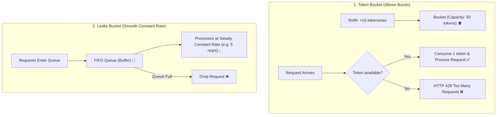

# Lesson 03: Rate Limiting & Throttling Algorithms

Master rate limiting and throttling algorithms: Token Bucket, Leaky Bucket, Fixed Window Counter, Sliding Window Log, Sliding Window Counter, and Redis distributed Lua implementations.

---

## 1. What Is It?
- **Rate Limiting**: Controlling the rate at which requests are accepted by an API or microservice to protect backend infrastructure from overload, brute force attacks, and noisy neighbor tenants.
- **Throttling**: Buffering or delaying requests that exceed standard capacity rather than rejecting them outright.

---

## 2. Why Does It Exist?
Without rate limiting, a single rogue script or DDoS attack sending 100,000 requests/second will exhaust database connections, CPU cycles, and memory, taking down the application for all legitimate paying users.

---

## 3. Mental Model: Rate Limiting Algorithms Comparison



---

## 4. How Does It Work: Algorithm Comparison Matrix

| Algorithm | Handles Bursts? | Memory Footprint | Accuracy | Complexity |
|---|---|---|---|---|
| **Fixed Window Counter** | No (Boundary Spikes) | **$O(1)$ Minimal** | Low | Very Low |
| **Sliding Window Log** | Yes | $O(N)$ (High memory per user)| **$100\%$ Perfect** | Moderate |
| **Sliding Window Counter**| Yes | **$O(1)$ Minimal** | High ($99.9\%$) | Moderate |
| **Token Bucket** | **Yes (Configurable Burst)** | **$O(1)$ Minimal** | **High** | Moderate |
| **Leaky Bucket** | No (Forces smooth rate) | $O(\text{Queue Size})$ | High | Moderate |

---

## 5. Internal Working: Redis Distributed Sliding Window Counter with Lua

In a distributed cluster with 20 API Gateway instances, in-memory counters fail because users hit different gateway nodes. 

To achieve atomic rate limiting across all nodes without race conditions, execute a **Redis Lua script**:

```lua
-- Redis Lua Script: Distributed Token Bucket
local key = KEYS[1]
local limit = tonumber(ARGV[1])
local current = tonumber(redis.call('get', key) or "0")

if current + 1 > limit then
    return 0 -- Rejected (Rate limit exceeded)
else
    redis.call("INCRBY", key, 1)
    if current == 0 then
        redis.call("EXPIRE", key, tonumber(ARGV[2]))
    end
    return 1 -- Allowed
end
```

---

## 6. Example & Production Java 21 Code

High-Performance Thread-Safe In-Memory Token Bucket Rate Limiter:

```java
package com.backend.resilience.ratelimit;

import java.time.Instant;
import java.util.concurrent.atomic.AtomicLong;
import java.util.concurrent.atomic.AtomicReference;

public class TokenBucketRateLimiter {

    private final long capacity;
    private final double refillTokensPerSecond;

    private record State(long tokens, long lastRefillTimestampNanos) {}

    private final AtomicReference<State> state;

    public TokenBucketRateLimiter(long capacity, double refillTokensPerSecond) {
        this.capacity = capacity;
        this.refillTokensPerSecond = refillTokensPerSecond;
        this.state = new AtomicReference<>(new State(capacity, System.nanoTime()));
    }

    public boolean tryAcquire(long tokensToConsume) {
        if (tokensToConsume <= 0 || tokensToConsume > capacity) {
            throw new IllegalArgumentException("Invalid tokens requested: " + tokensToConsume);
        }

        while (true) {
            State current = state.get();
            long now = System.nanoTime();
            long elapsedNanos = now - current.lastRefillTimestampNanos();

            // Calculate newly generated tokens
            double newTokens = (elapsedNanos / 1_000_000_000.0) * refillTokensPerSecond;
            long totalTokens = Math.min(capacity, current.tokens() + (long) newTokens);

            if (totalTokens < tokensToConsume) {
                return false; // Rate limit exceeded!
            }

            State next = new State(totalTokens - tokensToConsume, now);
            if (state.compareAndSet(current, next)) {
                return true; // Token acquired successfully!
            }
            // CAS failed due to concurrent thread race; retry loop automatically
        }
    }
}
```

---

## 7. Performance Characteristics
- The lock-free CAS `TokenBucketRateLimiter` processes $> 35{,}000{,}000\text{ acquisitions/sec}$ per core with zero thread blocking.

---

## 8. Failure Scenarios & Edge Cases
- **Fixed Window Boundary Spike**: With a limit of 100 req/minute, a client sends 100 requests at 00:00:59 and 100 requests at 00:01:01. In that 2-second window, the client sent 200 requests, bypassing the limit.
  - **Mitigation**: Use **Sliding Window Counter** or **Token Bucket**.

---

## 9. Observability (Logs, Metrics, Traces)
```text
# Rate Limiting Headers
HTTP/1.1 429 Too Many Requests
X-RateLimit-Limit: 100
X-RateLimit-Remaining: 0
Retry-After: 30
```

---

## 10. Debugging & Troubleshooting
1. **Monitor Rate Limit Drops in Real-Time**:
   ```bash
   redis-cli monitor | grep "rate_limit:"
   ```

---

## 11. Scaling Considerations
- Hash partition rate limit keys in Redis by tenant/IP (`rate_limit:{tenant_id}`) to distribute load evenly across Redis Cluster shards.

---

## 12. Architectural Trade-offs
| Algorithm | Burst Friendliness | Memory per User | Vulnerability to Spikes |
|---|---|---|---|
| **Fixed Window** | No | **$8\text{ bytes}$** | High at window edges |
| **Token Bucket** | **Yes (High Burst)** | **$16\text{ bytes}$**| **Zero** |
| **Sliding Window Log** | Yes | $> 1\text{KB}$ | **Zero** |

---

## 13. When to Use
- Use **Token Bucket** for public REST APIs where clients need to handle occasional bursts (e.g., page loads fetching multiple assets).

---

## 14. When NOT to Use
- Do not use in-memory rate limiters in multi-pod distributed clusters without centralized Redis synchronization.

---

## 15. SDE2 / Senior Interview Questions & Answers
### Q1: How does the Sliding Window Counter algorithm prevent the boundary burst vulnerability of Fixed Window rate limiters while maintaining $O(1)$ memory?
<details>
<summary>Reveal Answer</summary>

**Answer**:
- **The Fixed Window Problem**: Allows $2\times$ the limit at the boundary between two windows (e.g., 100 req at 0:59 and 100 req at 1:01 = 200 req in 2 seconds).
- **The Sliding Window Counter Solution**:
  1. It tracks only two numbers: the request count in the **Previous Window** ($C_{\text{prev}}$) and the count in the **Current Window** ($C_{\text{curr}}$).
  2. When a request arrives at timestamp $t$, it calculates the percentage overlap with the previous window. For example, if we are $30\%$ into the current 1-minute window, the estimated request rate is:
     $$\text{Estimated Rate} = C_{\text{prev}} \times (1 - 0.30) + C_{\text{curr}}$$
  3. If $\text{Estimated Rate} + 1 \le \text{Limit}$, allow the request and increment $C_{\text{curr}}$.
- **Benefits**: It prevents boundary bursts with $99.9\%$ accuracy while storing only two integer counters per user ($O(1)$ memory).
</details>

---

## 16. Practical Exercise
1. Write a Redis Lua script implementing a sliding window rate limiter and test concurrent execution using Testcontainers.

---

## 17. Quick Revision Summary
- **Token Bucket** allows bursts while enforcing average rate.
- **Fixed Window** suffers from boundary spikes; use **Sliding Window** instead.
- Use **Redis + Lua scripts** for atomic distributed rate limiting across clusters.
