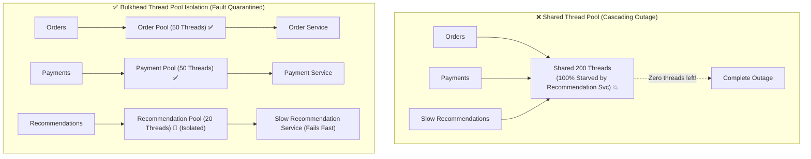

# Lesson 04: Bulkhead Pattern & Thread Isolation

Master the Bulkhead architectural pattern, Thread Pool Isolation vs Semaphore Isolation, resource quarantine, and preventing downstream dependency cascades.

---

## 1. What Is It?
- **Bulkhead Pattern**: An isolation pattern named after the watertight compartments of a ship's hull. If one compartment is punctured and floods with water, the bulkheads prevent water from spreading to the rest of the ship.
- In software, a Bulkhead isolates resources (thread pools, memory, CPU) for each downstream dependency so that a complete failure in one dependency cannot consume all shared system resources.

---

## 2. Why Does It Exist?
If your application uses a single shared thread pool of 200 threads, and an image processing service slows down, all 200 threads will get stuck waiting for image processing. When users attempt to log in or checkout, the server has zero threads left and throws `503 Service Unavailable`.

---

## 3. Mental Model: Shared Pool vs Bulkhead Thread Pool Isolation



---

## 4. How Does It Work: Thread Pool vs Semaphore Bulkheads

| Dimension | Thread Pool Bulkhead | Semaphore Bulkhead |
|---|---|---|
| **Mechanism** | Separate dedicated OS/Virtual thread pools | Atomic counter (semaphore) on existing thread |
| **Context Switching**| Higher (Handoff between thread pools) | **Zero (Executes on calling thread)** |
| **Timeout Control** | Can abort execution via `Future.cancel()` | Cannot abort blocking I/O calls |
| **Memory Overhead** | Higher (Thread stack memory) | **Minimal ($O(1)$ atomic integer)** |
| **Best For** | Slow, unreliable third-party integrations | Fast, non-blocking internal services |

---

## 5. Internal Working: Thread Pool Capacity Equation

To size a dedicated Bulkhead thread pool accurately:

$$\text{Threads} = \text{Target Throughput (req/sec)} \times \text{p99 Latency (seconds)} + \text{Safety Buffer}$$

*Example*: If payment service handles $100\text{ req/sec}$ with $0.2\text{s}$ p99 latency:
$$\text{Threads} = 100 \times 0.2 + 5 = 25\text{ threads}$$

---

## 6. Example & Production Java 21 Code

Resilience4j ThreadPool Bulkhead Configuration in Java 21:

```java
package com.backend.resilience.bulkhead;

import io.github.resilience4j.bulkhead.ThreadPoolBulkhead;
import io.github.resilience4j.bulkhead.ThreadPoolBulkheadConfig;
import io.github.resilience4j.bulkhead.ThreadPoolBulkheadRegistry;
import org.slf4j.Logger;
import org.slf4j.LoggerFactory;

import java.time.Duration;
import java.util.concurrent.CompletionStage;

public class RecommendationServiceClient {

    private static final Logger log = LoggerFactory.getLogger(RecommendationServiceClient.class);
    private final ThreadPoolBulkhead bulkhead;

    public RecommendationServiceClient() {
        ThreadPoolBulkheadConfig config = ThreadPoolBulkheadConfig.custom()
            .maxThreadPoolSize(10) // Max 10 threads isolated for recommendations
            .coreThreadPoolSize(5)
            .queueCapacity(20) // Bounded waiting queue
            .keepAliveDuration(Duration.ofMillis(1000))
            .build();

        ThreadPoolBulkheadRegistry registry = ThreadPoolBulkheadRegistry.of(config);
        this.bulkhead = registry.bulkhead("recommendationBulkhead");
    }

    public record Recommendation(String itemId, String title) {}

    public CompletionStage<Recommendation> getRecommendationAsync(String userId) {
        return bulkhead.executeSupplier(() -> fetchRecommendationRemote(userId))
            .exceptionally(throwable -> {
                log.warn("Recommendation bulkhead full or timed out! Returning fallback recommendation.");
                return new Recommendation("default-item", "Featured Best Seller");
            });
    }

    private Recommendation fetchRecommendationRemote(String userId) {
        // Slow external recommendation engine call
        return new Recommendation("item-101", "Personalized Widget");
    }
}
```

---

## 7. Performance Characteristics
- Thread Pool Bulkhead guarantees that no single downstream failure can consume more than its allotted slice of CPU and threads.

---

## 8. Failure Scenarios & Edge Cases
- **Unbounded Bulkhead Queue**: Setting `queueCapacity = Integer.MAX_VALUE` allows thousands of requests to queue up indefinitely during an outage, causing severe memory leaks (`OutOfMemoryError: Java heap space`).
  - **Mitigation**: Always configure small, bounded queues (`queueCapacity = 20 to 50`).

---

## 9. Observability (Logs, Metrics, Traces)
```text
# Bulkhead Metrics
resilience4j_bulkhead_available_concurrent_calls{name="recommendationBulkhead"} 4
resilience4j_bulkhead_max_allowed_concurrent_calls{name="recommendationBulkhead"} 10
```

---

## 10. Debugging & Troubleshooting
1. **Detect Thread Pool Starvation**:
   ```bash
   jcmd <PID> Thread.print | grep -c "WAITING"
   ```

---

## 11. Scaling Considerations
- In Java 21, pair Bulkheads with **Virtual Threads** (`Executors.newVirtualThreadPerTaskExecutor()`) to achieve lightweight concurrency without OS thread stack memory limits.

---

## 12. Architectural Trade-offs
| Strategy | Isolation Level | Context Switch Cost | Resource Overhead |
|---|---|---|---|
| **Single Shared Pool** | Zero | Lowest | Lowest |
| **Semaphore Bulkhead** | Moderate | **Zero** | **Lowest** |
| **Thread Pool Bulkhead**| **Maximum** | Moderate | Higher |

---

## 13. When to Use
- Use **Bulkheads** whenever an application communicates with multiple external microservices with differing SLA reliability guarantees.

---

## 14. When NOT to Use
- Do not create separate bulkheads for fast, guaranteed local database reads within the same VPC.

---

## 15. SDE2 / Senior Interview Questions & Answers
### Q1: Compare Thread Pool Bulkheads with Semaphore Bulkheads. When should an engineer choose one over the other?
<details>
<summary>Reveal Answer</summary>

**Answer**:
- **Thread Pool Bulkheads**:
  - Assigns a dedicated thread pool to the target dependency.
  - The calling thread dispatches the task to the pool and can continue or wait.
  - **Pros**: Provides true asynchronous execution, thread isolation, and supports cancellation timeouts via `Future.cancel()`.
  - **Cons**: Context-switching overhead between threads and higher memory usage.
  - **When to choose**: Unreliable third-party REST/gRPC calls that may hang or experience prolonged network latency.
- **Semaphore Bulkheads**:
  - Uses an atomic counter (like `java.util.concurrent.Semaphore`) to limit concurrent executions on the **calling thread**.
  - **Pros**: Zero context-switching overhead and ultra-low memory footprint.
  - **Cons**: Cannot force-abort a blocking call; blocking I/O occupies the caller's thread until timeout.
  - **When to choose**: High-throughput, non-blocking asynchronous APIs (e.g., Netty/WebFlux) or fast internal caches.
</details>

---

## 16. Practical Exercise
1. Implement a Semaphore-based Bulkhead in Java that rejects incoming requests with HTTP 429 when concurrent requests exceed 50.

---

## 17. Quick Revision Summary
- Bulkheads **quarantine failures** and prevent cascading thread pool starvation.
- Use **Thread Pool Bulkheads** for slow/unreliable external integrations.
- Always use **bounded queues** to avoid `OutOfMemoryError`.
