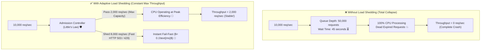

# Lesson 05: Load Shedding & Graceful Degradation

Master adaptive load shedding, Little's Law capacity limits, queue delay monitoring (CoDel), and graceful degradation strategies under extreme system saturation.

---

## 1. What Is It?
- **Load Shedding**: The proactive rejection of excess traffic before it enters internal processing queues when a service detects it has reached maximum throughput capacity.
- **Graceful Degradation**: Selectively disabling non-critical, compute-heavy features (recommendations, live chat, high-res images) to preserve core revenue-generating workflows (checkout, payment).

---

## 2. Why Does It Exist?
When a server receives more traffic than it can process, requests pile up in internal queues. As queues grow, queue wait time exceeds client timeout thresholds. Clients timeout and disconnect, but the server wastes $100\%$ of its CPU processing "dead" requests that no one is waiting for, causing total collapse.

---

## 3. Mental Model: Saturated System With vs Without Load Shedding



---

## 4. How Does It Work: Little's Law Applied to Load Shedding

**Little's Law**:
$$L = \lambda \times W$$
- $L$ = Number of concurrent requests in system (Concurrency)
- $\lambda$ = Arrival rate / Throughput (requests/sec)
- $W$ = Average response time / latency (seconds)

If a service can handle $\lambda = 1{,}000\text{ req/sec}$ with $W = 0.05\text{s}$ ($50\text{ms}$):
$$L_{\text{max}} = 1{,}000 \times 0.05 = 50\text{ concurrent requests}$$

Any incoming request when $L > 50$ **must be shed immediately**!

---

## 5. Internal Working: CoDel (Controlled Delay) Queue Shedding

Instead of checking queue size, modern load shedders measure **Queue Dwell Time** (the time a request spends sitting in the queue before execution starts).

If Dwell Time $> 20\text{ms}$, the request is already stale and is dropped immediately before consuming any database or CPU resources.

---

## 6. Example & Production Java 21 Code

Adaptive Load Shedding Admission Controller in Java 21:

```java
package com.backend.resilience.loadshedding;

import org.slf4j.Logger;
import org.slf4j.LoggerFactory;

import java.time.Duration;
import java.util.concurrent.atomic.AtomicInteger;

public class AdaptiveLoadShedder {

    private static final Logger log = LoggerFactory.getLogger(AdaptiveLoadShedder.class);

    private final int maxConcurrentRequests;
    private final Duration maxQueueDwellTime;
    private final AtomicInteger activeRequests = new AtomicInteger(0);

    public record RequestContext(String requestId, long ingressTimestampNanos, boolean isPriority) {}

    public AdaptiveLoadShedder(int maxConcurrentRequests, Duration maxQueueDwellTime) {
        this.maxConcurrentRequests = maxConcurrentRequests;
        this.maxQueueDwellTime = maxQueueDwellTime;
    }

    public boolean shouldAdmitRequest(RequestContext ctx) {
        // Rule 1: Always prioritize critical checkout/payment traffic
        if (ctx.isPriority()) {
            activeRequests.incrementAndGet();
            return true;
        }

        // Rule 2: CoDel Queue Dwell Time Check
        long dwellTimeNanos = System.nanoTime() - ctx.ingressTimestampNanos();
        if (dwellTimeNanos > maxQueueDwellTime.toNanos()) {
            log.warn("Shedding request {}: Queue dwell time ({}ms) exceeded threshold!", 
                ctx.requestId(), Duration.ofNanos(dwellTimeNanos).toMillis());
            return false; // Shed expired request!
        }

        // Rule 3: Concurrency Limit Check (Little's Law)
        int current = activeRequests.get();
        if (current >= maxConcurrentRequests) {
            log.warn("Shedding request {}: Active requests ({}) reached capacity limit ({})", 
                ctx.requestId(), current, maxConcurrentRequests);
            return false;
        }

        activeRequests.incrementAndGet();
        return true;
    }

    public void release() {
        activeRequests.decrementAndGet();
    }
}
```

---

## 7. Performance Characteristics
- Rejecting a shed request at the edge layer takes $< 0.05\text{ms}$ and consumes zero database connection pool slots.

---

## 8. Failure Scenarios & Edge Cases
- **Priority Inversion**: Shedding login requests while admitting search queries. Users cannot buy anything if they cannot log in.
  - **Mitigation**: Assign explicit priority headers (`X-Priority: Tier-1-Checkout`, `X-Priority: Tier-3-Analytics`) and drop Tier-3 first.

---

## 9. Observability (Logs, Metrics, Traces)
```text
# Load Shedding Metrics
load_shedder_admitted_total{priority="tier-1"} 98000
load_shedder_shed_total{priority="tier-3"} 14500
queue_dwell_time_milliseconds_p99 18.2
```

---

## 10. Debugging & Troubleshooting
1. **Inspect CPU Load Average vs Queue Depth**:
   ```bash
   uptime && netstat -s | grep "listen queue"
   ```

---

## 11. Scaling Considerations
- Combine Load Shedding with auto-scaling to shed traffic momentarily while Kubernetes spins up additional pod replicas.

---

## 12. Architectural Trade-offs
| Approach | Saturated Behavior | Latency Under Load | Core Revenue Protection |
|---|---|---|---|
| **No Load Shedding** | Total Outage ($0\%$) | $> 60\text{s}$ | Zero |
| **Adaptive Load Shedding**| **Peak Throughput ($100\%$)**| **$< 50\text{ms}$** | **$100\%$ for Tier-1** |

---

## 13. When to Use
- Implement load shedding in all entry gateways handling unpredictable viral traffic spikes.

---

## 14. When NOT to Use
- Do not shed internal health check probes (`/actuator/health`), or Kubernetes will kill healthy pods thinking they crashed.

---

## 15. SDE2 / Senior Interview Questions & Answers
### Q1: What happens to a backend service when traffic exceeds capacity without load shedding, and how does Little's Law guide admission control?
<details>
<summary>Reveal Answer</summary>

**Answer**:
- **Without Load Shedding**:
  - Excess requests enter unbounded thread/socket queues.
  - Queue wait time skyrockets past the client's timeout threshold (e.g., client gives up after 5s).
  - The server continues executing work for expired requests whose callers have already disconnected.
  - As CPU and memory reach $100\%$, effective useful throughput drops to zero, causing a complete system collapse.
- **Using Little's Law ($L = \lambda \times W$)**:
  - Identifies the maximum stable concurrency limit $L_{\text{max}}$ where throughput is maximized without latency degradation.
  - If incoming concurrency exceeds $L_{\text{max}}$, the Admission Controller immediately drops or sheds excess non-essential requests with HTTP 503 in $< 0.1\text{ms}$.
  - This preserves the CPU for admitted requests, ensuring they finish in $< 50\text{ms}$ with $100\%$ success rate.
</details>

---

## 16. Practical Exercise
1. Implement a Spring Boot filter that drops requests with `X-Priority: low` when JVM CPU usage exceeds $85\%$.

---

## 17. Quick Revision Summary
- Load shedding preserves **peak throughput** by failing fast on excess traffic.
- Use **CoDel Queue Dwell Time** to drop stale requests before execution.
- Always protect **Tier-1 critical workflows** (Checkout/Auth).
