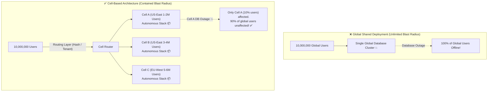

# Lesson 06: Chaos Engineering & Blast Radius Mitigation

Master the principles of Chaos Engineering, automated fault injection (latency, packet loss, pod kills), Cell-Based Architecture, and minimizing blast radius.

---

## 1. What Is It?
- **Chaos Engineering**: The discipline of experimenting on a distributed system in production to build confidence in the system's capability to withstand turbulent conditions.
- **Blast Radius**: The maximum extent of system damage or user impact caused by a single service failure or bad deployment.
- **Cell-Based Architecture**: Partitioning an entire cloud architecture into independent, self-contained mini-deployments ("cells") that share zero dependencies.

---

## 2. Why Does It Exist?
Complex distributed systems fail in unpredictable, emergent ways. You cannot know if your circuit breakers, retries, and fallbacks actually work in production until you deliberately test them under real network partitions.

---

## 3. Mental Model: Monolithic Cloud vs Cell-Based Architecture



---

## 4. How Does It Work: Chaos Engineering Experimentation Lifecycle

| Step | Phase | Action |
|---|---|---|
| **1** | **Define Steady State** | Establish baseline metric (e.g. Orders Placed = $500\text{ orders/min}$, p99 Latency $< 80\text{ms}$) |
| **2** | **Formulate Hypothesis**| *"If Payment Gateway latency increases to 3s, Circuit Breaker will trip and orders continue via fallback queue"* |
| **3** | **Inject Fault** | Use Chaos Mesh to inject $3{,}000\text{ms}$ latency on port 443 |
| **4** | **Verify & Automate** | Verify steady state is preserved; if steady state breaks, trigger automated emergency rollback |

---

## 5. Internal Working: Fault Injection Types with Chaos Mesh / Gremlin

1. **Network Latency / Packet Loss**: Simulates cross-region cloud fiber cuts or slow switches.
2. **CPU / Memory Stress**: Simulates memory leaks and JVM Garbage Collection pauses.
3. **Pod Termination (Chaos Monkey)**: Randomly kills container pods to verify Kubernetes auto-healing and zero-downtime rolling deploys.
4. **Clock Skew / NTP Drift**: Desynchronizes server system clocks to test distributed consensus and JWT token validation.

---

## 6. Example & Production Java 21 Code

Chaos Latency Injection Interceptor for Staging / Canary Environments:

```java
package com.backend.resilience.chaos;

import org.slf4j.Logger;
import org.slf4j.LoggerFactory;
import org.springframework.stereotype.Component;

import java.time.Duration;
import java.util.concurrent.ThreadLocalRandom;

@Component
public class ChaosFaultInjector {

    private static final Logger log = LoggerFactory.getLogger(ChaosFaultInjector.class);

    private volatile boolean chaosEnabled = false;
    private volatile double failureRate = 0.0; // 0.0 to 1.0
    private volatile Duration maxLatency = Duration.ZERO;

    public void configureChaos(boolean enabled, double failureRate, Duration maxLatency) {
        this.chaosEnabled = enabled;
        this.failureRate = failureRate;
        this.maxLatency = maxLatency;
        log.warn("Chaos Injection Configured: Enabled={}, FailureRate={}%, MaxLatency={}ms", 
            enabled, failureRate * 100, maxLatency.toMillis());
    }

    public void injectFaultIfEnabled(String operationName) {
        if (!chaosEnabled) return;

        // 1. Inject Random Latency
        if (!maxLatency.isZero()) {
            long latencyMs = ThreadLocalRandom.current().nextLong(50, maxLatency.toMillis() + 1);
            try {
                log.info("CHAOS: Injecting {}ms latency into operation '{}'", latencyMs, operationName);
                Thread.sleep(latencyMs);
            } catch (InterruptedException e) {
                Thread.currentThread().interrupt();
            }
        }

        // 2. Inject Simulated Server Exception
        if (failureRate > 0 && ThreadLocalRandom.current().nextDouble() < failureRate) {
            log.error("CHAOS: Injecting synthetic 500 error into operation '{}'", operationName);
            throw new RuntimeException("Chaos Injected Synthetic Failure for " + operationName);
        }
    }
}
```

---

## 7. Performance Characteristics
- Chaos experimentation validates that p99 latency degradation under severe faults is capped at circuit breaker timeouts ($< 1\text{s}$).

---

## 8. Failure Scenarios & Edge Cases
- **Uncontrolled Chaos Blast Radius**: Running a chaos experiment that accidentally drops real production databases without an automated abort switch.
  - **Mitigation**: Always implement a **Dead Man's Switch / Emergency Abort Button** that instantly terminates chaos experiments if business KPIs drop $> 5\%$.

---

## 9. Observability (Logs, Metrics, Traces)
```text
# Chaos Metrics
chaos_experiments_active_total 1
chaos_faults_injected_total{type="network_latency"} 450
business_kpi_orders_per_minute 520
```

---

## 10. Debugging & Troubleshooting
1. **Terminate All Chaos Experiments Immediately**:
   ```bash
   kubectl delete chaos -A
   ```

---

## 11. Scaling Considerations
- In Cell-Based Architectures, cap cell size to a fixed user capacity (e.g. 500k users per cell). As business grows, add more cells instead of expanding existing cells.

---

## 12. Architectural Trade-offs
| Architecture | Blast Radius on Outage | Deployment Cost | Operational Simplicity |
|---|---|---|---|
| **Single Monolithic Cluster** | **$100\%$ (Catastrophic)** | **Lowest** | High |
| **Cell-Based Architecture** | **$< 10\%$ (Contained)** | Higher (Multiple cells) | Moderate (Automated CI/CD) |

---

## 13. When to Use
- Use **Chaos Engineering** in staging and canary environments before major product launches.
- Use **Cell-Based Architectures** for tier-1 hyperscale financial and e-commerce platforms.

---

## 14. When NOT to Use
- Do not run chaos tests in production without automated monitoring and fast abort switches.

---

## 15. SDE2 / Senior Interview Questions & Answers
### Q1: What is a Cell-Based Architecture, and how does it contain the blast radius of critical cloud outages?
<details>
<summary>Reveal Answer</summary>

**Answer**:
- **Definition**: Cell-Based Architecture is a pattern where an entire application stack (API Gateways, Microservices, Databases, Caches) is packaged into self-contained, independent units called **Cells**.
- **How it works**:
  1. A lightweight, highly available routing layer at the edge hashes incoming users or tenants to a specific cell (e.g., User ID 1–1,000,000 routes to Cell A).
  2. Each cell runs completely autonomously and **shares zero state or databases** with other cells.
- **Blast Radius Containment**:
  - In a traditional global deployment, a corrupted database migration or memory leak crashes the entire service for $100\%$ of global users.
  - In a 10-cell architecture, an outage in Cell A affects only $10\%$ of users. The other $90\%$ of users in Cells B through J experience $0\text{s}$ downtime and zero degradation.
</details>

---

## 16. Practical Exercise
1. Write a Chaos Mesh YAML manifest that injects 500ms network delay into a target Kubernetes pod for 5 minutes.

---

## 17. Quick Revision Summary
- Chaos Engineering tests systems against **real turbulent conditions**.
- Use **Cell-Based Architecture** to minimize outage blast radius.
- Always maintain an **Emergency Abort Switch** during chaos experiments.
