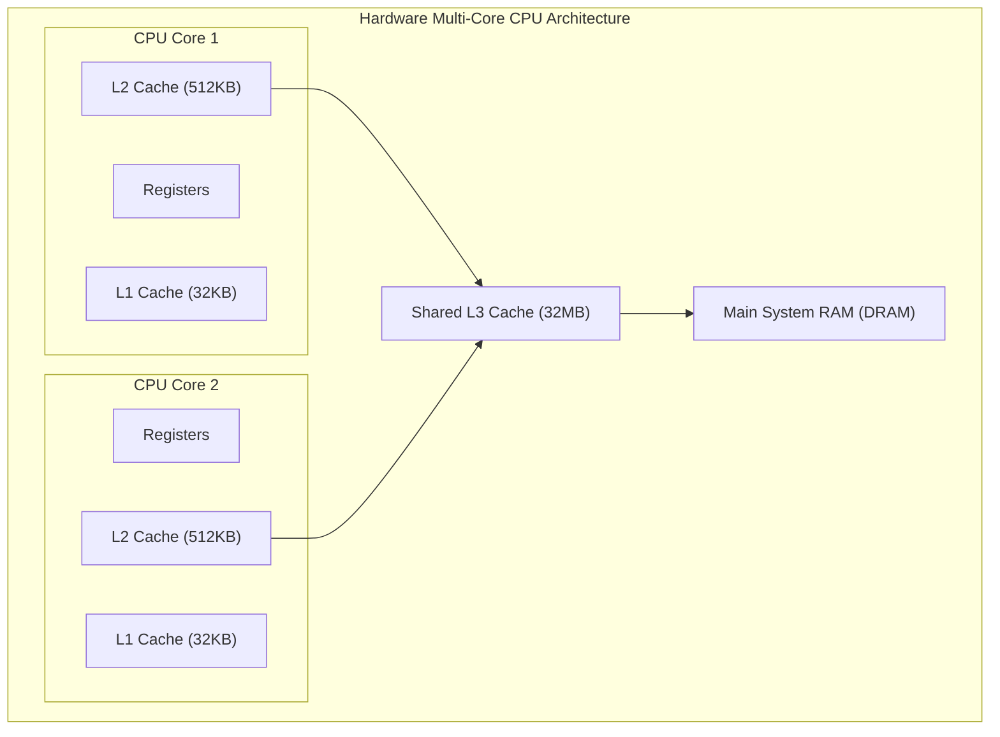
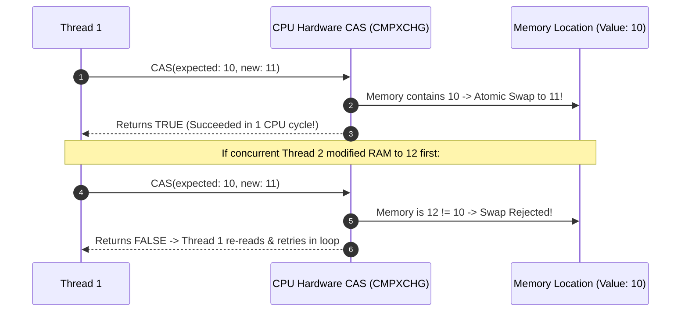
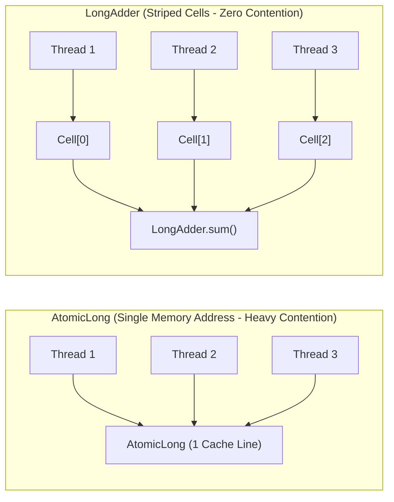

# Java Threads, The Java Memory Model (JMM), and Lock-Free Atomics

---

## 1. What Is It?
In Java backend engineering, **Platform Threads** are operating system kernel threads ($1:1$ mapping to Linux `pthreads`) managed by the OS scheduler. 

The **Java Memory Model (JMM)** (JSR-133) defines the formal specification governing how threads interact through shared computer memory, establishing **Visibility**, **Ordering (Happens-Before guarantees)**, and **Atomicity** rules across multi-core CPU architectures.

---

## 2. Why Does It Exist?
Modern multi-core CPU hardware introduces complex performance optimizations:
- **L1/L2/L3 Hardware Caches**: Each CPU core reads and writes to private cache lines, causing memory visibility drift.
- **Out-of-Order Instruction Pipelining**: Hardware CPUs and the JVM JIT compiler reorder machine instructions to maximize instruction-level parallelism.

Without the JMM and memory barriers:
- Thread B reading a variable updated by Thread A might read stale cached values indefinitely.
- Reordered instructions produce partially initialized objects, causing critical security and state corruption bugs.

---

## 3. Mental Model: CPU Hardware Architecture vs JMM



---

## 4. How Does It Work?

### 1. The `volatile` Keyword & Memory Barriers
When a field is declared `volatile`:
1. **Visibility**: Reads and writes bypass CPU L1/L2 caches and interact directly with main memory (or invalidate local cache lines via the MESI cache coherence protocol).
2. **Instruction Ordering**: The JIT compiler inserts **Hardware Memory Barriers** (LoadLoad, LoadStore, StoreStore, StoreLoad) preventing instruction reordering across the volatile access boundary.

---

### 2. Lock-Free Compare-And-Swap (CAS) & Atomics
Java's `java.util.concurrent.atomic` classes (`AtomicInteger`, `AtomicLong`, `AtomicReference`) utilize CPU hardware **Compare-And-Swap (`CAS`)** instructions (e.g. `CMPXCHG` on x86):
- Atomically checks: "If memory address $M$ contains value $V_{expected}$, update it to $V_{new}$ in a single clock cycle; otherwise, fail and return false."
- **Zero OS Thread Suspension**: Worker threads never enter kernel sleep states or context switches.



---

## 5. High-Contention Striping: `AtomicLong` vs `LongAdder`

Under extreme concurrent write contention ($100\text{ threads}$ incrementing the same counter simultaneously):
- **`AtomicLong` Bottleneck**: All 100 threads hammer the exact same cache line with CAS instructions. 99 threads fail and spin-retry repeatedly, causing **CPU Cache Line Bouncing / False Sharing**.
- **`LongAdder` (Striped Cells)**: Dynamically maintains an internal array of counter `Cell`s. Different threads hash to different cells and increment them independently without contention. The total sum is computed only when `sum()` is called ($10\times$ higher throughput under load!).



---

## 6. Implementation: High-Throughput Metric Collector in Java 21

```java
package com.backend.engineering.concurrency.atomics;

import java.util.concurrent.atomic.AtomicReference;
import java.util.concurrent.atomic.LongAdder;

public class HighThroughputMetricsCollector {

    // Striped counter: Near-zero contention under 100k req/sec
    private final LongAdder requestCounter = new LongAdder();
    private final LongAdder errorCounter = new LongAdder();

    // Lock-free state machine using AtomicReference
    public enum ServiceState { HEALTHY, DEGRADED, CIRCUIT_OPEN }
    private final AtomicReference<ServiceState> currentState = 
            new AtomicReference<>(ServiceState.HEALTHY);

    public void recordSuccess() {
        requestCounter.increment();
    }

    public void recordError() {
        requestCounter.increment();
        errorCounter.increment();
        
        // Evaluate error threshold and transition state atomically
        long total = requestCounter.sum();
        long errors = errorCounter.sum();
        
        if (total > 1000 && (double) errors / total > 0.5) {
            // CAS State Transition: Only transitions if still DEGRADED or HEALTHY
            currentState.compareAndSet(ServiceState.HEALTHY, ServiceState.DEGRADED);
        }
    }

    public long getTotalRequests() { return requestCounter.sum(); }
    public ServiceState getState() { return currentState.get(); }
}
```

---

## 7. Performance & Memory Overhead

| Concurrency Primitive | Overhead per Instance | Read Latency | Write Latency (Contended) |
|---|---|---|---|
| OS Platform Thread | $\approx 1\text{MB}$ Native OS Stack | N/A | N/A |
| `volatile` Variable | 0 extra bytes | $< 1\text{ns}$ | $< 5\text{ns}$ (Flushes store buffer) |
| `AtomicLong` | 24 bytes (Heap) | $< 1\text{ns}$ | Slower under high contention (CAS spinning) |
| **`LongAdder`** | $\approx 128 - 512$ bytes (Cells) | $< 10\text{ns}$ (`sum()`) | **Ultra-Fast ($< 2\text{ns}$ under 100 cores)** |

---

## 8. Failure Scenarios

1. **Cache Line False Sharing**:
   - *Failure*: Two independent variables modified by two different CPU threads reside in the same $64\text{-byte}$ CPU cache line. When Thread 1 modifies Variable A, the hardware invalidates Core 2's entire L1/L2 cache line, forcing Core 2 to reload Variable B from slow RAM even though Variable B never changed!
   - *Mitigation*: Pad variables using the `@jdk.internal.vm.annotation.Contended` annotation to force distinct 128-byte cache line alignment.

---

## 9. Interview Questions

### Q1: Why does `volatile` guarantee visibility and ordering, but NOT atomicity for compound operations like `count++`?
<details>
<summary>Reveal Answer</summary>

**Answer**:
1. **`volatile` Guarantees**:
   - **Visibility**: Any write to a volatile variable is immediately flushed to main memory and made visible to all other CPU cores via hardware cache-invalidation barriers.
   - **Ordering**: Prevents instruction reordering across the volatile read/write boundary.
2. **Why `count++` Fails**:
   `count++` is not a single atomic CPU operation; it compiles into **3 distinct bytecode instructions**:
   1. `GETFIELD`: Read current value of `count` from memory into CPU register.
   2. `IADD`: Add 1 to the register.
   3. `PUTFIELD`: Write modified value back to memory.
   If Thread A and Thread B execute `GETFIELD` simultaneously when `count = 10`, both threads calculate `11` and write `11` back to memory, resulting in a **Lost Update**. Atomic compound operations require hardware CAS instructions (`AtomicInteger.incrementAndGet()`) or synchronized locks.
</details>

---

## 10. Quick Revision
- **Platform Thread Cost**: 1MB native OS stack per thread; bounded by kernel scheduler.
- **JMM**: Defines visibility, ordering, and Happens-Before relationships across CPU caches.
- **`volatile`**: Guarantees memory visibility and prevents reordering; does not guarantee atomic compound operations.
- **CAS**: Hardware `CMPXCHG` instruction enabling lock-free atomic state mutations.
- **`LongAdder`**: Striped counter cells eliminating CAS contention for high-throughput metrics.
