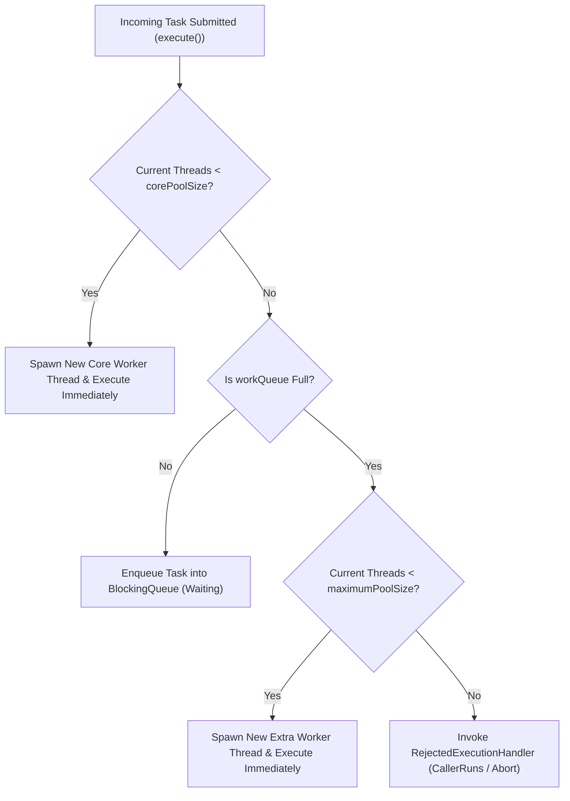
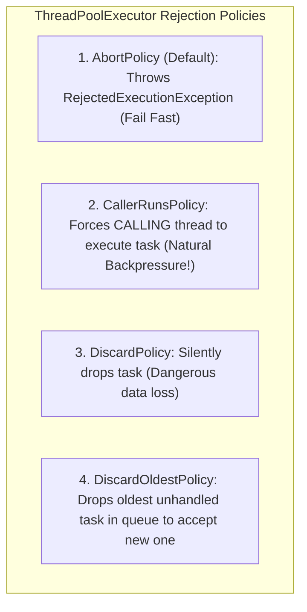

# Java Thread Pools, ThreadPoolExecutor Internals, and Queue Saturation

---

## 1. What Is It?
A **Java Thread Pool** (`java.util.concurrent.ThreadPoolExecutor`) is a managed pool of pre-allocated worker threads that execute submitted asynchronous tasks (`Runnable`/`Callable`) from a shared task buffer queue (**`BlockingQueue`**).

---

## 2. Why Does It Exist?
Creating an OS Platform Thread on demand (`new Thread()`) for every incoming backend request is disastrous:
- **Thread Creation Overhead**: Allocating a $1\text{MB}$ stack and calling the OS kernel `clone()` syscall takes $\approx 1 - 2\text{ms}$.
- **Memory Exhaustion**: Spawning 5,000 threads consumes $5\text{GB}$ of non-heap native OS memory, crashing the container with `java.lang.OutOfMemoryError: unable to create native thread`.
- **CPU Context-Switch Thrashing**: The Linux kernel spends $> 80\%$ of its CPU cycles context-switching between thousands of competing threads rather than executing application code.

`ThreadPoolExecutor` bounds memory and thread counts, reusing warm worker threads continuously.

---

## 3. Mental Model: ThreadPoolExecutor Task Dispatch Lifecycle



---

## 4. How Does It Work?

### The "Queue-First" Execution Trap
Many engineers mistakenly assume `ThreadPoolExecutor` scales threads up to `maximumPoolSize` before queuing tasks. 

$$\textbf{The Internal Truth: } \text{Extra threads between } \texttt{corePoolSize} \text{ and } \texttt{maximumPoolSize} \text{ are created ONLY AFTER the work queue is 100\% FULL!}$$

- If you configure `corePoolSize = 10`, `maximumPoolSize = 100`, and an **Unbounded `LinkedBlockingQueue`**:
  - The thread pool will **NEVER** scale past 10 threads!
  - All excess tasks are buffered in the unbounded queue in memory until the JVM runs out of heap and crashes.

---

### Sizing Thread Pools: The Mathematical Formulas

#### 1. CPU-Bound Tasks (Cryptography, Compression, Image Processing, Math)
$$N_{\text{threads}} = N_{\text{CPUs}} + 1$$
*(The $+1$ thread handles occasional page faults and OS interrupts without idling the CPU cores).*

#### 2. I/O-Bound Tasks (Database Queries, External REST API Calls, File I/O)
$$N_{\text{threads}} = N_{\text{CPUs}} \times \left(1 + \frac{\text{Wait Time (I/O Block)}}{\text{Service Time (CPU Computation)}}\right)$$

- *Example*: If a database query takes $50\text{ms}$ of I/O wait and $5\text{ms}$ of CPU computation on an 8-core server:
  $$N_{\text{threads}} = 8 \times \left(1 + \frac{50}{5}\right) = 8 \times 11 = \mathbf{88\text{ Threads}}$$

---

## 5. The 4 Standard Rejection Policies



### Why `CallerRunsPolicy` is the Gold Standard for Backend Ingress
When the thread pool and queue are saturated, **`CallerRunsPolicy` executes the submitted task on the calling thread itself** (e.g. Tomcat request thread):
1. The calling thread is temporarily occupied executing the task.
2. The calling thread **cannot accept or submit any new incoming HTTP requests** during this time.
3. This creates **Instant, Natural Backpressure**, forcing Tomcat / Netty to throttle inbound TCP socket reads and preventing server crashes.

---

## 6. Implementation: Production Bounded ThreadPoolExecutor in Java 21

```java
package com.backend.engineering.concurrency.executors;

import org.slf4j.Logger;
import org.slf4j.LoggerFactory;
import org.springframework.context.annotation.Bean;
import org.springframework.context.annotation.Configuration;

import java.util.concurrent.*;
import java.util.concurrent.atomic.AtomicInteger;

@Configuration
public class ProductionThreadPoolConfig {

    private static final Logger log = LoggerFactory.getLogger(ProductionThreadPoolConfig.class);

    @Bean(name = "orderProcessingExecutor", destroyMethod = "shutdown")
    public ExecutorService orderProcessingExecutor() {
        int corePoolSize = 16;
        int maxPoolSize = 32;
        long keepAliveSeconds = 60L;
        int queueCapacity = 500; // STRICTLY BOUNDED QUEUE!

        // Custom Named ThreadFactory for clear logs and thread dumps
        ThreadFactory threadFactory = new ThreadFactory() {
            private final AtomicInteger threadNumber = new AtomicInteger(1);
            @Override
            public Thread newThread(Runnable r) {
                Thread t = new Thread(r, "order-worker-" + threadNumber.getAndIncrement());
                t.setDaemon(false);
                t.setPriority(Thread.NORM_PRIORITY);
                return t;
            }
        };

        // Custom Rejection Handler with Logging and Metrics
        RejectedExecutionHandler rejectionHandler = new RejectedExecutionHandler() {
            private final RejectedExecutionHandler fallback = new ThreadPoolExecutor.CallerRunsPolicy();
            @Override
            public void rejectedExecution(Runnable r, ThreadPoolExecutor executor) {
                log.warn("Thread pool saturated! Active: {}, Queue Size: {}. Applying CallerRuns backpressure.",
                        executor.getActiveCount(), executor.getQueue().size());
                fallback.rejectedExecution(r, executor);
            }
        };

        return new ThreadPoolExecutor(
                corePoolSize,
                maxPoolSize,
                keepAliveSeconds,
                TimeUnit.SECONDS,
                new ArrayBlockingQueue<>(queueCapacity), // Bounded Memory Queue!
                threadFactory,
                rejectionHandler
        );
    }
}
```

---

## 7. Performance

| Configuration Pattern | Peak Throughput | Memory Stability | Risk Level |
|---|---|---|---|
| `Executors.newCachedThreadPool()` | High initially | Unbounded thread creation | **Critical (OOM Crash)** |
| `Executors.newFixedThreadPool(100)` | Moderate | Unbounded Queue | **Critical (Heap OOM Crash)** |
| **Bounded `ThreadPoolExecutor` + `CallerRunsPolicy`** | **High & Stable** | **Guaranteed Constant RAM** | **Production Ready** |

---

## 8. Failure Scenarios

1. **The `Executors.newCachedThreadPool()` Server Freeze**:
   - *Failure*: Spawns an unbounded number of threads (`maxPoolSize = Integer.MAX_VALUE`). Under a $10,000\text{ req/s}$ traffic spike, the JVM attempts to spawn 10,000 platform threads, exhausting native Linux OS memory and crashing the server with `unable to create new native thread`.
   - *Mitigation*: **Never use `Executors.newCachedThreadPool()` or `Executors.newFixedThreadPool()` in production!** Always instantiate `ThreadPoolExecutor` directly with bounded queues and fixed max pools.

---

## 9. Observability

- **Metrics**:
  - `executor_active_threads`: Number of threads actively executing tasks.
  - `executor_queue_depth`: Current items buffered in queue.
  - `executor_rejected_tasks_total`: Counter tracking rejected tasks (Trigger alert if $> 0$).

---

## 10. Interview Questions

### Q1: Why is using `Executors.newFixedThreadPool(n)` considered an anti-pattern in high-throughput backend services?
<details>
<summary>Reveal Answer</summary>

**Answer**:
`Executors.newFixedThreadPool(n)` creates a `ThreadPoolExecutor` backed by an **unbounded `LinkedBlockingQueue`** (`Integer.MAX_VALUE` capacity $\approx 2.14\text{ billion}$ elements).
If the downstream database or API slows down while upstream requests continue arriving at high velocity:
1. The $N$ worker threads become blocked waiting on slow I/O.
2. All incoming new tasks are appended to the unbounded queue without restriction.
3. The queue consumes hundreds of megabytes of JVM heap memory until the server crashes with `java.lang.OutOfMemoryError: Java heap space`.
Production systems must **always use bounded queues (`ArrayBlockingQueue` with a finite capacity)** combined with explicit rejection handling (`CallerRunsPolicy` or `AbortPolicy`).
</details>

---

## 11. Quick Revision
- **Queue-First Scaling**: Extra threads past `corePoolSize` are created only *after* the work queue is 100% full.
- **Never Use Default Factory**: `Executors.newFixedThreadPool()` uses unbounded queues that cause Heap OOM.
- **CPU Sizing**: $N_{\text{CPUs}} + 1$.
- **I/O Sizing**: $N_{\text{CPUs}} \times (1 + \text{WaitTime}/\text{ServiceTime})$.
- **`CallerRunsPolicy`**: Throttles upstream request ingress naturally by executing tasks on the submitter thread.
