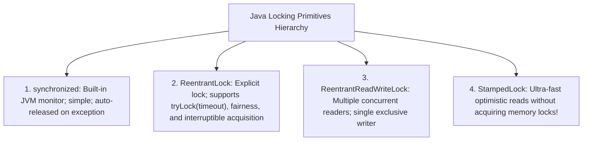
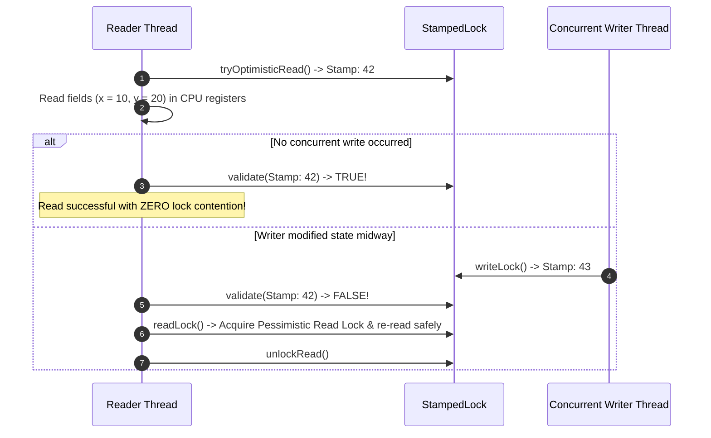

# Java Synchronization, Explicit Locks (StampedLock), and Concurrent Collections

---

## 1. What Is It?
In multi-threaded Java applications, **Mutual Exclusion and Synchronization** primitives ensure that only one thread can execute a critical section of code at a time, preventing race conditions on shared memory.

Java provides a spectrum of synchronization mechanisms:
1. **Intrinsic Locks (`synchronized`)**
2. **Explicit Locks (`ReentrantLock`, `ReentrantReadWriteLock`, `StampedLock`)**
3. **Resource Throttling (`Semaphore`)**
4. **Thread-Safe Collections (`ConcurrentHashMap`, `CopyOnWriteArrayList`, `ArrayBlockingQueue`)**.

---

## 2. Why Does It Exist?
When multiple threads read and mutate shared object fields concurrently without synchronization:
- Threads read dirty intermediate states.
- Counter increments and pointer updates are lost.
- Hash tables experience infinite loops or corrupted bucket pointers under concurrent rehashing.

---

## 3. Mental Model: The Lock Hierarchy



---

## 4. How Does It Work?

### 1. `StampedLock` & Optimistic Reading (Java 8+)
In read-heavy systems ($99\%\text{ Reads}, 1\%\text{ Writes}$), even a `ReentrantReadWriteLock` experiences reader lock contention because acquiring a shared read lock increments an atomic counter, causing cache line invalidation.

**`StampedLock` provides Optimistic Reading**:
- The reader retrieves a 64-bit **Stamp** without acquiring any lock ($0\text{ lock overhead}$!).
- It reads data fields into local CPU registers.
- It validates the stamp via `lock.validate(stamp)`:
  - If no write lock was acquired in between $\longrightarrow$ Read is valid! Succeeded in nanoseconds.
  - If a write occurred $\longrightarrow$ Fall back to an explicit Pessimistic Read Lock.



---

### 2. Throttling Concurrency with `Semaphore`
A `Semaphore` maintains a set of permits. Threads call `acquire()` to claim a permit and `release()` to return it:
- Used to enforce **Strict Concurrency Caps** on expensive backend resources (e.g. limiting simultaneous PDF rendering tasks to 4 to prevent JVM heap exhaustion).

---

### 3. `ConcurrentHashMap` Internal Mechanics
- **Reads**: **$100\%$ Lock-Free**. Uses `volatile` field reads on bucket nodes; never blocks writers.
- **Writes**: Locks **only the individual bucket bin / tree node** using `synchronized` on the head node. Writes to different hash buckets execute in parallel with **Zero Lock Contention**.
- **Resizing**: Multi-threaded cooperative resizing where concurrent worker threads help transfer buckets to the new table.

---

## 5. Implementation: High-Throughput Coordinate Cache with `StampedLock`

```java
package com.backend.engineering.concurrency.locks;

import java.util.concurrent.locks.StampedLock;

public class HighPerformancePointStore {

    private double x;
    private double y;
    private final StampedLock stampedLock = new StampedLock();

    public void move(double deltaX, double deltaY) {
        // Exclusive Write Lock
        long stamp = stampedLock.writeLock();
        try {
            this.x += deltaX;
            this.y += deltaY;
        } finally {
            stampedLock.unlockWrite(stamp);
        }
    }

    public double calculateDistanceFromOrigin() {
        // 1. Optimistic Read: ZERO Lock Acquisition!
        long stamp = stampedLock.tryOptimisticRead();
        double currentX = this.x;
        double currentY = this.y;

        // 2. Validate if a concurrent write modified the fields
        if (!stampedLock.validate(stamp)) {
            // 3. Stamp invalid! Upgrade to a Pessimistic Read Lock
            stamp = stampedLock.readLock();
            try {
                currentX = this.x;
                currentY = this.y;
            } finally {
                stampedLock.unlockRead(stamp);
            }
        }

        return Math.sqrt(currentX * currentX + currentY * currentY);
    }
}
```

---

## 6. Implementation: Resource Limiter with `Semaphore`

```java
package com.backend.engineering.concurrency.locks;

import java.util.concurrent.Semaphore;
import java.util.concurrent.TimeUnit;

public class ExternalApiRateLimiter {

    // Maximum 10 concurrent requests to third-party payment gateway
    private final Semaphore semaphore = new Semaphore(10);

    public <T> T executeWithThrottling(ApiCallable<T> task) throws Exception {
        // Attempt to acquire permit within 2 seconds
        boolean acquired = semaphore.tryAcquire(2, TimeUnit.SECONDS);

        if (!acquired) {
            throw new IllegalStateException("Payment Gateway concurrency limit reached. Shedding load.");
        }

        try {
            return task.call();
        } finally {
            semaphore.release(); // Always release in finally block!
        }
    }

    @FunctionalInterface
    public interface ApiCallable<T> {
        T call() throws Exception;
    }
}
```

---

## 7. Performance & Comparison

| Locking Mechanism | Read Latency ($99\%$ Reads) | Write Latency | Lock Overhead |
|---|---|---|---|
| `synchronized` | $10 - 25\text{ns}$ | $15 - 30\text{ns}$ | JVM Object Monitor |
| `ReentrantLock` | $10 - 20\text{ns}$ | $10 - 20\text{ns}$ | Unlocks on finally |
| `ReentrantReadWriteLock` | $15 - 35\text{ns}$ (CAS reader count) | $20 - 40\text{ns}$ | High CAS reader overhead |
| **`StampedLock` (Optimistic)** | **$\mathbf{< 2\text{ns}}$ (Lock-Free)** | **$< 15\text{ns}$** | **Lowest Read Overhead** |

---

## 8. Failure Scenarios

1. **Deadlock in Nested Locks**:
   - *Failure*: Thread 1 locks Resource A and waits for Resource B. Thread 2 locks Resource B and waits for Resource A. Both threads freeze permanently (**Deadlock**).
   - *Mitigation*: **Always acquire locks in a globally consistent canonical order** (e.g. sorted by resource ID) or use `tryLock(timeout)` with fail-fast timeouts.

2. **`StampedLock` Reentrancy Bug**:
   - *Failure*: Calling a method that acquires a `StampedLock` from within another method that already holds the same `StampedLock`. **`StampedLock` is NOT reentrant!** A thread calling `writeLock()` twice will deadlock with itself!
   - *Mitigation*: Use `StampedLock` strictly inside self-contained, non-reentrant leaf methods.

---

## 9. Interview Questions

### Q1: What makes `ConcurrentHashMap` significantly faster than `Collections.synchronizedMap()` and `Hashtable`?
<details>
<summary>Reveal Answer</summary>

**Answer**:
1. **`Hashtable` and `Collections.synchronizedMap()`**:
   - Wrap the entire map in a single coarse-grained synchronization lock. Every single `get()` and `put()` operation contends for the exact same mutex, reducing concurrency to **1 single thread at a time**.
2. **`ConcurrentHashMap` (Java 8+)**:
   - **Lock-Free Reads**: All read operations (`get()`) access nodes through `volatile` pointers with **zero locking**, allowing thousands of threads to read concurrently without contention.
   - **Fine-Grained Bucket-Level Locking**: Write operations (`put()`) lock **only the specific head node of the target hash bucket bin** (or use lock-free CAS if the bucket is empty). Writes to different buckets execute simultaneously in parallel.
</details>

---

## 10. Quick Revision
- **`synchronized`**: Built-in JVM monitor; reentrant; auto-unlocked on exception.
- **`ReentrantLock`**: Supports `tryLock(timeout)`, fairness policies, and multiple condition variables.
- **`StampedLock`**: Optimistic reads provide near-zero overhead for read-heavy workloads (Not reentrant!).
- **`Semaphore`**: Maintains fixed permits for resource throttling and load shedding.
- **`ConcurrentHashMap`**: Lock-free reads + bucket-level locked writes.
