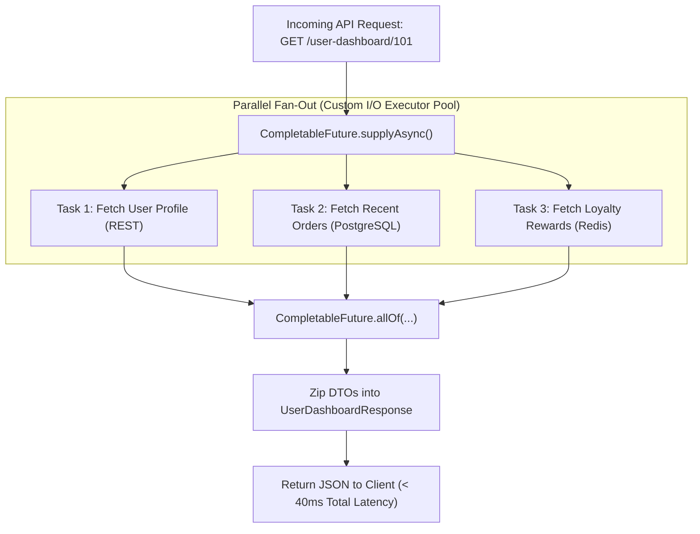
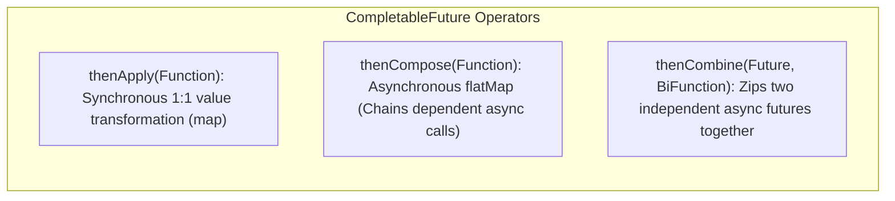

# Asynchronous Composition with CompletableFuture and Timeout Resilience

---

## 1. What Is It?
**`CompletableFuture<T>`** (Java 8+) is an asynchronous, non-blocking promise framework implementing `Future<T>` and `CompletionStage<T>`. 

It enables developers to build complex, declarative, non-blocking asynchronous processing pipelines—chaining transformations, combining parallel service calls, applying timeouts, and handling exceptions—without blocking worker threads on `.get()`.

---

## 2. Why Does It Exist?
Legacy Java `Future<T>` required calling blocking methods (`future.get()`) to retrieve results:
- Calling `future.get()` blocks the calling thread entirely, wasting OS platform thread capacity.
- Combining results from 3 parallel microservices required complex manual countdown latches and nested thread pools.

`CompletableFuture` enables **Functional Reactive Composition**: stages execute automatically on callback completion as soon as upstream computations finish.

---

## 3. Mental Model: Fan-Out / Scatter-Gather Pipeline



---

## 4. How Does It Work?

### 1. The 3 Core Async Composition Operators



---

### 2. The Dangerous `ForkJoinPool.commonPool()` Trap
When invoking `CompletableFuture.supplyAsync(supplier)` without an explicit `Executor`:
- Java executes the task on the **shared `ForkJoinPool.commonPool()`**.
- `commonPool()` has a thread count equal to `Runtime.getRuntime().availableProcessors() - 1` (e.g. 7 threads on an 8-core CPU).
- If your async tasks perform **Blocking I/O** (database calls, external REST APIs), all 7 commonPool threads become blocked waiting on sockets.
- **System-Wide Starvation**: All other parts of the application (including parallel streams and system internals) **freeze completely!**

$$\textbf{Production Rule: } \text{ALWAYS pass a dedicated, bounded } \texttt{ExecutorService} \text{ to } \texttt{supplyAsync()} \text{ for I/O tasks!}$$

---

## 5. Implementation: Scatter-Gather API Aggregator in Java 21

```java
package com.backend.engineering.concurrency.async;

import org.slf4j.Logger;
import org.slf4j.LoggerFactory;
import org.springframework.beans.factory.annotation.Qualifier;
import org.springframework.stereotype.Service;

import java.util.concurrent.CompletableFuture;
import java.util.concurrent.Executor;
import java.util.concurrent.TimeUnit;

@Service
public class UserDashboardAggregatorService {

    private static final Logger log = LoggerFactory.getLogger(UserDashboardAggregatorService.class);
    private final UserProfileClient userProfileClient;
    private final OrderHistoryClient orderHistoryClient;
    private final Executor ioExecutor;

    public UserDashboardAggregatorService(
            UserProfileClient userProfileClient,
            OrderHistoryClient orderHistoryClient,
            @Qualifier("orderProcessingExecutor") Executor ioExecutor) {
        this.userProfileClient = userProfileClient;
        this.orderHistoryClient = orderHistoryClient;
        this.ioExecutor = ioExecutor;
    }

    public CompletableFuture<DashboardDto> fetchUserDashboard(Long userId) {
        // 1. Asynchronous Call 1: User Profile with 800ms Timeout & Fallback
        CompletableFuture<UserProfileDto> profileFuture = CompletableFuture
                .supplyAsync(() -> userProfileClient.fetchProfile(userId), ioExecutor)
                .orTimeout(800, TimeUnit.MILLISECONDS)
                .exceptionally(ex -> {
                    log.warn("User profile fetch failed/timed out. Returning fallback default.", ex);
                    return UserProfileDto.defaultProfile(userId);
                });

        // 2. Asynchronous Call 2: Recent Orders with 1200ms Timeout & Fallback
        CompletableFuture<OrderHistoryDto> ordersFuture = CompletableFuture
                .supplyAsync(() -> orderHistoryClient.fetchRecentOrders(userId), ioExecutor)
                .orTimeout(1200, TimeUnit.MILLISECONDS)
                .exceptionally(ex -> {
                    log.warn("Order history fetch failed/timed out. Returning empty list.", ex);
                    return OrderHistoryDto.empty(userId);
                });

        // 3. Zip / Combine both futures non-blockingly
        return profileFuture.thenCombine(ordersFuture, (profile, orders) -> 
                new DashboardDto(userId, profile, orders)
        );
    }
}
```

---

## 6. Performance

| Pattern | Wall-Clock Latency ($3\text{ Calls of } 50\text{ms}$) | Thread Blocking Overhead |
|---|---|---|
| Sequential Synchronous | $50 + 50 + 50 = \mathbf{150\text{ms}}$ | Continuous thread blocking |
| **Parallel `CompletableFuture.allOf()`** | $\max(50, 50, 50) = \mathbf{\approx 52\text{ms}}$ | **Zero blocking during I/O wait** |

---

## 7. Failure Scenarios

1. **Unbounded Thread Leak via Missing Timeouts**:
   - *Failure*: An external microservice hangs without terminating the TCP socket. The `CompletableFuture` sits uncompleted indefinitely, holding references in memory.
   - *Mitigation*: **Always attach `.orTimeout(timeout, TimeUnit)`** (Java 9+) or `.completeOnTimeout(fallback, timeout, TimeUnit)` to every async stage.

---

## 8. Interview Questions

### Q1: What is the difference between `thenApply()` and `thenCompose()` in `CompletableFuture`?
<details>
<summary>Reveal Answer</summary>

**Answer**:
1. **`thenApply(Function<T, R>)` (Map)**:
   - Used for **synchronous value transformations**.
   - The transformation function returns a raw value $R$.
   - `CompletableFuture<String>.thenApply(s -> s.length())` returns `CompletableFuture<Integer>`.
2. **`thenCompose(Function<T, CompletableFuture<R>>)` (FlatMap)**:
   - Used for **chaining dependent asynchronous operations**.
   - The transformation function itself returns a `CompletableFuture<R>` (e.g. calling another async service).
   - If you used `thenApply()` on a function returning a future, you would get a nested `CompletableFuture<CompletableFuture<R>>`. `thenCompose()` flattens the nested futures into a single unified `CompletableFuture<R>`.
</details>

---

## 9. Quick Revision
- **Async Composition**: `thenApply` (map), `thenCompose` (flatMap), `thenCombine` (zip).
- **Custom Executor**: Always pass custom thread pools to `supplyAsync()` to protect `ForkJoinPool.commonPool()`.
- **Timeout Defense**: Use `orTimeout()` and `completeOnTimeout()` to prevent hanging async stages.
- **Non-Blocking Scatter-Gather**: `CompletableFuture.allOf()` executes parallel service calls in parallel, dropping latency from $L_1 + L_2$ to $\max(L_1, L_2)$.
