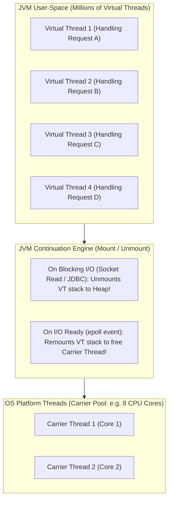
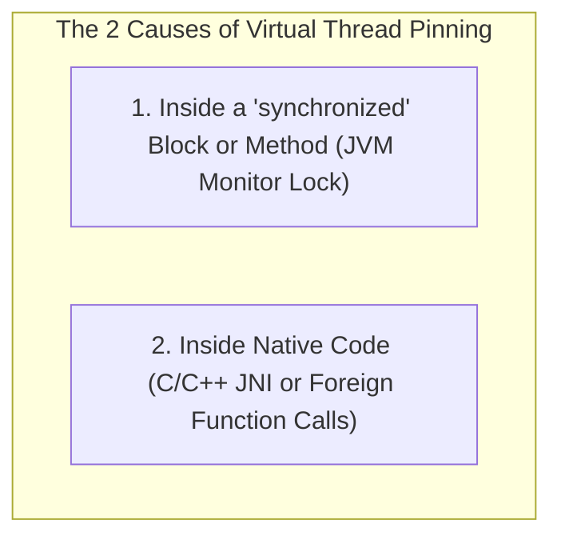

# Java 21 Virtual Threads (Project Loom), Carrier Threads, and Pinning Hazards

---

## 1. What Is It?
**Virtual Threads** (JEP 444, Java 21 LTS baseline) are lightweight, user-space threads managed entirely by the Java Virtual Machine (JVM) rather than the underlying operating system kernel. 

Unlike OS Platform Threads (which cost $\approx 1\text{MB}$ of native RAM per thread), a Virtual Thread consumes only a few hundred bytes of JVM heap memory, allowing a single Spring Boot application instance to run **millions of concurrent active threads** simultaneously.

---

## 2. Why Does It Exist?
Historically, Java backends had to choose between two painful architectural compromises for high concurrency:
1. **Thread-per-Request (Platform Threads)**:
   - Clean, imperative, easy-to-debug synchronous code (`db.query()`, `httpClient.send()`).
   - **Severe Scalability Bottleneck**: Capped at $\approx 2,000 - 5,000$ OS threads before kernel memory exhaustion and context-switch thrashing crash the JVM.
2. **Reactive Programming (Spring WebFlux / Project Reactor / Netty)**:
   - Massive concurrency ($> 100,000\text{ connections}$).
   - **Massive Developer Cognitive Overhead**: Fragmented stack traces, difficult debugging, broken ThreadLocal context propagation, and complex `Mono`/`Flux` monadic functional syntax.

**Virtual Threads unite the best of both worlds**: Write simple, synchronous, imperative `thread-per-request` code that scales to millions of concurrent requests with reactive-level efficiency!

---

## 3. Mental Model: Virtual Threads vs Carrier Threads



---

## 4. How Does It Work?

### 1. Mounting and Unmounting Mechanics
1. A Virtual Thread is assigned to run on an underlying OS platform thread called a **Carrier Thread** (managed by an internal `ForkJoinPool`).
2. When the Virtual Thread executes a **Blocking Operation** (e.g. `SocketInputStream.read()`, `Thread.sleep()`, JDBC database query, `ReentrantLock.lock()`):
   - The JVM intercepts the blocking call via low-level hooks.
   - The Virtual Thread's call stack frames are copied from the carrier thread to the **JVM Heap Memory** (**Unmounting / Yield**).
   - The Carrier Thread is immediately freed to execute other waiting Virtual Threads!
3. When the operating system signals that the network socket has received data (via `epoll`/`kqueue`):
   - The JVM finds an available Carrier Thread.
   - The Virtual Thread's stack is copied back onto the carrier thread (**Mounting**), and execution resumes seamlessly.

---

### 2. The Critical "Thread Pinning" Hazard

When a Virtual Thread is **Pinned**, it **cannot be unmounted from its Carrier Thread** during a blocking operation, tying up the expensive underlying OS platform thread and defeating the purpose of Virtual Threads.



#### Why `synchronized` Pins Threads
In current OpenJDK implementations, the JVM monitor mechanism binds the Java thread to the physical OS thread frame. If a virtual thread blocks on I/O inside a `synchronized` block:
- The carrier thread **remains blocked and frozen**.
- If 16 virtual threads do this simultaneously on a 16-core machine, **all Carrier Threads become exhausted**, completely freezing the entire JVM!

$$\textbf{Production Solution: } \text{Replace all } \texttt{synchronized} \text{ blocks protecting I/O operations with } \texttt{java.util.concurrent.locks.ReentrantLock}!$$

---

## 5. Detecting Thread Pinning in Production

Run your JVM with the diagnostic flag:
```bash
-Djdk.tracePinnedThreads=full
```
- Whenever a virtual thread blocks while pinned, the JVM prints a complete stack trace highlighting the exact `synchronized` block causing the carrier thread stall.

---

## 6. Implementation: Enabling Virtual Threads in Spring Boot 3.3.4

### 1. `application.yml` (The 1-Line Activation)
```yaml
spring:
  threads:
    virtual:
      enabled: true # Automatically runs Tomcat request threads and @Async on Virtual Threads!
```

---

### 2. Thread-Safe Service using `ReentrantLock` (Pin-Free)

```java
package com.backend.engineering.concurrency.virtualthreads;

import org.slf4j.Logger;
import org.slf4j.LoggerFactory;
import org.springframework.stereotype.Service;

import java.net.URI;
import java.net.http.HttpClient;
import java.net.http.HttpRequest;
import java.net.http.HttpResponse;
import java.time.Duration;
import java.util.concurrent.locks.ReentrantLock;

@Service
public class PinFreePaymentGatewayClient {

    private static final Logger log = LoggerFactory.getLogger(PinFreePaymentGatewayClient.class);
    private final HttpClient httpClient = HttpClient.newBuilder()
            .connectTimeout(Duration.ofSeconds(2))
            .build();

    // USE ReentrantLock INSTEAD OF synchronized TO PREVENT PINNING!
    private final ReentrantLock lock = new ReentrantLock();

    public String processPayment(String payload) {
        log.info("Executing on thread: {}", Thread.currentThread()); // Will output: VirtualThread[#42]/runnable@ForkJoinPool...

        lock.lock();
        try {
            // Safe synchronous blocking I/O: JVM automatically unmounts virtual thread!
            HttpRequest request = HttpRequest.newBuilder()
                    .uri(URI.create("https://payment.internal/api/charge"))
                    .POST(HttpRequest.BodyPublishers.ofString(payload))
                    .build();

            HttpResponse<String> response = httpClient.send(request, HttpResponse.BodyHandlers.ofString());
            return response.body();

        } catch (Exception ex) {
            log.error("Payment error: {}", ex.getMessage());
            throw new RuntimeException(ex);
        } finally {
            lock.unlock(); // Safe unlock
        }
    }
}
```

---

## 7. Performance: Platform Threads vs Virtual Threads

| Metric | OS Platform Threads (Tomcat Default) | Java 21 Virtual Threads (`spring.threads.virtual.enabled=true`) |
|---|---|---|
| Memory Overhead per 10,000 Threads | $\mathbf{\approx 10\text{GB}}$ Native RAM | $\mathbf{\approx 35\text{MB}}$ Heap RAM ($99.6\%$ reduction) |
| Max Concurrent Blocking HTTP Connections | $\approx 2,000$ (Kernel thread limits) | $\mathbf{> 1,000,000}$ (RAM bounded) |
| Code Complexity | Simple Imperative | **Simple Imperative (Zero reactive monadic callbacks!)** |

---

## 8. Failure Scenarios

1. **Virtual Thread ThreadLocal Memory Leaks**:
   - *Failure*: An application creates 500,000 virtual threads and populates large object graphs into `ThreadLocal` variables. The heap fills with 500,000 uncollected `ThreadLocalMap` instances, causing an OutOfMemoryError.
   - *Mitigation*: Avoid heavy `ThreadLocal` storage on virtual threads; use lightweight **Scoped Values (JEP 446)** instead.

---

## 9. Interview Questions

### Q1: How do Virtual Threads differ from OS Platform Threads, and why do they achieve massive scalability on I/O-bound workloads?
<details>
<summary>Reveal Answer</summary>

**Answer**:
1. **OS Platform Threads**:
   - Mapped $1:1$ to operating system kernel threads (`pthreads`).
   - Require a dedicated $1\text{MB}$ memory stack allocated in native OS memory.
   - When a platform thread performs blocking I/O (e.g. waiting for a database response), the OS puts the physical kernel thread to sleep, keeping that $1\text{MB}$ stack and thread handle tied up and unavailable for any other work.
2. **Virtual Threads**:
   - Managed entirely in user-space by the JVM.
   - Start with a tiny heap stack (typically $< 1\text{KB}$) that grows and shrinks dynamically.
   - When a virtual thread encounters blocking I/O, the JVM **unmounts its stack frames and stores them as a Continuation in the heap**, immediately freeing the underlying physical **Carrier Thread** to execute other virtual threads.
   - Once I/O completes, the JVM remounts the virtual thread on any available carrier thread. This enables thousands of concurrent I/O operations per physical CPU core without thread starvation.
</details>

### Q2: What is Thread Pinning in Java 21 Virtual Threads, and how do you prevent it?
<details>
<summary>Reveal Answer</summary>

**Answer**:
**Thread Pinning** occurs when a Virtual Thread executes a blocking operation while being physically bound to its underlying OS Carrier Thread, preventing the JVM from unmounting it.
The primary cause of pinning is executing blocking I/O inside a **`synchronized` block or method** (or calling native C/JNI methods).
If all carrier threads become pinned by blocking operations simultaneously, the carrier pool is exhausted, and the JVM stalls completely.
**Mitigation**: Replace all `synchronized` blocks protecting I/O operations with explicit **`ReentrantLock`** instances, which integrate with the JVM continuation engine to allow unmounting without pinning.
</details>

---

## 10. Quick Revision
- **Virtual Threads (JEP 444)**: JVM user-space threads with tiny heap stacks ($< 1\text{KB}$).
- **Carrier Threads**: Underlying OS platform threads executing virtual threads.
- **Unmounting**: JVM frees carrier threads during blocking I/O (epoll-driven).
- **Pinning Hazard**: `synchronized` blocks prevent unmounting; replace with `ReentrantLock`.
- **Spring Boot 3**: Set `spring.threads.virtual.enabled: true` for instant virtual thread scaling.
